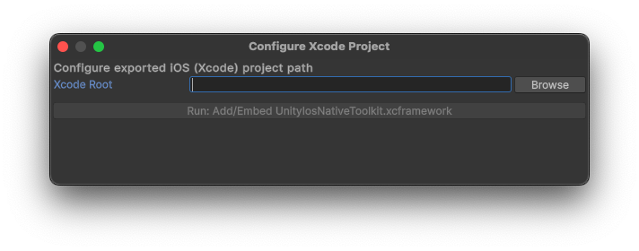
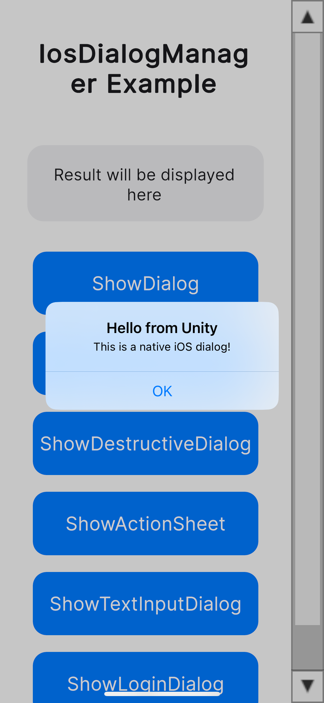
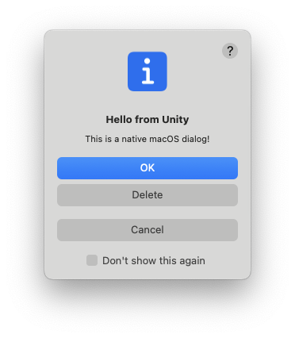
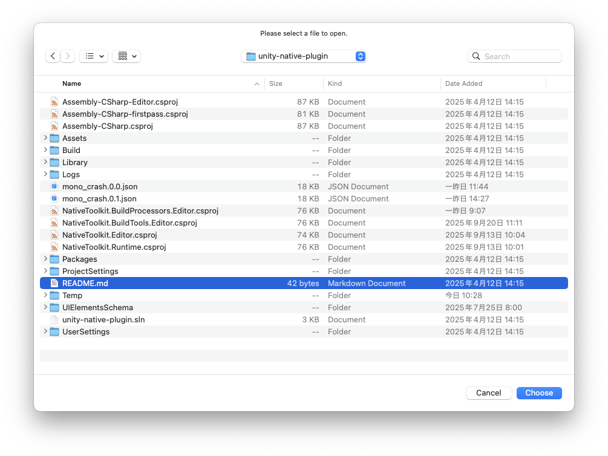
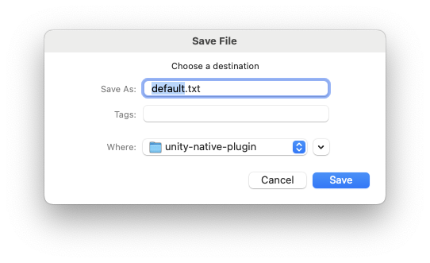
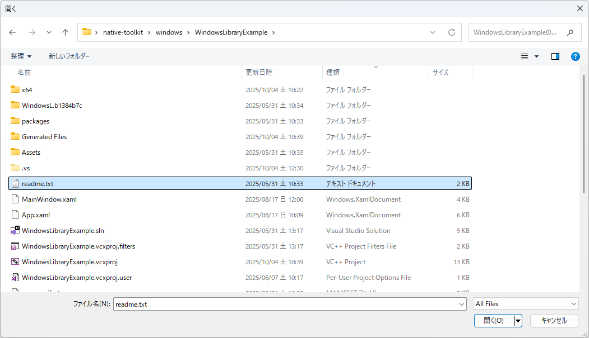
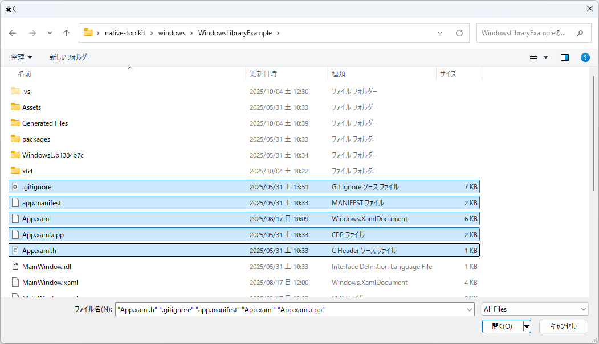
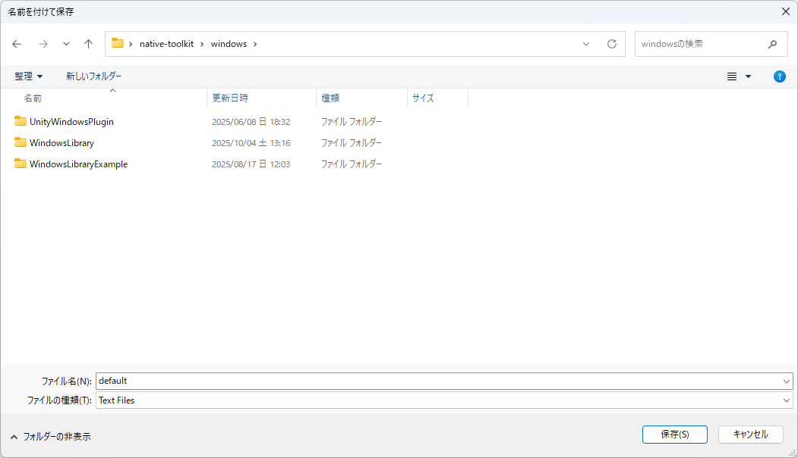

# Unity Native Toolkit (Unity 6)

クロスプラットフォーム対応のネイティブ機能を提供します。

バージョン: 1.0.0

# 機能一覧

## Android

- ダイアログ機能
  - 基本ダイアログ
  - 確認ダイアログ
  - シングル選択ダイアログ
  - マルチ選択ダイアログ
  - 入力ダイアログ
  - ログインダイアログ

## iOS

- ダイアログ機能
  - 基本ダイアログ
  - 確認ダイアログ
  - ディストラクティブなダイアログ
  - アクションシート
  - 入力ダイアログ
  - ログインダイアログ

## Windows

- ダイアログ機能
  - 基本ダイアログ
  - ファイル選択ダイアログ
  - 複数ファイル選択ダイアログ
  - フォルダ選択ダイアログ
  - 複数フォルダ選択ダイアログ
  - ファイル保存ダイアログ

## Mac

- ダイアログ機能

  - 基本ダイアログ
  - ファイル選択ダイアログ
  - 複数ファイル選択ダイアログ
  - フォルダ選択ダイアログ
  - 複数フォルダ選択ダイアログ
  - ファイル保存ダイアログ

## 追加予定機能

- クリップボード連携
- 通知
- シェア機能

# はじめに

## インストール

- Unity6 を起動します。
- Window → Package Manager を選択します。
- Unity Package Manager → Native Toolkit パッケージを Git URL から追加します。
- 必要条件:
  - Unity 6 以降
  - 依存パッケージ: Localization, Addressables, Input System

## サンプル

- Unity6 を起動します。
- Tools → Native Toolkit → Example を選択します。
  
- Android サンプル

  - Android - Dialog - AndroidDialogManager.cs を選択します。
  - 「Open」ボタンをクリックします。
  - 「Game ビュー」にサンプル画面が表示されます。
  - 「Build Profiles」から「Android Profile」→ Export を実行します。
  - Tools → Native Toolkit → Android → Configue Gradle Project を選択します。
    
  - 「Browse」ボタンを押下して、Export した Android Project を指定します。
  - 「Run: Add Kotlin Dependencies」ボタンを押下して、Kotlin ライブラリを追加します。
  - Android Studio からサンプルアプリをインストールしてください。

- iOS サンプル

  - iOS - Dialog - IosDialogManager.cs を選択します。
  - 「Open」ボタンをクリックします。
  - 「Game ビュー」にサンプル画面が表示されます。
  - 「Build Profiles」から「iOS Profile」→ Build を実行します。
  - Tools → Native Toolkit → iOS → Configue Xcode Project を選択します。
    
  - 「Browse」ボタンを押下して、Build した iOS Project を指定します。
  - 「Run: Add/Embed UnityIosNativeToolkit.xcframework」ボタンを押下して、NativeToolkit ライブラリを追加します。
  - Xcode からサンプルアプリをインストールしてください。

- Windows サンプル

  - Windows - Dialog - WindowsDialogManager.cs を選択します。
  - 「Open」ボタンをクリックします。
  - 「Game ビュー」にサンプル画面が表示されます。
  - 「Build Profiles」から「Windows Profile」→ Build を実行します。

- Mac サンプル

  - macOS - Dialog - MacDialogManager.cs を選択します。
  - 「Open」ボタンをクリックします。
  - 「Game ビュー」にサンプル画面が表示されます。
  - 「Build Profiles」から「macOS Profile」→ Build を実行します。
  - Tools → Native Toolkit → macOS → Configue Xcode Project を選択します。
    
  - 「Browse」ボタンを押下して、Build した macOS Project を指定します。
  - 「Run: Add UnityMacNativeToolkit.xcframework」ボタンを押下して、NativeToolkit ライブラリを追加します。
  - Xcode からサンプルアプリをインストールしてください。

# API

## ダイアログ

## AndroidDialogManager

### ShowDialog - 基本ダイアログ

- イベントを登録します。

```csharp
// 実行ガード: Android (Player) のみ有効。Editor ではネイティブ呼び出しを行わないようにします。
#if UNITY_ANDROID && !UNITY_EDITOR
AndroidDialogManager.Instance.DialogResult += OnDialogResult;
#endif
```

- ダイアログを表示します。

```csharp
// 実行ガード: Android (Player) のみ有効。Editor ではネイティブ呼び出しを行わないようにします。
#if UNITY_ANDROID && !UNITY_EDITOR
// タイトルを設定します。
string title = "Hello from Unity";
// メッセージを設定します。
string message = "This is a native Android dialog!";
// ボタンのテキストを設定します。
string buttonText = "OK";
// ダイアログの外をタップした場合、キャンセル可能かを設定します。
bool cancelableOnTouchOutside = false;
// バックキーなどでダイアログがキャンセル可能かを設定します。
bool cancelable = false;
AndroidDialogManager.Instance.ShowDialog(
  title,
  message,
  buttonText,
  cancelableOnTouchOutside,
  cancelable
);
#endif
```


- ボタン押下時の結果はイベントで受け取ります。

```csharp
// buttonText:　押下したボタンのテキストを取得します。エラーの場合、null を返します。
// isSuccess: ダイアログ表示成功のプラグを取得します。成功の場合、true を返します。
// errorMessage: エラーが発生した場合、エラー内容を取得します。成功の場合、null を返します。

private void OnDialogResult(
  string? buttonText,
  bool isSuccess,
  string? errorMessage
)
```

### ShowConfirmDialog - 確認ダイアログ

- イベントを登録します。

```csharp
// 実行ガード: Android (Player) のみ有効。Editor ではネイティブ呼び出しを行わないようにします。
#if UNITY_ANDROID && !UNITY_EDITOR
AndroidDialogManager.Instance.ConfirmDialogResult += OnConfirmDialogResult;
#endif
```

- ダイアログを表示します。

```csharp
// 実行ガード: Android (Player) のみ有効。Editor ではネイティブ呼び出しを行わないようにします。
#if UNITY_ANDROID && !UNITY_EDITOR
// タイトルを設定します。
string title = "Confirmation";
// メッセージを設定します。
string message = "Do you want to proceed with this action?";
// 否定ボタンのテキストを設定します。
string negativeButtonText = "No";
// 肯定ボタンのテキストを設定します。
string positiveButtonText = "Yes";
// ダイアログの外をタップした場合、キャンセル可能かを設定します。
bool cancelableOnTouchOutside = false;
// バックキーなどでダイアログがキャンセル可能かを設定します。
bool cancelable = false;
AndroidDialogManager.Instance.ShowConfirmDialog(
  title,
  message,
  negativeButtonText,
  positiveButtonText,
  cancelableOnTouchOutside,
  cancelable
);
#endif
```


- ボタン押下時の結果はイベントで受け取ります。

```csharp
// buttonText:　押下したボタンのテキストを取得します。エラーの場合、null を返します。
// isSuccess: ダイアログ表示成功のプラグを取得します。成功の場合、true を返します。
// errorMessage: エラーが発生した場合、エラー内容を取得します。成功の場合、null を返します。

private void OnConfirmDialogResult(
  string? buttonText,
  bool isSuccess,
  string? errorMessage
)
```

### ShowSingleChoiceDialog - シングル選択ダイアログ

- イベントを登録します。

```csharp
// 実行ガード: Android (Player) のみ有効。Editor ではネイティブ呼び出しを行わないようにします。
#if UNITY_ANDROID && !UNITY_EDITOR
AndroidDialogManager.Instance.SingleChoiceItemDialogResult += OnSingleChoiceItemDialogResult;
#endif
```

- ダイアログを表示します。

```csharp
// 実行ガード: Android (Player) のみ有効。Editor ではネイティブ呼び出しを行わないようにします。
#if UNITY_ANDROID && !UNITY_EDITOR
// タイトルを設定します。
string title = "Please select one";
// 選択肢を設定します。
string[] singleChoiceItems = { "Option 1", "Option 2", "Option 3" };
// デフォルト選択項目のindex番号を設定します。
int checkedItem = 0;
// 否定ボタンのテキストを設定します。
string negativeButtonText = "Cancel";
// 肯定ボタンのテキストを設定します。
string positiveButtonText = "OK";
// ダイアログの外をタップした場合、キャンセル可能かを設定します。
bool cancelableOnTouchOutside = false;
// バックキーなどでダイアログがキャンセル可能かを設定します。
bool cancelable = false;
AndroidDialogManager.Instance.ShowSingleChoiceItemDialog(
  title,
  singleChoiceItems,
  checkedItem,
  negativeButtonText,
  positiveButtonText,
  cancelableOnTouchOutside,
  cancelable
);
#endif
```


- ボタン押下時の結果はイベントで受け取ります。

```csharp
// buttonText:　押下したボタンのテキストを取得します。エラーの場合、null を返します。
// checkedItem: 選択された項目のindex番号を取得します。エラーの場合、null を返します。
// isSuccess: ダイアログ表示成功のプラグを取得します。成功の場合、true を返します。
// errorMessage: エラーが発生した場合、エラー内容を取得します。成功の場合、null を返します。

private void OnSingleChoiceItemDialogResult(
  string? buttonText,
  int? checkedItem,
  bool isSuccess,
  string? errorMessage
)
```

### ShowMultiChoiceDialog - マルチ選択ダイアログ

- イベントを登録します。

```csharp
// 実行ガード: Android (Player) のみ有効。Editor ではネイティブ呼び出しを行わないようにします。
#if UNITY_ANDROID && !UNITY_EDITOR
AndroidDialogManager.Instance.MultiChoiceItemDialogResult += OnMultiChoiceItemDialogResult;
#endif
```

- ダイアログを表示します。

```csharp
// 実行ガード: Android (Player) のみ有効。Editor ではネイティブ呼び出しを行わないようにします。
#if UNITY_ANDROID && !UNITY_EDITOR
// タイトルを設定します。
string title = "Multiple Selection";
// 選択肢を設定します。
string[] multiChoiceItems = { "Item 1", "Item 2", "Item 3", "Item 4" };
// デフォルト選択項目の選択状態を設定します。
bool[] checkedItems = { false, true, false, true };
// 否定ボタンのテキストを設定します。
string negativeButtonText = "Cancel";
// 肯定ボタンのテキストを設定します。
string positiveButtonText = "OK";
// ダイアログの外をタップした場合、キャンセル可能かを設定します。
bool cancelableOnTouchOutside = false;
// バックキーなどでダイアログがキャンセル可能かを設定します。
bool cancelable = false;
AndroidDialogManager.Instance.ShowMultiChoiceItemDialog(
  title,
  multiChoiceItems,
  checkedItems,
  negativeButtonText,
  positiveButtonText,
  cancelableOnTouchOutside,
  cancelable
);
#endif
```


- ボタン押下時の結果はイベントで受け取ります。

```csharp
// buttonText:　押下したボタンのテキストを取得します。エラーの場合、null を返します。
// checkedItems: 選択された項目の選択状態を取得します。選択はtrue, 未選択はfalse。エラーの場合、null を返します。
// isSuccess: ダイアログ表示成功のプラグを取得します。成功の場合、true を返します。
// errorMessage: エラーが発生した場合、エラー内容を取得します。成功の場合、null を返します。

private void OnMultiChoiceItemDialogResult(
  string? buttonText,
  bool[]? checkedItems,
  bool isSuccess,
  string? errorMessage
)
```

### ShowInputDialog - 入力ダイアログ

- イベントを登録します。

```csharp
// 実行ガード: Android (Player) のみ有効。Editor ではネイティブ呼び出しを行わないようにします。
#if UNITY_ANDROID && !UNITY_EDITOR
AndroidDialogManager.Instance.TextInputDialogResult += OnTextInputDialogResult;
#endif
```

- ダイアログを表示します。

```csharp
// 実行ガード: Android (Player) のみ有効。Editor ではネイティブ呼び出しを行わないようにします。
#if UNITY_ANDROID && !UNITY_EDITOR
// タイトルを設定します。
string title = "Text Input";
// メッセージを設定します。
string message = "Please enter your name";
// プレースホルダーを設定します。
string placeholder = "Enter here...";
// 否定ボタンのテキストを設定します。
string negativeButtonText = "Cancel";
// 肯定ボタンのテキストを設定します。
string positiveButtonText = "OK";
// 入力値が空の場合、肯定ボタンが有効になるかを設定します。
bool enablePositiveButtonWhenEmpty = false;
// ダイアログの外をタップした場合、キャンセル可能かを設定します。
bool cancelableOnTouchOutside = false;
// バックキーなどでダイアログがキャンセル可能かを設定します。
bool cancelable = false;
AndroidDialogManager.Instance.ShowTextInputDialog(
  title,
  message,
  placeholder,
  negativeButtonText,
  positiveButtonText,
  enablePositiveButtonWhenEmpty,
  cancelableOnTouchOutside,
  cancelable
);
#endif
```


- ボタン押下時の結果はイベントで受け取ります。

```csharp
// buttonText:　押下したボタンのテキストを取得します。エラーの場合、null を返します。
// inputText: 入力されたテキストを取得します。エラーの場合、null を返します。
// isSuccess: ダイアログ表示成功のプラグを取得します。成功の場合、true を返します。
// errorMessage: エラーが発生した場合、エラー内容を取得します。成功の場合、null を返します。

private void OnTextInputDialogResult(
  string? buttonText,
  string? inputText,
  bool isSuccess,
  string? errorMessage
)
```

### ShowLoginDialog - ログインダイアログ

- イベントを登録します。

```csharp
// 実行ガード: Android (Player) のみ有効。Editor ではネイティブ呼び出しを行わないようにします。
#if UNITY_ANDROID && !UNITY_EDITOR
AndroidDialogManager.Instance.LoginDialogResult += OnLoginDialogResult;
#endif
```

- ダイアログを表示します。

```csharp
// 実行ガード: Android (Player) のみ有効。Editor ではネイティブ呼び出しを行わないようにします。
#if UNITY_ANDROID && !UNITY_EDITOR
// タイトルを設定します。
string title = "Login";
// メッセージを設定します。
string message = "Please enter your credentials";
// ユーザ名のプレースホルダーを設定します。
string usernameHint = "Username";
// パスワードのプレースホルダーを設定します。
string passwordHint = "Password";
// 否定ボタンのテキストを設定します。
string negativeButtonText = "Cancel";
// 肯定ボタンのテキストを設定します。
string positiveButtonText = "Login";
// 入力値が空の場合、肯定ボタンが有効になるかを設定します。
bool enablePositiveButtonWhenEmpty = false;
// ダイアログの外をタップした場合、キャンセル可能かを設定します。
bool cancelableOnTouchOutside = false;
// バックキーなどでダイアログがキャンセル可能かを設定します。
bool cancelable = false;
AndroidDialogManager.Instance.ShowLoginDialog(
  title,
  message,
  usernameHint,
  passwordHint,
  negativeButtonText,
  positiveButtonText,
  enablePositiveButtonWhenEmpty,
  cancelableOnTouchOutside,
  cancelable
);
#endif
```


- ボタン押下時の結果はイベントで受け取ります。

```csharp
// buttonText:　押下したボタンのテキストを取得します。エラーの場合、null を返します。
// username: 入力されたユーザ名を取得します。エラーの場合、null を返します。
// password: 入力されたパスワードを取得します。エラーの場合、null を返します。
// isSuccess: ダイアログ表示成功のプラグを取得します。成功の場合、true を返します。
// errorMessage: エラーが発生した場合、エラー内容を取得します。成功の場合、null を返します。

private void OnLoginDialogResult(
  string? buttonText,
  string? username,
  string? password,
  bool isSuccess,
  string? errorMessage
)
```

## iOSDialogManager

### ShowDialog - 基本ダイアログ

- イベントを登録します。

```csharp
// 実行ガード: iOS (Player) のみ有効。Editor ではネイティブ呼び出しを行わないようにします。
#if UNITY_IOS && !UNITY_EDITOR
IosDialogManager.Instance.DialogResult += OnDialogResult;
#endif
```

- ダイアログを表示します。

```csharp
// 実行ガード: iOS (Player) のみ有効。Editor ではネイティブ呼び出しを行わないようにします。
#if UNITY_IOS && !UNITY_EDITOR
// タイトルを設定します。
string title = "Hello from Unity";
// メッセージを設定します。
string message = "This is a native iOS dialog!";
// ボタンのテキストを設定します。
string buttonText = "OK";
IosDialogManager.Instance.ShowDialog(
  title,
  message,
  buttonText
);
#endif
```



- ボタン押下時の結果はイベントで受け取ります。

```csharp
// buttonText:　押下したボタンのテキストを取得します。エラーの場合、null を返します。
// isSuccess: ダイアログ表示成功のプラグを取得します。成功の場合、true を返します。
// errorMessage: エラーが発生した場合、エラー内容を取得します。成功の場合、null を返します。

private void OnDialogResult(
  string? buttonText,
  bool isSuccess,
  string? errorMessage
)
```

### ShowConfirmDialog - 確認ダイアログ

- イベントを登録します。

```csharp
// 実行ガード: iOS (Player) のみ有効。Editor ではネイティブ呼び出しを行わないようにします。
#if UNITY_IOS && !UNITY_EDITOR
IosDialogManager.Instance.ConfirmDialogResult += OnConfirmDialogResult;
#endif
```

- ダイアログを表示します。

```csharp
// 実行ガード: iOS (Player) のみ有効。Editor ではネイティブ呼び出しを行わないようにします。
#if UNITY_IOS && !UNITY_EDITOR
// タイトルを設定します。
string title = "Confirm Action";
// メッセージを設定します。
string message = "Are you sure you want to proceed?";
// 確認ボタンのテキストを設定します。
string confirmButtonText = "Yes";
// キャンセルボタンのテキストを設定します。
string cancelButtonText = "No";
IosDialogManager.Instance.ShowConfirmDialog(
  title,
  message,
  confirmButtonText,
  cancelButtonText
);
#endif
```


- ボタン押下時の結果はイベントで受け取ります。

```csharp
// buttonText:　押下したボタンのテキストを取得します。エラーの場合、null を返します。
// isSuccess: ダイアログ表示成功のプラグを取得します。成功の場合、true を返します。
// errorMessage: エラーが発生した場合、エラー内容を取得します。成功の場合、null を返します。

private void OnConfirmDialogResult(
  string? buttonText,
  bool isSuccess,
  string? errorMessage
)
```

### ShowDestructiveDialog - ディストラクティブなダイアログ

- イベントを登録します。

```csharp
// 実行ガード: iOS (Player) のみ有効。Editor ではネイティブ呼び出しを行わないようにします。
#if UNITY_IOS && !UNITY_EDITOR
IosDialogManager.Instance.DestructiveDialogResult += OnDestructiveDialogResult;
#endif
```

- ダイアログを表示します。

```csharp
// 実行ガード: iOS (Player) のみ有効。Editor ではネイティブ呼び出しを行わないようにします。
#if UNITY_IOS && !UNITY_EDITOR
// タイトルを設定します。
string title = "Delete File";
// メッセージを設定します。
string message = "This action cannot be undone. Are you sure?";
// 破壊的操作の確認ボタンのテキストを設定します。
string destructiveButtonText = "Delete";
// キャンセルボタンのテキストを設定します。
string cancelButtonText = "Cancel";
IosDialogManager.Instance.ShowDestructiveDialog(
  title,
  message,
  destructiveButtonText,
  cancelButtonText
);
#endif
```


- ボタン押下時の結果はイベントで受け取ります。

```csharp
// buttonText:　押下したボタンのテキストを取得します。エラーの場合、null を返します。
// isSuccess: ダイアログ表示成功のプラグを取得します。成功の場合、true を返します。
// errorMessage: エラーが発生した場合、エラー内容を取得します。成功の場合、null を返します。

private void OnDestructiveDialogResult(
  string? buttonText,
  bool isSuccess,
  string? errorMessage
)
```

### ShowActionSheet - アクションシート

- イベントを登録します。

```csharp
// 実行ガード: iOS (Player) のみ有効。Editor ではネイティブ呼び出しを行わないようにします。
#if UNITY_IOS && !UNITY_EDITOR
IosDialogManager.Instance.ActionSheetResult += OnActionSheetResult;
#endif
```

- アクションシートを表示します。

```csharp
// 実行ガード: iOS (Player) のみ有効。Editor ではネイティブ呼び出しを行わないようにします。
#if UNITY_IOS && !UNITY_EDITOR
// タイトルを設定します。
string title = "Select Source";
// メッセージを設定します。
string message = "Choose where to get the file from";
// 選択肢を設定します。
string[] options = { "Camera", "Photo Library", "Documents" };
// キャンセルボタンのテキストを設定します。
string cancelButtonText = "Cancel";
IosDialogManager.Instance.ShowActionSheet(
  title,
  message,
  options,
  cancelButtonText
);
#endif
```


- ボタン押下時の結果はイベントで受け取ります。

```csharp
// buttonText:　押下したボタンのテキストを取得します。エラーの場合、null を返します。
// isSuccess: ダイアログ表示成功のプラグを取得します。成功の場合、true を返します。
// errorMessage: エラーが発生した場合、エラー内容を取得します。成功の場合、null を返します。

private void OnActionSheetResult(
  string? buttonText,
  bool isSuccess,
  string? errorMessage
)
```

### ShowTextInputDialog - 入力ダイアログ

- イベントを登録します。

```csharp
// 実行ガード: iOS (Player) のみ有効。Editor ではネイティブ呼び出しを行わないようにします。
#if UNITY_IOS && !UNITY_EDITOR
IosDialogManager.Instance.TextInputDialogResult += OnTextInputDialogResult;
#endif
```

- ダイアログを表示します。

```csharp
// 実行ガード: iOS (Player) のみ有効。Editor ではネイティブ呼び出しを行わないようにします。
#if UNITY_IOS && !UNITY_EDITOR
// タイトルを設定します。
string title = "Enter Name";
// メッセージを設定します。
string message = "Please enter your name";
// プレースホルダーを設定します。
string placeholder = "Your name here";
// 確認ボタンのテキストを設定します。
string confirmButtonText = "OK";
// キャンセルボタンのテキストを設定します。
string cancelButtonText = "Cancel";
// 入力値が空の場合、確認ボタンが有効になるかを設定します。
bool enableConfirmWhenEmpty = false;
IosDialogManager.Instance.ShowTextInputDialog(
  title,
  message,
  placeholder,
  confirmButtonText,
  cancelButtonText,
  enableConfirmWhenEmpty
);
#endif
```


- ボタン押下時の結果はイベントで受け取ります。

```csharp
// buttonText:　押下したボタンのテキストを取得します。エラーの場合、null を返します。
// inputText: 入力されたテキストを取得します。エラーの場合、null を返します。
// isSuccess: ダイアログ表示成功のプラグを取得します。成功の場合、true を返します。
// errorMessage: エラーが発生した場合、エラー内容を取得します。成功の場合、null を返します。

private void OnTextInputDialogResult(
  string? buttonText,
  string? inputText,
  bool isSuccess,
  string? errorMessage
)
```

### ShowLoginDialog - ログインダイアログ

- イベントを登録します。

```csharp
// 実行ガード: iOS (Player) のみ有効。Editor ではネイティブ呼び出しを行わないようにします。
#if UNITY_IOS && !UNITY_EDITOR
IosDialogManager.Instance.LoginDialogResult += OnLoginDialogResult;
#endif
```

- ダイアログを表示します。

```csharp
// 実行ガード: iOS (Player) のみ有効。Editor ではネイティブ呼び出しを行わないようにします。
#if UNITY_IOS && !UNITY_EDITOR
// タイトルを設定します。
string title = "Login Required";
// メッセージを設定します。
string message = "Please enter your credentials";
// ユーザ名のプレースホルダーを設定します。
string usernamePlaceholder = "Username";
// パスワードのプレースホルダーを設定します。
string passwordPlaceholder = "Password";
// ログインボタンのテキストを設定します。
string loginButtonText = "Login";
// キャンセルボタンのテキストを設定します。
string cancelButtonText = "Cancel";
// 入力値が空の場合、ログインボタンが有効になるかを設定します。
bool enableLoginWhenEmpty = false;
IosDialogManager.Instance.ShowLoginDialog(
  title,
  message,
  usernamePlaceholder,
  passwordPlaceholder,
  loginButtonText,
  cancelButtonText,
  enableLoginWhenEmpty
);
#endif
```


- ボタン押下時の結果はイベントで受け取ります。

```csharp
// buttonText:　押下したボタンのテキストを取得します。エラーの場合、null を返します。
// username: 入力されたユーザ名を取得します。エラーの場合、null を返します。
// password: 入力されたパスワードを取得します。エラーの場合、null を返します。
// isSuccess: ダイアログ表示成功のプラグを取得します。成功の場合、true を返します。
// errorMessage: エラーが発生した場合、エラー内容を取得します。成功の場合、null を返します。

private void OnLoginDialogResult(
  string? buttonText,
  string? username,
  string? password,
  bool isSuccess,
  string? errorMessage
)
```

## MacDialogManager

### ShowDialog - 基本ダイアログ

- イベントを登録します。

```csharp
// 実行ガード: macOS (Player) のみ有効。Editor ではネイティブ呼び出しを行わないようにします。
#if UNITY_STANDALONE_OSX && !UNITY_EDITOR
MacDialogManager.Instance.AlertDialogResult += OnAlertDialogResult;
#endif
```

- ダイアログを表示します。

```csharp
// 実行ガード: macOS (Player) のみ有効。Editor ではネイティブ呼び出しを行わないようにします。
#if UNITY_STANDALONE_OSX && !UNITY_EDITOR
// タイトルを設定します。
string title = "Hello from Unity";
// メッセージを設定します。
string message = "This is a native macOS dialog!";
// ボタンを設定します。isDefault やキーショートカット (keyEquivalent) も指定できます。
DialogButton[] buttons = {
  new DialogButton { title = "OK", isDefault = true, keyEquivalent = "return" },
  new DialogButton { title = "Cancel", keyEquivalent = "escape" },
  new DialogButton { title = "Delete", keyEquivalent = "d" }
};
// オプションを設定します (警告スタイルやサプレッションチェックボックスなど)。
DialogOptions options = new DialogOptions
{
  alertStyle = "warning",
  showsSuppressionButton = true,
  suppressionButtonTitle = "Don't show this again",
};
MacDialogManager.Instance.ShowDialog(
  title,
  message,
  buttons,
  options
);
#endif
```



- ボタン押下時の結果はイベントで受け取ります。

```csharp
// buttonTitle: 押下したボタンのタイトルを取得します。エラーの場合、null を返します。
// buttonIndex: 押下したボタンの index を取得します。
// suppressionState: サプレッションチェックボックスの状態を取得します。
// isSuccess: ダイアログ表示成功のフラグを取得します。成功の場合、true を返します。
// errorMessage: エラーが発生した場合、エラー内容を取得します。成功の場合、null を返します。

private void OnAlertDialogResult(
  string? buttonTitle,
  int buttonIndex,
  bool suppressionState,
  bool isSuccess,
  string? errorMessage
)
```

### ShowFileDialog - ファイル選択ダイアログ

- イベントを登録します。

```csharp
// 実行ガード: macOS (Player) のみ有効。Editor ではネイティブ呼び出しを行わないようにします。
#if UNITY_STANDALONE_OSX && !UNITY_EDITOR
MacDialogManager.Instance.FileDialogResult += OnFileDialogResult;
#endif
```

- ダイアログを表示します。

```csharp
// 実行ガード: macOS (Player) のみ有効。Editor ではネイティブ呼び出しを行わないようにします。
#if UNITY_STANDALONE_OSX && !UNITY_EDITOR
// タイトルを設定します。
string title = "Select a file";
// メッセージを設定します。
string message = "Please select a file to open.";
// 許可するコンテンツタイプ (UTI) を設定します。
string[] allowedContentTypes = { "public.text" };
// 初期ディレクトリを設定します。null の場合はシステム既定が使用されます。
string? directoryPath = null;
MacDialogManager.Instance.ShowFileDialog(
  title,
  message,
  allowedContentTypes,
  directoryPath
);
#endif
```



- 選択結果はイベントで受け取ります。

```csharp
// filePaths: 選択されたファイルパスの配列を取得します。エラーの場合、null を返します。
// fileCount: 返却されたファイル数を取得します。キャンセルされた場合は 0 です。
// directoryURL: 選択が行われたディレクトリ URL を取得します。エラーの場合、null を返します。
// isCancelled: ユーザがダイアログをキャンセルしたかどうかを取得します。
// isSuccess: ダイアログ表示成功のフラグを取得します。成功の場合、true を返します。
// errorMessage: エラーが発生した場合、エラー内容を取得します。成功の場合、null を返します。

private void OnFileDialogResult(
  string[]? filePaths,
  int fileCount,
  string? directoryURL,
  bool isCancelled,
  bool isSuccess,
  string? errorMessage
)
```

### ShowMultiFileDialog - 複数ファイル選択ダイアログ

- イベントを登録します。

```csharp
// 実行ガード: macOS (Player) のみ有効。Editor ではネイティブ呼び出しを行わないようにします。
#if UNITY_STANDALONE_OSX && !UNITY_EDITOR
MacDialogManager.Instance.MultiFileDialogResult += OnMultiFileDialogResult;
#endif
```

- ダイアログを表示します。

```csharp
// 実行ガード: macOS (Player) のみ有効。Editor ではネイティブ呼び出しを行わないようにします。
#if UNITY_STANDALONE_OSX && !UNITY_EDITOR
// タイトルを設定します。
string title = "Select files";
// メッセージを設定します。
string message = "Please select files to open.";
// 許可するコンテンツタイプ (UTI) を設定します。
string[] allowedContentTypes = { "public.text" };
// 初期ディレクトリを設定します。null の場合はシステム既定が使用されます。
string? directoryPath = null;
MacDialogManager.Instance.ShowMultiFileDialog(
  title,
  message,
  allowedContentTypes,
  directoryPath
);
#endif
```


- 選択結果はイベントで受け取ります。

```csharp
// filePaths: 選択されたファイルパスの配列を取得します。エラーの場合、null を返します。
// fileCount: 返却されたファイル数を取得します。キャンセルされた場合は 0 です。
// directoryURL: 選択が行われたディレクトリ URL を取得します。エラーの場合、null を返します。
// isCancelled: ユーザがダイアログをキャンセルしたかどうかを取得します。
// isSuccess: ダイアログ表示成功のフラグを取得します。成功の場合、true を返します。
// errorMessage: エラーが発生した場合、エラー内容を取得します。成功の場合、null を返します。

private void OnMultiFileDialogResult(
  string[]? filePaths,
  int fileCount,
  string? directoryURL,
  bool isCancelled,
  bool isSuccess,
  string? errorMessage
)
```

### ShowFolderDialog - フォルダ選択ダイアログ

- イベントを登録します。

```csharp
// 実行ガード: macOS (Player) のみ有効。Editor ではネイティブ呼び出しを行わないようにします。
#if UNITY_STANDALONE_OSX && !UNITY_EDITOR
MacDialogManager.Instance.FolderDialogResult += OnFolderDialogResult;
#endif
```

- ダイアログを表示します。

```csharp
// 実行ガード: macOS (Player) のみ有効。Editor ではネイティブ呼び出しを行わないようにします。
#if UNITY_STANDALONE_OSX && !UNITY_EDITOR
// タイトルを設定します。
string title = "Select a folder";
// メッセージを設定します。
string message = "Please select a folder to open.";
// 初期ディレクトリを設定します。null の場合はシステム既定が使用されます。
string? directoryPath = null;
MacDialogManager.Instance.ShowFolderDialog(
  title,
  message,
  directoryPath
);
#endif
```


- 選択結果はイベントで受け取ります。

```csharp
// folderPaths: 選択されたフォルダパスの配列を取得します。エラーの場合、null を返します。
// folderCount: 返却されたフォルダ数を取得します。キャンセルされた場合は 0 です。
// directoryURL: 選択が行われたディレクトリ URL を取得します。エラーの場合、null を返します。
// isCancelled: ユーザがダイアログをキャンセルしたかどうかを取得します。
// isSuccess: ダイアログ表示成功のフラグを取得します。成功の場合、true を返します。
// errorMessage: エラーが発生した場合、エラー内容を取得します。成功の場合、null を返します。

private void OnFolderDialogResult(
  string[]? folderPaths,
  int folderCount,
  string? directoryURL,
  bool isCancelled,
  bool isSuccess,
  string? errorMessage
)
```

### ShowMultiFolderDialog - 複数フォルダ選択ダイアログ

- イベントを登録します。

```csharp
// 実行ガード: macOS (Player) のみ有効。Editor ではネイティブ呼び出しを行わないようにします。
#if UNITY_STANDALONE_OSX && !UNITY_EDITOR
MacDialogManager.Instance.MultiFolderDialogResult += OnMultiFolderDialogResult;
#endif
```

- ダイアログを表示します。

```csharp
// 実行ガード: macOS (Player) のみ有効。Editor ではネイティブ呼び出しを行わないようにします。
#if UNITY_STANDALONE_OSX && !UNITY_EDITOR
// タイトルを設定します。
string title = "Select folders";
// メッセージを設定します。
string message = "Please select folders to open.";
// 初期ディレクトリを設定します。null の場合はシステム既定が使用されます。
string? directoryPath = null;
MacDialogManager.Instance.ShowMultiFolderDialog(
  title,
  message,
  directoryPath
);
#endif
```


- 選択結果はイベントで受け取ります。

```csharp
// folderPaths: 選択されたフォルダパスの配列を取得します。エラーの場合、null を返します。
// folderCount: 返却されたフォルダ数を取得します。キャンセルされた場合は 0 です。
// directoryURL: 選択が行われたディレクトリ URL を取得します。エラーの場合、null を返します。
// isCancelled: ユーザがダイアログをキャンセルしたかどうかを取得します。
// isSuccess: ダイアログ表示成功のフラグを取得します。成功の場合、true を返します。
// errorMessage: エラーが発生した場合、エラー内容を取得します。成功の場合、null を返します。

private void OnMultiFolderDialogResult(
  string[]? folderPaths,
  int folderCount,
  string? directoryURL,
  bool isCancelled,
  bool isSuccess,
  string? errorMessage
)
```

### ShowSaveFileDialog - ファイル保存ダイアログ

- イベントを登録します。

```csharp
// 実行ガード: macOS (Player) のみ有効。Editor ではネイティブ呼び出しを行わないようにします。
#if UNITY_STANDALONE_OSX && !UNITY_EDITOR
MacDialogManager.Instance.SaveFileDialogResult += OnSaveFileDialogResult;
#endif
```

- ダイアログを表示します。

```csharp
// 実行ガード: macOS (Player) のみ有効。Editor ではネイティブ呼び出しを行わないようにします。
#if UNITY_STANDALONE_OSX && !UNITY_EDITOR
// タイトルを設定します。
string title = "Save File";
// メッセージを設定します。
string message = "Choose a destination";
// デフォルトのファイル名を設定します。
string defaultFileName = "default.txt";
// 許可するコンテンツタイプ (UTI) を設定します。
string[] allowedContentTypes = { "public.text" };
// 初期ディレクトリを設定します。null の場合はシステム既定が使用されます。
string? directoryPath = null;
MacDialogManager.Instance.ShowSaveFileDialog(
  title,
  message,
  defaultFileName,
  allowedContentTypes,
  directoryPath
);
#endif
```



- 保存結果はイベントで受け取ります。

```csharp
// filePath: 保存先のファイルパスを取得します。キャンセルや失敗の場合は null を返します。
// fileCount: 返却されたパス数を取得します。成功時は 1、キャンセル時は 0 です。
// directoryURL: 保存が行われたディレクトリ URL を取得します。エラーの場合、null を返します。
// isCancelled: ユーザがダイアログをキャンセルしたかどうかを取得します。
// isSuccess: ダイアログ表示成功のフラグを取得します。成功の場合、true を返します。
// errorMessage: エラーが発生した場合、エラー内容を取得します。成功の場合、null を返します。

private void OnSaveFileDialogResult(
  string? filePath,
  int fileCount,
  string? directoryURL,
  bool isCancelled,
  bool isSuccess,
  string? errorMessage
)
```

## WindowsDialogManager

### ShowDialog - 基本ダイアログ

- イベントを登録します。

```csharp
// 実行ガード: Windows (Player) のみ有効。Editor ではネイティブ呼び出しを行わないようにします。
#if UNITY_STANDALONE_WIN && !UNITY_EDITOR
WindowsDialogManager.Instance.AlertDialogResult += OnAlertDialogResult;
#endif
```

- ダイアログを表示します。

```csharp
// 実行ガード: Windows (Player) のみ有効。Editor ではネイティブ呼び出しを行わないようにします。
#if UNITY_STANDALONE_WIN && !UNITY_EDITOR
// タイトルを設定します。
string title = "Native Windows Dialog";
// メッセージを設定します。
string message = "This is a native Windows dialog!";
// OK/キャンセルボタン
uint buttons = Win32MessageBox.MB_OKCANCEL;
// 情報アイコン
uint icon = Win32MessageBox.MB_ICONINFORMATION;
// 2番目のボタンをデフォルト
uint defbutton = Win32MessageBox.MB_DEFBUTTON2;
// アプリケーションモーダル
uint options = Win32MessageBox.MB_APPLMODAL;
WindowsDialogManager.Instance.ShowDialog(
  title,
  message,
  buttons,
  icon,
  defbutton,
  options
);
#endif
```


- 結果はイベントで受け取ります。

```csharp
// result: 押下したボタンの識別子を取得します。エラーの場合、null を返します。
// isSuccess: ダイアログ表示成功のフラグを取得します。成功の場合、true を返します。
// errorCode: エラーが発生した場合、エラーコードを取得します。成功の場合、null を返します。

private void OnAlertDialogResult(
  int? result,
  bool isSuccess,
  int? errorCode
)
```

### ShowFileDialog - ファイル選択ダイアログ

- イベントを登録します。

```csharp
// 実行ガード: Windows (Player) のみ有効。Editor ではネイティブ呼び出しを行わないようにします。
#if UNITY_STANDALONE_WIN && !UNITY_EDITOR
WindowsDialogManager.Instance.FileDialogResult += OnFileDialogResult;
#endif
```

- ダイアログを表示します。

```csharp
// 実行ガード: Windows (Player) のみ有効。Editor ではネイティブ呼び出しを行わないようにします。
#if UNITY_STANDALONE_WIN && !UNITY_EDITOR
// バッファサイズを設定します。
uint bufferSize = 1024;
// フィルタを設定します。各フィルタはヌル文字 (\0) で区切り、最後に二重のヌル文字で終了します。
string filter = "Text Files\0*.txt\0All Files\0*.*\0\0";
WindowsDialogManager.Instance.ShowFileDialog(
  bufferSize,
  filter
);
#endif
```



- 結果はイベントで受け取ります。

```csharp
// filePath: 選択されたファイルパスを取得します。キャンセルや失敗の場合は null を返します。
// isCancelled: ユーザがダイアログをキャンセルしたかどうかを取得します。
// isSuccess: ダイアログ表示成功のフラグを取得します。成功の場合、true を返します。
// errorCode: エラーが発生した場合、エラーコードを取得します。成功の場合、null を返します。

private void OnFileDialogResult(
  string? filePath,
  bool isCancelled,
  bool isSuccess,
  int? errorCode
)
```

### ShowMultiFileDialog - 複数ファイル選択ダイアログ

- イベントを登録します。

```csharp
// 実行ガード: Windows (Player) のみ有効。Editor ではネイティブ呼び出しを行わないようにします。
#if UNITY_STANDALONE_WIN && !UNITY_EDITOR
WindowsDialogManager.Instance.MultiFileDialogResult += OnMultiFileDialogResult;
#endif
```

- ダイアログを表示します。

```csharp
// 実行ガード: Windows (Player) のみ有効。Editor ではネイティブ呼び出しを行わないようにします。
#if UNITY_STANDALONE_WIN && !UNITY_EDITOR
// バッファサイズを設定します。
uint bufferSize = 4096;
// フィルタを設定します。各フィルタはヌル文字 (\0) で区切り、最後に二重のヌル文字で終了します。
string filter = "Text Files\0*.txt\0All Files\0*.*\0\0";
WindowsDialogManager.Instance.ShowMultiFileDialog(
  bufferSize,
  filter
);
#endif
```



- 結果はイベントで受け取ります。

```csharp
// filePaths: 選択されたファイルパスの ArrayList を取得します。キャンセルや失敗の場合は null を返します。
// isCancelled: ユーザがダイアログをキャンセルしたかどうかを取得します。
// isSuccess: ダイアログ表示成功のフラグを取得します。成功の場合、true を返します。
// errorCode: エラーが発生した場合、エラーコードを取得します。成功の場合、null を返します。

private void OnMultiFileDialogResult(
  ArrayList? filePaths,
  bool isCancelled,
  bool isSuccess,
  int? errorCode
)
```

### ShowFolderDialog - フォルダ選択ダイアログ

- イベントを登録します。

```csharp
// 実行ガード: Windows (Player) のみ有効。Editor ではネイティブ呼び出しを行わないようにします。
#if UNITY_STANDALONE_WIN && !UNITY_EDITOR
WindowsDialogManager.Instance.FolderDialogResult += OnFolderDialogResult;
#endif
```

- ダイアログを表示します。

```csharp
// 実行ガード: Windows (Player) のみ有効。Editor ではネイティブ呼び出しを行わないようにします。
#if UNITY_STANDALONE_WIN && !UNITY_EDITOR
// バッファサイズを設定します。
uint bufferSize = 1024;
// タイトルを設定します。
string title = "Select Folder";
WindowsDialogManager.Instance.ShowFolderDialog(
  bufferSize,
  title
);
#endif
```


- 結果はイベントで受け取ります。

```csharp
// folderPath: 選択されたフォルダパスを取得します。キャンセルや失敗の場合は null を返します。
// isCancelled: ユーザがダイアログをキャンセルしたかどうかを取得します。
// isSuccess: ダイアログ表示成功のフラグを取得します。成功の場合、true を返します。
// errorCode: エラーが発生した場合、エラーコードを取得します。成功の場合、null を返します。

private void OnFolderDialogResult(
  string? folderPath,
  bool isCancelled,
  bool isSuccess,
  int? errorCode
)
```

### ShowMultiFolderDialog - 複数フォルダ選択ダイアログ

- イベントを登録します。

```csharp
// 実行ガード: Windows (Player) のみ有効。Editor ではネイティブ呼び出しを行わないようにします。
#if UNITY_STANDALONE_WIN && !UNITY_EDITOR
WindowsDialogManager.Instance.MultiFolderDialogResult += OnMultiFolderDialogResult;
#endif
```

```csharp
// 実行ガード: Windows (Player) のみ有効。Editor ではネイティブ呼び出しを行わないようにします。
#if UNITY_STANDALONE_WIN && !UNITY_EDITOR
// バッファサイズを設定します。
uint bufferSize = 4096;
// タイトルを設定します。
string title = "Select Folders";
WindowsDialogManager.Instance.ShowMultiFolderDialog(
  bufferSize,
  title
);
#endif
```


- 結果はイベントで受け取ります。

```csharp
// folderPaths: 選択されたフォルダパスの ArrayList を取得します。キャンセルや失敗の場合は null を返します。
// isCancelled: ユーザがダイアログをキャンセルしたかどうかを取得します。
// isSuccess: ダイアログ表示成功のフラグを取得します。成功の場合、true を返します。
// errorCode: エラーが発生した場合、エラーコードを取得します。成功の場合、null を返します。

private void OnMultiFolderDialogResult(
  ArrayList? folderPaths,
  bool isCancelled,
  bool isSuccess,
  int? errorCode
)
```

### ShowSaveFileDialog - ファイル保存ダイアログ

- イベントを登録します。

```csharp
// 実行ガード: Windows (Player) のみ有効。Editor ではネイティブ呼び出しを行わないようにします。
#if UNITY_STANDALONE_WIN && !UNITY_EDITOR
WindowsDialogManager.Instance.SaveFileDialogResult += OnSaveFileDialogResult;
#endif
```

- ダイアログを表示します。

```csharp
// 実行ガード: Windows (Player) のみ有効。Editor ではネイティブ呼び出しを行わないようにします。
#if UNITY_STANDALONE_WIN && !UNITY_EDITOR
// バッファサイズを設定します。
uint bufferSize = 1024;
// フィルタを設定します。各フィルタはヌル文字 (\0) で区切り、最後に二重のヌル文字で終了します。
string filter = "Text Files\0*.txt\0All Files\0*.*\0\0";
// デフォルトの拡張子を設定します。
string defExt = "txt";
WindowsDialogManager.Instance.ShowSaveFileDialog(
  bufferSize,
  filter,
  defExt
);
#endif
```



- 結果はイベントで受け取ります。

```csharp
// filePath: 保存先のファイルパスを取得します。キャンセルや失敗の場合は null を返します。
// isCancelled: ユーザがダイアログをキャンセルしたかどうかを取得します。
// isSuccess: ダイアログ表示成功のフラグを取得します。成功の場合、true を返します。
// errorCode: エラーが発生した場合、エラーコードを取得します。 成功の場合、null を返します。

private void OnSaveFileDialogResult(
  string? filePath,
  bool isCancelled,
  bool isSuccess,
  int? errorCode
)
```
