# 다이얼로그

언어:

- 한국어（이 페이지）
- English: [dialog.md](dialog.md)
- 日本語: [dialog.ja.md](dialog.ja.md)

← [매뉴얼 상단으로 돌아가기](index.ko.md)

---

## 목차

- [Android](#android)
  - [AndroidDialogManager](#androiddialogmanager)
- [iOS](#ios)
  - [IosDialogManager](#iosdialogmanager)
- [Windows](#windows)
  - [WindowsDialogManager](#windowsdialogmanager)
- [macOS](#macos)
  - [MacDialogManager](#macdialogmanager)

---

## Android

### AndroidDialogManager

#### ShowDialog - 기본 다이얼로그

- 네임스페이스를 임포트합니다.

```csharp
// 가드: Android (Player)만. Editor에서는 네이티브 호출을 피합니다.
#if UNITY_ANDROID && !UNITY_EDITOR
using JonghyunKim.NativeToolkit.Runtime.Dialog;
#endif
```

- 이벤트를 등록합니다.

```csharp
// 가드: Android (Player)만. Editor에서는 네이티브 호출을 피합니다.
#if UNITY_ANDROID && !UNITY_EDITOR
AndroidDialogManager.Instance.DialogResult += OnDialogResult;
#endif
```

- 다이얼로그를 표시합니다.

```csharp
// 가드: Android (Player)만. Editor에서는 네이티브 호출을 피합니다.
#if UNITY_ANDROID && !UNITY_EDITOR
// 제목 (필수)
string title = "Hello from Unity";
// 메시지 (필수)
string message = "This is a native Android dialog!";
// 버튼 텍스트 (기본값: "OK")
string buttonText = "OK";
// 바깥 터치로 닫기 허용 (기본값: true)
bool cancelableOnTouchOutside = false;
// 뒤로가기 등으로 취소 허용 (기본값: true)
bool cancelable = false;
AndroidDialogManager.Instance.ShowDialog(
  title,
  message,
  buttonText,
  cancelableOnTouchOutside,
  cancelable
);
#endif
```

<p align="center">
  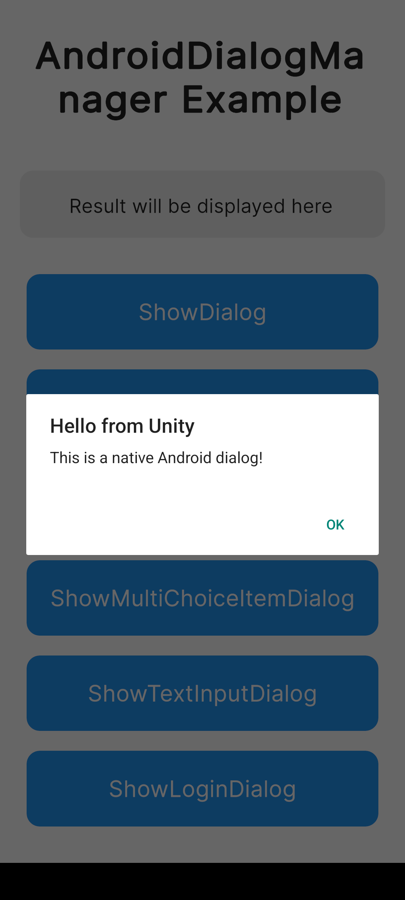
</p>
- 결과는 이벤트로 받습니다.

```csharp
// buttonText: 누른 버튼 텍스트. 오류 시 null.
// isSuccess: 성공 시 true.
// errorMessage: 오류 메시지 (성공 시 null).

private void OnDialogResult(
  string? buttonText,
  bool isSuccess,
  string? errorMessage
)
```

#### ShowConfirmDialog - 확인 다이얼로그

- 네임스페이스를 임포트합니다.

```csharp
// 가드: Android (Player)만. Editor에서는 네이티브 호출을 피합니다.
#if UNITY_ANDROID && !UNITY_EDITOR
using JonghyunKim.NativeToolkit.Runtime.Dialog;
#endif
```

- 이벤트를 등록합니다.

```csharp
// 가드: Android (Player)만. Editor에서는 네이티브 호출을 피합니다.
#if UNITY_ANDROID && !UNITY_EDITOR
AndroidDialogManager.Instance.ConfirmDialogResult += OnConfirmDialogResult;
#endif
```

- 다이얼로그를 표시합니다.

```csharp
// 가드: Android (Player)만. Editor에서는 네이티브 호출을 피합니다.
#if UNITY_ANDROID && !UNITY_EDITOR
// 제목 (필수)
string title = "Confirmation";
// 메시지 (필수)
string message = "Do you want to proceed with this action?";
// 부정 버튼 텍스트 (기본값: "No")
string negativeButtonText = "No";
// 긍정 버튼 텍스트 (기본값: "Yes")
string positiveButtonText = "Yes";
// 바깥 터치로 닫기 허용 (기본값: true)
bool cancelableOnTouchOutside = false;
// 뒤로가기 등으로 취소 허용 (기본값: true)
bool cancelable = false;
AndroidDialogManager.Instance.ShowConfirmDialog(
  title,
  message,
  negativeButtonText,
  positiveButtonText,
  cancelableOnTouchOutside,
  cancelable
);
#endif
```

<p align="center">
  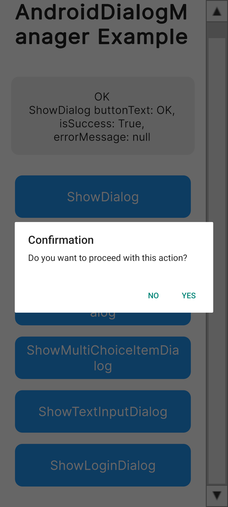
</p>
- 결과는 이벤트로 받습니다.

```csharp
// buttonText: 누른 버튼 텍스트. 오류 시 null.
// isSuccess: 성공 시 true.
// errorMessage: 오류 메시지 (성공 시 null).

private void OnConfirmDialogResult(
  string? buttonText,
  bool isSuccess,
  string? errorMessage
)
```

#### ShowSingleChoiceDialog - 단일 선택 다이얼로그

- 네임스페이스를 임포트합니다.

```csharp
// 가드: Android (Player)만. Editor에서는 네이티브 호출을 피합니다.
#if UNITY_ANDROID && !UNITY_EDITOR
using JonghyunKim.NativeToolkit.Runtime.Dialog;
#endif
```

- 이벤트를 등록합니다.

```csharp
// 가드: Android (Player)만. Editor에서는 네이티브 호출을 피합니다.
#if UNITY_ANDROID && !UNITY_EDITOR
AndroidDialogManager.Instance.SingleChoiceItemDialogResult += OnSingleChoiceItemDialogResult;
#endif
```

- 다이얼로그를 표시합니다.

```csharp
// 가드: Android (Player)만. Editor에서는 네이티브 호출을 피합니다.
#if UNITY_ANDROID && !UNITY_EDITOR
// 제목 (필수)
string title = "Please select one";
// 선택 항목 (필수)
string[] singleChoiceItems = { "Option 1", "Option 2", "Option 3" };
// 기본 선택 index (기본값: 0)
int checkedItem = 0;
// 부정 버튼 텍스트 (기본값: "Cancel")
string negativeButtonText = "Cancel";
// 긍정 버튼 텍스트 (기본값: "OK")
string positiveButtonText = "OK";
// 바깥 터치로 닫기 허용 (기본값: true)
bool cancelableOnTouchOutside = false;
// 뒤로가기 등으로 취소 허용 (기본값: true)
bool cancelable = false;
AndroidDialogManager.Instance.ShowSingleChoiceItemDialog(
  title,
  singleChoiceItems,
  checkedItem,
  negativeButtonText,
  positiveButtonText,
  cancelableOnTouchOutside,
  cancelable
);
#endif
```

<p align="center">
  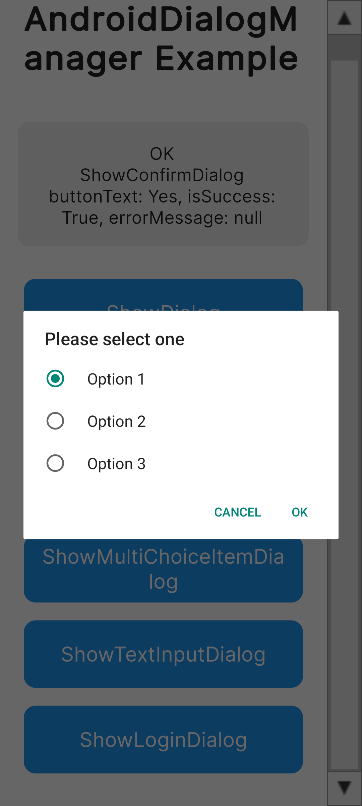
</p>
- 결과는 이벤트로 받습니다.

```csharp
// buttonText: 누른 버튼 텍스트. 오류 시 null.
// checkedItem: 선택된 index. 오류 시 null.
// isSuccess: 성공 시 true.
// errorMessage: 오류 메시지 (성공 시 null).

private void OnSingleChoiceItemDialogResult(
  string? buttonText,
  int? checkedItem,
  bool isSuccess,
  string? errorMessage
)
```

#### ShowMultiChoiceDialog - 다중 선택 다이얼로그

- 네임스페이스를 임포트합니다.

```csharp
// 가드: Android (Player)만. Editor에서는 네이티브 호출을 피합니다.
#if UNITY_ANDROID && !UNITY_EDITOR
using JonghyunKim.NativeToolkit.Runtime.Dialog;
#endif
```

- 이벤트를 등록합니다.

```csharp
// 가드: Android (Player)만. Editor에서는 네이티브 호출을 피합니다.
#if UNITY_ANDROID && !UNITY_EDITOR
AndroidDialogManager.Instance.MultiChoiceItemDialogResult += OnMultiChoiceItemDialogResult;
#endif
```

- 다이얼로그를 표시합니다.

```csharp
// 가드: Android (Player)만. Editor에서는 네이티브 호출을 피합니다.
#if UNITY_ANDROID && !UNITY_EDITOR
// 제목 (필수)
string title = "Multiple Selection";
// 선택 항목 (필수)
string[] multiChoiceItems = { "Item 1", "Item 2", "Item 3", "Item 4" };
// 기본 선택 상태 (기본값: 모두 false)
bool[] checkedItems = { false, true, false, true };
// 부정 버튼 텍스트 (기본값: "Cancel")
string negativeButtonText = "Cancel";
// 긍정 버튼 텍스트 (기본값: "OK")
string positiveButtonText = "OK";
// 바깥 터치로 닫기 허용 (기본값: true)
bool cancelableOnTouchOutside = false;
// 뒤로가기 등으로 취소 허용 (기본값: true)
bool cancelable = false;
AndroidDialogManager.Instance.ShowMultiChoiceItemDialog(
  title,
  multiChoiceItems,
  checkedItems,
  negativeButtonText,
  positiveButtonText,
  cancelableOnTouchOutside,
  cancelable
);
#endif
```

<p align="center">
  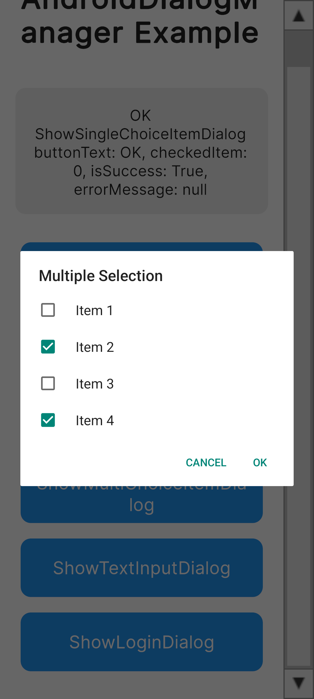
</p>
- 결과는 이벤트로 받습니다.

```csharp
// buttonText: 누른 버튼 텍스트. 오류 시 null.
// checkedItems: 선택 상태. 오류 시 null.
// isSuccess: 성공 시 true.
// errorMessage: 오류 메시지 (성공 시 null).

private void OnMultiChoiceItemDialogResult(
  string? buttonText,
  bool[]? checkedItems,
  bool isSuccess,
  string? errorMessage
)
```

#### ShowInputDialog - 입력 다이얼로그

- 네임스페이스를 임포트합니다.

```csharp
// 가드: Android (Player)만. Editor에서는 네이티브 호출을 피합니다.
#if UNITY_ANDROID && !UNITY_EDITOR
using JonghyunKim.NativeToolkit.Runtime.Dialog;
#endif
```

- 이벤트를 등록합니다.

```csharp
// 가드: Android (Player)만. Editor에서는 네이티브 호출을 피합니다.
#if UNITY_ANDROID && !UNITY_EDITOR
AndroidDialogManager.Instance.TextInputDialogResult += OnTextInputDialogResult;
#endif
```

- 다이얼로그를 표시합니다.

```csharp
// 가드: Android (Player)만. Editor에서는 네이티브 호출을 피합니다.
#if UNITY_ANDROID && !UNITY_EDITOR
// 제목 (필수)
string title = "Text Input";
// 메시지 (필수)
string message = "Please enter your name";
// 플레이스홀더 (기본값: 빈 문자열)
string placeholder = "Enter here...";
// 부정 버튼 텍스트 (기본값: "Cancel")
string negativeButtonText = "Cancel";
// 긍정 버튼 텍스트 (기본값: "OK")
string positiveButtonText = "OK";
// 입력이 비어있어도 긍정 버튼 활성화 (기본값: false)
bool enablePositiveButtonWhenEmpty = false;
// 바깥 터치로 닫기 허용 (기본값: true)
bool cancelableOnTouchOutside = false;
// 뒤로가기 등으로 취소 허용 (기본값: true)
bool cancelable = false;
AndroidDialogManager.Instance.ShowTextInputDialog(
  title,
  message,
  placeholder,
  negativeButtonText,
  positiveButtonText,
  enablePositiveButtonWhenEmpty,
  cancelableOnTouchOutside,
  cancelable
);
#endif
```

<p align="center">
  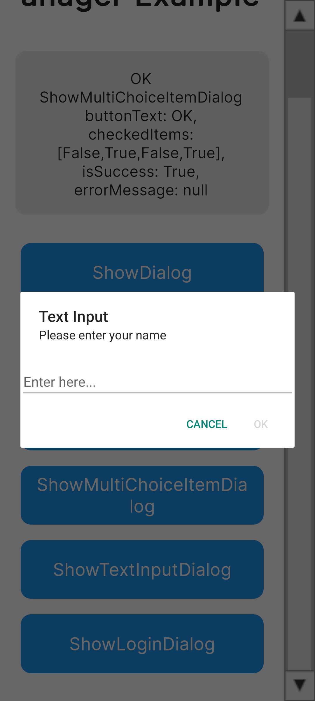
</p>
- 결과는 이벤트로 받습니다.

```csharp
// buttonText: 누른 버튼 텍스트. 오류 시 null.
// inputText: 입력된 텍스트. 오류 시 null.
// isSuccess: 성공 시 true.
// errorMessage: 오류 메시지 (성공 시 null).

private void OnTextInputDialogResult(
  string? buttonText,
  string? inputText,
  bool isSuccess,
  string? errorMessage
)
```

#### ShowLoginDialog - 로그인 다이얼로그

- 네임스페이스를 임포트합니다.

```csharp
// 가드: Android (Player)만. Editor에서는 네이티브 호출을 피합니다.
#if UNITY_ANDROID && !UNITY_EDITOR
using JonghyunKim.NativeToolkit.Runtime.Dialog;
#endif
```

- 이벤트를 등록합니다.

```csharp
// 가드: Android (Player)만. Editor에서는 네이티브 호출을 피합니다.
#if UNITY_ANDROID && !UNITY_EDITOR
AndroidDialogManager.Instance.LoginDialogResult += OnLoginDialogResult;
#endif
```

- 다이얼로그를 표시합니다.

```csharp
// 가드: Android (Player)만. Editor에서는 네이티브 호출을 피합니다.
#if UNITY_ANDROID && !UNITY_EDITOR
// 제목 (필수)
string title = "Login";
// 메시지 (필수)
string message = "Please enter your credentials";
// 사용자명 힌트 (기본값: "Username")
string usernameHint = "Username";
// 비밀번호 힌트 (기본값: "Password")
string passwordHint = "Password";
// 부정 버튼 텍스트 (기본값: "Cancel")
string negativeButtonText = "Cancel";
// 긍정 버튼 텍스트 (기본값: "Login")
string positiveButtonText = "Login";
// 입력이 비어있어도 긍정 버튼 활성화 (기본값: false)
bool enablePositiveButtonWhenEmpty = false;
// 바깥 터치로 닫기 허용 (기본값: true)
bool cancelableOnTouchOutside = false;
// 뒤로가기 등으로 취소 허용 (기본값: true)
bool cancelable = false;
AndroidDialogManager.Instance.ShowLoginDialog(
  title,
  message,
  usernameHint,
  passwordHint,
  negativeButtonText,
  positiveButtonText,
  enablePositiveButtonWhenEmpty,
  cancelableOnTouchOutside,
  cancelable
);
#endif
```

<p align="center">
  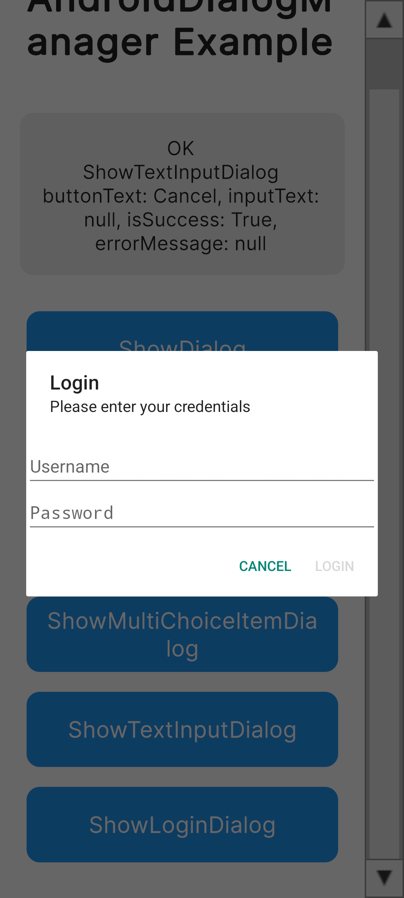
</p>
- 결과는 이벤트로 받습니다.

```csharp
// buttonText: 누른 버튼 텍스트. 오류 시 null.
// username: 입력된 사용자명. 오류 시 null.
// password: 입력된 비밀번호. 오류 시 null.
// isSuccess: 성공 시 true.
// errorMessage: 오류 메시지 (성공 시 null).

private void OnLoginDialogResult(
  string? buttonText,
  string? username,
  string? password,
  bool isSuccess,
  string? errorMessage
)
```

---

## iOS

### IosDialogManager

#### ShowDialog - 기본 다이얼로그

- 네임스페이스를 임포트합니다.

```csharp
// 가드: iOS (Player)만. Editor에서는 네이티브 호출을 피합니다.
#if UNITY_IOS && !UNITY_EDITOR
using JonghyunKim.NativeToolkit.Runtime.Dialog;
#endif
```

- 이벤트를 등록합니다.

```csharp
// 가드: iOS (Player)만. Editor에서는 네이티브 호출을 피합니다.
#if UNITY_IOS && !UNITY_EDITOR
IosDialogManager.Instance.DialogResult += OnDialogResult;
#endif
```

- 다이얼로그를 표시합니다.

```csharp
// 가드: iOS (Player)만. Editor에서는 네이티브 호출을 피합니다.
#if UNITY_IOS && !UNITY_EDITOR
// 제목 (필수)
string title = "Hello from Unity";
// 메시지 (필수)
string message = "This is a native iOS dialog!";
// 버튼 텍스트 (기본값: "OK")
string buttonText = "OK";
IosDialogManager.Instance.ShowDialog(
  title,
  message,
  buttonText
);
#endif
```

<p align="center">
  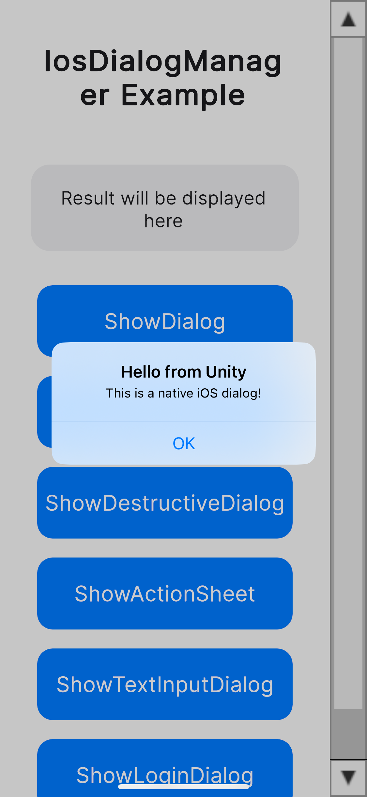
</p>
- 결과는 이벤트로 받습니다.

```csharp
// buttonText: 누른 버튼 텍스트. 오류 시 null.
// isSuccess: 성공 시 true.
// errorMessage: 오류 메시지 (성공 시 null).

private void OnDialogResult(
  string? buttonText,
  bool isSuccess,
  string? errorMessage
)
```

#### ShowConfirmDialog - 확인 다이얼로그

- 네임스페이스를 임포트합니다.

```csharp
// 가드: iOS (Player)만. Editor에서는 네이티브 호출을 피합니다.
#if UNITY_IOS && !UNITY_EDITOR
using JonghyunKim.NativeToolkit.Runtime.Dialog;
#endif
```

- 이벤트를 등록합니다.

```csharp
// 가드: iOS (Player)만. Editor에서는 네이티브 호출을 피합니다.
#if UNITY_IOS && !UNITY_EDITOR
IosDialogManager.Instance.ConfirmDialogResult += OnConfirmDialogResult;
#endif
```

- 다이얼로그를 표시합니다.

```csharp
// 가드: iOS (Player)만. Editor에서는 네이티브 호출을 피합니다.
#if UNITY_IOS && !UNITY_EDITOR
// 제목 (필수)
string title = "Confirm Action";
// 메시지 (필수)
string message = "Are you sure you want to proceed?";
// 확인 버튼 텍스트 (기본값: "OK")
string confirmButtonText = "Yes";
// 취소 버튼 텍스트 (기본값: "Cancel")
string cancelButtonText = "No";
IosDialogManager.Instance.ShowConfirmDialog(
  title,
  message,
  confirmButtonText,
  cancelButtonText
);
#endif
```

<p align="center">
  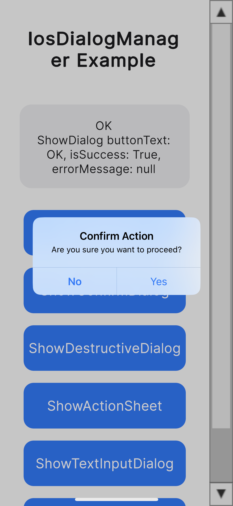
</p>
- 결과는 이벤트로 받습니다.

```csharp
// buttonText: 누른 버튼 텍스트. 오류 시 null.
// isSuccess: 성공 시 true.
// errorMessage: 오류 메시지 (성공 시 null).

private void OnConfirmDialogResult(
  string? buttonText,
  bool isSuccess,
  string? errorMessage
)
```

#### ShowDestructiveDialog - 파괴적 다이얼로그

- 네임스페이스를 임포트합니다.

```csharp
// 가드: iOS (Player)만. Editor에서는 네이티브 호출을 피합니다.
#if UNITY_IOS && !UNITY_EDITOR
using JonghyunKim.NativeToolkit.Runtime.Dialog;
#endif
```

- 이벤트를 등록합니다.

```csharp
// 가드: iOS (Player)만. Editor에서는 네이티브 호출을 피합니다.
#if UNITY_IOS && !UNITY_EDITOR
IosDialogManager.Instance.DestructiveDialogResult += OnDestructiveDialogResult;
#endif
```

- 다이얼로그를 표시합니다.

```csharp
// 가드: iOS (Player)만. Editor에서는 네이티브 호출을 피합니다.
#if UNITY_IOS && !UNITY_EDITOR
// 제목 (필수)
string title = "Delete File";
// 메시지 (필수)
string message = "This action cannot be undone. Are you sure?";
// 파괴적 버튼 텍스트 (기본값: "Delete")
string destructiveButtonText = "Delete";
// 취소 버튼 텍스트 (기본값: "Cancel")
string cancelButtonText = "Cancel";
IosDialogManager.Instance.ShowDestructiveDialog(
  title,
  message,
  destructiveButtonText,
  cancelButtonText
);
#endif
```

<p align="center">
  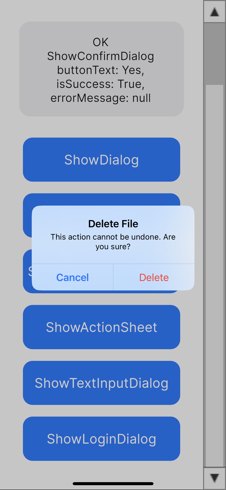
</p>
- 결과는 이벤트로 받습니다.

```csharp
// buttonText: 누른 버튼 텍스트. 오류 시 null.
// isSuccess: 성공 시 true.
// errorMessage: 오류 메시지 (성공 시 null).

private void OnDestructiveDialogResult(
  string? buttonText,
  bool isSuccess,
  string? errorMessage
)
```

#### ShowActionSheet - 액션 시트

- 네임스페이스를 임포트합니다.

```csharp
// 가드: iOS (Player)만. Editor에서는 네이티브 호출을 피합니다.
#if UNITY_IOS && !UNITY_EDITOR
using JonghyunKim.NativeToolkit.Runtime.Dialog;
#endif
```

- 이벤트를 등록합니다.

```csharp
// 가드: iOS (Player)만. Editor에서는 네이티브 호출을 피합니다.
#if UNITY_IOS && !UNITY_EDITOR
IosDialogManager.Instance.ActionSheetResult += OnActionSheetResult;
#endif
```

- 액션 시트를 표시합니다.

```csharp
// 가드: iOS (Player)만. Editor에서는 네이티브 호출을 피합니다.
#if UNITY_IOS && !UNITY_EDITOR
// 제목 (필수)
string title = "Select Source";
// 메시지 (필수)
string message = "Choose where to get the file from";
// 옵션 (필수)
string[] options = { "Camera", "Photo Library", "Documents" };
// 취소 버튼 텍스트 (기본값: "Cancel")
string cancelButtonText = "Cancel";
IosDialogManager.Instance.ShowActionSheet(
  title,
  message,
  options,
  cancelButtonText
);
#endif
```

<p align="center">
  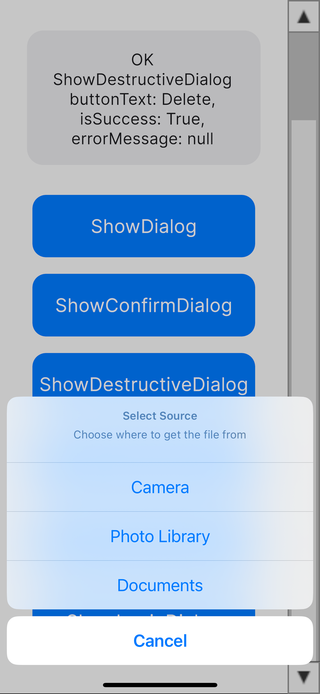
</p>
- 결과는 이벤트로 받습니다.

```csharp
// buttonText: 누른 버튼 텍스트. 오류 시 null.
// isSuccess: 성공 시 true.
// errorMessage: 오류 메시지 (성공 시 null).

private void OnActionSheetResult(
  string? buttonText,
  bool isSuccess,
  string? errorMessage
)
```

#### ShowTextInputDialog - 입력 다이얼로그

- 네임스페이스를 임포트합니다.

```csharp
// 가드: iOS (Player)만. Editor에서는 네이티브 호출을 피합니다.
#if UNITY_IOS && !UNITY_EDITOR
using JonghyunKim.NativeToolkit.Runtime.Dialog;
#endif
```

- 이벤트를 등록합니다.

```csharp
// 가드: iOS (Player)만. Editor에서는 네이티브 호출을 피합니다.
#if UNITY_IOS && !UNITY_EDITOR
IosDialogManager.Instance.TextInputDialogResult += OnTextInputDialogResult;
#endif
```

- 다이얼로그를 표시합니다.

```csharp
// 가드: iOS (Player)만. Editor에서는 네이티브 호출을 피합니다.
#if UNITY_IOS && !UNITY_EDITOR
// 제목 (필수)
string title = "Enter Name";
// 메시지 (필수)
string message = "Please enter your name";
// 플레이스홀더 (기본값: 빈 문자열)
string placeholder = "Your name here";
// 확인 버튼 텍스트 (기본값: "OK")
string confirmButtonText = "OK";
// 취소 버튼 텍스트 (기본값: "Cancel")
string cancelButtonText = "Cancel";
// 입력이 비어있어도 확인 버튼 활성화 (기본값: false)
bool enableConfirmWhenEmpty = false;
IosDialogManager.Instance.ShowTextInputDialog(
  title,
  message,
  placeholder,
  confirmButtonText,
  cancelButtonText,
  enableConfirmWhenEmpty
);
#endif
```

<p align="center">
  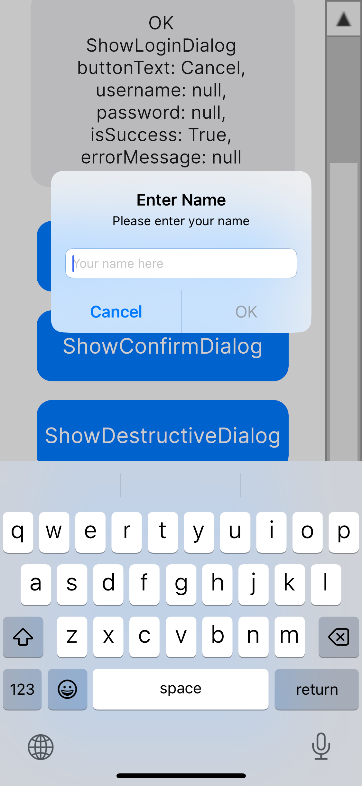
</p>
- 결과는 이벤트로 받습니다.

```csharp
// buttonText: 누른 버튼 텍스트. 오류 시 null.
// inputText: 입력된 텍스트. 오류 시 null.
// isSuccess: 성공 시 true.
// errorMessage: 오류 메시지 (성공 시 null).

private void OnTextInputDialogResult(
  string? buttonText,
  string? inputText,
  bool isSuccess,
  string? errorMessage
)
```

#### ShowLoginDialog - 로그인 다이얼로그

- 네임스페이스를 임포트합니다.

```csharp
// 가드: iOS (Player)만. Editor에서는 네이티브 호출을 피합니다.
#if UNITY_IOS && !UNITY_EDITOR
using JonghyunKim.NativeToolkit.Runtime.Dialog;
#endif
```

- 이벤트를 등록합니다.

```csharp
// 가드: iOS (Player)만. Editor에서는 네이티브 호출을 피합니다.
#if UNITY_IOS && !UNITY_EDITOR
IosDialogManager.Instance.LoginDialogResult += OnLoginDialogResult;
#endif
```

- 다이얼로그를 표시합니다.

```csharp
// 가드: iOS (Player)만. Editor에서는 네이티브 호출을 피합니다.
#if UNITY_IOS && !UNITY_EDITOR
// 제목 (필수)
string title = "Login Required";
// 메시지 (필수)
string message = "Please enter your credentials";
// 사용자명 플레이스홀더 (기본값: "Username")
string usernamePlaceholder = "Username";
// 비밀번호 플레이스홀더 (기본값: "Password")
string passwordPlaceholder = "Password";
// 로그인 버튼 텍스트 (기본값: "Login")
string loginButtonText = "Login";
// 취소 버튼 텍스트 (기본값: "Cancel")
string cancelButtonText = "Cancel";
// 입력이 비어있어도 로그인 버튼 활성화 (기본값: false)
bool enableLoginWhenEmpty = false;
IosDialogManager.Instance.ShowLoginDialog(
  title,
  message,
  usernamePlaceholder,
  passwordPlaceholder,
  loginButtonText,
  cancelButtonText,
  enableLoginWhenEmpty
);
#endif
```

<p align="center">
  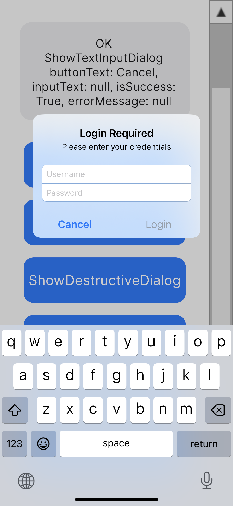
</p>
- 결과는 이벤트로 받습니다.

```csharp
// buttonText: 누른 버튼 텍스트. 오류 시 null.
// username: 입력된 사용자명. 오류 시 null.
// password: 입력된 비밀번호. 오류 시 null.
// isSuccess: 성공 시 true.
// errorMessage: 오류 메시지 (성공 시 null).

private void OnLoginDialogResult(
  string? buttonText,
  string? username,
  string? password,
  bool isSuccess,
  string? errorMessage
)
```

---

## Windows

### WindowsDialogManager

#### ShowDialog - 기본 다이얼로그

- 네임스페이스를 임포트합니다.

```csharp
// 가드: Windows (Player)만. Editor에서는 네이티브 호출을 피합니다.
#if UNITY_STANDALONE_WIN && !UNITY_EDITOR
using JonghyunKim.NativeToolkit.Runtime.Dialog;
#endif
```

- 이벤트를 등록합니다.

```csharp
// 가드: Windows (Player)만. Editor에서는 네이티브 호출을 피합니다.
#if UNITY_STANDALONE_WIN && !UNITY_EDITOR
WindowsDialogManager.Instance.AlertDialogResult += OnAlertDialogResult;
#endif
```

- 다이얼로그를 표시합니다.

```csharp
// 가드: Windows (Player)만. Editor에서는 네이티브 호출을 피합니다.
#if UNITY_STANDALONE_WIN && !UNITY_EDITOR
// 제목 (필수)
string title = "Native Windows Dialog";
// 메시지 (필수)
string message = "This is a native Windows dialog!";
// 버튼: OK + Cancel (기본값: MB_OK)
uint buttons = Win32MessageBox.MB_OKCANCEL;
// 아이콘: 정보 (기본값: MB_ICONINFORMATION)
uint icon = Win32MessageBox.MB_ICONINFORMATION;
// 기본 버튼: 두번째 (기본값: MB_DEFBUTTON1)
uint defbutton = Win32MessageBox.MB_DEFBUTTON2;
// 옵션: 앱 모달 (기본값: MB_APPLMODAL)
uint options = Win32MessageBox.MB_APPLMODAL;
WindowsDialogManager.Instance.ShowDialog(
  title,
  message,
  buttons,
  icon,
  defbutton,
  options
);
#endif
```

<p align="center">
  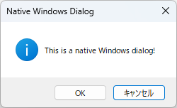
</p>
- 결과는 이벤트로 받습니다.

```csharp
// result: 누른 버튼 식별자. 오류 시 null.
// isSuccess: 성공 시 true.
// errorCode: 오류 코드 (성공 시 null).

private void OnAlertDialogResult(
  int? result,
  bool isSuccess,
  int? errorCode
)
```

#### ShowFileDialog - 파일 선택 다이얼로그

- 네임스페이스를 임포트합니다.

```csharp
// 가드: Windows (Player)만. Editor에서는 네이티브 호출을 피합니다.
#if UNITY_STANDALONE_WIN && !UNITY_EDITOR
using JonghyunKim.NativeToolkit.Runtime.Dialog;
#endif
```

- 이벤트를 등록합니다.

```csharp
// 가드: Windows (Player)만. Editor에서는 네이티브 호출을 피합니다.
#if UNITY_STANDALONE_WIN && !UNITY_EDITOR
WindowsDialogManager.Instance.FileDialogResult += OnFileDialogResult;
#endif
```

- 다이얼로그를 표시합니다.

```csharp
// 가드: Windows (Player)만. Editor에서는 네이티브 호출을 피합니다.
#if UNITY_STANDALONE_WIN && !UNITY_EDITOR
// 버퍼 크기 (기본값: 1024)
uint bufferSize = 1024;
// 필터 (기본값: "All Files\0*.*\0\0")
string filter = "All Files\0*.*\0\0";
WindowsDialogManager.Instance.ShowFileDialog(
  bufferSize,
  filter
);
#endif
```

<p align="center">
  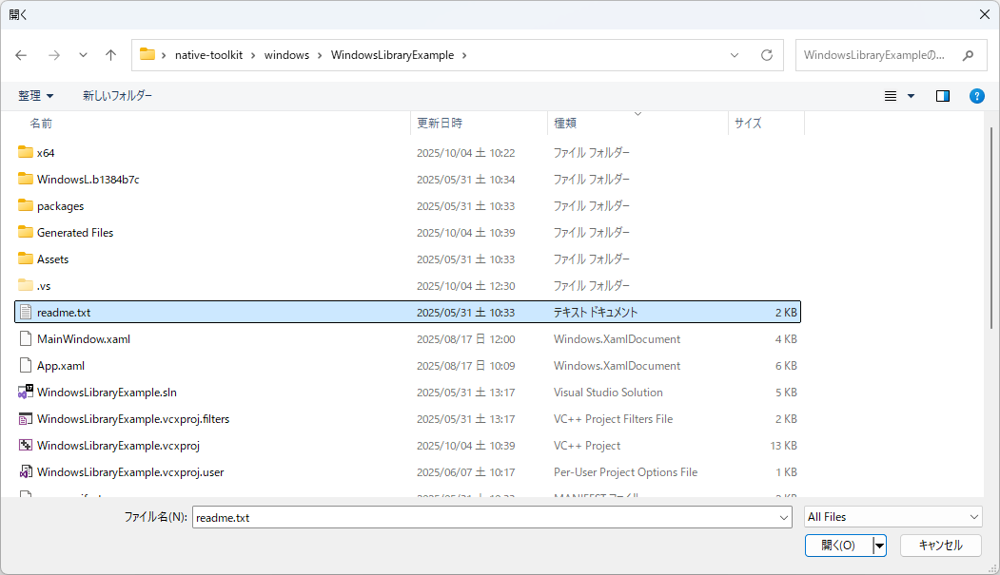
</p>
- 결과는 이벤트로 받습니다.

```csharp
// filePath: 선택된 경로. 취소/실패 시 null.
// isCancelled: 사용자가 취소했는지 여부.
// isSuccess: 성공 시 true.
// errorCode: 오류 코드 (성공 시 null).

private void OnFileDialogResult(
  string? filePath,
  bool isCancelled,
  bool isSuccess,
  int? errorCode
)
```

#### ShowMultiFileDialog - 다중 파일 선택 다이얼로그

- 네임스페이스를 임포트합니다.

```csharp
// 가드: Windows (Player)만. Editor에서는 네이티브 호출을 피합니다.
#if UNITY_STANDALONE_WIN && !UNITY_EDITOR
using JonghyunKim.NativeToolkit.Runtime.Dialog;
#endif
```

- 이벤트를 등록합니다.

```csharp
// 가드: Windows (Player)만. Editor에서는 네이티브 호출을 피합니다.
#if UNITY_STANDALONE_WIN && !UNITY_EDITOR
WindowsDialogManager.Instance.MultiFileDialogResult += OnMultiFileDialogResult;
#endif
```

- 다이얼로그를 표시합니다.

```csharp
// 가드: Windows (Player)만. Editor에서는 네이티브 호출을 피합니다.
#if UNITY_STANDALONE_WIN && !UNITY_EDITOR
// 버퍼 크기 (기본값: 4096)
uint bufferSize = 4096;
// 필터 (기본값: "All Files\0*.*\0\0")
string filter = "All Files\0*.*\0\0";
WindowsDialogManager.Instance.ShowMultiFileDialog(
  bufferSize,
  filter
);
#endif
```

<p align="center">
  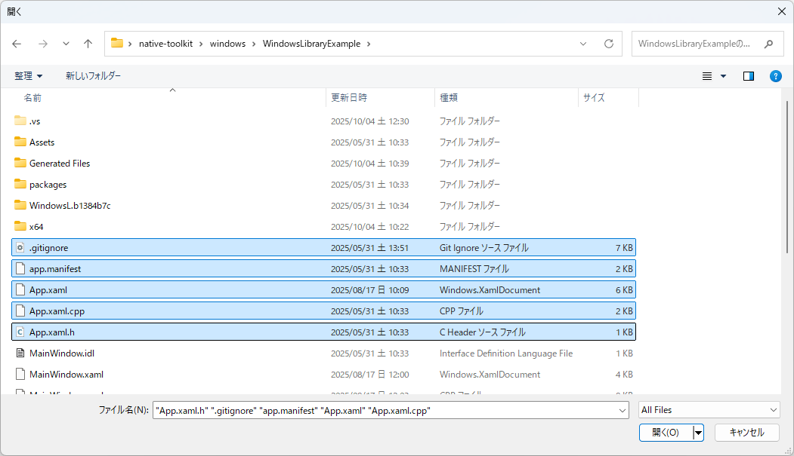
</p>
- 결과는 이벤트로 받습니다.

```csharp
// filePaths: 선택된 파일 경로들 (ArrayList). 취소/실패 시 null.
// isCancelled: 사용자가 취소했는지 여부.
// isSuccess: 성공 시 true.
// errorCode: 오류 코드 (성공 시 null).

private void OnMultiFileDialogResult(
  ArrayList? filePaths,
  bool isCancelled,
  bool isSuccess,
  int? errorCode
)
```

#### ShowFolderDialog - 폴더 선택 다이얼로그

- 네임스페이스를 임포트합니다.

```csharp
// 가드: Windows (Player)만. Editor에서는 네이티브 호출을 피합니다.
#if UNITY_STANDALONE_WIN && !UNITY_EDITOR
using JonghyunKim.NativeToolkit.Runtime.Dialog;
#endif
```

- 이벤트를 등록합니다.

```csharp
// 가드: Windows (Player)만. Editor에서는 네이티브 호출을 피합니다.
#if UNITY_STANDALONE_WIN && !UNITY_EDITOR
WindowsDialogManager.Instance.FolderDialogResult += OnFolderDialogResult;
#endif
```

- 다이얼로그를 표시합니다.

```csharp
// 가드: Windows (Player)만. Editor에서는 네이티브 호출을 피합니다.
#if UNITY_STANDALONE_WIN && !UNITY_EDITOR
// 버퍼 크기 (기본값: 1024)
uint bufferSize = 1024;
// 제목 (기본값: "Select Folder")
string title = "Select Folder";
WindowsDialogManager.Instance.ShowFolderDialog(
  bufferSize,
  title
);
#endif
```

<p align="center">
  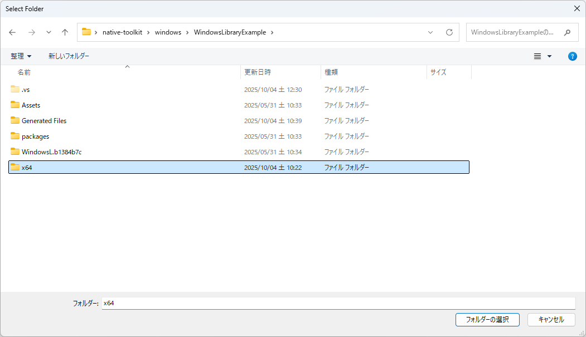
</p>
- 결과는 이벤트로 받습니다.

```csharp
// folderPath: 선택된 경로. 취소/실패 시 null.
// isCancelled: 사용자가 취소했는지 여부.
// isSuccess: 성공 시 true.
// errorCode: 오류 코드 (성공 시 null).

private void OnFolderDialogResult(
  string? folderPath,
  bool isCancelled,
  bool isSuccess,
  int? errorCode
)
```

#### ShowMultiFolderDialog - 다중 폴더 선택 다이얼로그

- 네임스페이스를 임포트합니다.

```csharp
// 가드: Windows (Player)만. Editor에서는 네이티브 호출을 피합니다.
#if UNITY_STANDALONE_WIN && !UNITY_EDITOR
using JonghyunKim.NativeToolkit.Runtime.Dialog;
#endif
```

- 이벤트를 등록합니다.

```csharp
// 가드: Windows (Player)만. Editor에서는 네이티브 호출을 피합니다.
#if UNITY_STANDALONE_WIN && !UNITY_EDITOR
WindowsDialogManager.Instance.MultiFolderDialogResult += OnMultiFolderDialogResult;
#endif
```

- 다이얼로그를 표시합니다.

```csharp
// 가드: Windows (Player)만. Editor에서는 네이티브 호출을 피합니다.
#if UNITY_STANDALONE_WIN && !UNITY_EDITOR
// 버퍼 크기 (기본값: 4096)
uint bufferSize = 4096;
// 제목 (기본값: "Select Folders")
string title = "Select Folders";
WindowsDialogManager.Instance.ShowMultiFolderDialog(
  bufferSize,
  title
);
#endif
```

<p align="center">
  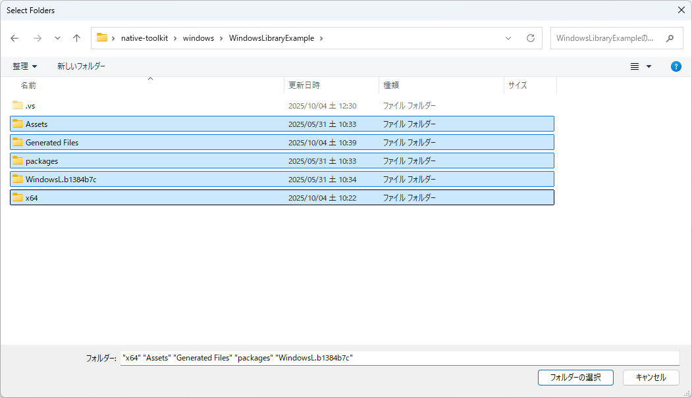
</p>
- 결과는 이벤트로 받습니다.

```csharp
// folderPaths: 선택된 폴더 경로들 (ArrayList). 취소/실패 시 null.
// isCancelled: 사용자가 취소했는지 여부.
// isSuccess: 성공 시 true.
// errorCode: 오류 코드 (성공 시 null).

private void OnMultiFolderDialogResult(
  ArrayList? folderPaths,
  bool isCancelled,
  bool isSuccess,
  int? errorCode
)
```

#### ShowSaveFileDialog - 파일 저장 다이얼로그

- 네임스페이스를 임포트합니다.

```csharp
// 가드: Windows (Player)만. Editor에서는 네이티브 호출을 피합니다.
#if UNITY_STANDALONE_WIN && !UNITY_EDITOR
using JonghyunKim.NativeToolkit.Runtime.Dialog;
#endif
```

- 이벤트를 등록합니다.

```csharp
// 가드: Windows (Player)만. Editor에서는 네이티브 호출을 피합니다.
#if UNITY_STANDALONE_WIN && !UNITY_EDITOR
WindowsDialogManager.Instance.SaveFileDialogResult += OnSaveFileDialogResult;
#endif
```

- 다이얼로그를 표시합니다.

```csharp
// 가드: Windows (Player)만. Editor에서는 네이티브 호출을 피합니다.
#if UNITY_STANDALONE_WIN && !UNITY_EDITOR
// 버퍼 크기 (기본값: 1024)
uint bufferSize = 1024;
// 필터 (기본값: "All Files\0*.*\0\0")
string filter = "All Files\0*.*\0\0";
// 기본 확장자 (기본값: "txt")
string defExt = "txt";
WindowsDialogManager.Instance.ShowSaveFileDialog(
  bufferSize,
  filter,
  defExt
);
#endif
```

<p align="center">
  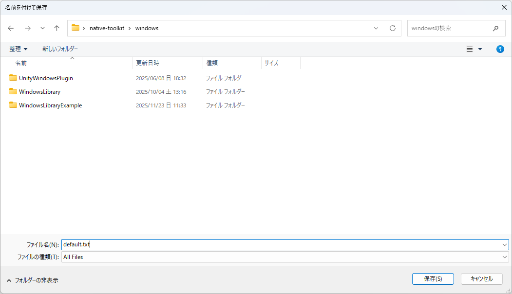
</p>
- 결과는 이벤트로 받습니다.

```csharp
// filePath: 저장된 경로. 취소/실패 시 null.
// isCancelled: 사용자가 취소했는지 여부.
// isSuccess: 성공 시 true.
// errorCode: 오류 코드 (성공 시 null).

private void OnSaveFileDialogResult(
  string? filePath,
  bool isCancelled,
  bool isSuccess,
  int? errorCode
)
```

---

## macOS

### MacDialogManager

#### ShowDialog - 기본 다이얼로그

- 네임스페이스를 임포트합니다.

```csharp
// 가드: macOS (Player)만. Editor에서는 네이티브 호출을 피합니다.
#if UNITY_STANDALONE_OSX && !UNITY_EDITOR
using JonghyunKim.NativeToolkit.Runtime.Dialog;
#endif
```

- 이벤트를 등록합니다.

```csharp
// 가드: macOS (Player)만. Editor에서는 네이티브 호출을 피합니다.
#if UNITY_STANDALONE_OSX && !UNITY_EDITOR
MacDialogManager.Instance.AlertDialogResult += OnAlertDialogResult;
#endif
```

- 다이얼로그를 표시합니다.

```csharp
// 가드: macOS (Player)만. Editor에서는 네이티브 호출을 피합니다.
#if UNITY_STANDALONE_OSX && !UNITY_EDITOR
// 제목 (필수)
string title = "Hello from Unity";
// 메시지 (선택)
string message = "This is a native macOS dialog!";
// 버튼 (최소 1개 필요)
DialogButton[] buttons = {
  // title: 버튼 제목 (필수)
  // isDefault: 기본 버튼 지정 (하나만 가능)
  // keyEquivalent: 단축키 (옵션, 기본 버튼은 Enter 사용)
  new DialogButton(title: "OK", isDefault: true),
  new DialogButton(title: "Cancel", keyEquivalent: ""),
  new DialogButton(title: "Delete", keyEquivalent: "d")
};
// 옵션 (필수)
DialogOptions options = new DialogOptions(
  // alertStyle: 다이얼로그 스타일 (필수)
  alertStyle: DialogOptions.AlertStyle.Informational,
  // showsHelp: 도움말 버튼 표시
  showsHelp: true,
  // showsSuppressionButton: 서프레션 체크박스 표시
  showsSuppressionButton: true,
  // suppressionButtonTitle: 서프레션 체크박스 타이틀 (옵션)
  suppressionButtonTitle: "Don't show this again",
  // icon: 아이콘 설정
  icon: new IconConfiguration(
    // 아이콘 타입별 예시는 아래 참고.
    ...
  )
);

// 예시: 시스템 심볼 아이콘
DialogOptions options = new DialogOptions(
  ...
  icon: new IconConfiguration(
    // type: 시스템 심볼 아이콘 (필수)
    type: IconConfiguration.IconType.SystemSymbol,
    // value: 심볼 이름 (필수)
    value: "info.square.fill",
    // mode: 렌더링 모드 (필수)
    mode: IconConfiguration.RenderingMode.Palette,
    // colors: Palette는 1~3색, Hierarchical은 1색
    colors: new List<string> { "white", "systemblue", "systemblue" },
    // size: 포인트 크기 (다이얼로그에서는 무시됨)
    size: 64f,
    // weight: 심볼 두께
    weight: IconConfiguration.Weight.Regular,
    // scale: 심볼 스케일 (다이얼로그에서는 무시됨)
    scale: IconConfiguration.Scale.Medium
  )
);

// 예시: 파일 경로 아이콘
DialogOptions options = new DialogOptions(
  ...
  icon: new IconConfiguration(
    // type: 파일 경로 아이콘 (필수)
    type: IconConfiguration.IconType.FilePath,
    // value: 파일 경로 (필수)
    value: "/Users/user/Downloads/test.png"
  )
);

// 예시: 이름 지정 이미지 아이콘
DialogOptions options = new DialogOptions(
  ...
  icon: new IconConfiguration(
    // type: 이름 지정 이미지 아이콘 (필수)
    type: IconConfiguration.IconType.NamedImage,
    // value: 이미지 이름 (필수)
    value: "test-image"
  )
);

// 예시: 앱 아이콘
DialogOptions options = new DialogOptions(
  ...
  icon: new IconConfiguration(
    // type: 앱 아이콘 (필수)
    type: IconConfiguration.IconType.AppIcon
  )
);

// 예시: 시스템 이미지 아이콘
DialogOptions options = new DialogOptions(
  ...
  icon: new IconConfiguration(
    // type: 시스템 이미지 아이콘 (필수)
    type: IconConfiguration.IconType.SystemImage,
    // value: 시스템 이미지 이름 (필수)
    value: "cautionName"
  )
);

MacDialogManager.Instance.ShowDialog(
  title,
  message,
  buttons,
  options
);
#endif
```

<p align="center">
  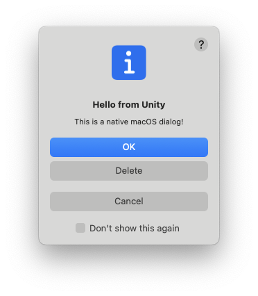
</p>
- 결과는 이벤트로 받습니다.

```csharp
// buttonTitle: 누른 버튼 제목. 오류 시 null.
// buttonIndex: 누른 버튼 index.
// suppressionState: 서프레션 체크박스 상태.
// isSuccess: 성공 시 true.
// errorMessage: 오류 메시지 (성공 시 null).

private void OnAlertDialogResult(
  string? buttonTitle,
  int buttonIndex,
  bool suppressionState,
  bool isSuccess,
  string? errorMessage
)
```

#### ShowFileDialog - 파일 선택 다이얼로그

- 네임스페이스를 임포트합니다.

```csharp
// 가드: macOS (Player)만. Editor에서는 네이티브 호출을 피합니다.
#if UNITY_STANDALONE_OSX && !UNITY_EDITOR
using JonghyunKim.NativeToolkit.Runtime.Dialog;
#endif
```

- 이벤트를 등록합니다.

```csharp
// 가드: macOS (Player)만. Editor에서는 네이티브 호출을 피합니다.
#if UNITY_STANDALONE_OSX && !UNITY_EDITOR
MacDialogManager.Instance.FileDialogResult += OnFileDialogResult;
#endif
```

- 다이얼로그를 표시합니다.

```csharp
// 가드: macOS (Player)만. Editor에서는 네이티브 호출을 피합니다.
#if UNITY_STANDALONE_OSX && !UNITY_EDITOR
// 제목 (필수)
string title = "Select a file";
// 메시지 (선택)
string message = "Please select a file to open.";
// 허용 확장자 (기본값: OS 규정)
string[] allowedContentTypes = { "txt", "png" };
// 초기 디렉터리 (기본값: OS 규정)
string? directoryPath = null;
MacDialogManager.Instance.ShowFileDialog(
  title,
  message,
  allowedContentTypes,
  directoryPath
);
#endif
```

<p align="center">
  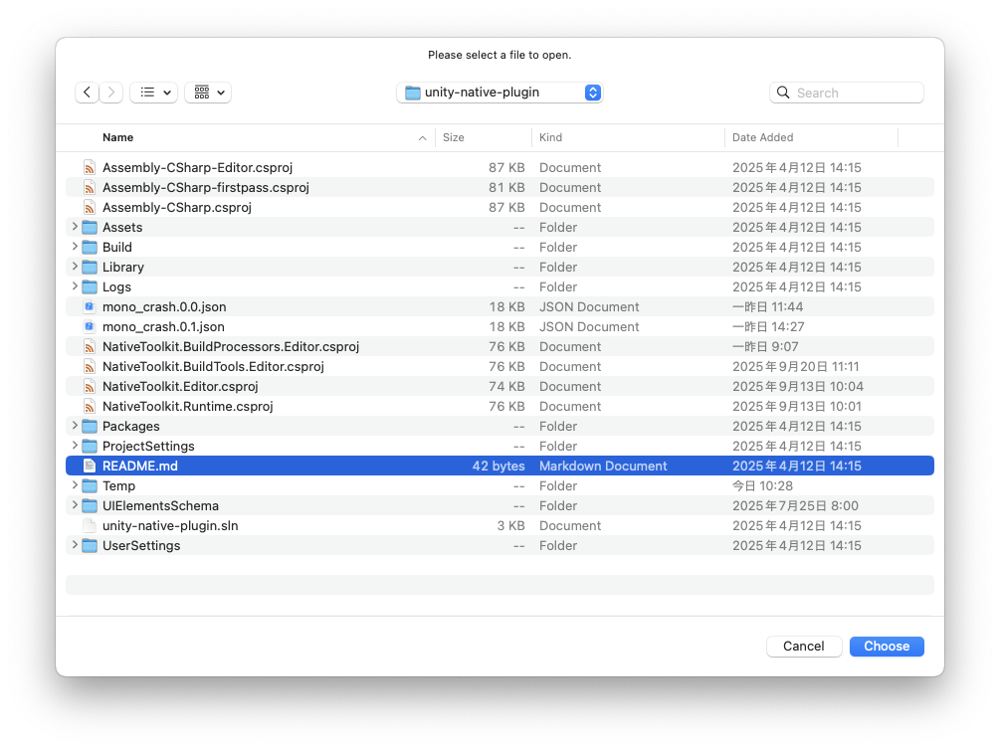
</p>
- 결과는 이벤트로 받습니다.

```csharp
// filePaths: 선택된 파일 경로. 오류 시 null.
// fileCount: 반환된 파일 수 (취소 시 0).
// directoryURL: 선택에 사용된 디렉터리 URL. 오류 시 null.
// isCancelled: 사용자가 취소했는지 여부.
// isSuccess: 성공 시 true.
// errorMessage: 오류 메시지 (성공 시 null).

private void OnFileDialogResult(
  string[]? filePaths,
  int fileCount,
  string? directoryURL,
  bool isCancelled,
  bool isSuccess,
  string? errorMessage
)
```

#### ShowMultiFileDialog - 다중 파일 선택 다이얼로그

- 네임스페이스를 임포트합니다.

```csharp
// 가드: macOS (Player)만. Editor에서는 네이티브 호출을 피합니다.
#if UNITY_STANDALONE_OSX && !UNITY_EDITOR
using JonghyunKim.NativeToolkit.Runtime.Dialog;
#endif
```

- 이벤트를 등록합니다.

```csharp
// 가드: macOS (Player)만. Editor에서는 네이티브 호출을 피합니다.
#if UNITY_STANDALONE_OSX && !UNITY_EDITOR
MacDialogManager.Instance.MultiFileDialogResult += OnMultiFileDialogResult;
#endif
```

- 다이얼로그를 표시합니다.

```csharp
// 가드: macOS (Player)만. Editor에서는 네이티브 호출을 피합니다.
#if UNITY_STANDALONE_OSX && !UNITY_EDITOR
// 제목 (필수)
string title = "Select files";
// 메시지 (선택)
string message = "Please select files to open.";
// 허용 확장자 (기본값: OS 규정)
string[] allowedContentTypes = { "txt", "png" };
// 초기 디렉터리 (기본값: OS 규정)
string? directoryPath = null;
MacDialogManager.Instance.ShowMultiFileDialog(
  title,
  message,
  allowedContentTypes,
  directoryPath
);
#endif
```

<p align="center">
  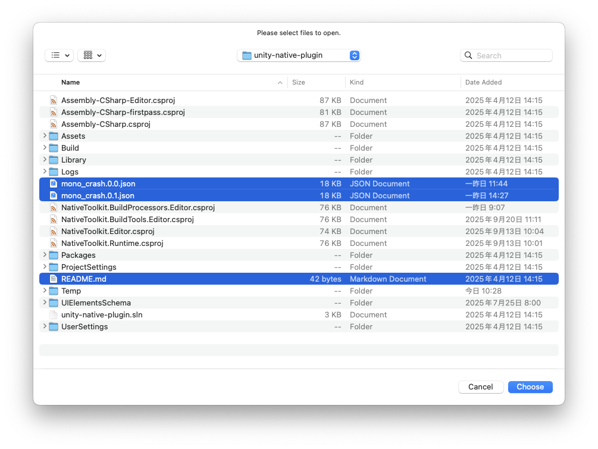
</p>
- 결과는 이벤트로 받습니다.

```csharp
// filePaths: 선택된 파일 경로. 오류 시 null.
// fileCount: 반환된 파일 수 (취소 시 0).
// directoryURL: 선택에 사용된 디렉터리 URL. 오류 시 null.
// isCancelled: 사용자가 취소했는지 여부.
// isSuccess: 성공 시 true.
// errorMessage: 오류 메시지 (성공 시 null).

private void OnMultiFileDialogResult(
  string[]? filePaths,
  int fileCount,
  string? directoryURL,
  bool isCancelled,
  bool isSuccess,
  string? errorMessage
)
```

#### ShowFolderDialog - 폴더 선택 다이얼로그

- 네임스페이스를 임포트합니다.

```csharp
// 가드: macOS (Player)만. Editor에서는 네이티브 호출을 피합니다.
#if UNITY_STANDALONE_OSX && !UNITY_EDITOR
using JonghyunKim.NativeToolkit.Runtime.Dialog;
#endif
```

- 이벤트를 등록합니다.

```csharp
// 가드: macOS (Player)만. Editor에서는 네이티브 호출을 피합니다.
#if UNITY_STANDALONE_OSX && !UNITY_EDITOR
MacDialogManager.Instance.FolderDialogResult += OnFolderDialogResult;
#endif
```

- 다이얼로그를 표시합니다.

```csharp
// 가드: macOS (Player)만. Editor에서는 네이티브 호출을 피합니다.
#if UNITY_STANDALONE_OSX && !UNITY_EDITOR
// 제목 (필수)
string title = "Select a folder";
// 메시지 (선택)
string message = "Please select a folder to open.";
// 초기 디렉터리 (기본값: OS 규정)
string? directoryPath = null;
MacDialogManager.Instance.ShowFolderDialog(
  title,
  message,
  directoryPath
);
#endif
```

<p align="center">
  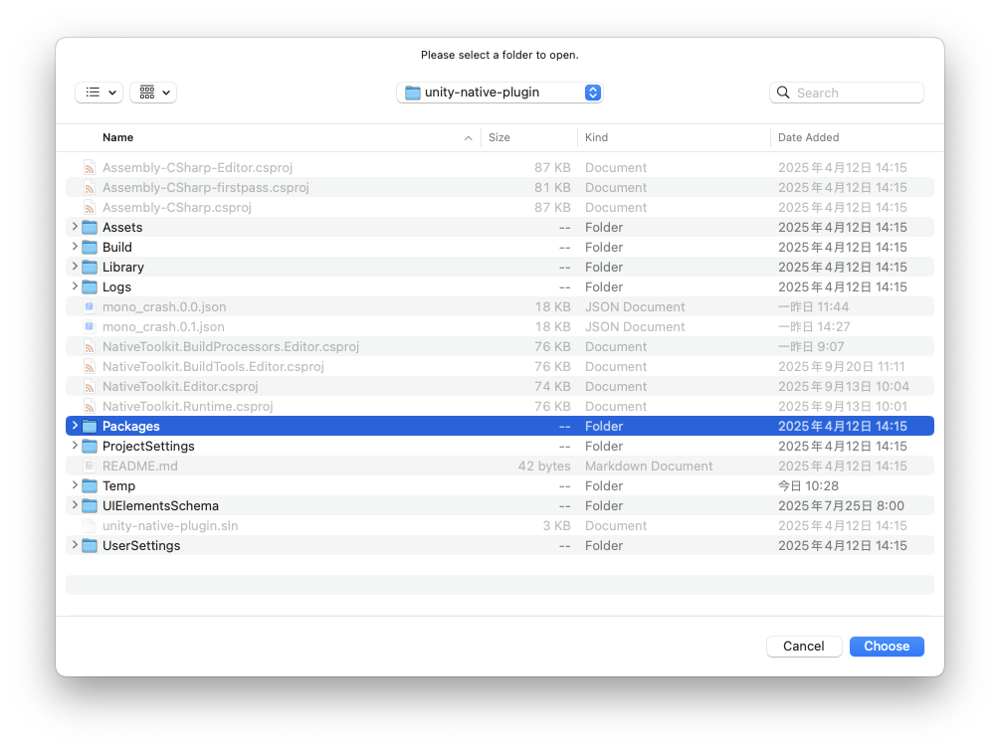
</p>
- 결과는 이벤트로 받습니다.

```csharp
// folderPaths: 선택된 폴더 경로. 오류 시 null.
// folderCount: 반환된 폴더 수 (취소 시 0).
// directoryURL: 선택에 사용된 디렉터리 URL. 오류 시 null.
// isCancelled: 사용자가 취소했는지 여부.
// isSuccess: 성공 시 true.
// errorMessage: 오류 메시지 (성공 시 null).

private void OnFolderDialogResult(
  string[]? folderPaths,
  int folderCount,
  string? directoryURL,
  bool isCancelled,
  bool isSuccess,
  string? errorMessage
)
```

#### ShowMultiFolderDialog - 다중 폴더 선택 다이얼로그

- 네임스페이스를 임포트합니다.

```csharp
// 가드: macOS (Player)만. Editor에서는 네이티브 호출을 피합니다.
#if UNITY_STANDALONE_OSX && !UNITY_EDITOR
using JonghyunKim.NativeToolkit.Runtime.Dialog;
#endif
```

- 이벤트를 등록합니다.

```csharp
// 가드: macOS (Player)만. Editor에서는 네이티브 호출을 피합니다.
#if UNITY_STANDALONE_OSX && !UNITY_EDITOR
MacDialogManager.Instance.MultiFolderDialogResult += OnMultiFolderDialogResult;
#endif
```

- 다이얼로그를 표시합니다.

```csharp
// 가드: macOS (Player)만. Editor에서는 네이티브 호출을 피합니다.
#if UNITY_STANDALONE_OSX && !UNITY_EDITOR
// 제목 (필수)
string title = "Select folders";
// 메시지 (선택)
string message = "Please select folders to open.";
// 초기 디렉터리 (기본값: OS 규정)
string? directoryPath = null;
MacDialogManager.Instance.ShowMultiFolderDialog(
  title,
  message,
  directoryPath
);
#endif
```

<p align="center">
  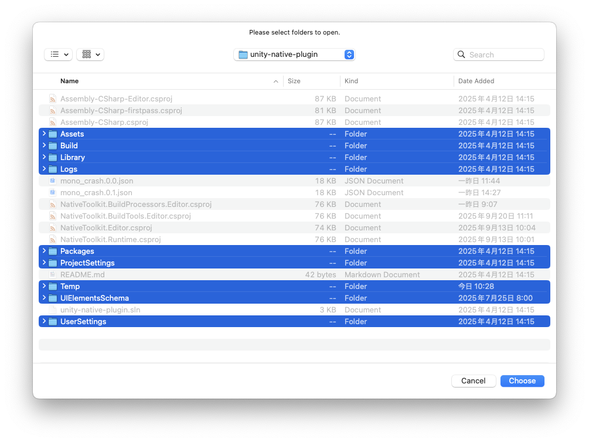
</p>
- 결과는 이벤트로 받습니다.

```csharp
// folderPaths: 선택된 폴더 경로. 오류 시 null.
// folderCount: 반환된 폴더 수 (취소 시 0).
// directoryURL: 선택에 사용된 디렉터리 URL. 오류 시 null.
// isCancelled: 사용자가 취소했는지 여부.
// isSuccess: 성공 시 true.
// errorMessage: 오류 메시지 (성공 시 null).

private void OnMultiFolderDialogResult(
  string[]? folderPaths,
  int folderCount,
  string? directoryURL,
  bool isCancelled,
  bool isSuccess,
  string? errorMessage
)
```

#### ShowSaveFileDialog - 파일 저장 다이얼로그

- 네임스페이스를 임포트합니다.

```csharp
// 가드: macOS (Player)만. Editor에서는 네이티브 호출을 피합니다.
#if UNITY_STANDALONE_OSX && !UNITY_EDITOR
using JonghyunKim.NativeToolkit.Runtime.Dialog;
#endif
```

- 이벤트를 등록합니다.

```csharp
// 가드: macOS (Player)만. Editor에서는 네이티브 호출을 피합니다.
#if UNITY_STANDALONE_OSX && !UNITY_EDITOR
MacDialogManager.Instance.SaveFileDialogResult += OnSaveFileDialogResult;
#endif
```

- 다이얼로그를 표시합니다.

```csharp
// 가드: macOS (Player)만. Editor에서는 네이티브 호출을 피합니다.
#if UNITY_STANDALONE_OSX && !UNITY_EDITOR
// 제목 (필수)
string title = "Save File";
// 메시지 (선택)
string message = "Choose a destination";
// 기본 파일명 (기본값: OS 규정)
string defaultFileName = "default";
// 허용 확장자 (기본값: OS 규정)
string[] allowedContentTypes = { "txt" };
// 초기 디렉터리 (기본값: OS 규정)
string? directoryPath = null;
MacDialogManager.Instance.ShowSaveFileDialog(
  title,
  message,
  defaultFileName,
  allowedContentTypes,
  directoryPath
);
#endif
```

<p align="center">
  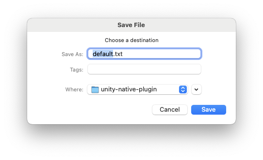
</p>
- 결과는 이벤트로 받습니다.

```csharp
// filePath: 저장된 파일 경로. 취소/실패 시 null.
// fileCount: 반환된 경로 수 (성공 시 1, 취소 시 0).
// directoryURL: 저장에 사용된 디렉터리 URL. 오류 시 null.
// isCancelled: 사용자가 취소했는지 여부.
// isSuccess: 성공 시 true.
// errorMessage: 오류 메시지 (성공 시 null).

private void OnSaveFileDialogResult(
  string? filePath,
  int fileCount,
  string? directoryURL,
  bool isCancelled,
  bool isSuccess,
  string? errorMessage
)
```
