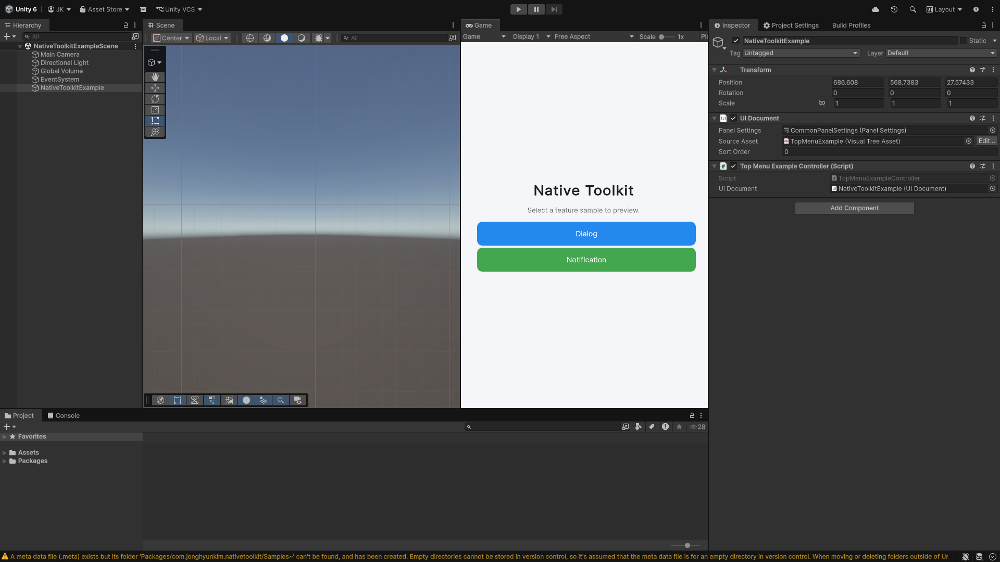
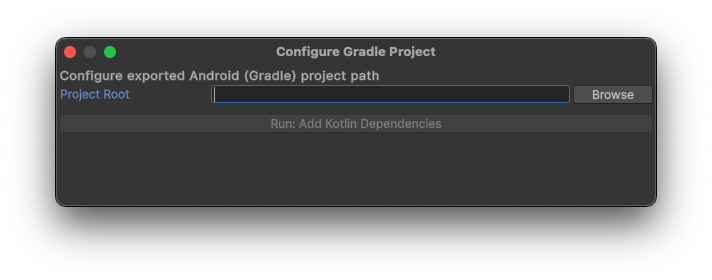

# Unity Native Toolkit (Unity 6)

[English](index.md) | [Korean](index.ko.md) | [Japanese](index.ja.md)

- A toolkit that provides native features for Unity 6+.
- The package includes native plugins and sample scenes for Android/iOS/Windows/macOS, and exposes dialog operations via singleton APIs per platform.
- Editor windows help integrate native libraries and Gradle/Xcode settings, streamlining post-build project setup.

# Version

## 1.1.0

# Supported OS Versions

- Android 12+
- iOS 18+
- Windows 11+
- macOS 15+

# Features

## Android

- Dialog features
  - Basic dialog
  - Confirmation dialog
  - Single choice dialog
  - Multi choice dialog
  - Text input dialog
  - Login dialog

- Notification features
  - Immediate notifications
  - Scheduled notifications
  - Progress foreground service
  - Notification actions
  - Full-screen notifications
  - Custom view notifications

## iOS

- Dialog features
  - Basic dialog
  - Confirmation dialog
  - Destructive dialog
  - Action sheet
  - Text input dialog
  - Login dialog

## Windows

- Dialog features
  - Basic dialog
  - File picker dialog
  - Multi-file picker dialog
  - Folder picker dialog
  - Multi-folder picker dialog
  - Save file dialog

## macOS

- Dialog features
  - Basic dialog
  - File picker dialog
  - Multi-file picker dialog
  - Folder picker dialog
  - Multi-folder picker dialog
  - Save file dialog

## Planned Features

- Share
- Clipboard integration
- Notifications (iOS, Windows, macOS)

# Getting Started

## Installation

- Open Unity 6.
- Window -> Package Manager.
- Select "install from Git URL...".
- Enter the Git URL for this package:
  - https://github.com/jonghyunkim/unity-native-plugin.git?path=/Packages/com.jonghyunkim.nativetoolkit#1.1.0
- Click "install".
- Requirements:
  - Unity 6+
  - Dependencies: Localization, Addressables, Input System

## Samples

- Open Unity 6.
- Window -> Package Manager.
- Unity Package Manager -> Native Toolkit -> Samples -> Import.
- Tools -> Native Toolkit -> Sample.
  

    
  

- Android sample
  - The sample UI appears in the Game view.
  - From Build Profiles, run "Android Profile" -> Export.
  - Tools -> Native Toolkit -> Android -> Configure Gradle Project.
  

    
  

  - Click "Browse" and select the exported Android project.
  - Click "Run: Add Kotlin Dependencies" to add Kotlin libraries.
  - Install the sample app from Android Studio.
    - <a href="https://developer.android.com/studio" target="_blank" rel="noopener noreferrer">Reference</a>

- iOS sample
  - The sample UI appears in the Game view.
  - From Build Profiles, run "iOS Profile" -> Build.
  - Tools -> Native Toolkit -> iOS -> Configure Xcode Project.
  

    
  

  - Click "Browse" and select the built iOS project.
  - Click "Run: Add/Embed iOS XCFrameworks" to add NativeToolkit libraries.
  - Install the sample app from Xcode.
    - <a href="https://developer.apple.com/xcode" target="_blank" rel="noopener noreferrer">Reference</a>

- Windows sample
  - The sample UI appears in the Game view.
  - From Build Profiles, run "Windows Profile" -> Build.
  - Run "Unity NativeToolkit.exe" from the build output folder.

- macOS sample
  - The sample UI appears in the Game view.
  - From Build Profiles, run "macOS Profile" -> Build.
  - Tools -> Native Toolkit -> macOS -> Configure Xcode Project.
  

    
  

  - Click "Browse" and select the built macOS project.
  - Click "Run: Add UnityMacNativeToolkit.xcframework" to add NativeToolkit libraries.
  - Install the sample app from Xcode.
    - <a href="https://developer.apple.com/xcode" target="_blank" rel="noopener noreferrer">Reference</a>

# API Usage

- [Dialog](dialog.md)
- [Notification](notification.md)
