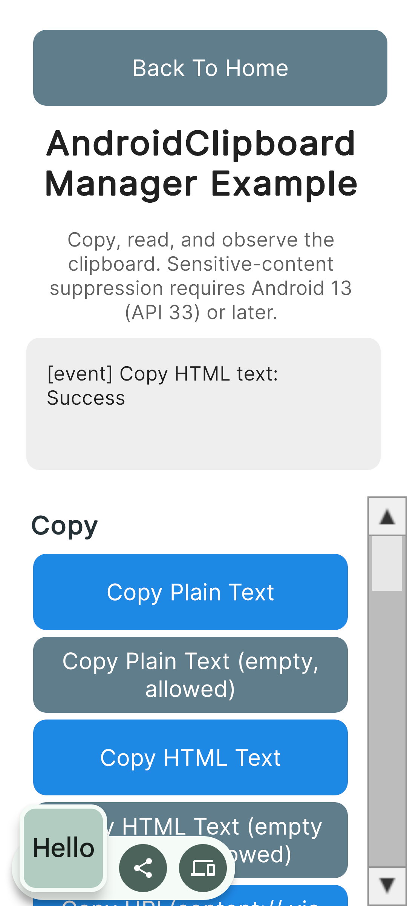
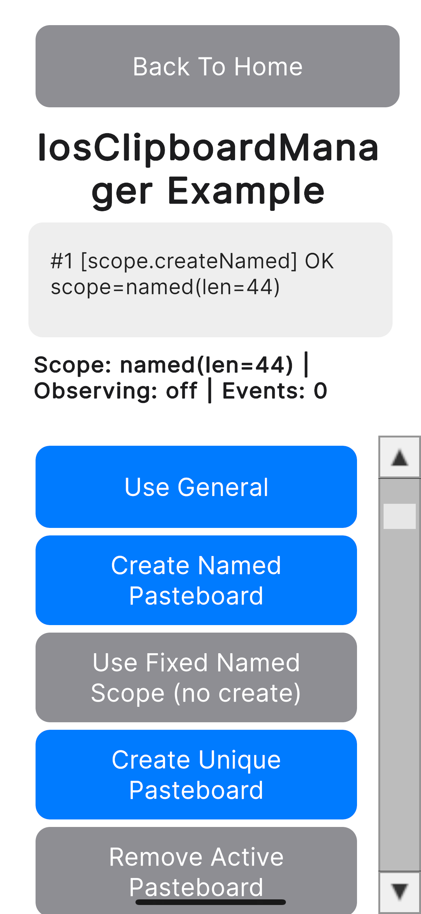
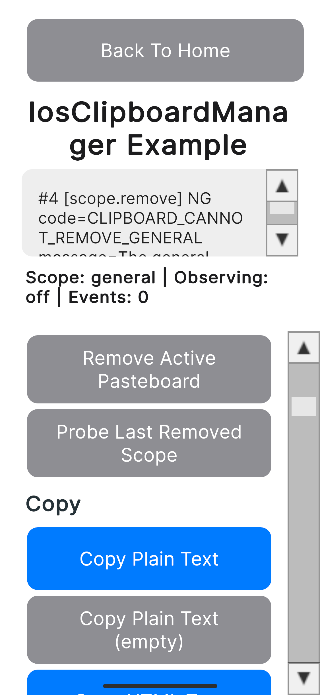
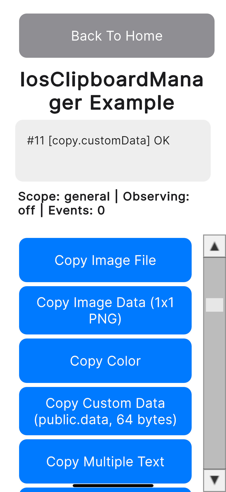
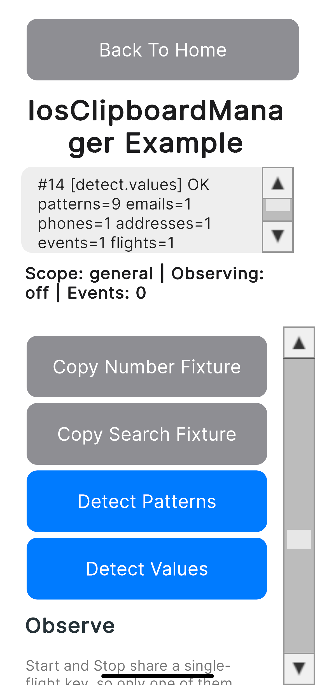
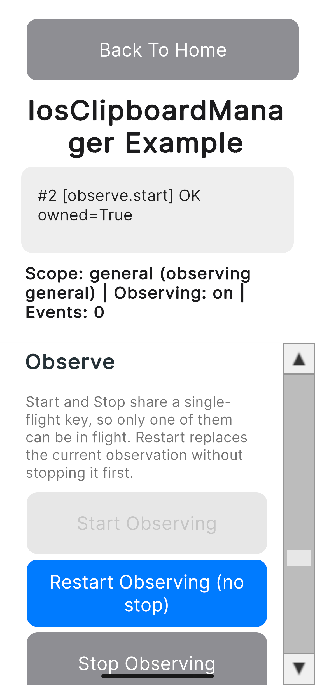
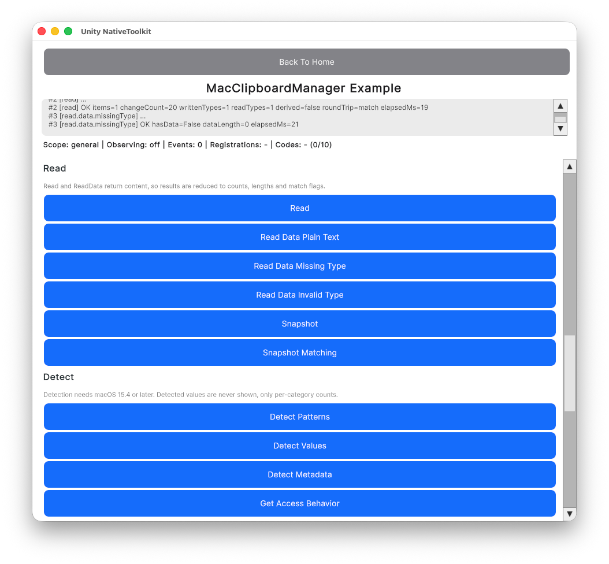
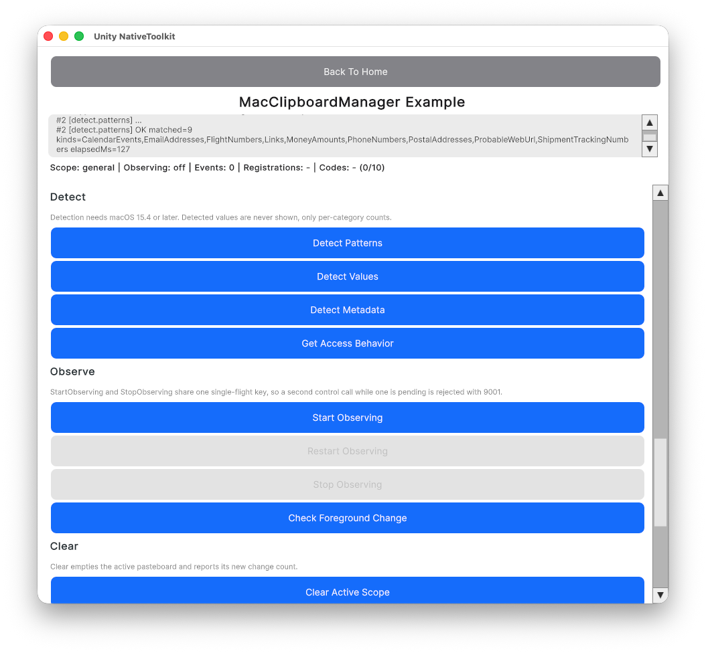

# クリップボード機能

言語:

- [English](clipboard.md)
- 日本語（このページ）
- [한국어](clipboard.ko.md)

← [マニュアルトップへ戻る](index.ja.md)

---

## 目次

- [Android](#android)
  - [セットアップ](#セットアップ)
  - [プレーンテキストのコピー](#プレーンテキストのコピー)
  - [プレーンテキストのコピー（空文字、許容）](#プレーンテキストのコピー空文字許容)
  - [HTMLテキストのコピー](#htmlテキストのコピー)
  - [プレーンテキストが空のHTMLコピー](#プレーンテキストが空のhtmlコピー)
  - [URIのコピー](#uriのコピー)
  - [複数テキストのコピー](#複数テキストのコピー)
  - [機微テキストのコピー](#機微テキストのコピー)
  - [ゲームでの利用例](#ゲームでの利用例)
    - [招待コードのコピー](#招待コードのコピー)
    - [クリップボードからコードを貼り付け](#クリップボードからコードを貼り付け)
    - [スクリーンショットのコピー](#スクリーンショットのコピー)
  - [クリップボードの読み取り](#クリップボードの読み取り)
  - [クリップの有無判定](#クリップの有無判定)
  - [メタデータの取得](#メタデータの取得)
  - [クリップボードのクリア](#クリップボードのクリア)
  - [監視の開始・停止](#監視の開始停止)
  - [イベントの受信](#イベントの受信)
  - [エラーハンドリング](#エラーハンドリング)
- [iOS](#ios)
  - [セットアップ](#セットアップ-1)
  - [ペーストボードのスコープ](#ペーストボードのスコープ)
  - [プレーンテキストのコピー](#プレーンテキストのコピー-1)
  - [HTMLテキストのコピー](#htmlテキストのコピー-1)
  - [URLのコピー](#urlのコピー)
  - [画像ファイルのコピー](#画像ファイルのコピー)
  - [画像データのコピー](#画像データのコピー)
  - [色のコピー](#色のコピー)
  - [カスタムデータのコピー](#カスタムデータのコピー)
  - [複数テキストのコピー](#複数テキストのコピー-1)
  - [複数表現のコピー](#複数表現のコピー)
  - [コピーオプション](#コピーオプション)
  - [追記](#追記)
  - [読み取り](#読み取り)
  - [データの読み取り](#データの読み取り)
  - [スナップショット](#スナップショット)
  - [アイテムのロード](#アイテムのロード)
  - [ロードのキャンセル](#ロードのキャンセル)
  - [パターン検出](#パターン検出)
  - [値の検出](#値の検出)
  - [変更の監視](#変更の監視)
  - [フォアグラウンド復帰時の変更確認](#フォアグラウンド復帰時の変更確認)
  - [クリア](#クリア)
  - [同時実行とBusy拒否](#同時実行とbusy拒否)
  - [イベントの受信](#イベントの受信-1)
  - [エラーハンドリング](#エラーハンドリング-1)
- [macOS](#macos)
  - [セットアップ](#セットアップ-2)
  - [ペーストボードのスコープ](#ペーストボードのスコープ-1)
  - [プレーンテキストのコピー](#プレーンテキストのコピー-2)
  - [HTML テキストのコピー](#html-テキストのコピー)
  - [URL のコピー](#url-のコピー)
  - [カスタムデータのコピー](#カスタムデータのコピー-1)
  - [複数アイテムのコピー](#複数アイテムのコピー)
  - [複数表現のコピー](#複数表現のコピー-1)
  - [コピーのオプション: ローカル限定](#コピーのオプション-ローカル限定)
  - [追記](#追記-1)
  - [読み出し](#読み出し)
  - [型を指定した読み出し](#型を指定した読み出し)
  - [スナップショット](#スナップショット-1)
  - [パターンの検出](#パターンの検出)
  - [値の検出](#値の検出-1)
  - [メタデータの検出](#メタデータの検出)
  - [アクセス設定の取得](#アクセス設定の取得)
  - [変更の監視](#変更の監視-1)
  - [前面復帰時の変更確認](#前面復帰時の変更確認)
  - [消去](#消去)
  - [サイズの上限](#サイズの上限)
  - [App Sandbox](#app-sandbox)
  - [イベントの受信](#イベントの受信-2)
  - [エラーハンドリング](#エラーハンドリング-2)

---

## Android

クリップボード機能は Android と iOS を対象としています。Windows・macOS 向けの実装はありません。両プラットフォームは Manager も API も別系統です。iOS 側は [iOS](#ios) を参照してください。

### セットアップ

#### 名前空間のインポート

`AndroidClipboardManager` は Android ビルドターゲットを選択している場合にのみコンパイルされます。

```csharp
// ガード: Android専用。AndroidClipboardManagerは他のビルドターゲットには存在しません。
#if UNITY_ANDROID
using JonghyunKim.NativeToolkit.Runtime.Clipboard;
#endif
```

自作スクリプト側の呼び出し箇所（例えばエディター上でも動作する MonoBehaviour）では、ネイティブブリッジが実機上にしか存在しないため、呼び出し時点でさらにエディターを除外してください。

```csharp
#if UNITY_ANDROID && !UNITY_EDITOR
AndroidClipboardManager.Instance.CopyPlainText(new CopyPlainTextPayload { text = "Hello" });
#endif
```

#### 同期APIと非同期API

- `Read` / `HasClip` / `GetDescription` は同期APIで、結果をその場で返し、`ClipboardOperationCompleted` を発火しません。
- `CopyPlainText` / `CopyHtmlText` / `CopyUri` / `CopyMultipleText` / `Clear` / `StopObserving` は非同期APIで、結果を `ClipboardOperationCompleted` イベント経由で通知したあと、任意の呼び出し単位のコールバックを呼び出します。
- `StartObserving` は成功・失敗を問わず結果を一切通知しません。詳細は[監視の開始・停止](#監視の開始停止)を参照してください。

#### content:// URI（Copy URI・Copy Screenshotに必要）

クリップボードAPIはURI文字列を受け取りますが、それを組み立てる仕組みは持っていません。native-toolkitのAARに同梱されているFileProvider（Share機能が使用するものと同一）を利用してください。AARのマニフェストに `${applicationId}.native_toolkit.share.fileprovider` として宣言済みのため、アプリ側でのマニフェスト追記は不要です。

```csharp
#if UNITY_ANDROID && !UNITY_EDITOR
private static string CreateContentUri(string path)
{
    using var unityPlayer = new AndroidJavaClass("com.unity3d.player.UnityPlayer");
    using var activity = unityPlayer.GetStatic<AndroidJavaObject>("currentActivity");
    using var file = new AndroidJavaObject("java.io.File", path);
    string authority = $"{Application.identifier}.native_toolkit.share.fileprovider";
    using var fileProvider = new AndroidJavaClass("androidx.core.content.FileProvider");
    using var uri = fileProvider.CallStatic<AndroidJavaObject>("getUriForFile", activity, authority, file);
    return uri.Call<string>("toString");
}
#endif
```

> **注意:** FileProviderのauthorityは `Application.identifier` から組み立てられます。Gradleテンプレートで `applicationIdSuffix` を設定している場合はマージ後のマニフェストと一致するか確認してください。一致しないと `getUriForFile` が `IllegalArgumentException` を投げます。

---

### プレーンテキストのコピー

```csharp
#if UNITY_ANDROID && !UNITY_EDITOR
AndroidClipboardManager.Instance.CopyPlainText(new CopyPlainTextPayload
{
    text = "Hello from Unity Native Toolkit",
    label = "sample"
});
#endif
```

<p align="center">
    
</p>

---

### プレーンテキストのコピー（空文字、許容）

`text` が空文字の場合、ネイティブ層はこれを明示的に許容し失敗しません。`CopyHtmlText` の `htmlText` とは異なる挙動です。

```csharp
#if UNITY_ANDROID && !UNITY_EDITOR
AndroidClipboardManager.Instance.CopyPlainText(new CopyPlainTextPayload
{
    text = ""
});
#endif
```

<p align="center">
    
</p>

---

### HTMLテキストのコピー

```csharp
#if UNITY_ANDROID && !UNITY_EDITOR
AndroidClipboardManager.Instance.CopyHtmlText(new CopyHtmlTextPayload
{
    plainText = "Hello",
    htmlText = "<b>Hello</b>"
});
#endif
```

<p align="center">
    
</p>

---

### プレーンテキストが空のHTMLコピー

`plainText` は空文字を許容しますが、`htmlText` が空文字の場合のみ失敗します（[エラーハンドリング](#エラーハンドリング)参照）。

```csharp
#if UNITY_ANDROID && !UNITY_EDITOR
AndroidClipboardManager.Instance.CopyHtmlText(new CopyHtmlTextPayload
{
    plainText = "",
    htmlText = "<b>Html only</b>"
});
#endif
```

<p align="center">
    
</p>

---

### URIのコピー

`content://` URI（画像やファイルへの参照など）をコピーします。URI文字列の組み立て方は前述の[content:// URI](#content-uricopy-uricopy-screenshotに必要)を参照してください。

```csharp
#if UNITY_ANDROID && !UNITY_EDITOR
string path = Path.Combine(Application.persistentDataPath, "clipboard_sample.txt");
File.WriteAllText(path, "Clipboard sample file content");
string uri = CreateContentUri(path);

AndroidClipboardManager.Instance.CopyUri(new CopyUriPayload
{
    uri = uri
});
#endif
```

<p align="center">
    
</p>

> **注意:** 貼り付け先アプリがこの `content://` URIを読み取れるかは端末と対象アプリに依存します。プレーンテキストのみを受け付けるアプリでは解決できません。

---

### 複数テキストのコピー

複数のプレーンテキストを1つのクリップとしてコピーします。`texts` 配列内の個々の空文字は許容されますが、配列自体が空の場合のみ失敗します（[エラーハンドリング](#エラーハンドリング)参照）。

```csharp
#if UNITY_ANDROID && !UNITY_EDITOR
AndroidClipboardManager.Instance.CopyMultipleText(new CopyMultipleTextPayload
{
    texts = new[] { "First", "", "Third" }
});
#endif
```

<p align="center">
    
</p>

---

### 機微テキストのコピー

`isSensitive` を設定すると、システムクリップボードUIでのプレビュー抑制を要求できます。このヒントはAndroid 13（API 33）以降でのみ効果があり、それより前のバージョンでは抑制なしで通常どおりコピーされます。

```csharp
#if UNITY_ANDROID && !UNITY_EDITOR
AndroidClipboardManager.Instance.CopyPlainText(new CopyPlainTextPayload
{
    text = "P@ssw0rd-sample",
    isSensitive = true
});
#endif
```

<p align="center">
    
</p>

---

### ゲームでの利用例

ゲームでよくあるクリップボードの使い方として、招待コードの共有、受け取ったコードの貼り付け、スクリーンショットのコピーを紹介します。

#### 招待コードのコピー

```csharp
#if UNITY_ANDROID && !UNITY_EDITOR
AndroidClipboardManager.Instance.CopyPlainText(new CopyPlainTextPayload
{
    text = "NTK-7F3A-92QX",
    label = "invite code"
});
#endif
```

<p align="center">
    
</p>

#### クリップボードからコードを貼り付け

クリップボードを同期的に読み取り、先頭のアイテムのプレーンテキストを抽出します。ベストエフォートのフォールバック値は使いません。`content://` URIのみを保持するクリップ（[スクリーンショットのコピー](#スクリーンショットのコピー)で作成したものなど）は、URIをコードとして誤って表示するのではなく、「テキストアイテムが見つからない」という結果になります。

```csharp
#if UNITY_ANDROID && !UNITY_EDITOR
var result = AndroidClipboardManager.Instance.Read();
switch (result.Status)
{
    case ClipboardReadStatus.HasContent:
        string? code = ExtractFirstText(result.Contents!);
        // クリップにプレーンテキストのアイテムが無い場合（URIのみのクリップ等）はnullになる
        break;
    case ClipboardReadStatus.Empty:
        // クリップボードが空。これは失敗ではなく正常な結果
        break;
    default:
        // result.ErrorCode / result.ErrorMessage が失敗内容を表す
        break;
}

static string? ExtractFirstText(ClipContents contents)
{
    foreach (var item in contents.Items)
    {
        if (!string.IsNullOrEmpty(item.Text)) return item.Text;
    }
    return null;
}
#endif
```

<p align="center">
    
</p>

> **セキュリティ上の注意:** 貼り付けた値は絶対にログへ出力しないでください。クーポンコードなどの機微情報である可能性があります。ログには `result.Status` と `result.ErrorCode` のみ出力してください。

#### スクリーンショットのコピー

現在のフレームをキャプチャし、`content://` URIとしてコピーします。`ScreenCapture.CaptureScreenshotAsTexture` はフレームの描画完了を必要とするため、キャプチャは `WaitForEndOfFrame` の後、コルーチン内で実行する必要があります。PNGバイト列への書き出しが終わった `Texture2D` は必ず破棄してください。破棄しないとリークします。

```csharp
#if UNITY_ANDROID && !UNITY_EDITOR
private IEnumerator CaptureAndCopyScreenshot()
{
    yield return new WaitForEndOfFrame();

    string uri;
    Texture2D? screenshot = null;
    try
    {
        screenshot = ScreenCapture.CaptureScreenshotAsTexture();
        byte[] png = screenshot.EncodeToPNG();
        string path = Path.Combine(Application.persistentDataPath, "clipboard_screenshot.png");
        File.WriteAllBytes(path, png);
        uri = CreateContentUri(path);
    }
    finally
    {
        if (screenshot != null) Destroy(screenshot);
    }

    AndroidClipboardManager.Instance.CopyUri(new CopyUriPayload
    {
        uri = uri,
        label = "screenshot"
    });
}
#endif
```

<p align="center">
    
</p>

> **注意:** 貼り付けたスクリーンショットを受け取り側アプリが読み取れるかは、他の `content://` クリップと同様に端末と対象アプリに依存します。

---

### クリップボードの読み取り

同期API。クリップの内容、空の結果、または失敗のいずれかを返します。空のクリップボードは失敗ではなく正常な結果として扱われます。

```csharp
#if UNITY_ANDROID && !UNITY_EDITOR
var result = AndroidClipboardManager.Instance.Read();
switch (result.Status)
{
    case ClipboardReadStatus.HasContent:
        ClipContents contents = result.Contents!;
        // contents.Label, contents.MimeTypes, contents.Items（各アイテムのText / HtmlText / Uri / CoercedText）
        break;
    case ClipboardReadStatus.Empty:
        // 正常な結果であり失敗ではない
        break;
    default:
        // result.ErrorCode / result.ErrorMessage が失敗内容を表す
        break;
}
#endif
```

<p align="center">
    
</p>

> **セキュリティ上の注意:** クリップボードの内容にはパスワードやトークンが含まれる可能性があります。ログには `result.Status` と `result.ErrorCode` のみを出力し、クリップ本文自体は絶対にログへ出力しないでください。

---

### クリップの有無判定

同期API。クリップボードが本当に空の場合と、判定自体が実行できなかった場合の両方で `false` を返します。C#側からはこの2つを区別できません。

```csharp
#if UNITY_ANDROID && !UNITY_EDITOR
bool hasClip = AndroidClipboardManager.Instance.HasClip();
#endif
```

<p align="center">
    
</p>

---

### メタデータの取得

同期API。クリップ本文には触れずに、ラベル・MIMEタイプ・スタイル付きテキストかどうか・分類ステータスといったメタデータのみを読み取ります。

```csharp
#if UNITY_ANDROID && !UNITY_EDITOR
var result = AndroidClipboardManager.Instance.GetDescription();
switch (result.Status)
{
    case ClipboardReadStatus.HasContent:
        ClipDescriptionInfo info = result.Description!;
        // info.Label, info.MimeTypes, info.IsStyledText, info.ClassificationStatus（API 31未満ではnull）
        break;
    case ClipboardReadStatus.Empty:
        break;
    default:
        break;
}
#endif
```

<p align="center">
    
</p>

---

### クリップボードのクリア

非同期API。`ClipboardOperationCompleted` 経由で結果が通知されます。

```csharp
#if UNITY_ANDROID && !UNITY_EDITOR
AndroidClipboardManager.Instance.Clear();
#endif
```

<p align="center">
    
</p>

---

### 監視の開始・停止

`StartObserving` は成功・失敗を問わず結果を一切通知しません。成功として表示しないでください。監視中のクリップボード変化は `ClipboardChanged` イベントで通知されます（[イベントの受信](#イベントの受信)参照）。すでに監視中の状態で再度呼び出した場合、ネイティブ側では何も起きません。監視はアプリがフォアグラウンドにある間のみ有効です（Android 10以降のプラットフォーム制約）。

`StopObserving` は他の操作と同様に非同期APIで、`ClipboardOperationCompleted` 経由で結果が通知されます。画面が非表示になった後も監視が続かないよう、`OnDisable` で呼び出してください。

```csharp
#if UNITY_ANDROID && !UNITY_EDITOR
// 開始: 結果は一切通知されない。クリップボードを変更してClipboardChangedで動作を確認する
AndroidClipboardManager.Instance.StartObserving();

// 停止: Clearと同様にClipboardOperationCompleted経由で通知される
AndroidClipboardManager.Instance.StopObserving();
#endif
```

<p align="center">
    
</p>

---

### イベントの受信

`OnEnable` でイベントを購読し、`OnDisable` で解除してください。`OnDisable` では `StopObserving` も呼び出し、非表示になった画面が監視を続けないようにします。

```csharp
private void OnEnable()
{
#if UNITY_ANDROID && !UNITY_EDITOR
    AndroidClipboardManager.Instance.ClipboardOperationCompleted += OnClipboardOperationCompleted;
    AndroidClipboardManager.Instance.ClipboardChanged += OnClipboardChanged;
#endif
}

private void OnDisable()
{
#if UNITY_ANDROID && !UNITY_EDITOR
    AndroidClipboardManager.Instance.ClipboardOperationCompleted -= OnClipboardOperationCompleted;
    AndroidClipboardManager.Instance.ClipboardChanged -= OnClipboardChanged;
    AndroidClipboardManager.Instance.StopObserving();
#endif
}

#if UNITY_ANDROID && !UNITY_EDITOR
private void OnClipboardOperationCompleted(ClipboardOperationResult result)
{
    string status = result.IsSuccess ? "Success" : "Failed";
    Debug.Log($"[event] {result.Operation}: {status}");
    if (!string.IsNullOrEmpty(result.ErrorMessage))
        Debug.LogError(result.ErrorMessage);
}

private void OnClipboardChanged()
{
    Debug.Log("[event] Clipboard changed");
}
#endif
```

`ClipboardOperationCompleted` は、`CopyPlainText` / `CopyHtmlText` / `CopyUri` / `CopyMultipleText` / `Clear` / `StopObserving` に渡した呼び出し単位のコールバックより常に先に発火します。イベント側のコールバックと呼び出し単位のコールバックの両方が例外を投げた場合でも、それぞれ独立して捕捉されるため、片方の例外がもう片方の呼び出しを妨げることはありません。

---

### エラーハンドリング

すべての非同期操作は `ClipboardOperationCompleted` を通じて成功・失敗を通知します。`ErrorMessage` は `IsSuccess` が `false` の場合のみ非nullになります。

```csharp
#if UNITY_ANDROID && !UNITY_EDITOR
// HTMLテキストが空の場合は失敗する: CLIPBOARD_EMPTY_CONTENT
// ErrorMessage: "Clipboard content is empty. Please provide text or HTML."
AndroidClipboardManager.Instance.CopyHtmlText(new CopyHtmlTextPayload
{
    plainText = "Hello",
    htmlText = ""
});

// アイテム配列が空の場合は失敗する: CLIPBOARD_EMPTY_ITEMS
// ErrorMessage: "No items provided for clipboard copy."
AndroidClipboardManager.Instance.CopyMultipleText(new CopyMultipleTextPayload
{
    texts = Array.Empty<string>()
});

// URIが空文字の場合は失敗する: CLIPBOARD_INVALID_URI
AndroidClipboardManager.Instance.CopyUri(new CopyUriPayload
{
    uri = ""
});

// http:// スキームは拒否される。content:// URIのみサポート: CLIPBOARD_INVALID_URI
// ErrorMessageは "Invalid URI:" で始まる
AndroidClipboardManager.Instance.CopyUri(new CopyUriPayload
{
    uri = "http://example.com/x"
});
#endif
```

`ErrorCode` として通知される安定したエラーコード一覧:

| エラーコード | 意味 |
| --- | --- |
| `CLIPBOARD_EMPTY_CONTENT` | `CopyHtmlText` が空文字の `htmlText` で呼び出された |
| `CLIPBOARD_EMPTY_ITEMS` | `CopyMultipleText` が空の `texts` 配列で呼び出された |
| `CLIPBOARD_INVALID_URI` | `CopyUri` が空文字・不正な形式・`content://` 以外のURIで呼び出された |
| `CLIPBOARD_READ_NOT_ALLOWED` | ネイティブ層が読み取りを拒否した（フォーカス・権限制約など） |
| `CLIPBOARD_SECURITY` | ネイティブ層がセキュリティ上の理由で操作を拒否した |
| `CLIPBOARD_UNAVAILABLE` | システムの `ClipboardManager` を取得できなかった |
| `CLIPBOARD_UNKNOWN` | 分類できない失敗。Unity側でのパース失敗にも使われる |

`Read` と `GetDescription` は、ネイティブブリッジ自体に到達できなかった場合（Android上で実行されていない、プラグイン未初期化、currentActivityが取得できない等）、追加で `CLIPBOARD_BRIDGE_UNAVAILABLE` を返すことがあります。これはネイティブ層が返すものではなく、Unity側のエラーコードです。

---

## iOS

### セットアップ

#### 名前空間のインポート

`IosClipboardManager` は iOS ビルドターゲットが選択されていれば Editor 上でもコンパイルされます。Editor で呼び出してもクラッシュせず、ネイティブブリッジに触れないまま `CLIPBOARD_BRIDGE_UNAVAILABLE` の失敗が即座に返ります。Editor でも動くシーンにそのまま置いて構いません。

```csharp
#if UNITY_IOS || UNITY_EDITOR
using JonghyunKim.NativeToolkit.Runtime.Clipboard;
#endif
```

ネイティブ層の対象は iOS 18 以降です。

#### すべての操作が非同期

iOS 側に同期 API はありません。各呼び出しは任意の per-call コールバックを取り、あわせて種類ごとのイベントも発火します。

| メソッド | コールバックの結果型 | イベント |
| --- | --- | --- |
| `Copy` / `Append` / `Clear` / `RemovePasteboard` / `CancelLoads` / `StartObserving` / `StopObserving` | `IosClipboardOperationResult` | `ClipboardOperationCompleted` |
| `Read` | `IosClipboardReadResult` | `ReadCompleted` |
| `ReadData` | `IosClipboardReadDataResult` | `ReadDataCompleted` |
| `GetSnapshot` | `IosClipboardSnapshotResult` | `SnapshotCompleted` |
| `CreatePasteboard` | `IosPasteboardScopeResult` | `PasteboardCreated` |
| `DetectPatterns` | `IosClipboardDetectedPatternsResult` | `PatternsDetected` |
| `DetectValues` | `IosClipboardDetectedValuesResult` | `ValuesDetected` |
| `LoadItem` | `IosClipboardLoadedItemResult` | `ItemLoaded` |
| `CheckForegroundChange` | `IosClipboardForegroundChangeResult` | `ForegroundChangeChecked` |

イベントにはどの呼び出しの結果かを判別する手段がありません。結果を特定のリクエストと対応させる必要がある場合は per-call コールバックを使い、イベントはログや共有 UI の更新にとどめてください。すべての結果型は `IsSuccess` を持ち、失敗時は `Error`（`Code` / `Message` と、任意の `Domain` / `NativeCode` を持つ `IosClipboardErrorInfo`）を返します。

#### メインスレッド限定

すべての public API は Unity のメインスレッドから呼び出す必要があります。他スレッドからの呼び出しは `CLIPBOARD_MAIN_THREAD_REQUIRED` で拒否され、ネイティブ層には到達しません。

#### 同一操作は同時に1本まで

直列化されるのは同一操作だけです。実行中の `LoadItem` にもう1本 `LoadItem` を重ねると `CLIPBOARD_BUSY` で拒否されますが、`Read` と `GetSnapshot` は同時に走ります。[同時実行とBusy拒否](#同時実行とbusy拒否)を参照してください。

#### Manager のライフタイム

`IosClipboardManager.Instance` は初回アクセス時に生成され、ネイティブ層は最初の呼び出し時に初期化されます。実行中に破棄して作り直す運用には対応していません。破棄後は `IosClipboardManager.IsTerminated` が `true` になり、以降のすべての API が `CLIPBOARD_MANAGER_DESTROYED` を返します。

---

### ペーストボードのスコープ

すべての操作はスコープに対して実行されます。`scope` 引数を省略（`null`）すると general ペーストボードが対象になります。

| スコープ | ファクトリ | 補足 |
| --- | --- | --- |
| General | `IosPasteboardScope.General` | 他アプリと共有されるシステムのペーストボード |
| Named | `IosPasteboardScope.Named(name)` | アプリが名前を決めるペーストボード。`CreatePasteboard` で一度作成する |
| Unique | `IosPasteboardScope.Unique(name)` | 名前をシステムが生成するペーストボード。名前は `CreatePasteboard` の結果から取得する |

`Named` と `Unique` は名前が空白の場合 `ArgumentException` を投げます。ユーザー入力から作る場合は事前に検証してください。

```csharp
#if UNITY_IOS || UNITY_EDITOR
private IosPasteboardScope _scope = IosPasteboardScope.General;

// 名前付きペーストボードを作成し、アクティブなスコープとして保持する。
IosClipboardManager.Instance.CreatePasteboard(
    IosPasteboardCreationRequest.Named("com.jonghyunkim.nativetoolkit.example.sample"),
    result =>
    {
        if (!result.IsSuccess || result.Scope == null)
        {
            Debug.LogError($"CreatePasteboard failed: {result.Error?.Code}");
            return;
        }

        _scope = result.Scope;
    });

// システムが名前を決めるペーストボード。名前は結果からしか分からない。
IosClipboardManager.Instance.CreatePasteboard(
    IosPasteboardCreationRequest.Unique,
    result => _scope = result.IsSuccess && result.Scope != null ? result.Scope : _scope);
#endif
```

<p align="center">
    
</p>

Named / Unique のペーストボードは `RemovePasteboard` で削除します。general ペーストボードは削除できず、`CLIPBOARD_CANNOT_REMOVE_GENERAL` で失敗します。

```csharp
#if UNITY_IOS || UNITY_EDITOR
IosClipboardManager.Instance.RemovePasteboard(_scope, result =>
{
    if (result.IsSuccess)
    {
        _scope = IosPasteboardScope.General;
    }
});
#endif
```

<p align="center">
    
</p>

> **注意:** 削除済みのスコープを読み取っても失敗しません。ペーストボードが空の状態で再生成されます。「空の読み取り」を削除済みの証拠として扱い、エラーとして扱わないでください。

---

### プレーンテキストのコピー

`Copy` はペーストボードの内容全体を置き換えます。空文字も受理され、失敗にはなりません。

```csharp
#if UNITY_IOS || UNITY_EDITOR
IosClipboardManager.Instance.Copy(
    IosClipboardContent.PlainText("Hello 日本語 \U0001F680 テスト"),
    _scope,
    options: null,
    onResult: result =>
    {
        if (!result.IsSuccess)
        {
            Debug.LogError($"Copy failed: {result.Error?.Code}");
        }
    });
#endif
```

<p align="center">
    
</p>

---

### HTMLテキストのコピー

1つのアイテムに、プレーンテキスト表現と HTML 表現の両方を書き込みます。

```csharp
#if UNITY_IOS || UNITY_EDITOR
IosClipboardManager.Instance.Copy(
    IosClipboardContent.HtmlText("Hello", "<b>Hello</b>"),
    _scope);
#endif
```

<p align="center">
    
</p>

---

### URLのコピー

有効な URL である必要があります。解釈できない文字列はネイティブ層が `CLIPBOARD_INVALID_URL` を返します。

```csharp
#if UNITY_IOS || UNITY_EDITOR
IosClipboardManager.Instance.Copy(IosClipboardContent.Url("https://unity.com"), _scope);
#endif
```

<p align="center">
    
</p>

---

### 画像ファイルのコピー

パスを指定して画像をコピーします。Android と異なり FileProvider は不要で、読み取れるパスであればそのまま渡せます。存在しないパスは `CLIPBOARD_FILE_NOT_FOUND` になります。

```csharp
#if UNITY_IOS || UNITY_EDITOR
string path = Path.Combine(Application.persistentDataPath, "ios_clipboard_sample_image.png");
File.WriteAllBytes(path, pngBytes);

IosClipboardManager.Instance.Copy(IosClipboardContent.ImageFile(path), _scope);
#endif
```

<p align="center">
    
</p>

---

### 画像データのコピー

エンコード済みの画像バイト列を、その uniform type identifier とあわせてコピーします。

```csharp
#if UNITY_IOS || UNITY_EDITOR
IosClipboardManager.Instance.Copy(
    IosClipboardContent.ImageData(pngBytes, "public.png"),
    _scope);
#endif
```

<p align="center">
    
</p>

> **注意:** `IosClipboardLoadRequest.Image` による `LoadItem` は画像を再エンコードするため、返るバイト数はコピーしたバイト数と一致しません。バイト単位で一致させたい場合は[データの読み取り](#データの読み取り)を使ってください。

---

### 色のコピー

各成分は有限値である必要があります。`NaN` や無限大は `IosClipboardContent.Color` が呼び出し前に `ArgumentException` を投げます。有限だが `0.0...1.0` の範囲外の値はネイティブ層まで届き、そこで `CLIPBOARD_INVALID_COLOR` になります。

```csharp
#if UNITY_IOS || UNITY_EDITOR
IosClipboardManager.Instance.Copy(IosClipboardContent.Color(0.2, 0.4, 0.8, 1.0), _scope);
#endif
```

<p align="center">
    
</p>

> **注意:** コピーした色はテキスト用の貼り付け先には現れません。[スナップショット](#スナップショット)の `HasColors` が `true` になることで確認できます。

---

### カスタムデータのコピー

任意の uniform type identifier で生バイト列をコピーします。不正な identifier は `CLIPBOARD_INVALID_TYPE` になります。

```csharp
#if UNITY_IOS || UNITY_EDITOR
byte[] payload = new byte[64];
payload.AsSpan().Fill(0x41);

IosClipboardManager.Instance.Copy(
    IosClipboardContent.CustomData(payload, "public.data"),
    _scope);
#endif
```

<p align="center">
    
</p>

---

### 複数テキストのコピー

配列の要素ごとに1つのテキストアイテムを書き込みます。個々の要素は空でも構いませんが、空配列は `CLIPBOARD_EMPTY_ITEMS` で失敗します。

```csharp
#if UNITY_IOS || UNITY_EDITOR
IosClipboardManager.Instance.Copy(
    IosClipboardContent.MultipleText(new[] { "First", string.Empty, "Third" }),
    _scope);
#endif
```

<p align="center">
    
</p>

---

### 複数表現のコピー

1つのアイテムに複数の表現を持たせ、受け取り側のアプリが解釈できる型を選べるようにします。空の辞書は `CLIPBOARD_EMPTY_ITEMS` で失敗します。

```csharp
#if UNITY_IOS || UNITY_EDITOR
var representations = new Dictionary<string, byte[]>
{
    { "public.utf8-plain-text", Encoding.UTF8.GetBytes("LOCALONLY-0001") },
    { "com.jonghyunkim.nativetoolkit.example.custom", payload }
};

IosClipboardManager.Instance.Copy(
    IosClipboardContent.MultiRepresentation(representations),
    _scope);
#endif
```

<p align="center">
    
</p>

---

### コピーオプション

`IosClipboardCopyOptions` は `Copy` 専用です。`Append` にはオプション引数がありません。

- `LocalOnly` は、Universal Clipboard による近隣デバイスへの受け渡しを行わないようシステムへ要求します。
- `ExpirationDate` は未来の時刻である必要があります。過去の時刻はネイティブ層が `CLIPBOARD_INVALID_EXPIRATION` を返します。
- `IosClipboardCopyOptions.PrivacyPreservingDefault` は `localOnly: true` かつ有効期限なしです。

```csharp
#if UNITY_IOS || UNITY_EDITOR
// この端末の中だけに留める。
IosClipboardManager.Instance.Copy(
    IosClipboardContent.PlainText("LOCALONLY-0001"),
    _scope,
    IosClipboardCopyOptions.Create(localOnly: true));

// 30 秒後に失効させる。
IosClipboardManager.Instance.Copy(
    IosClipboardContent.PlainText("Hello 日本語 \U0001F680 テスト"),
    _scope,
    IosClipboardCopyOptions.Create(localOnly: false, DateTime.UtcNow.AddSeconds(30)));
#endif
```

<p align="center">
    
</p>

> **注意:** `localOnly` が実際に近隣デバイスへの転送を抑止するかどうかは、1台の端末では確認できません。システムへの要求であって、本パッケージが検証した保証ではない点に留意してください。

---

### 追記

`Append` は内容を置き換えず、アイテムを追加します。オプションは指定できません。

```csharp
#if UNITY_IOS || UNITY_EDITOR
// 呼び出しごとに一意の接尾辞を付け、Read で追記されたアイテムを区別できるようにする。
string marker = "APPENDED-MARKER-" + Guid.NewGuid().ToString("N").Substring(0, 8);

IosClipboardManager.Instance.Append(
    IosClipboardContent.PlainText(marker),
    _scope,
    result => Debug.Log($"Append: {result.IsSuccess}"));
#endif
```

<p align="center">
    
</p>

---

### 読み取り

すべてのアイテムを、型識別子と、取得できる場合のテキスト・URL 表現とあわせて読み取ります。

```csharp
#if UNITY_IOS || UNITY_EDITOR
IosClipboardManager.Instance.Read(_scope, result =>
{
    if (!result.IsSuccess)
    {
        Debug.LogError($"Read failed: {result.Error?.Code}");
        return;
    }

    foreach (IosClipboardItem item in result.Items)
    {
        // item.TypeIdentifiers, item.Text, item.UrlString, item.ImageDataUtType
        Debug.Log($"types: {item.TypeIdentifiers.Count}, hasText: {item.Text != null}");
    }
});
#endif
```

<p align="center">
    
</p>

> **注意:** general ペーストボードでは、自分が書き込んでいない内容を最初に読むときに iOS のシステム貼り付け許可ダイアログが表示されます。`Read` / `ReadData` / `LoadItem` と検出系 API は内容を読むため対象になります。`GetSnapshot` はどの型が存在するかしか報告しないため、ダイアログは出ません。

---

### データの読み取り

指定した uniform type identifier で格納されている生バイト列を返します。その型を持つアイテムがない場合も成功し、`HasData` が `false` になります。

```csharp
#if UNITY_IOS || UNITY_EDITOR
IosClipboardManager.Instance.ReadData("public.png", _scope, result =>
{
    if (!result.IsSuccess)
    {
        Debug.LogError($"ReadData failed: {result.Error?.Code}");
        return;
    }

    if (!result.HasData)
    {
        Debug.Log("No item carries public.png");
        return;
    }

    byte[] data = result.Data!;
    Debug.Log($"utType: {result.UtType}, bytes: {result.ByteCount}");
});
#endif
```

<p align="center">
    
</p>

> **注意:** デコード後のサイズが 64 MiB を超えるペイロードは、バッファを確保する前に `CLIPBOARD_CONTENT_TOO_LARGE` で拒否されます。

---

### スナップショット

内容を読まずに、アイテム数・型識別子・`HasStrings` / `HasUrls` / `HasImages` / `HasColors` のフラグを報告します。`matchingTypes` を渡すと、いずれかの型を持つアイテムの添字が `MatchingItemIndexes` に入ります。渡さない場合 `MatchingItemIndexes` は `null` です。

```csharp
#if UNITY_IOS || UNITY_EDITOR
IosClipboardManager.Instance.GetSnapshot(_scope, matchingTypes: null, result =>
{
    if (!result.IsSuccess || result.Snapshot == null) return;

    IosClipboardSnapshot snapshot = result.Snapshot;
    Debug.Log($"items: {snapshot.NumberOfItems}, strings: {snapshot.HasStrings}, " +
              $"urls: {snapshot.HasUrls}, images: {snapshot.HasImages}, colors: {snapshot.HasColors}");
});

// 特定の型に絞って問い合わせる。
IosClipboardManager.Instance.GetSnapshot(
    _scope,
    new[] { "public.utf8-plain-text", "public.png" },
    result =>
    {
        IReadOnlyList<int>? matching = result.Snapshot?.MatchingItemIndexes;
        Debug.Log($"matching items: {matching?.Count ?? 0}");
    });
#endif
```

<p align="center">
    
</p>

---

### アイテムのロード

`LoadItem` は、アイテムをテキスト・URL・画像・ファイルとして実体化するようシステムへ依頼します。ファイルとして受け取れる唯一の API です。

| リクエスト | 結果の `Kind` | 値が入るメンバー |
| --- | --- | --- |
| `IosClipboardLoadRequest.Text` | `Text` | `Text` |
| `IosClipboardLoadRequest.Url` | `Url` | `UrlString` |
| `IosClipboardLoadRequest.Image` | `ImageData` | `Data`、`UtType` |
| `IosClipboardLoadRequest.File(utType)` | `File` | `Path`、`UtType` |

```csharp
#if UNITY_IOS || UNITY_EDITOR
IosClipboardManager.Instance.LoadItem(IosClipboardLoadRequest.Text, _scope, result =>
{
    if (!result.IsSuccess || result.Item == null)
    {
        Debug.LogError($"LoadItem failed: {result.Error?.Code}");
        return;
    }

    Debug.Log($"kind: {result.Item.Kind}, textLength: {result.Item.Text?.Length ?? 0}");
});
#endif
```

<p align="center">
    
</p>

**`File` リクエストで返るファイルは呼び出し側の所有物です。** ネイティブ層はリクエストごとの一時ディレクトリへアイテムをコピーするだけで削除は行いません。使い終わったらアプリ側でそのディレクトリを削除してください。

```csharp
#if UNITY_IOS || UNITY_EDITOR
IosClipboardManager.Instance.LoadItem(IosClipboardLoadRequest.File("public.data"), _scope, result =>
{
    if (!result.IsSuccess || result.Item?.Path == null) return;

    string path = result.Item.Path;
    try
    {
        long size = new FileInfo(path).Length;
        Debug.Log($"loaded file size: {size}");
    }
    finally
    {
        // このコールのためにネイティブ層が作成したリクエストディレクトリを削除する。
        string? directory = Path.GetDirectoryName(path);
        if (!string.IsNullOrEmpty(directory))
        {
            Directory.Delete(directory, recursive: true);
        }
    }
});
#endif
```

<p align="center">
    
</p>

---

### ロードのキャンセル

`CancelLoads` は実行中のロードを打ち切ります。打ち切られたロードは `CLIPBOARD_CANCELLED` を返します。これは正常な結果であり、エラーとして通知すべきものではありません。

```csharp
#if UNITY_IOS || UNITY_EDITOR
IosClipboardManager.Instance.LoadItem(IosClipboardLoadRequest.Image, _scope, result =>
{
    if (!result.IsSuccess && result.Error?.Code == "CLIPBOARD_CANCELLED")
    {
        Debug.Log("The load was cancelled on purpose.");
        return;
    }
});

IosClipboardManager.Instance.CancelLoads();
#endif
```

---

### パターン検出

指定したパターンのうち、ペーストボードのテキストに含まれるものを報告します。値そのものは返りません。空のパターン配列は `CLIPBOARD_EMPTY_PATTERNS` で失敗します。

```csharp
#if UNITY_IOS || UNITY_EDITOR
private static readonly IosClipboardDetectionPattern[] AllPatterns =
{
    IosClipboardDetectionPattern.ProbableWebUrl,
    IosClipboardDetectionPattern.ProbableWebSearch,
    IosClipboardDetectionPattern.Number,
    IosClipboardDetectionPattern.Link,
    IosClipboardDetectionPattern.EmailAddress,
    IosClipboardDetectionPattern.PhoneNumber,
    IosClipboardDetectionPattern.PostalAddress,
    IosClipboardDetectionPattern.CalendarEvent,
    IosClipboardDetectionPattern.FlightNumber,
    IosClipboardDetectionPattern.MoneyAmount,
    IosClipboardDetectionPattern.ShipmentTrackingNumber
};

IosClipboardManager.Instance.DetectPatterns(AllPatterns, _scope, result =>
{
    if (!result.IsSuccess) return;

    foreach (IosClipboardDetectionPattern pattern in result.Patterns)
    {
        Debug.Log($"detected: {pattern}");
    }
});
#endif
```

<p align="center">
    
</p>

> **注意:** `Number` と `ProbableWebSearch` は、テキスト全体が数値または検索語である場合にのみ報告されます。他のパターンと一緒に数値が含まれているだけのテキストでは検出されません。

---

### 値の検出

検出された値そのものを、カテゴリごとに返します。

```csharp
#if UNITY_IOS || UNITY_EDITOR
IosClipboardManager.Instance.DetectValues(AllPatterns, _scope, result =>
{
    if (!result.IsSuccess || result.Values == null) return;

    IosClipboardDetectedValues values = result.Values;
    Debug.Log($"patterns: {values.DetectedPatterns.Count}, emails: {values.EmailAddresses.Count}, " +
              $"phones: {values.PhoneNumbers.Count}, addresses: {values.PostalAddresses.Count}, " +
              $"events: {values.CalendarEvents.Count}, flights: {values.FlightNumbers.Count}, " +
              $"money: {values.MoneyAmounts.Count}, shipments: {values.ShipmentTrackingNumbers.Count}, " +
              $"links: {values.Links.Count}");
});
#endif
```

<p align="center">
    
</p>

> **注意:** 検出された値は利用者の内容そのものです。ログには値ではなく件数を出してください。

---

### 変更の監視

`StartObserving` はスコープに対するシステムの変更通知を購読し、結果を自身のコールバックで返します。以降の変更は `ClipboardChanged` イベントで届きます。

`StartObserving` と `StopObserving` は single-flight キーを共有するため、同時に実行できるのはどちらか一方だけです。片方の実行中にもう片方を呼ぶと `CLIPBOARD_BUSY` で拒否されます。監視中に再度 `StartObserving` を呼ぶと、ネイティブ層が先に旧監視を停止するため、監視が置き換わります。存在しない名前付きペーストボードを監視しようとすると `CLIPBOARD_UNAVAILABLE` になります。

```csharp
#if UNITY_IOS || UNITY_EDITOR
IosClipboardManager.Instance.StartObserving(
    _scope,
    onChanged: null,
    onStarted: result =>
    {
        if (!result.IsSuccess)
        {
            Debug.LogError($"StartObserving failed: {result.Error?.Code}");
        }
    });

// 画面を離れるときに停止する。
IosClipboardManager.Instance.StopObserving(result => Debug.Log($"StopObserving: {result.IsSuccess}"));
#endif
```

<p align="center">
    
</p>

> **注意:** `StartObserving` が失敗した場合、監視は行われていない状態になります。ネイティブ層は新しい監視を開始する前に旧監視を停止するため、停止すべきものは残りません。

---

### フォアグラウンド復帰時の変更確認

システムが変更通知を送るのは、アプリがフォアグラウンドにある間だけです。バックグラウンド中に他アプリが行ったコピーは `ClipboardChanged` には届きません。`CheckForegroundChange` はペーストボードの変更カウントを比較し、前回の確認以降に内容が変わったかどうかを報告します。フォアグラウンド復帰時に呼び出してください。

```csharp
#if UNITY_IOS || UNITY_EDITOR
private void OnApplicationPause(bool paused)
{
    if (paused) return;

    IosClipboardManager.Instance.CheckForegroundChange(_scope, result =>
    {
        if (result.IsSuccess && result.Changed)
        {
            Debug.Log("The clipboard changed while the app was in the background.");
        }
    });
}
#endif
```

<p align="center">
    
</p>

---

### クリア

スコープからすべてのアイテムを削除します。

```csharp
#if UNITY_IOS || UNITY_EDITOR
IosClipboardManager.Instance.Clear(_scope, result => Debug.Log($"Clear: {result.IsSuccess}"));
#endif
```

<p align="center">
    
</p>

---

### 同時実行とBusy拒否

直列化されるのは**同一操作**だけです。実行中の操作に同じ操作を重ねると、その2本目は即座に `CLIPBOARD_BUSY` で拒否されます。1本目は影響を受けず、通常どおり完了します。異なる操作は同時に走るため、結果が発行順とは異なる順序で届くことがあります。

```csharp
#if UNITY_IOS || UNITY_EDITOR
// 1本目の実行中に発行した2本目の LoadItem は CLIPBOARD_BUSY で拒否される。
IosClipboardManager.Instance.LoadItem(IosClipboardLoadRequest.Text, _scope, first =>
    Debug.Log($"first: {first.IsSuccess}"));

IosClipboardManager.Instance.LoadItem(IosClipboardLoadRequest.Text, _scope, second =>
    Debug.Log($"second: {second.Error?.Code}"));  // CLIPBOARD_BUSY
#endif
```

結果だけからは、どの呼び出しのものかを判別できません。複数の呼び出しが並行しうる場合は、発行側のクロージャに呼び出しの識別子を持たせてください。

```csharp
#if UNITY_IOS || UNITY_EDITOR
int sequence = ++_sequence;
IosClipboardManager.Instance.Read(_scope, result =>
    Debug.Log($"#{sequence} read: {result.IsSuccess}"));
#endif
```

---

### イベントの受信

`OnEnable` で購読し、`OnDisable` で解除します。あわせて `OnDisable` で監視も停止し、非表示の画面が変更を受け取り続けないようにしてください。

```csharp
private void OnEnable()
{
#if UNITY_IOS || UNITY_EDITOR
    var manager = IosClipboardManager.Instance;
    manager.ClipboardOperationCompleted += OnClipboardOperationCompleted;
    manager.ClipboardChanged += OnClipboardChanged;
#endif
}

private void OnDisable()
{
#if UNITY_IOS || UNITY_EDITOR
    var manager = IosClipboardManager.Instance;
    manager.StopObserving();
    manager.ClipboardOperationCompleted -= OnClipboardOperationCompleted;
    manager.ClipboardChanged -= OnClipboardChanged;
#endif
}

#if UNITY_IOS || UNITY_EDITOR
private void OnClipboardOperationCompleted(IosClipboardOperationResult result)
{
    Debug.Log($"[event] {result.Operation}: {result.IsSuccess}, code: {result.Error?.Code}");
}

private void OnClipboardChanged(IosClipboardChangeEvent changeEvent)
{
    // Kind: Changed, ChangedDetectedOnForeground, Removed, Unknown のいずれか。
    Debug.Log($"[event] {changeEvent.Kind}, added: {changeEvent.TypesAdded.Count}, " +
              $"removed: {changeEvent.TypesRemoved.Count}");
}
#endif
```

`IosClipboardOperationResult.Operation` に入る値は、`IosClipboardManager.OperationCopy` / `OperationAppend` / `OperationClear` / `OperationRemovePasteboard` / `OperationCancelLoads` / `OperationStartObserving` / `OperationStopObserving` の各定数です。

> **注意:** 自アプリ自身の変更では、変更通知がコピーのコールバックより先に届くことがあります。両方が同じ UI 要素へ書き込む場合、イベントが原因側のコピーの結果を上書きします。

---

### エラーハンドリング

失敗はすべて `IosClipboardErrorInfo` を伴います。`Code` は安定しており分岐に使えます。`Message` はログ用です。`Domain` と `NativeCode` は、システムが理由を返した失敗にのみ入ります。

```csharp
#if UNITY_IOS || UNITY_EDITOR
// 空配列: CLIPBOARD_EMPTY_ITEMS。
IosClipboardManager.Instance.Copy(
    IosClipboardContent.MultipleText(Array.Empty<string>()),
    _scope,
    options: null,
    onResult: result => Debug.Log(result.Error?.Code));

// 存在しないファイル: CLIPBOARD_FILE_NOT_FOUND。
IosClipboardManager.Instance.Copy(
    IosClipboardContent.ImageFile("/nonexistent/ios-clipboard-missing.png"), _scope);

// 不正な uniform type identifier: CLIPBOARD_INVALID_TYPE。
IosClipboardManager.Instance.Copy(
    IosClipboardContent.CustomData(payload, "not a uti"), _scope);

// 不正な URL: CLIPBOARD_INVALID_URL。
IosClipboardManager.Instance.Copy(IosClipboardContent.Url("not a valid url"), _scope);

// 有限だが 0.0...1.0 の範囲外: CLIPBOARD_INVALID_COLOR。
IosClipboardManager.Instance.Copy(IosClipboardContent.Color(1.5, 0.0, 0.0, 1.0), _scope);

// general は削除できない: CLIPBOARD_CANNOT_REMOVE_GENERAL。
IosClipboardManager.Instance.RemovePasteboard(IosPasteboardScope.General);

// 空のパターン配列: CLIPBOARD_EMPTY_PATTERNS。ネイティブ層に到達する前に返る。
IosClipboardManager.Instance.DetectPatterns(
    Array.Empty<IosClipboardDetectionPattern>(), _scope);
#endif
```

ネイティブ層が返すコード:

| エラーコード | 意味 |
| --- | --- |
| `CLIPBOARD_EMPTY_CONTENT` | テキスト・データ・表現の値が空 |
| `CLIPBOARD_EMPTY_ITEMS` | `texts` 配列または表現の辞書が空 |
| `CLIPBOARD_EMPTY_PATTERNS` | 検出パターンが未指定 |
| `CLIPBOARD_INVALID_URL` | URL 文字列を解釈できない |
| `CLIPBOARD_INVALID_TYPE` | `utType` または表現のキーが uniform type identifier として不正 |
| `CLIPBOARD_INVALID_NAME` | ペーストボード名が使用できない |
| `CLIPBOARD_INVALID_COLOR` | 色成分が `0.0...1.0` の範囲外 |
| `CLIPBOARD_INVALID_IMAGE_DATA` | 画像データをデコードできない |
| `CLIPBOARD_INVALID_EXPIRATION` | `ExpirationDate` が未来の時刻でない |
| `CLIPBOARD_INVALID_REQUEST` | リクエスト自体が拒否された。個別の理由は返らない |
| `CLIPBOARD_CONTENT_TOO_LARGE` | 内容が上限（64 MiB）を超えている |
| `CLIPBOARD_FILE_NOT_FOUND` | 指定した画像ファイルが存在しない |
| `CLIPBOARD_IMAGE_LOAD_FAILED` | 画像を読み込めない |
| `CLIPBOARD_IMAGE_ENCODE_FAILED` | 貼り付けた画像をエンコードできない |
| `CLIPBOARD_UNAVAILABLE` | 要求したペーストボードが存在しない |
| `CLIPBOARD_CANNOT_REMOVE_GENERAL` | general スコープに対する `RemovePasteboard` |
| `CLIPBOARD_NO_MATCHING_ITEM` | 要求した型に一致するアイテムがない |
| `CLIPBOARD_LOAD_FAILED` | アイテムをロードできない |
| `CLIPBOARD_UNEXPECTED_TYPE` | 要求した型へ変換できない |
| `CLIPBOARD_FILE_COPY_FAILED` | 一時ディレクトリへのコピーに失敗 |
| `CLIPBOARD_CANCELLED` | ロードが打ち切られた。正常な結果であり、通知すべき失敗ではない |
| `CLIPBOARD_TIMED_OUT` | 検出・アイテムのロード・画像コーデックが時間制限を超えた |
| `CLIPBOARD_DETECTION_FAILED` | システム側で検出処理が失敗 |
| `CLIPBOARD_UNKNOWN` | 分類できないシステムエラー |

Unity 側で、ネイティブ呼び出しの前または代わりに返るコード:

| エラーコード | 意味 |
| --- | --- |
| `CLIPBOARD_BUSY` | 同一操作が実行中 |
| `CLIPBOARD_BRIDGE_UNAVAILABLE` | iOS 実機で実行されていない（Editor を含む）、またはブリッジ呼び出しが例外を投げた |
| `CLIPBOARD_MAIN_THREAD_REQUIRED` | Unity のメインスレッド以外から呼び出された |
| `CLIPBOARD_MANAGER_DESTROYED` | Manager が破棄済み。実行中の再生成には対応していない |
| `CLIPBOARD_INVALID_REQUEST` | 必須引数が `null` |
| `CLIPBOARD_EMPTY_PATTERNS` | 空のパターン配列。ネイティブ呼び出し前に拒否 |
| `CLIPBOARD_CONTENT_TOO_LARGE` | 返却されたペイロードのデコード後サイズが 64 MiB を超える |
| `CLIPBOARD_UNKNOWN` | ネイティブ応答が空、またはパースできない |

結果として返らず、生成時点で例外になる入力もあります。これらはユーザー入力から作る前に検証してください。

| ファクトリ | 例外 |
| --- | --- |
| `IosPasteboardScope.Named` / `Unique`、`IosPasteboardCreationRequest.Named` | 名前が空白の場合 `ArgumentException` |
| `IosClipboardContent.Color` | 成分が `NaN` または無限大の場合 `ArgumentException` |
| その他の `IosClipboardContent` ファクトリ、`IosClipboardLoadRequest.File` | 引数が `null` の場合 `ArgumentNullException` |

## macOS

### セットアップ

#### 名前空間のインポート

`MacClipboardManager` は macOS スタンドアロンのビルドターゲットが選択されていればコンパイルされます。エディタでも同様です。エディタで呼び出してもクラッシュはしません。すべての操作はネイティブブリッジに触れず、その場で `BridgeUnavailable`（9002）の失敗を返すため、エディタでも動くシーンに同じコードを置いたままにできます。

```csharp
#if UNITY_STANDALONE_OSX || UNITY_EDITOR
using JonghyunKim.NativeToolkit.Runtime.Clipboard;
#endif
```

ネイティブ層の対象は macOS 15 以降です。3 つの操作だけは macOS 15.4 が必要です。[パターンの検出](#パターンの検出) を参照してください。

#### すべての操作は非同期

macOS に同期 API はありません。各呼び出しは省略可能なコールバックを受け取り、あわせて同種の呼び出しごとに発火するイベントも通知します。

| メソッド | コールバックの結果 | イベント |
| --- | --- | --- |
| `Copy`, `Append` | `MacClipboardOwnershipResult` | `OwnershipChanged` |
| `Read` | `MacClipboardReadResult` | `ReadCompleted` |
| `ReadData` | `MacClipboardReadDataResult` | `ReadDataCompleted` |
| `Snapshot` | `MacClipboardSnapshotResult` | `SnapshotCompleted` |
| `Clear` | `MacClipboardChangeCountResult` | `ClearCompleted` |
| `CreatePasteboard` | `MacPasteboardScopeResult` | `PasteboardCreated` |
| `RemovePasteboard`, `StartObserving`, `StopObserving` | `MacClipboardOperationResult` | `ClipboardOperationCompleted` |
| `DetectPatterns` | `MacClipboardDetectedPatternsResult` | `PatternsDetected` |
| `DetectValues` | `MacClipboardDetectedValuesResult` | `ValuesDetected` |
| `DetectMetadata` | `MacClipboardDetectedMetadataResult` | `MetadataDetected` |
| `GetAccessBehavior` | `MacClipboardAccessBehaviorResult` | `AccessBehaviorChecked` |
| `CheckForegroundChange` | `MacClipboardForegroundChangeResult` | `ForegroundChangeChecked` |
| （監視） | `MacClipboardChangeEvent` | `ClipboardChanged` |

イベントからはどの呼び出しに対応するものかを判別できません。結果を特定のリクエストに紐づける必要があるときは必ずコールバックを使い、イベントはログや共有 UI の更新にとどめてください。すべての結果は `IsSuccess` を持ち、失敗時は `Error`（`int Code` と `string Message` を持つ `MacClipboardErrorInfo`）を返します。

#### メインスレッド専用

すべての公開 API は Unity のメインスレッドから呼び出す必要があります。それ以外のスレッドからの呼び出しは `MainThreadRequired`（9003）で拒否され、ネイティブ層には到達しません。コールバックとイベントは常にメインスレッドで届くため、その中で Unity の API をそのまま呼べます。

#### 操作ごとに同時 1 件

呼び出しは操作単位で直列化されます。実行中の `Read` があるときに 2 件目の `Read` を出すと `Busy`（9001）で拒否されますが、`Read` と `Snapshot` は同時に走ります。`StartObserving` と `StopObserving` は 1 つのキーを共有するため、片方の応答待ち中にもう片方を開始することはできません。

#### マネージャーの寿命

`MacClipboardManager.Instance` は初回アクセス時にマネージャーを生成し、ネイティブ層は最初の呼び出しで初期化されます。実行中に破棄して再生成することはできません。一度破棄されると `MacClipboardManager.IsTerminated` が `true` になり、以降すべての API が `ManagerDestroyed`（9004）を返します。

---

### ペーストボードのスコープ

すべての操作はスコープに対して実行されます。`scope` パラメータを省略（`null`）すると一般ペーストボードが対象になります。

| スコープ | ファクトリ | 説明 |
| --- | --- | --- |
| General | `MacPasteboardScope.General` | 他アプリと共有されるシステムのペーストボード。 |
| Named | `MacPasteboardScope.Named(name)` | アプリが名前を決めるペーストボード。`CreatePasteboard` で一度作成する。 |
| Unique | `MacPasteboardScope.Unique(name)` | 名前をシステムが生成するペーストボード。名前は `CreatePasteboard` の結果から受け取る。 |

`Named` と `Unique` は名前が空文字または空白のみの場合に `ArgumentException` を投げます。ネイティブ層はそうした名前をそのまま受け入れ、意図しないペーストボードを操作してしまうため、この検査は C# 側にしかありません。スコープを組み立てる前に入力を検証してください。

```csharp
#if UNITY_STANDALONE_OSX || UNITY_EDITOR
private MacPasteboardScope _scope = MacPasteboardScope.General;

// 名前付きペーストボードを作成し、アクティブなスコープとして保持する。
MacClipboardManager.Instance.CreatePasteboard(
    MacPasteboardCreationRequest.Named("com.jonghyunkim.nativetoolkit.example.sample"),
    result =>
    {
        if (!result.IsSuccess || result.Scope == null)
        {
            Debug.LogError($"CreatePasteboard failed: {result.Error?.Code}");
            return;
        }

        _scope = result.Scope;
    });

// システムが名前を決めるペーストボード。名前は結果からしか分からない。
MacClipboardManager.Instance.CreatePasteboard(
    MacPasteboardCreationRequest.Unique,
    result => _scope = result.IsSuccess && result.Scope != null ? result.Scope : _scope);
#endif
```

<p align="center">
    
</p>

名前付き・ユニークなペーストボードは `RemovePasteboard` で解放します。

```csharp
#if UNITY_STANDALONE_OSX || UNITY_EDITOR
MacClipboardManager.Instance.RemovePasteboard(_scope, result =>
{
    if (result.IsSuccess)
    {
        _scope = MacPasteboardScope.General;
    }
});
#endif
```

> **注意:** `RemovePasteboard` が破棄するのは名前ではなく内容です。解放済みのスコープを読むと成功し、アイテム 0 件が返ります。エラーを待つのではなく、空の読み出しを「もう無い」と解釈してください。

標準のペーストボードは解放できません。`general` / `font` / `ruler` / `find` / `drag` はいずれも `CannotReleaseStandardPasteboard`（1508）で失敗します。判定は名前で行われるため、この 5 つの名前を `Unique` スコープとして渡しても同じように失敗します。

名前付き・ユニークなペーストボードはプロセス終了後もペーストボードサーバー上に残ります。不要になったユニークなペーストボードは明示的に解放し、機密データを名前付きペーストボードに置かないでください。

---

### プレーンテキストのコピー

`Copy` はペーストボードの内容を丸ごと置き換え、[追記](#追記-1) が必要とする `MacPasteboardOwnership` を返します。

```csharp
#if UNITY_STANDALONE_OSX || UNITY_EDITOR
private MacPasteboardOwnership? _ownership;

MacClipboardManager.Instance.Copy(
    MacClipboardContent.PlainText("Hello macOS clipboard"),
    _scope,
    options: null,
    onResult: result =>
    {
        if (!result.IsSuccess)
        {
            Debug.LogError($"Copy failed: {result.Error?.Code}");
            return;
        }

        _ownership = result.Ownership;
    });
#endif
```

---

### HTML テキストのコピー

1 つのアイテムは複数の表現を持てます。`Html` は `public.html` を書き込み、フォールバックを渡した場合は同じアイテムに `public.utf8-plain-text` も書き込みます。HTML を扱えないアプリでも読める文字列が残ります。

```csharp
#if UNITY_STANDALONE_OSX || UNITY_EDITOR
MacClipboardManager.Instance.Copy(
    MacClipboardContent.Single(MacClipboardContentItem.Html("<b>Hello</b>", "Hello")),
    _scope,
    options: null,
    onResult: result => _ownership = result.IsSuccess ? result.Ownership : _ownership);
#endif
```

---

### URL のコピー

```csharp
#if UNITY_STANDALONE_OSX || UNITY_EDITOR
MacClipboardManager.Instance.Copy(
    MacClipboardContent.Single(MacClipboardContentItem.Url("https://unity.com")),
    _scope,
    options: null,
    onResult: result => _ownership = result.IsSuccess ? result.Ownership : _ownership);
#endif
```

---

### カスタムデータのコピー

アプリが定義した uniform type identifier で生のバイト列を書き込みます。他のアプリはこの型を認識しません。それが狙いで、自分のシーンやプロセスの間でデータを受け渡すために使います。

```csharp
#if UNITY_STANDALONE_OSX || UNITY_EDITOR
byte[] payload = System.Text.Encoding.UTF8.GetBytes("{\"level\":12}");

MacClipboardManager.Instance.Copy(
    MacClipboardContent.Single(MacClipboardContentItem.Data(
        "com.jonghyunkim.nativetoolkit.example.custom", payload)),
    _scope,
    options: null,
    onResult: result => _ownership = result.IsSuccess ? result.Ownership : _ownership);
#endif
```

---

### 複数アイテムのコピー

`Multiple` は複数のアイテムを順番に書き込みます。受け取る側がそれをどう扱うかは受け取る側の判断です。リッチテキストのビューはすべてを読み、1 行の入力欄はたいてい先頭だけを使います。

```csharp
#if UNITY_STANDALONE_OSX || UNITY_EDITOR
MacClipboardManager.Instance.Copy(
    MacClipboardContent.Multiple(new[]
    {
        MacClipboardContentItem.PlainText("Hello macOS clipboard"),
        MacClipboardContentItem.Url("https://unity.com"),
    }),
    _scope,
    options: null,
    onResult: result => _ownership = result.IsSuccess ? result.Ownership : _ownership);
#endif
```

---

### 複数表現のコピー

同じ内容の複数の表現を 1 つのアイテムに入れます。受け取る側が好みの型を選びます。

`MacClipboardContentItem` に public なコンストラクタはありません。`FromRepresentations` が汎用のファクトリで、型からバイト列への辞書を受け取り、そのすべてを 1 つのアイテムにまとめます。名前付きのファクトリでは作れない型の組み合わせはこれで作ります。

```csharp
#if UNITY_STANDALONE_OSX || UNITY_EDITOR
var representations = new Dictionary<string, byte[]>
{
    [MacClipboardTypes.PlainText] = System.Text.Encoding.UTF8.GetBytes("Hello"),
    [MacClipboardTypes.Html] = System.Text.Encoding.UTF8.GetBytes("<b>Hello</b>"),
};

MacClipboardManager.Instance.Copy(
    MacClipboardContent.Single(MacClipboardContentItem.FromRepresentations(representations)),
    _scope,
    options: null,
    onResult: result => _ownership = result.IsSuccess ? result.Ownership : _ownership);
#endif
```

---

### コピーのオプション: ローカル限定

`MacClipboardCopyOptions` は、書き込みを Universal Clipboard 経由でユーザーの他の Apple デバイスに渡すかどうかを制御します。

| オプション | 意味 |
| --- | --- |
| `MacClipboardCopyOptions.PrivacyPreservingDefault` | `localOnly: true`。この Mac の中だけに留まります。 |
| `MacClipboardCopyOptions.Create(false)` | 同じ Apple アカウントでサインインした近くのデバイスに渡されます。 |
| `null` | システムの既定に従います。 |

どちらの挙動も実機で確認済みです。`localOnly: false` では別デバイスにテキストが現れ、`localOnly: true` では別デバイスの内容が変わりません。

```csharp
#if UNITY_STANDALONE_OSX || UNITY_EDITOR
// アクセストークンをこの Mac の中だけに留める。
MacClipboardManager.Instance.Copy(
    MacClipboardContent.PlainText("Hello macOS clipboard (localOnly true, local)"),
    _scope,
    MacClipboardCopyOptions.PrivacyPreservingDefault,
    result => _ownership = result.IsSuccess ? result.Ownership : _ownership);

// 招待コードをユーザーの iPhone にも届ける。
MacClipboardManager.Instance.Copy(
    MacClipboardContent.PlainText("Hello macOS clipboard (localOnly false, shared)"),
    _scope,
    MacClipboardCopyOptions.Create(false),
    result => _ownership = result.IsSuccess ? result.Ownership : _ownership);
#endif
```

---

### 追記

`Append` は既存の内容を消さずにアイテムを追加します。直前の `Copy` が返した `MacPasteboardOwnership` が必要です。

`Append` には、もう一方の書き込み経路と違い、実務上重要な性質が 2 つあります。

- **所有権が検査されます。** 途中で他のアプリがコピーすると、黙って無視されるのではなく `OwnershipLost`（1511）で失敗します。
- **成功した追記では changeCount が変わりません。** そのため同じ ownership を次の追記にそのまま使えます。

```csharp
#if UNITY_STANDALONE_OSX || UNITY_EDITOR
if (_ownership != null)
{
    MacClipboardManager.Instance.Append(
        MacClipboardContent.PlainText("Hello macOS clipboard"),
        _ownership,
        result =>
        {
            if (!result.IsSuccess)
            {
                // 1511: 他のアプリがペーストボードを取得した。Copy し直して所有権を取り戻す。
                Debug.LogError($"Append failed: {result.Error?.Code}");
                return;
            }

            _ownership = result.Ownership;
        });
}
#endif
```

---

### 読み出し

`Read` はすべてのアイテムをその全表現とともに返し、あわせて読み出し時点の changeCount を返します。

```csharp
#if UNITY_STANDALONE_OSX || UNITY_EDITOR
MacClipboardManager.Instance.Read(_scope, result =>
{
    if (!result.IsSuccess || result.Contents == null)
    {
        Debug.LogError($"Read failed: {result.Error?.Code}");
        return;
    }

    MacClipboardReadContents contents = result.Contents;
    Debug.Log($"items: {contents.Items.Count}, changeCount: {contents.ChangeCount}");

    foreach (MacClipboardItem item in contents.Items)
    {
        if (item.Representations.TryGetValue(MacClipboardTypes.PlainText, out byte[] bytes))
        {
            string text = System.Text.Encoding.UTF8.GetString(bytes);
            // テキストを使う。
        }
    }
});
#endif
```

<p align="center">
    
</p>

> **注意:** 返ってくる内容は書き込んだ内容の鏡ではありません。リッチテキストをコピーするアプリは独自に追加の表現を宣言するため、1 つのアイテムが `public.rtf` と `public.utf8-plain-text` と `public.utf16-external-plain-text` を同時に持つことがあります。必要な型だけを要求し、それ以外は無視してください。**表現の数や、書き込んだ内容との完全一致で分岐を書かないでください。**

---

### 型を指定した読み出し

`ReadData` は 1 つの型のバイト列を返します。**その型が存在しない場合も、型識別子として不正な場合も、失敗ではなく `Data == null` の成功**になります。`IsSuccess` ではなく `Data` を検査してください。

```csharp
#if UNITY_STANDALONE_OSX || UNITY_EDITOR
MacClipboardManager.Instance.ReadData(MacClipboardTypes.PlainText, _scope, result =>
{
    if (!result.IsSuccess)
    {
        Debug.LogError($"ReadData failed: {result.Error?.Code}");
        return;
    }

    if (result.Data == null)
    {
        // ペーストボードにプレーンテキストが無い。これはエラーではない。
        return;
    }

    string text = System.Text.Encoding.UTF8.GetString(result.Data);
});
#endif
```

<p align="center">
    
</p>

空文字の `utType` は別扱いで、ネイティブ層が `ContractViolation`（1302）で拒否します。

---

### スナップショット

`Snapshot` はペイロードを読まずに、どの型が存在するかだけを報告します。バイト列を取り出す前に、貼り付ける価値があるかを判断するために使います。

`matchingTypes` は報告される型を絞り込みません。指定した型を 1 つ以上持つアイテムの番号が `MatchingItemIndexes` に入るだけです。

```csharp
#if UNITY_STANDALONE_OSX || UNITY_EDITOR
MacClipboardManager.Instance.Snapshot(
    new[] { MacClipboardTypes.PlainText, MacClipboardTypes.Html },
    _scope,
    result =>
    {
        if (!result.IsSuccess || result.Snapshot == null)
        {
            Debug.LogError($"Snapshot failed: {result.Error?.Code}");
            return;
        }

        MacClipboardSnapshot snapshot = result.Snapshot;
        Debug.Log($"items: {snapshot.ItemTypes.Count}, " +
                  $"matching: {snapshot.MatchingItemIndexes.Count}, " +
                  $"changeCount: {snapshot.ChangeCount}");
    });
#endif
```

<p align="center">
    
</p>

空の配列は「フィルタなし」ではありません。`EmptyTypeFilter`（1512）で失敗します。フィルタを掛けない場合は `null` を渡してください。

> **注意:** ペイロードを読まないのは最適化であり、プライバシーの保証ではありません。`Snapshot` も検出系の API も、ユーザーにクリップボードへのアクセスが通知されないことを保証するものではありません。

---

### パターンの検出

`DetectPatterns` は値そのものを返さずに、ペーストボードがどの種類の内容を含むかを報告します。

**この 3 つの API は macOS 15.4 が必要です。** `DetectPatterns` / `DetectValues` / `DetectMetadata` はいずれもそれ未満のバージョンで `DetectionUnavailable`（1513）を返します。

```csharp
#if UNITY_STANDALONE_OSX || UNITY_EDITOR
MacClipboardManager.Instance.DetectPatterns(
    new[]
    {
        MacClipboardDetectionPattern.ProbableWebUrl,
        MacClipboardDetectionPattern.Links,
        MacClipboardDetectionPattern.EmailAddresses,
        MacClipboardDetectionPattern.PhoneNumbers,
    },
    _scope,
    result =>
    {
        if (!result.IsSuccess)
        {
            // macOS 15.4 未満では 1513。
            Debug.LogError($"DetectPatterns failed: {result.Error?.Code}");
            return;
        }

        foreach (MacClipboardDetectionPattern pattern in result.Patterns)
        {
            Debug.Log($"matched: {pattern}");
        }
    });
#endif
```

<p align="center">
    
</p>

返るのは要求したパターンのうち一致したものだけです。空のコレクションは `EmptyDetectionPatterns`（1503）で拒否されます。

`ProbableWebUrl` / `ProbableWebSearch` / `Number` は内容全体を分類するパターンで、それ以外は長い文章の中から個別の要素を見つけます。URL を含む文章は `Links` に一致しますが、数字を含んでいても `Number` には一致しません。

---

### 値の検出

`DetectValues` は検出した値そのものを返します。

```csharp
#if UNITY_STANDALONE_OSX || UNITY_EDITOR
MacClipboardManager.Instance.DetectValues(
    new[] { MacClipboardDetectionPattern.Links, MacClipboardDetectionPattern.EmailAddresses },
    _scope,
    result =>
    {
        if (!result.IsSuccess || result.Values == null)
        {
            Debug.LogError($"DetectValues failed: {result.Error?.Code}");
            return;
        }

        MacClipboardDetectedValues values = result.Values;
        Debug.Log($"links: {values.Links.Count}, emails: {values.EmailAddresses.Count}");

        foreach (MacClipboardDetectedLink link in values.Links)
        {
            Debug.Log($"url: {link.Url}");
        }
    });
#endif
```

<p align="center">
    
</p>

値の読み出しにはユーザーの許可が必要になる場合があります。拒否されたときは `DetectionDenied`（1514）で失敗します。確認した機体ではアクセス設定が `AlwaysAllow` でダイアログは出ませんでしたが、起こらないものとは考えず、1514 を受けても問題ないように書いてください。

---

### メタデータの検出

`DetectMetadata` はペイロードを読まずに内容の種類を報告します。

**プレーンテキストでは `DetectionFailed`（1515）で失敗します。** ネイティブ層は「報告するものが無い」と「報告を作れなかった」を区別できないため、最も一般的なプレーンテキストのペーストボードでは常に失敗の経路を通ります。1515 は表面化させるエラーではなく「メタデータが無い」として扱ってください。

```csharp
#if UNITY_STANDALONE_OSX || UNITY_EDITOR
MacClipboardManager.Instance.DetectMetadata(_scope, result =>
{
    if (!result.IsSuccess || result.Metadata == null)
    {
        // プレーンテキストでは 1515、macOS 15.4 未満では 1513。
        return;
    }

    Debug.Log($"contentType: {result.Metadata.ContentTypeIdentifier}");
});
#endif
```

---

### アクセス設定の取得

`GetAccessBehavior` は、他のアプリのクリップボードを読む操作をシステムがどう扱うかを返します。

| 値 | 意味 |
| --- | --- |
| `Default` | システムの既定。 |
| `Ask` | ユーザーに確認する。 |
| `AlwaysAllow` | 確認せずに読める。 |
| `AlwaysDeny` | 読み出しが拒否される。 |
| `Unavailable` | macOS が 15.4 未満。**失敗ではなく成功として返ります。** |

```csharp
#if UNITY_STANDALONE_OSX || UNITY_EDITOR
MacClipboardManager.Instance.GetAccessBehavior(_scope, result =>
{
    if (!result.IsSuccess)
    {
        Debug.LogError($"GetAccessBehavior failed: {result.Error?.Code}");
        return;
    }

    if (result.Behavior == MacClipboardAccessBehavior.AlwaysDeny)
    {
        // 失敗させるのではなく、貼り付けボタンを隠す。
    }
});
#endif
```

<p align="center">
    
</p>

---

### 変更の監視

`StartObserving` はペーストボードをポーリングし、changeCount が動くたびに `onChanged`（および `ClipboardChanged` イベント）を発火します。

`intervalSeconds` は `0 < interval <= 60` を満たす必要があります。`NaN` を含め範囲外の値は `InvalidConfiguration`（1523）で失敗します。既定は 0.5 秒です。

```csharp
#if UNITY_STANDALONE_OSX || UNITY_EDITOR
MacClipboardManager.Instance.StartObserving(
    _scope,
    intervalSeconds: 0.5,
    onChanged: change =>
    {
        Debug.Log($"clipboard changed: {change.ChangeCount}");
    },
    onStarted: result =>
    {
        if (!result.IsSuccess)
        {
            Debug.LogError($"StartObserving failed: {result.Error?.Code}");
        }
    });
#endif
```

`StartObserving` をもう一度呼ぶと、購読が追加されるのではなく置き換わります。前の `onChanged` は呼ばれなくなります。`StopObserving` は冪等です。

```csharp
#if UNITY_STANDALONE_OSX || UNITY_EDITOR
MacClipboardManager.Instance.StopObserving(result =>
{
    // 監視していない状態で呼んでも安全。
});
#endif
```

macOS 固有の挙動が 2 つあり、どちらも実機で確認済みです。

- **アプリが最前面でない間はポーリングが止まり、戻ったときに追いつきます。** 他のアプリでの変更は、起きた瞬間ではなくユーザーが戻ってきたときに報告されます。
- **追いつきは 1 件にまとめられません。** バックグラウンド中に 3 回変更があれば、changeCount の昇順で 3 件のイベントが届きます。クリップボード履歴のような機能でも取りこぼしません。

> **注意:** 再開始に失敗しても、前の監視は動き続けます。`StartObserving` は既存の監視に触れる前に間隔の検証とスコープの解決を行うため、1523 で失敗した呼び出しは何も停止させていません。

---

### 前面復帰時の変更確認

`CheckForegroundChange` は、ポーリングを走らせずに「前回聞いたときから変わったか」を答えます。変更後の最初の呼び出しが `true` を返し、次の呼び出しは `false` を返します。

```csharp
#if UNITY_STANDALONE_OSX || UNITY_EDITOR
MacClipboardManager.Instance.CheckForegroundChange(_scope, result =>
{
    if (result.IsSuccess && result.Changed)
    {
        // 貼り付けボタンを更新する。
    }
});
#endif
```

<p align="center">
    
</p>

> **監視と併用しないでください。** 両者は同じ基準 changeCount を共有します。`StartObserving` が動いている間はポーリングが先に基準を更新するため、`CheckForegroundChange` はほぼ常に `false` を返します。開きっぱなしの画面なら監視、必要なときだけ確認するなら `CheckForegroundChange` と、どちらか一方を選んでください。

---

### 消去

`Clear` はスコープを空にし、新しい changeCount を返します。

```csharp
#if UNITY_STANDALONE_OSX || UNITY_EDITOR
MacClipboardManager.Instance.Clear(_scope, result =>
{
    if (result.IsSuccess)
    {
        Debug.Log($"cleared, changeCount: {result.ChangeCount}");
    }
});
#endif
```

---

### サイズの上限

送受いずれも 32 MiB が上限です。

| 上限 | 定数 | 失敗 |
| --- | --- | --- |
| 書き込み | `MacClipboardLimits.MaxRequestBytes` | `RequestTooLarge`（9007）。ネイティブ呼び出しの前に C# 側で発生します。 |
| 読み出し（表現ごと） | `MacClipboardLimits.MaxResponseBytesPerRepresentation` | `ResponseParseFailed`（9006） |

書き込みの上限は全アイテムの全表現の合計です。読み出しの上限は表現 1 つずつに掛かるため、小さな表現が多数あって合計が 32 MiB を超えても読めます。

**読み出しの上限は、他のアプリが置いた内容に掛かります。自分のアプリでは制御できません。** 非常に大きな画像やテキストが載っていると `Read` は 9006 で失敗しますが、これは本当に壊れた応答と同じコードです。`Read` の 9006 は不具合ではなく「このペーストボードは扱えない」と解釈し、ペイロードを読まない `Snapshot` にフォールバックしてください。

#### 大きな単一アイテムは遅延書き込みになる

**単一**アイテムで 10 MiB を超えると、ネイティブ層は別の経路を通ります。ペーストボードには型だけが載り、バイト列は読み手が要求した時点で供給されます。

- **したがって `Copy` の成功は貼り付けできることを意味しません。** 何かが読み出す前にプロセスが終了すると、バイト列は失われます。
- **一度でも貼り付けられればバイト列は実体化し、プロセス終了後も残ります。**
- 発動条件は「アイテムが 1 つ**かつ** 10 MiB 超」です。複数アイテムなら合計サイズにかかわらず通常の経路になります。

大きなペイロードをアプリ終了後も残す必要がある場合は、2 つのアイテムに分けてください。

---

### App Sandbox

クリップボードは `com.apple.security.app-sandbox` 以外の entitlement を必要としません。App Sandbox を有効にした状態でも、コピー・読み出し・名前付きおよびユニークなペーストボードの作成と解放がすべて動作します。Mac App Store 向けのビルドでも使えなくなる操作はありません。

クリップボードとは無関係ですが、知っておく価値のある落とし穴が 1 つあります。**サンドボックス下のプレイヤーはコンテナの外に書き込めません。** `-logFile /tmp/player.log` を渡すと、プレイヤーは起動時に `Unable to open log file, exiting.` を出して終了します。`~/Library/Containers/<bundle id>/Data/` 配下のパスを使ってください。セーブデータなど、絶対パスで書き出すすべての出力に同じことが当てはまります。

---

### イベントの受信

すべての操作は、コールバックに加えてイベントも発火します。イベントはログや共有 UI に向いていますが、特定の呼び出しとは対応づけられません。

```csharp
#if UNITY_STANDALONE_OSX || UNITY_EDITOR
private void OnEnable()
{
    MacClipboardManager.Instance.OwnershipChanged += OnOwnershipChanged;
    MacClipboardManager.Instance.ReadCompleted += OnReadCompleted;
    MacClipboardManager.Instance.ClipboardChanged += OnClipboardChanged;
}

private void OnDisable()
{
    MacClipboardManager.Instance.OwnershipChanged -= OnOwnershipChanged;
    MacClipboardManager.Instance.ReadCompleted -= OnReadCompleted;
    MacClipboardManager.Instance.ClipboardChanged -= OnClipboardChanged;
}

private void OnOwnershipChanged(MacClipboardOwnershipResult result)
{
    Debug.Log($"{result.Operation}: {result.IsSuccess}");
}

private void OnReadCompleted(MacClipboardReadResult result) { }

private void OnClipboardChanged(MacClipboardChangeEvent change)
{
    Debug.Log($"changeCount: {change.ChangeCount}");
}
#endif
```

購読は `OnDisable` で解除してください。マネージャーは個々のシーンより長く生きるため、解除し忘れると破棄済みのオブジェクトが生き続けます。

---

### エラーハンドリング

失敗はすべて例外ではなく結果として返ります。唯一の例外が `MacPasteboardScope.Named("")` などで、空の名前に対して `ArgumentException` を投げます。

| コード | 定数 | 発生条件 |
| --- | --- | --- |
| 1301 | `ParseFailed` | ネイティブ層がリクエストを解析できなかった。 |
| 1302 | `ContractViolation` | 空の `utType` など、必須のネイティブ引数が空だった。 |
| 1501 | `EmptyContent` | 内容にアイテムが無かった。 |
| 1502 | `EmptyRepresentations` | アイテムに表現が無かった。 |
| 1503 | `EmptyDetectionPatterns` | 空のパターンコレクションを渡した。 |
| 1504 | `InvalidTypeIdentifier` | uniform type identifier が拒否された。 |
| 1505 | `InvalidPasteboardName` | ペーストボード名が拒否された。 |
| 1506 | `ContentTooLarge` | ネイティブ層がペイロードのサイズを拒否した。 |
| 1507 | `PasteboardUnavailable` | ペーストボードを読めなかった。 |
| 1508 | `CannotReleaseStandardPasteboard` | `general` / `font` / `ruler` / `find` / `drag` を `RemovePasteboard` に渡した。 |
| 1509 | `WriteRejected` | 書き込みが拒否された。 |
| 1510 | `AppendRejected` | 追記が拒否された。 |
| 1511 | `OwnershipLost` | 追記の前に他のアプリがペーストボードを取得した。 |
| 1512 | `EmptyTypeFilter` | `Snapshot` に空の配列を渡した。 |
| 1513 | `DetectionUnavailable` | macOS が 15.4 未満。 |
| 1514 | `DetectionDenied` | ユーザーが読み出しを拒否した。 |
| 1515 | `DetectionFailed` | 検出が何も生成しなかった。プレーンテキストのメタデータを含む。 |
| 1523 | `InvalidConfiguration` | 監視間隔が `0 < interval <= 60` の範囲外だった。 |
| 1599 | `Unknown` | 分類されていないネイティブの失敗。 |
| 9001 | `Busy` | 同じ操作が既に実行中。 |
| 9002 | `BridgeUnavailable` | エディタまたは対象外のプラットフォームで呼び出した。 |
| 9003 | `MainThreadRequired` | Unity のメインスレッド以外から呼び出した。 |
| 9004 | `ManagerDestroyed` | マネージャーが破棄済み。 |
| 9005 | `InvalidRequest` | 必須の引数が null だった。 |
| 9006 | `ResponseParseFailed` | 応答を解析できなかった。32 MiB を超える表現を含む。 |
| 9007 | `RequestTooLarge` | ペイロードが 32 MiB を超えた。 |

```csharp
#if UNITY_STANDALONE_OSX || UNITY_EDITOR
MacClipboardManager.Instance.Read(_scope, result =>
{
    if (result.IsSuccess)
    {
        return;
    }

    switch (result.Error?.Code)
    {
        case MacClipboardErrorCodes.ResponseParseFailed:
            // 読み出せないほど大きいペーストボードを含む。Snapshot にフォールバックする。
            break;
        case MacClipboardErrorCodes.Busy:
            // 既に Read が走っている。この呼び出しは無視する。
            break;
        default:
            Debug.LogError($"Read failed: {result.Error?.Code}");
            break;
    }
});
#endif
```

> **注意:** `Error.Message` はネイティブ層が組み立てた文字列で、ペーストボード名を含むことがあります。ユーザーの目に触れうる場所では、生のメッセージではなく `Code` と自前の文言を出力してください。
