# 클립보드 기능

언어:

- [English](clipboard.md)
- [日本語](clipboard.ja.md)
- 한국어（이 페이지）

← [매뉴얼 상단으로 돌아가기](index.ko.md)

---

## 목차

- [Android](#android)
  - [설정](#설정)
  - [일반 텍스트 복사](#일반-텍스트-복사)
  - [일반 텍스트 복사 (빈 문자열, 허용됨)](#일반-텍스트-복사-빈-문자열-허용됨)
  - [HTML 텍스트 복사](#html-텍스트-복사)
  - [일반 텍스트가 빈 HTML 복사](#일반-텍스트가-빈-html-복사)
  - [URI 복사](#uri-복사)
  - [다중 텍스트 복사](#다중-텍스트-복사)
  - [민감한 텍스트 복사](#민감한-텍스트-복사)
  - [게임 활용 사례](#게임-활용-사례)
    - [초대 코드 복사](#초대-코드-복사)
    - [클립보드에서 코드 붙여넣기](#클립보드에서-코드-붙여넣기)
    - [스크린샷 복사](#스크린샷-복사)
  - [클립보드 읽기](#클립보드-읽기)
  - [클립 존재 여부 확인](#클립-존재-여부-확인)
  - [메타데이터 조회](#메타데이터-조회)
  - [클립보드 지우기](#클립보드-지우기)
  - [관찰 시작·중지](#관찰-시작중지)
  - [이벤트 수신](#이벤트-수신)
  - [에러 처리](#에러-처리)
- [iOS](#ios)
  - [설정](#설정-1)
  - [페이스트보드 스코프](#페이스트보드-스코프)
  - [일반 텍스트 복사](#일반-텍스트-복사-1)
  - [HTML 텍스트 복사](#html-텍스트-복사-1)
  - [URL 복사](#url-복사)
  - [이미지 파일 복사](#이미지-파일-복사)
  - [이미지 데이터 복사](#이미지-데이터-복사)
  - [색상 복사](#색상-복사)
  - [커스텀 데이터 복사](#커스텀-데이터-복사)
  - [다중 텍스트 복사](#다중-텍스트-복사-1)
  - [다중 표현 복사](#다중-표현-복사)
  - [복사 옵션](#복사-옵션)
  - [추가](#추가)
  - [읽기](#읽기)
  - [데이터 읽기](#데이터-읽기)
  - [스냅샷](#스냅샷)
  - [아이템 로드](#아이템-로드)
  - [로드 취소](#로드-취소)
  - [패턴 감지](#패턴-감지)
  - [값 감지](#값-감지)
  - [변경 관찰](#변경-관찰)
  - [포그라운드 복귀 시 변경 확인](#포그라운드-복귀-시-변경-확인)
  - [지우기](#지우기)
  - [동시 실행과 Busy 거부](#동시-실행과-busy-거부)
  - [이벤트 수신](#이벤트-수신-1)
  - [에러 처리](#에러-처리-1)
- [macOS](#macos)
  - [설정](#설정-2)
  - [페이스트보드 스코프](#페이스트보드-스코프-1)
  - [일반 텍스트 복사](#일반-텍스트-복사-2)
  - [HTML 텍스트 복사](#html-텍스트-복사-2)
  - [URL 복사](#url-복사-1)
  - [사용자 정의 데이터 복사](#사용자-정의-데이터-복사)
  - [여러 항목 복사](#여러-항목-복사)
  - [여러 표현 복사](#여러-표현-복사)
  - [복사 옵션: 로컬 전용](#복사-옵션-로컬-전용)
  - [추가](#추가-1)
  - [읽기](#읽기-1)
  - [타입을 지정한 읽기](#타입을-지정한-읽기)
  - [스냅샷](#스냅샷-1)
  - [패턴 감지](#패턴-감지-1)
  - [값 감지](#값-감지-1)
  - [메타데이터 감지](#메타데이터-감지)
  - [접근 동작 확인](#접근-동작-확인)
  - [변경 감시](#변경-감시)
  - [전면 복귀 시 변경 확인](#전면-복귀-시-변경-확인)
  - [지우기](#지우기-1)
  - [크기 제한](#크기-제한)
  - [App Sandbox](#app-sandbox)
  - [이벤트 수신](#이벤트-수신-2)
  - [오류 처리](#오류-처리)
- [Windows](#windows)
  - [설정](#설정-3)
  - [일반 텍스트 복사](#일반-텍스트-복사-3)
  - [HTML 텍스트 복사](#html-텍스트-복사-3)
  - [파일 복사](#파일-복사)
  - [이미지 복사](#이미지-복사)
  - [커스텀 포맷 복사](#커스텀-포맷-복사)
  - [다중 포맷 복사](#다중-포맷-복사)
  - [복사 옵션](#복사-옵션-1)
  - [일반 텍스트 붙여넣기](#일반-텍스트-붙여넣기)
  - [HTML 텍스트 붙여넣기](#html-텍스트-붙여넣기)
  - [파일 붙여넣기](#파일-붙여넣기)
  - [이미지 붙여넣기](#이미지-붙여넣기)
  - [커스텀 포맷 붙여넣기](#커스텀-포맷-붙여넣기)
  - [클립보드 내용 살펴보기](#클립보드-내용-살펴보기)
  - [지연 렌더링](#지연-렌더링)
  - [클립보드 기록](#클립보드-기록)
  - [Await 버전](#await-버전)
  - [이벤트 수신](#이벤트-수신-3)
  - [비우기](#비우기)
  - [오류 처리 (Windows)](#오류-처리-windows)

---

## Android

클립보드 기능은 Android·iOS·macOS·Windows에 구현되어 있습니다. 공통 추상화 대신 플랫폼마다 Manager와 API가 별도 계열입니다. 네 클립보드가 "클립보드란 무엇인가"에 대한 전제부터 다르기 때문입니다. iOS 쪽은 [iOS](#ios)를 참고하세요.

### 설정

#### 네임스페이스 가져오기

`AndroidClipboardManager`는 Android 빌드 타겟이 선택된 경우에만 컴파일됩니다.

```csharp
// 가드: Android 전용. AndroidClipboardManager는 다른 빌드 타겟에는 존재하지 않습니다.
#if UNITY_ANDROID
using JonghyunKim.NativeToolkit.Runtime.Clipboard;
#endif
```

네이티브 브리지는 실제 기기에서만 존재하므로, 에디터에서도 실행되는 MonoBehaviour 등 자체 스크립트의 호출 지점에서는 에디터를 추가로 제외해야 합니다.

```csharp
#if UNITY_ANDROID && !UNITY_EDITOR
AndroidClipboardManager.Instance.CopyPlainText(new CopyPlainTextPayload { text = "Hello" });
#endif
```

#### 동기 API와 비동기 API

- `Read`, `HasClip`, `GetDescription`은 동기 API로, 결과를 즉시 반환하며 `ClipboardOperationCompleted`를 발생시키지 않습니다.
- `CopyPlainText`, `CopyHtmlText`, `CopyUri`, `CopyMultipleText`, `Clear`, `StopObserving`은 비동기 API로, `ClipboardOperationCompleted` 이벤트를 통해 결과를 알린 뒤 선택적으로 호출별 콜백을 호출합니다.
- `StartObserving`은 성공·실패 여부와 관계없이 결과를 전혀 알리지 않습니다. 자세한 내용은 [관찰 시작·중지](#관찰-시작중지)를 참고하세요.

#### content:// URI (Copy URI · Copy Screenshot에 필요)

클립보드 API는 URI 문자열을 인자로 받지만 이를 생성하는 기능은 제공하지 않습니다. native-toolkit AAR에 포함된 FileProvider(Share 기능이 사용하는 것과 동일)를 사용하세요. AAR 매니페스트에 `${applicationId}.native_toolkit.share.fileprovider`로 이미 선언되어 있어 앱 측에서 별도로 매니페스트를 추가할 필요가 없습니다.

```csharp
#if UNITY_ANDROID && !UNITY_EDITOR
private static string CreateContentUri(string path)
{
    using var unityPlayer = new AndroidJavaClass("com.unity3d.player.UnityPlayer");
    using var activity = unityPlayer.GetStatic<AndroidJavaObject>("currentActivity");
    using var file = new AndroidJavaObject("java.io.File", path);
    string authority = $"{Application.identifier}.native_toolkit.share.fileprovider";
    using var fileProvider = new AndroidJavaClass("androidx.core.content.FileProvider");
    using var uri = fileProvider.CallStatic<AndroidJavaObject>("getUriForFile", activity, authority, file);
    return uri.Call<string>("toString");
}
#endif
```

> **참고:** FileProvider의 authority는 `Application.identifier`로 구성됩니다. Gradle 템플릿에서 `applicationIdSuffix`를 사용하는 경우 병합된 매니페스트와 일치하는지 확인하세요. 일치하지 않으면 `getUriForFile`이 `IllegalArgumentException`을 던집니다.

---

### 일반 텍스트 복사

```csharp
#if UNITY_ANDROID && !UNITY_EDITOR
AndroidClipboardManager.Instance.CopyPlainText(new CopyPlainTextPayload
{
    text = "Hello from Unity Native Toolkit",
    label = "sample"
});
#endif
```

<p align="center">
    
</p>

---

### 일반 텍스트 복사 (빈 문자열, 허용됨)

`text`가 빈 문자열이어도 네이티브 계층은 이를 명시적으로 허용하며 실패하지 않습니다. `CopyHtmlText`의 `htmlText`와는 다른 동작입니다.

```csharp
#if UNITY_ANDROID && !UNITY_EDITOR
AndroidClipboardManager.Instance.CopyPlainText(new CopyPlainTextPayload
{
    text = ""
});
#endif
```

<p align="center">
    
</p>

---

### HTML 텍스트 복사

```csharp
#if UNITY_ANDROID && !UNITY_EDITOR
AndroidClipboardManager.Instance.CopyHtmlText(new CopyHtmlTextPayload
{
    plainText = "Hello",
    htmlText = "<b>Hello</b>"
});
#endif
```

<p align="center">
    
</p>

---

### 일반 텍스트가 빈 HTML 복사

`plainText`는 빈 문자열을 허용하지만, `htmlText`가 빈 문자열인 경우에만 실패합니다([에러 처리](#에러-처리) 참고).

```csharp
#if UNITY_ANDROID && !UNITY_EDITOR
AndroidClipboardManager.Instance.CopyHtmlText(new CopyHtmlTextPayload
{
    plainText = "",
    htmlText = "<b>Html only</b>"
});
#endif
```

<p align="center">
    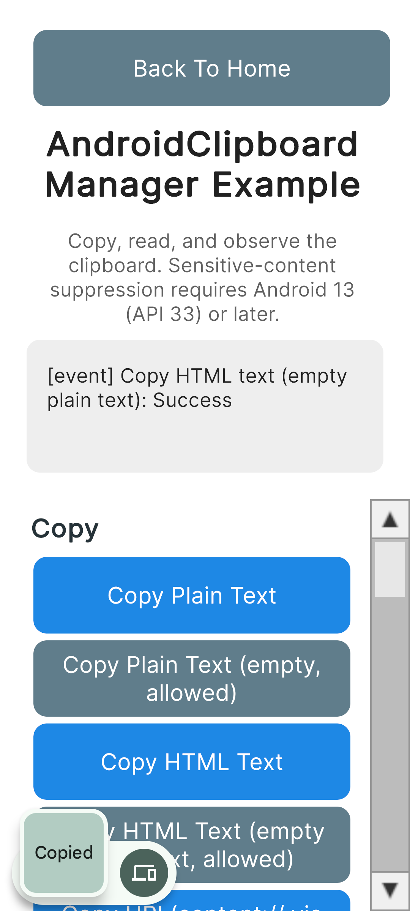
</p>

---

### URI 복사

`content://` URI(이미지나 파일 참조 등)를 복사합니다. URI 문자열을 만드는 방법은 위의 [content:// URI](#content-uri-copy-uri--copy-screenshot에-필요)를 참고하세요.

```csharp
#if UNITY_ANDROID && !UNITY_EDITOR
string path = Path.Combine(Application.persistentDataPath, "clipboard_sample.txt");
File.WriteAllText(path, "Clipboard sample file content");
string uri = CreateContentUri(path);

AndroidClipboardManager.Instance.CopyUri(new CopyUriPayload
{
    uri = uri
});
#endif
```

<p align="center">
    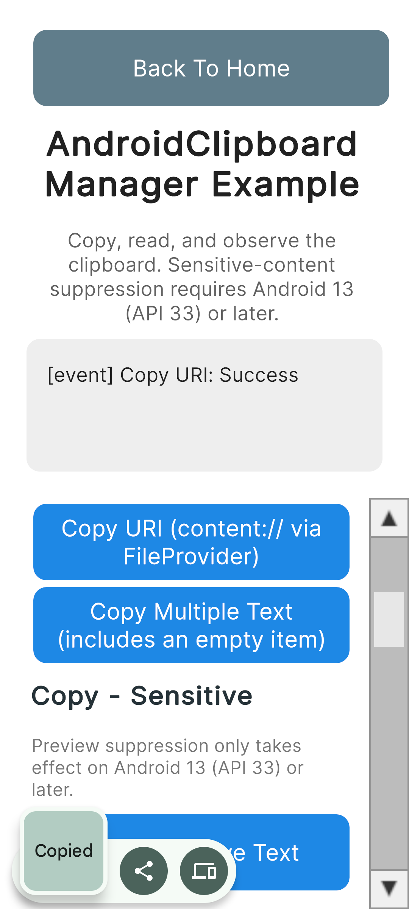
</p>

> **참고:** 붙여넣은 `content://` URI를 대상 앱이 읽을 수 있는지는 기기와 대상 앱에 따라 다릅니다. 일반 텍스트만 처리하는 앱에서는 해석되지 않습니다.

---

### 다중 텍스트 복사

여러 개의 일반 텍스트를 하나의 클립으로 복사합니다. `texts` 배열 안의 개별 빈 문자열은 허용되며, 배열 자체가 비어 있는 경우에만 실패합니다([에러 처리](#에러-처리) 참고).

```csharp
#if UNITY_ANDROID && !UNITY_EDITOR
AndroidClipboardManager.Instance.CopyMultipleText(new CopyMultipleTextPayload
{
    texts = new[] { "First", "", "Third" }
});
#endif
```

<p align="center">
    
</p>

---

### 민감한 텍스트 복사

`isSensitive`를 설정하면 시스템 클립보드 UI에서 미리보기 억제를 요청할 수 있습니다. 이 힌트는 Android 13(API 33) 이상에서만 적용되며, 그 이전 버전에서는 억제 없이 일반적으로 복사됩니다.

```csharp
#if UNITY_ANDROID && !UNITY_EDITOR
AndroidClipboardManager.Instance.CopyPlainText(new CopyPlainTextPayload
{
    text = "P@ssw0rd-sample",
    isSensitive = true
});
#endif
```

<p align="center">
    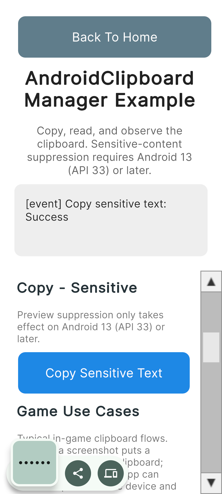
</p>

---

### 게임 활용 사례

게임에서 자주 사용하는 클립보드 활용 사례로, 초대 코드 공유, 전달받은 코드 붙여넣기, 스크린샷 복사를 소개합니다.

#### 초대 코드 복사

```csharp
#if UNITY_ANDROID && !UNITY_EDITOR
AndroidClipboardManager.Instance.CopyPlainText(new CopyPlainTextPayload
{
    text = "NTK-7F3A-92QX",
    label = "invite code"
});
#endif
```

<p align="center">
    
</p>

#### 클립보드에서 코드 붙여넣기

클립보드를 동기적으로 읽어 첫 번째 항목의 일반 텍스트를 추출합니다. 최선 추정(best-effort) 대체값으로는 폴백하지 않습니다. `content://` URI만 담고 있는 클립([스크린샷 복사](#스크린샷-복사)로 생성한 것 등)은 URI를 코드처럼 잘못 표시하는 대신 "텍스트 항목을 찾을 수 없음"으로 처리됩니다.

```csharp
#if UNITY_ANDROID && !UNITY_EDITOR
var result = AndroidClipboardManager.Instance.Read();
switch (result.Status)
{
    case ClipboardReadStatus.HasContent:
        string? code = ExtractFirstText(result.Contents!);
        // 클립에 일반 텍스트 항목이 없으면(URI 전용 클립 등) null
        break;
    case ClipboardReadStatus.Empty:
        // 클립보드가 비어 있음. 실패가 아닌 정상적인 결과
        break;
    default:
        // result.ErrorCode / result.ErrorMessage가 실패 내용을 나타냄
        break;
}

static string? ExtractFirstText(ClipContents contents)
{
    foreach (var item in contents.Items)
    {
        if (!string.IsNullOrEmpty(item.Text)) return item.Text;
    }
    return null;
}
#endif
```

<p align="center">
    
</p>

> **보안 참고:** 붙여넣은 값은 절대 로그로 남기지 마세요. 쿠폰 코드 등 민감한 데이터일 수 있습니다. 로그에는 `result.Status`와 `result.ErrorCode`만 남기세요.

#### 스크린샷 복사

현재 프레임을 캡처하여 `content://` URI로 복사합니다. `ScreenCapture.CaptureScreenshotAsTexture`는 프레임 렌더링이 완료되어야 하므로, 캡처는 `WaitForEndOfFrame` 이후 코루틴 안에서 실행해야 합니다. PNG 바이트로 저장이 끝난 `Texture2D`는 반드시 파괴해야 합니다. 그렇지 않으면 메모리 누수가 발생합니다.

```csharp
#if UNITY_ANDROID && !UNITY_EDITOR
private IEnumerator CaptureAndCopyScreenshot()
{
    yield return new WaitForEndOfFrame();

    string uri;
    Texture2D? screenshot = null;
    try
    {
        screenshot = ScreenCapture.CaptureScreenshotAsTexture();
        byte[] png = screenshot.EncodeToPNG();
        string path = Path.Combine(Application.persistentDataPath, "clipboard_screenshot.png");
        File.WriteAllBytes(path, png);
        uri = CreateContentUri(path);
    }
    finally
    {
        if (screenshot != null) Destroy(screenshot);
    }

    AndroidClipboardManager.Instance.CopyUri(new CopyUriPayload
    {
        uri = uri,
        label = "screenshot"
    });
}
#endif
```

<p align="center">
    
</p>

> **참고:** 붙여넣은 스크린샷을 수신 앱이 읽을 수 있는지는 다른 `content://` 클립과 마찬가지로 기기와 대상 앱에 따라 다릅니다.

---

### 클립보드 읽기

동기 API. 클립 내용, 빈 결과, 또는 실패 중 하나를 반환합니다. 빈 클립보드는 실패가 아닌 정상적인 결과로 취급됩니다.

```csharp
#if UNITY_ANDROID && !UNITY_EDITOR
var result = AndroidClipboardManager.Instance.Read();
switch (result.Status)
{
    case ClipboardReadStatus.HasContent:
        ClipContents contents = result.Contents!;
        // contents.Label, contents.MimeTypes, contents.Items (각 항목의 Text / HtmlText / Uri / CoercedText)
        break;
    case ClipboardReadStatus.Empty:
        // 실패가 아닌 정상적인 결과
        break;
    default:
        // result.ErrorCode / result.ErrorMessage가 실패 내용을 나타냄
        break;
}
#endif
```

<p align="center">
    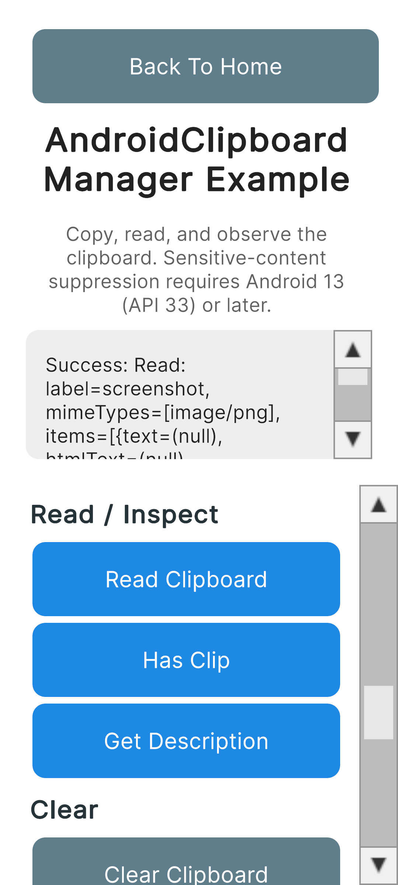
</p>

> **보안 참고:** 클립보드 내용에는 비밀번호나 토큰이 포함될 수 있습니다. 로그에는 `result.Status`와 `result.ErrorCode`만 남기고, 클립 본문 자체는 절대 로그로 남기지 마세요.

---

### 클립 존재 여부 확인

동기 API. 클립보드가 실제로 비어 있는 경우와 확인 자체를 수행할 수 없었던 경우 모두 `false`를 반환합니다. C# 쪽에서는 두 경우를 구분할 수 없습니다.

```csharp
#if UNITY_ANDROID && !UNITY_EDITOR
bool hasClip = AndroidClipboardManager.Instance.HasClip();
#endif
```

<p align="center">
    
</p>

---

### 메타데이터 조회

동기 API. 클립 본문에는 접근하지 않고 라벨, MIME 타입, 스타일 텍스트 여부, 분류 상태 등의 메타데이터만 읽어옵니다.

```csharp
#if UNITY_ANDROID && !UNITY_EDITOR
var result = AndroidClipboardManager.Instance.GetDescription();
switch (result.Status)
{
    case ClipboardReadStatus.HasContent:
        ClipDescriptionInfo info = result.Description!;
        // info.Label, info.MimeTypes, info.IsStyledText, info.ClassificationStatus (API 31 미만에서는 null)
        break;
    case ClipboardReadStatus.Empty:
        break;
    default:
        break;
}
#endif
```

<p align="center">
    
</p>

---

### 클립보드 지우기

비동기 API. `ClipboardOperationCompleted`를 통해 결과가 통보됩니다.

```csharp
#if UNITY_ANDROID && !UNITY_EDITOR
AndroidClipboardManager.Instance.Clear();
#endif
```

<p align="center">
    
</p>

---

### 관찰 시작·중지

`StartObserving`은 성공·실패 여부와 관계없이 결과를 전혀 알리지 않습니다. 성공으로 표시하지 마세요. 관찰 중 클립보드 변경은 `ClipboardChanged` 이벤트로 전달됩니다([이벤트 수신](#이벤트-수신) 참고). 이미 관찰 중인 상태에서 다시 호출하면 네이티브 측에서는 아무 동작도 하지 않습니다. 관찰은 앱이 포그라운드에 있는 동안에만 안정적으로 동작합니다(Android 10 이상의 플랫폼 제약).

`StopObserving`은 다른 작업과 마찬가지로 비동기 API이며 `ClipboardOperationCompleted`를 통해 결과가 통보됩니다. 화면이 숨겨진 뒤에도 관찰이 계속되지 않도록 `OnDisable`에서 호출하세요.

```csharp
#if UNITY_ANDROID && !UNITY_EDITOR
// 시작: 결과가 전혀 통보되지 않음. 이후 클립보드를 변경해 ClipboardChanged로 동작을 확인
AndroidClipboardManager.Instance.StartObserving();

// 중지: Clear와 마찬가지로 ClipboardOperationCompleted를 통해 통보됨
AndroidClipboardManager.Instance.StopObserving();
#endif
```

<p align="center">
    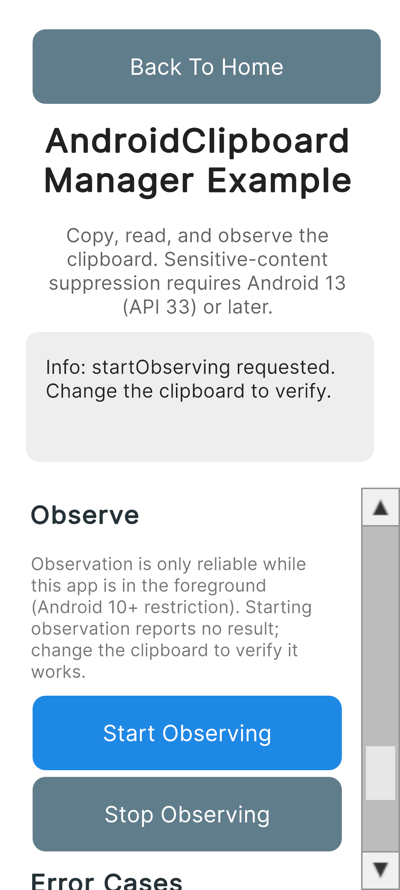
</p>

---

### 이벤트 수신

`OnEnable`에서 이벤트를 구독하고 `OnDisable`에서 해제하세요. `OnDisable`에서는 `StopObserving`도 호출하여 숨겨진 화면이 계속 관찰하지 않도록 합니다.

```csharp
private void OnEnable()
{
#if UNITY_ANDROID && !UNITY_EDITOR
    AndroidClipboardManager.Instance.ClipboardOperationCompleted += OnClipboardOperationCompleted;
    AndroidClipboardManager.Instance.ClipboardChanged += OnClipboardChanged;
#endif
}

private void OnDisable()
{
#if UNITY_ANDROID && !UNITY_EDITOR
    AndroidClipboardManager.Instance.ClipboardOperationCompleted -= OnClipboardOperationCompleted;
    AndroidClipboardManager.Instance.ClipboardChanged -= OnClipboardChanged;
    AndroidClipboardManager.Instance.StopObserving();
#endif
}

#if UNITY_ANDROID && !UNITY_EDITOR
private void OnClipboardOperationCompleted(ClipboardOperationResult result)
{
    string status = result.IsSuccess ? "Success" : "Failed";
    Debug.Log($"[event] {result.Operation}: {status}");
    if (!string.IsNullOrEmpty(result.ErrorMessage))
        Debug.LogError(result.ErrorMessage);
}

private void OnClipboardChanged()
{
    Debug.Log("[event] Clipboard changed");
}
#endif
```

`ClipboardOperationCompleted`는 `CopyPlainText`, `CopyHtmlText`, `CopyUri`, `CopyMultipleText`, `Clear`, `StopObserving`에 전달한 호출별 콜백보다 항상 먼저 발생합니다. 이벤트 구독자와 호출별 콜백이 모두 예외를 던지더라도 각각 독립적으로 처리되므로, 한쪽의 예외가 다른 쪽 호출을 막지 않습니다.

---

### 에러 처리

모든 비동기 작업은 `ClipboardOperationCompleted`를 통해 성공·실패를 통보합니다. `ErrorMessage`는 `IsSuccess`가 `false`인 경우에만 null이 아닙니다.

```csharp
#if UNITY_ANDROID && !UNITY_EDITOR
// HTML 텍스트가 빈 문자열이면 실패: CLIPBOARD_EMPTY_CONTENT
// ErrorMessage: "Clipboard content is empty. Please provide text or HTML."
AndroidClipboardManager.Instance.CopyHtmlText(new CopyHtmlTextPayload
{
    plainText = "Hello",
    htmlText = ""
});

// 항목 배열이 비어 있으면 실패: CLIPBOARD_EMPTY_ITEMS
// ErrorMessage: "No items provided for clipboard copy."
AndroidClipboardManager.Instance.CopyMultipleText(new CopyMultipleTextPayload
{
    texts = Array.Empty<string>()
});

// URI가 빈 문자열이면 실패: CLIPBOARD_INVALID_URI
AndroidClipboardManager.Instance.CopyUri(new CopyUriPayload
{
    uri = ""
});

// http:// 스킴은 거부됨. content:// URI만 지원: CLIPBOARD_INVALID_URI
// ErrorMessage는 "Invalid URI:"로 시작함
AndroidClipboardManager.Instance.CopyUri(new CopyUriPayload
{
    uri = "http://example.com/x"
});
#endif
```

`ErrorCode`로 통보되는 안정적인 에러 코드 목록:

| 에러 코드 | 의미 |
| --- | --- |
| `CLIPBOARD_EMPTY_CONTENT` | `CopyHtmlText`가 빈 문자열 `htmlText`로 호출됨 |
| `CLIPBOARD_EMPTY_ITEMS` | `CopyMultipleText`가 빈 `texts` 배열로 호출됨 |
| `CLIPBOARD_INVALID_URI` | `CopyUri`가 빈 문자열, 잘못된 형식, 또는 `content://`가 아닌 URI로 호출됨 |
| `CLIPBOARD_READ_NOT_ALLOWED` | 네이티브 계층이 읽기를 거부함(포커스·권한 제약 등) |
| `CLIPBOARD_SECURITY` | 네이티브 계층이 보안상의 이유로 작업을 거부함 |
| `CLIPBOARD_UNAVAILABLE` | 시스템 `ClipboardManager`를 가져올 수 없었음 |
| `CLIPBOARD_UNKNOWN` | 분류되지 않은 실패. Unity 측 파싱 실패에도 사용됨 |

`Read`와 `GetDescription`은 네이티브 브리지 자체에 접근할 수 없는 경우(Android에서 실행 중이 아님, 플러그인 미초기화, currentActivity를 가져올 수 없음 등) 추가로 `CLIPBOARD_BRIDGE_UNAVAILABLE`을 반환할 수 있습니다. 이는 네이티브 계층이 반환하는 값이 아니라 Unity 측 에러 코드입니다.

---

## iOS

### 설정

#### 네임스페이스 임포트

`IosClipboardManager`는 iOS 빌드 타겟이 선택되어 있으면 에디터에서도 컴파일됩니다. 에디터에서 호출해도 크래시하지 않으며, 네이티브 브리지에 접근하지 않고 즉시 `CLIPBOARD_BRIDGE_UNAVAILABLE` 실패를 반환합니다. 따라서 에디터에서도 실행되는 씬에 그대로 두어도 됩니다.

```csharp
#if UNITY_IOS || UNITY_EDITOR
using JonghyunKim.NativeToolkit.Runtime.Clipboard;
#endif
```

네이티브 계층의 지원 대상은 iOS 18 이상입니다.

#### 모든 동작은 비동기

iOS에는 동기 API가 없습니다. 각 호출은 선택적인 호출별 콜백을 받으며, 동시에 종류별 이벤트도 발생시킵니다.

| 메서드 | 콜백 결과 타입 | 이벤트 |
| --- | --- | --- |
| `Copy` / `Append` / `Clear` / `RemovePasteboard` / `CancelLoads` / `StartObserving` / `StopObserving` | `IosClipboardOperationResult` | `ClipboardOperationCompleted` |
| `Read` | `IosClipboardReadResult` | `ReadCompleted` |
| `ReadData` | `IosClipboardReadDataResult` | `ReadDataCompleted` |
| `GetSnapshot` | `IosClipboardSnapshotResult` | `SnapshotCompleted` |
| `CreatePasteboard` | `IosPasteboardScopeResult` | `PasteboardCreated` |
| `DetectPatterns` | `IosClipboardDetectedPatternsResult` | `PatternsDetected` |
| `DetectValues` | `IosClipboardDetectedValuesResult` | `ValuesDetected` |
| `LoadItem` | `IosClipboardLoadedItemResult` | `ItemLoaded` |
| `CheckForegroundChange` | `IosClipboardForegroundChangeResult` | `ForegroundChangeChecked` |

이벤트만으로는 어느 호출의 결과인지 구분할 수 없습니다. 결과를 특정 요청과 대응시켜야 한다면 호출별 콜백을 사용하고, 이벤트는 로깅이나 공용 UI 갱신에만 사용하세요. 모든 결과 타입은 `IsSuccess`를 제공하며, 실패 시 `Error`(`Code`, `Message`와 선택적 `Domain` / `NativeCode`를 가진 `IosClipboardErrorInfo`)를 반환합니다.

#### 메인 스레드 전용

모든 public API는 Unity 메인 스레드에서 호출해야 합니다. 다른 스레드에서의 호출은 `CLIPBOARD_MAIN_THREAD_REQUIRED`로 거부되며 네이티브 계층에 도달하지 않습니다.

#### 동일 동작은 한 번에 하나

직렬화되는 것은 동일한 동작뿐입니다. 실행 중인 `LoadItem`에 또 하나의 `LoadItem`을 겹치면 `CLIPBOARD_BUSY`로 거부되지만, `Read`와 `GetSnapshot`은 동시에 실행됩니다. [동시 실행과 Busy 거부](#동시-실행과-busy-거부)를 참고하세요.

#### Manager 수명

`IosClipboardManager.Instance`는 최초 접근 시 생성되며, 네이티브 계층은 첫 호출 시 초기화됩니다. 실행 중에 파괴한 뒤 다시 만드는 사용 방식은 지원하지 않습니다. 파괴된 뒤에는 `IosClipboardManager.IsTerminated`가 `true`가 되고 이후 모든 API가 `CLIPBOARD_MANAGER_DESTROYED`를 반환합니다.

---

### 페이스트보드 스코프

모든 동작은 스코프를 대상으로 실행됩니다. `scope` 인자를 생략(`null`)하면 general 페이스트보드가 대상이 됩니다.

| 스코프 | 팩토리 | 비고 |
| --- | --- | --- |
| General | `IosPasteboardScope.General` | 다른 앱과 공유되는 시스템 페이스트보드 |
| Named | `IosPasteboardScope.Named(name)` | 앱이 이름을 정하는 페이스트보드. `CreatePasteboard`로 한 번 생성한다 |
| Unique | `IosPasteboardScope.Unique(name)` | 이름을 시스템이 생성하는 페이스트보드. 이름은 `CreatePasteboard` 결과에서 얻는다 |

`Named`와 `Unique`는 이름이 공백이면 `ArgumentException`을 던집니다. 사용자 입력으로 만들 경우 미리 검증하세요.

```csharp
#if UNITY_IOS || UNITY_EDITOR
private IosPasteboardScope _scope = IosPasteboardScope.General;

// 이름 있는 페이스트보드를 생성하고 활성 스코프로 보관한다.
IosClipboardManager.Instance.CreatePasteboard(
    IosPasteboardCreationRequest.Named("com.jonghyunkim.nativetoolkit.example.sample"),
    result =>
    {
        if (!result.IsSuccess || result.Scope == null)
        {
            Debug.LogError($"CreatePasteboard failed: {result.Error?.Code}");
            return;
        }

        _scope = result.Scope;
    });

// 시스템이 이름을 정하는 페이스트보드. 이름은 결과에서만 알 수 있다.
IosClipboardManager.Instance.CreatePasteboard(
    IosPasteboardCreationRequest.Unique,
    result => _scope = result.IsSuccess && result.Scope != null ? result.Scope : _scope);
#endif
```

<p align="center">
    
</p>

Named / Unique 페이스트보드는 `RemovePasteboard`로 삭제합니다. general 페이스트보드는 삭제할 수 없으며 `CLIPBOARD_CANNOT_REMOVE_GENERAL`로 실패합니다.

```csharp
#if UNITY_IOS || UNITY_EDITOR
IosClipboardManager.Instance.RemovePasteboard(_scope, result =>
{
    if (result.IsSuccess)
    {
        _scope = IosPasteboardScope.General;
    }
});
#endif
```

<p align="center">
    
</p>

> **참고:** 삭제된 스코프를 읽어도 실패하지 않고, 비어 있는 상태로 페이스트보드가 다시 생성됩니다. "비어 있는 읽기"를 삭제되었다는 신호로 다루고 에러로 처리하지 마세요.

---

### 일반 텍스트 복사

`Copy`는 페이스트보드 내용 전체를 교체합니다. 빈 문자열도 허용되며 실패하지 않습니다.

```csharp
#if UNITY_IOS || UNITY_EDITOR
IosClipboardManager.Instance.Copy(
    IosClipboardContent.PlainText("Hello 日本語 \U0001F680 テスト"),
    _scope,
    options: null,
    onResult: result =>
    {
        if (!result.IsSuccess)
        {
            Debug.LogError($"Copy failed: {result.Error?.Code}");
        }
    });
#endif
```

<p align="center">
    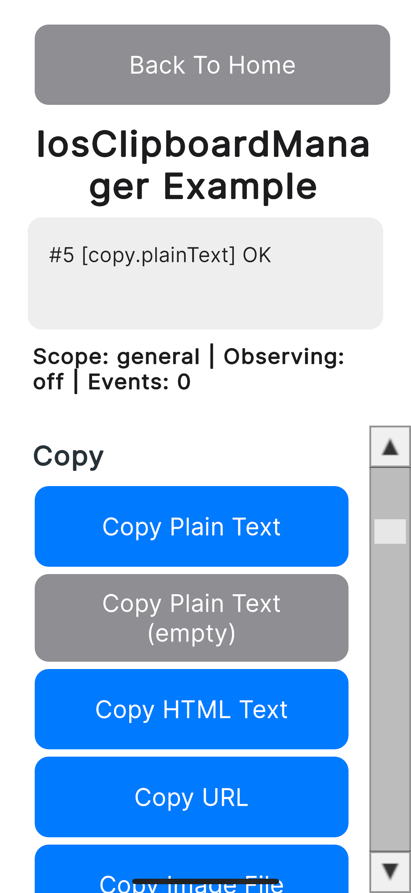
</p>

---

### HTML 텍스트 복사

하나의 아이템에 일반 텍스트 표현과 HTML 표현을 함께 기록합니다.

```csharp
#if UNITY_IOS || UNITY_EDITOR
IosClipboardManager.Instance.Copy(
    IosClipboardContent.HtmlText("Hello", "<b>Hello</b>"),
    _scope);
#endif
```

<p align="center">
    
</p>

---

### URL 복사

유효한 URL이어야 하며, 해석할 수 없는 문자열은 네이티브 계층이 `CLIPBOARD_INVALID_URL`을 반환합니다.

```csharp
#if UNITY_IOS || UNITY_EDITOR
IosClipboardManager.Instance.Copy(IosClipboardContent.Url("https://unity.com"), _scope);
#endif
```

<p align="center">
    
</p>

---

### 이미지 파일 복사

경로를 지정해 이미지를 복사합니다. Android와 달리 FileProvider가 필요 없으며, 읽을 수 있는 경로면 그대로 전달할 수 있습니다. 존재하지 않는 경로는 `CLIPBOARD_FILE_NOT_FOUND`가 됩니다.

```csharp
#if UNITY_IOS || UNITY_EDITOR
string path = Path.Combine(Application.persistentDataPath, "ios_clipboard_sample_image.png");
File.WriteAllBytes(path, pngBytes);

IosClipboardManager.Instance.Copy(IosClipboardContent.ImageFile(path), _scope);
#endif
```

<p align="center">
    
</p>

---

### 이미지 데이터 복사

인코딩된 이미지 바이트열을 해당 uniform type identifier와 함께 복사합니다.

```csharp
#if UNITY_IOS || UNITY_EDITOR
IosClipboardManager.Instance.Copy(
    IosClipboardContent.ImageData(pngBytes, "public.png"),
    _scope);
#endif
```

<p align="center">
    
</p>

> **참고:** `IosClipboardLoadRequest.Image`를 사용하는 `LoadItem`은 이미지를 다시 인코딩하므로, 반환되는 바이트 수는 복사한 바이트 수와 일치하지 않습니다. 바이트 단위로 일치시켜야 한다면 [데이터 읽기](#데이터-읽기)를 사용하세요.

---

### 색상 복사

각 성분은 유한한 값이어야 합니다. `NaN`이나 무한대는 `IosClipboardContent.Color`가 호출 전에 `ArgumentException`을 던집니다. 유한하지만 `0.0...1.0` 범위를 벗어난 값은 네이티브 계층까지 전달되어 `CLIPBOARD_INVALID_COLOR`가 됩니다.

```csharp
#if UNITY_IOS || UNITY_EDITOR
IosClipboardManager.Instance.Copy(IosClipboardContent.Color(0.2, 0.4, 0.8, 1.0), _scope);
#endif
```

<p align="center">
    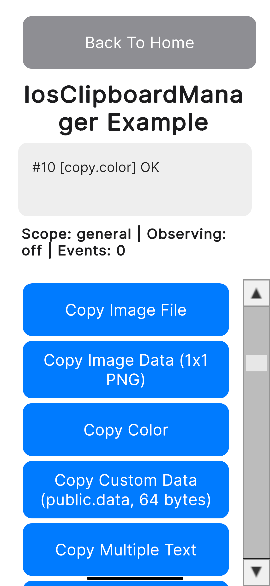
</p>

> **참고:** 복사한 색상은 텍스트 붙여넣기 대상에는 나타나지 않습니다. [스냅샷](#스냅샷)의 `HasColors`가 `true`가 되는 것으로 확인할 수 있습니다.

---

### 커스텀 데이터 복사

임의의 uniform type identifier로 원시 바이트열을 복사합니다. 잘못된 identifier는 `CLIPBOARD_INVALID_TYPE`이 됩니다.

```csharp
#if UNITY_IOS || UNITY_EDITOR
byte[] payload = new byte[64];
payload.AsSpan().Fill(0x41);

IosClipboardManager.Instance.Copy(
    IosClipboardContent.CustomData(payload, "public.data"),
    _scope);
#endif
```

<p align="center">
    
</p>

---

### 다중 텍스트 복사

배열 요소마다 하나의 텍스트 아이템을 기록합니다. 개별 요소는 비어 있어도 되지만, 빈 배열은 `CLIPBOARD_EMPTY_ITEMS`로 실패합니다.

```csharp
#if UNITY_IOS || UNITY_EDITOR
IosClipboardManager.Instance.Copy(
    IosClipboardContent.MultipleText(new[] { "First", string.Empty, "Third" }),
    _scope);
#endif
```

<p align="center">
    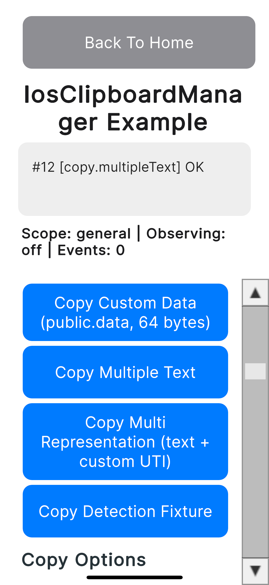
</p>

---

### 다중 표현 복사

하나의 아이템에 여러 표현을 담아, 받는 앱이 해석할 수 있는 타입을 고를 수 있게 합니다. 빈 딕셔너리는 `CLIPBOARD_EMPTY_ITEMS`로 실패합니다.

```csharp
#if UNITY_IOS || UNITY_EDITOR
var representations = new Dictionary<string, byte[]>
{
    { "public.utf8-plain-text", Encoding.UTF8.GetBytes("LOCALONLY-0001") },
    { "com.jonghyunkim.nativetoolkit.example.custom", payload }
};

IosClipboardManager.Instance.Copy(
    IosClipboardContent.MultiRepresentation(representations),
    _scope);
#endif
```

<p align="center">
    
</p>

---

### 복사 옵션

`IosClipboardCopyOptions`는 `Copy` 전용입니다. `Append`에는 옵션 인자가 없습니다.

- `LocalOnly`는 Universal Clipboard를 통한 주변 기기 전달을 하지 않도록 시스템에 요청합니다.
- `ExpirationDate`는 미래 시각이어야 하며, 과거 시각은 네이티브 계층이 `CLIPBOARD_INVALID_EXPIRATION`을 반환합니다.
- `IosClipboardCopyOptions.PrivacyPreservingDefault`는 `localOnly: true`이고 만료 시각이 없습니다.

```csharp
#if UNITY_IOS || UNITY_EDITOR
// 이 기기 안에만 남긴다.
IosClipboardManager.Instance.Copy(
    IosClipboardContent.PlainText("LOCALONLY-0001"),
    _scope,
    IosClipboardCopyOptions.Create(localOnly: true));

// 30초 뒤에 만료시킨다.
IosClipboardManager.Instance.Copy(
    IosClipboardContent.PlainText("Hello 日本語 \U0001F680 テスト"),
    _scope,
    IosClipboardCopyOptions.Create(localOnly: false, DateTime.UtcNow.AddSeconds(30)));
#endif
```

<p align="center">
    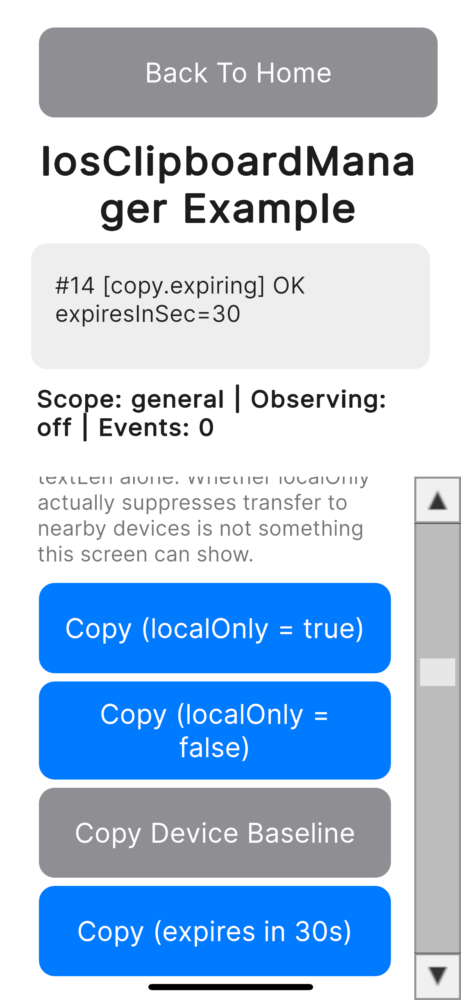
</p>

> **참고:** `localOnly`가 실제로 주변 기기로의 전송을 막는지는 기기 한 대로는 확인할 수 없습니다. 시스템에 대한 요청일 뿐, 이 패키지가 검증한 보장은 아니라는 점을 염두에 두세요.

---

### 추가

`Append`는 내용을 교체하지 않고 아이템을 추가합니다. 옵션은 지정할 수 없습니다.

```csharp
#if UNITY_IOS || UNITY_EDITOR
// 호출마다 고유한 접미사를 붙여 Read에서 추가된 아이템을 구분할 수 있게 한다.
string marker = "APPENDED-MARKER-" + Guid.NewGuid().ToString("N").Substring(0, 8);

IosClipboardManager.Instance.Append(
    IosClipboardContent.PlainText(marker),
    _scope,
    result => Debug.Log($"Append: {result.IsSuccess}"));
#endif
```

<p align="center">
    
</p>

---

### 읽기

모든 아이템을 타입 식별자와 함께 읽고, 가능한 경우 텍스트·URL 표현도 반환합니다.

```csharp
#if UNITY_IOS || UNITY_EDITOR
IosClipboardManager.Instance.Read(_scope, result =>
{
    if (!result.IsSuccess)
    {
        Debug.LogError($"Read failed: {result.Error?.Code}");
        return;
    }

    foreach (IosClipboardItem item in result.Items)
    {
        // item.TypeIdentifiers, item.Text, item.UrlString, item.ImageDataUtType
        Debug.Log($"types: {item.TypeIdentifiers.Count}, hasText: {item.Text != null}");
    }
});
#endif
```

<p align="center">
    
</p>

> **참고:** general 페이스트보드에서는 앱이 직접 쓰지 않은 내용을 처음 읽을 때 iOS의 붙여넣기 허용 시스템 다이얼로그가 표시됩니다. `Read` / `ReadData` / `LoadItem`과 감지 API는 내용을 읽으므로 해당됩니다. `GetSnapshot`은 어떤 타입이 있는지만 보고하므로 다이얼로그가 뜨지 않습니다.

---

### 데이터 읽기

지정한 uniform type identifier로 저장된 원시 바이트열을 반환합니다. 해당 타입을 가진 아이템이 없어도 성공하며 `HasData`가 `false`가 됩니다.

```csharp
#if UNITY_IOS || UNITY_EDITOR
IosClipboardManager.Instance.ReadData("public.png", _scope, result =>
{
    if (!result.IsSuccess)
    {
        Debug.LogError($"ReadData failed: {result.Error?.Code}");
        return;
    }

    if (!result.HasData)
    {
        Debug.Log("No item carries public.png");
        return;
    }

    byte[] data = result.Data!;
    Debug.Log($"utType: {result.UtType}, bytes: {result.ByteCount}");
});
#endif
```

<p align="center">
    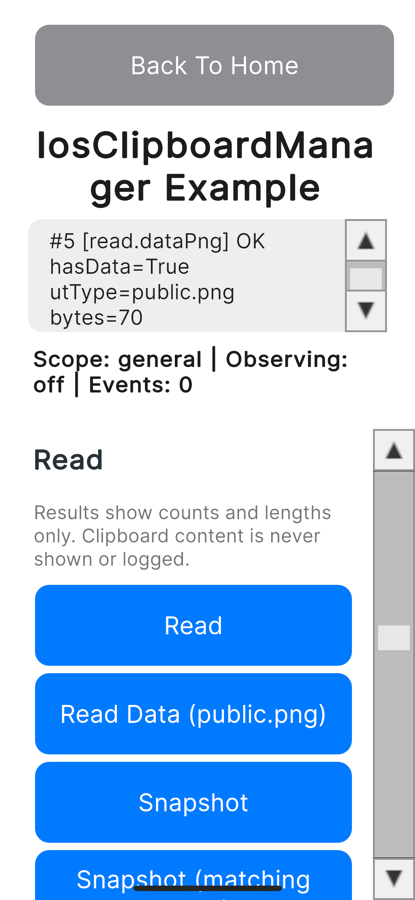
</p>

> **참고:** 디코딩 후 크기가 64 MiB를 넘는 페이로드는 버퍼를 할당하기 전에 `CLIPBOARD_CONTENT_TOO_LARGE`로 거부됩니다.

---

### 스냅샷

내용을 읽지 않고 아이템 수, 타입 식별자, `HasStrings` / `HasUrls` / `HasImages` / `HasColors` 플래그를 보고합니다. `matchingTypes`를 전달하면 해당 타입을 가진 아이템의 인덱스가 `MatchingItemIndexes`에 채워지고, 전달하지 않으면 `MatchingItemIndexes`는 `null`입니다.

```csharp
#if UNITY_IOS || UNITY_EDITOR
IosClipboardManager.Instance.GetSnapshot(_scope, matchingTypes: null, result =>
{
    if (!result.IsSuccess || result.Snapshot == null) return;

    IosClipboardSnapshot snapshot = result.Snapshot;
    Debug.Log($"items: {snapshot.NumberOfItems}, strings: {snapshot.HasStrings}, " +
              $"urls: {snapshot.HasUrls}, images: {snapshot.HasImages}, colors: {snapshot.HasColors}");
});

// 특정 타입으로 좁혀서 조회한다.
IosClipboardManager.Instance.GetSnapshot(
    _scope,
    new[] { "public.utf8-plain-text", "public.png" },
    result =>
    {
        IReadOnlyList<int>? matching = result.Snapshot?.MatchingItemIndexes;
        Debug.Log($"matching items: {matching?.Count ?? 0}");
    });
#endif
```

<p align="center">
    
</p>

---

### 아이템 로드

`LoadItem`은 아이템을 텍스트·URL·이미지·파일로 구체화하도록 시스템에 요청합니다. 파일로 받을 수 있는 유일한 API입니다.

| 요청 | 결과 `Kind` | 값이 채워지는 멤버 |
| --- | --- | --- |
| `IosClipboardLoadRequest.Text` | `Text` | `Text` |
| `IosClipboardLoadRequest.Url` | `Url` | `UrlString` |
| `IosClipboardLoadRequest.Image` | `ImageData` | `Data`, `UtType` |
| `IosClipboardLoadRequest.File(utType)` | `File` | `Path`, `UtType` |

```csharp
#if UNITY_IOS || UNITY_EDITOR
IosClipboardManager.Instance.LoadItem(IosClipboardLoadRequest.Text, _scope, result =>
{
    if (!result.IsSuccess || result.Item == null)
    {
        Debug.LogError($"LoadItem failed: {result.Error?.Code}");
        return;
    }

    Debug.Log($"kind: {result.Item.Kind}, textLength: {result.Item.Text?.Length ?? 0}");
});
#endif
```

<p align="center">
    
</p>

**`File` 요청으로 반환되는 파일은 호출자 소유입니다.** 네이티브 계층은 요청마다 임시 디렉터리에 아이템을 복사할 뿐 삭제하지 않으므로, 사용이 끝나면 앱에서 해당 디렉터리를 삭제해야 합니다.

```csharp
#if UNITY_IOS || UNITY_EDITOR
IosClipboardManager.Instance.LoadItem(IosClipboardLoadRequest.File("public.data"), _scope, result =>
{
    if (!result.IsSuccess || result.Item?.Path == null) return;

    string path = result.Item.Path;
    try
    {
        long size = new FileInfo(path).Length;
        Debug.Log($"loaded file size: {size}");
    }
    finally
    {
        // 이 호출을 위해 네이티브 계층이 만든 요청 디렉터리를 삭제한다.
        string? directory = Path.GetDirectoryName(path);
        if (!string.IsNullOrEmpty(directory))
        {
            Directory.Delete(directory, recursive: true);
        }
    }
});
#endif
```

<p align="center">
    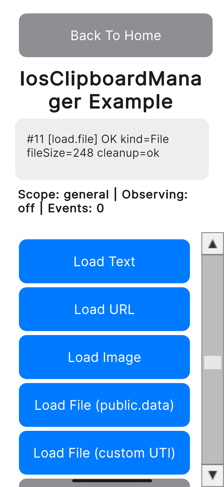
</p>

---

### 로드 취소

`CancelLoads`는 실행 중인 로드를 중단합니다. 중단된 로드는 `CLIPBOARD_CANCELLED`를 반환하며, 이는 정상적인 결과이지 알림을 띄울 실패가 아닙니다.

```csharp
#if UNITY_IOS || UNITY_EDITOR
IosClipboardManager.Instance.LoadItem(IosClipboardLoadRequest.Image, _scope, result =>
{
    if (!result.IsSuccess && result.Error?.Code == "CLIPBOARD_CANCELLED")
    {
        Debug.Log("The load was cancelled on purpose.");
        return;
    }
});

IosClipboardManager.Instance.CancelLoads();
#endif
```

---

### 패턴 감지

요청한 패턴 중 페이스트보드 텍스트에 포함된 것을 보고합니다. 값 자체는 반환하지 않습니다. 빈 패턴 배열은 `CLIPBOARD_EMPTY_PATTERNS`로 실패합니다.

```csharp
#if UNITY_IOS || UNITY_EDITOR
private static readonly IosClipboardDetectionPattern[] AllPatterns =
{
    IosClipboardDetectionPattern.ProbableWebUrl,
    IosClipboardDetectionPattern.ProbableWebSearch,
    IosClipboardDetectionPattern.Number,
    IosClipboardDetectionPattern.Link,
    IosClipboardDetectionPattern.EmailAddress,
    IosClipboardDetectionPattern.PhoneNumber,
    IosClipboardDetectionPattern.PostalAddress,
    IosClipboardDetectionPattern.CalendarEvent,
    IosClipboardDetectionPattern.FlightNumber,
    IosClipboardDetectionPattern.MoneyAmount,
    IosClipboardDetectionPattern.ShipmentTrackingNumber
};

IosClipboardManager.Instance.DetectPatterns(AllPatterns, _scope, result =>
{
    if (!result.IsSuccess) return;

    foreach (IosClipboardDetectionPattern pattern in result.Patterns)
    {
        Debug.Log($"detected: {pattern}");
    }
});
#endif
```

<p align="center">
    
</p>

> **참고:** `Number`와 `ProbableWebSearch`는 텍스트 전체가 숫자이거나 검색어일 때만 보고됩니다. 다른 패턴과 함께 숫자가 섞여 있는 텍스트에서는 감지되지 않습니다.

---

### 값 감지

감지된 값 자체를 카테고리별로 반환합니다.

```csharp
#if UNITY_IOS || UNITY_EDITOR
IosClipboardManager.Instance.DetectValues(AllPatterns, _scope, result =>
{
    if (!result.IsSuccess || result.Values == null) return;

    IosClipboardDetectedValues values = result.Values;
    Debug.Log($"patterns: {values.DetectedPatterns.Count}, emails: {values.EmailAddresses.Count}, " +
              $"phones: {values.PhoneNumbers.Count}, addresses: {values.PostalAddresses.Count}, " +
              $"events: {values.CalendarEvents.Count}, flights: {values.FlightNumbers.Count}, " +
              $"money: {values.MoneyAmounts.Count}, shipments: {values.ShipmentTrackingNumbers.Count}, " +
              $"links: {values.Links.Count}");
});
#endif
```

<p align="center">
    
</p>

> **참고:** 감지된 값은 사용자 내용 그 자체입니다. 로그에는 값이 아니라 건수를 남기세요.

---

### 변경 관찰

`StartObserving`은 스코프에 대한 시스템 변경 알림을 구독하고 결과를 자신의 콜백으로 반환합니다. 이후 변경은 `ClipboardChanged` 이벤트로 전달됩니다.

`StartObserving`과 `StopObserving`은 single-flight 키를 공유하므로 둘 중 하나만 실행 중일 수 있습니다. 한쪽이 진행 중일 때 다른 쪽을 호출하면 `CLIPBOARD_BUSY`로 거부됩니다. 관찰 중에 `StartObserving`을 다시 호출하면 네이티브 계층이 먼저 이전 관찰을 중지하므로 관찰이 교체됩니다. 존재하지 않는 이름 있는 페이스트보드를 관찰하려 하면 `CLIPBOARD_UNAVAILABLE`이 됩니다.

```csharp
#if UNITY_IOS || UNITY_EDITOR
IosClipboardManager.Instance.StartObserving(
    _scope,
    onChanged: null,
    onStarted: result =>
    {
        if (!result.IsSuccess)
        {
            Debug.LogError($"StartObserving failed: {result.Error?.Code}");
        }
    });

// 화면을 벗어날 때 중지한다.
IosClipboardManager.Instance.StopObserving(result => Debug.Log($"StopObserving: {result.IsSuccess}"));
#endif
```

<p align="center">
    
</p>

> **참고:** `StartObserving`이 실패하면 관찰하지 않는 상태가 됩니다. 네이티브 계층은 새 관찰을 시작하기 전에 이전 관찰을 중지하므로 남아서 중지해야 할 것이 없습니다.

---

### 포그라운드 복귀 시 변경 확인

시스템이 변경 알림을 보내는 것은 앱이 포그라운드에 있는 동안뿐입니다. 백그라운드 중에 다른 앱이 수행한 복사는 `ClipboardChanged`로 전달되지 않습니다. `CheckForegroundChange`는 페이스트보드 변경 카운트를 비교해 마지막 확인 이후 내용이 바뀌었는지 보고하므로, 포그라운드로 복귀할 때 호출하세요.

```csharp
#if UNITY_IOS || UNITY_EDITOR
private void OnApplicationPause(bool paused)
{
    if (paused) return;

    IosClipboardManager.Instance.CheckForegroundChange(_scope, result =>
    {
        if (result.IsSuccess && result.Changed)
        {
            Debug.Log("The clipboard changed while the app was in the background.");
        }
    });
}
#endif
```

<p align="center">
    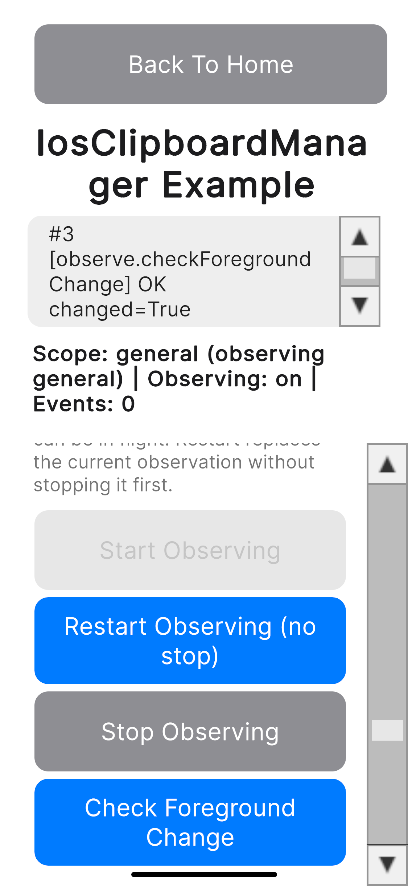
</p>

---

### 지우기

스코프에서 모든 아이템을 삭제합니다.

```csharp
#if UNITY_IOS || UNITY_EDITOR
IosClipboardManager.Instance.Clear(_scope, result => Debug.Log($"Clear: {result.IsSuccess}"));
#endif
```

<p align="center">
    
</p>

---

### 동시 실행과 Busy 거부

직렬화되는 것은 **동일한 동작**뿐입니다. 실행 중인 동작에 같은 동작을 겹치면 두 번째 호출이 즉시 `CLIPBOARD_BUSY`로 거부되고, 첫 번째 호출은 영향을 받지 않고 정상적으로 완료됩니다. 서로 다른 동작은 동시에 실행되므로 결과가 발행 순서와 다르게 도착할 수 있습니다.

```csharp
#if UNITY_IOS || UNITY_EDITOR
// 첫 번째가 실행 중일 때 발행한 두 번째 LoadItem은 CLIPBOARD_BUSY로 거부된다.
IosClipboardManager.Instance.LoadItem(IosClipboardLoadRequest.Text, _scope, first =>
    Debug.Log($"first: {first.IsSuccess}"));

IosClipboardManager.Instance.LoadItem(IosClipboardLoadRequest.Text, _scope, second =>
    Debug.Log($"second: {second.Error?.Code}"));  // CLIPBOARD_BUSY
#endif
```

결과만으로는 어느 호출의 것인지 알 수 없습니다. 여러 호출이 동시에 진행될 수 있다면, 발행하는 클로저에 호출 식별자를 담아 두세요.

```csharp
#if UNITY_IOS || UNITY_EDITOR
int sequence = ++_sequence;
IosClipboardManager.Instance.Read(_scope, result =>
    Debug.Log($"#{sequence} read: {result.IsSuccess}"));
#endif
```

---

### 이벤트 수신

`OnEnable`에서 구독하고 `OnDisable`에서 해제합니다. 숨겨진 화면이 계속 변경을 받지 않도록 `OnDisable`에서 관찰도 중지하세요.

```csharp
private void OnEnable()
{
#if UNITY_IOS || UNITY_EDITOR
    var manager = IosClipboardManager.Instance;
    manager.ClipboardOperationCompleted += OnClipboardOperationCompleted;
    manager.ClipboardChanged += OnClipboardChanged;
#endif
}

private void OnDisable()
{
#if UNITY_IOS || UNITY_EDITOR
    var manager = IosClipboardManager.Instance;
    manager.StopObserving();
    manager.ClipboardOperationCompleted -= OnClipboardOperationCompleted;
    manager.ClipboardChanged -= OnClipboardChanged;
#endif
}

#if UNITY_IOS || UNITY_EDITOR
private void OnClipboardOperationCompleted(IosClipboardOperationResult result)
{
    Debug.Log($"[event] {result.Operation}: {result.IsSuccess}, code: {result.Error?.Code}");
}

private void OnClipboardChanged(IosClipboardChangeEvent changeEvent)
{
    // Kind: Changed, ChangedDetectedOnForeground, Removed, Unknown 중 하나.
    Debug.Log($"[event] {changeEvent.Kind}, added: {changeEvent.TypesAdded.Count}, " +
              $"removed: {changeEvent.TypesRemoved.Count}");
}
#endif
```

`IosClipboardOperationResult.Operation`에 들어가는 값은 `IosClipboardManager.OperationCopy` / `OperationAppend` / `OperationClear` / `OperationRemovePasteboard` / `OperationCancelLoads` / `OperationStartObserving` / `OperationStopObserving` 상수입니다.

> **참고:** 앱 자신이 만든 변경에서는 변경 알림이 복사 콜백보다 먼저 도착할 수 있습니다. 둘이 같은 UI 요소에 쓰면 이벤트가 원인이 된 복사의 결과를 덮어씁니다.

---

### 에러 처리

모든 실패에는 `IosClipboardErrorInfo`가 따라옵니다. `Code`는 안정적이므로 분기에 사용할 수 있고 `Message`는 로그용입니다. `Domain`과 `NativeCode`는 시스템이 사유를 반환한 실패에만 채워집니다.

```csharp
#if UNITY_IOS || UNITY_EDITOR
// 빈 배열: CLIPBOARD_EMPTY_ITEMS.
IosClipboardManager.Instance.Copy(
    IosClipboardContent.MultipleText(Array.Empty<string>()),
    _scope,
    options: null,
    onResult: result => Debug.Log(result.Error?.Code));

// 존재하지 않는 파일: CLIPBOARD_FILE_NOT_FOUND.
IosClipboardManager.Instance.Copy(
    IosClipboardContent.ImageFile("/nonexistent/ios-clipboard-missing.png"), _scope);

// 잘못된 uniform type identifier: CLIPBOARD_INVALID_TYPE.
IosClipboardManager.Instance.Copy(
    IosClipboardContent.CustomData(payload, "not a uti"), _scope);

// 잘못된 URL: CLIPBOARD_INVALID_URL.
IosClipboardManager.Instance.Copy(IosClipboardContent.Url("not a valid url"), _scope);

// 유한하지만 0.0...1.0 범위 밖: CLIPBOARD_INVALID_COLOR.
IosClipboardManager.Instance.Copy(IosClipboardContent.Color(1.5, 0.0, 0.0, 1.0), _scope);

// general은 삭제할 수 없다: CLIPBOARD_CANNOT_REMOVE_GENERAL.
IosClipboardManager.Instance.RemovePasteboard(IosPasteboardScope.General);

// 빈 패턴 배열: CLIPBOARD_EMPTY_PATTERNS. 네이티브 계층에 도달하기 전에 반환된다.
IosClipboardManager.Instance.DetectPatterns(
    Array.Empty<IosClipboardDetectionPattern>(), _scope);
#endif
```

네이티브 계층이 반환하는 코드:

| 에러 코드 | 의미 |
| --- | --- |
| `CLIPBOARD_EMPTY_CONTENT` | 텍스트·데이터·표현 값이 비어 있음 |
| `CLIPBOARD_EMPTY_ITEMS` | `texts` 배열 또는 표현 딕셔너리가 비어 있음 |
| `CLIPBOARD_EMPTY_PATTERNS` | 감지 패턴이 지정되지 않음 |
| `CLIPBOARD_INVALID_URL` | URL 문자열을 해석할 수 없음 |
| `CLIPBOARD_INVALID_TYPE` | `utType` 또는 표현 키가 uniform type identifier로 유효하지 않음 |
| `CLIPBOARD_INVALID_NAME` | 페이스트보드 이름을 사용할 수 없음 |
| `CLIPBOARD_INVALID_COLOR` | 색상 성분이 `0.0...1.0` 범위를 벗어남 |
| `CLIPBOARD_INVALID_IMAGE_DATA` | 이미지 데이터를 디코딩할 수 없음 |
| `CLIPBOARD_INVALID_EXPIRATION` | `ExpirationDate`가 미래 시각이 아님 |
| `CLIPBOARD_INVALID_REQUEST` | 요청 자체가 거부됨. 개별 사유는 반환되지 않음 |
| `CLIPBOARD_CONTENT_TOO_LARGE` | 내용이 상한(64 MiB)을 초과함 |
| `CLIPBOARD_FILE_NOT_FOUND` | 지정한 이미지 파일이 존재하지 않음 |
| `CLIPBOARD_IMAGE_LOAD_FAILED` | 이미지를 읽을 수 없음 |
| `CLIPBOARD_IMAGE_ENCODE_FAILED` | 붙여넣은 이미지를 인코딩할 수 없음 |
| `CLIPBOARD_UNAVAILABLE` | 요청한 페이스트보드가 존재하지 않음 |
| `CLIPBOARD_CANNOT_REMOVE_GENERAL` | general 스코프에 대한 `RemovePasteboard` |
| `CLIPBOARD_NO_MATCHING_ITEM` | 요청한 타입에 해당하는 아이템이 없음 |
| `CLIPBOARD_LOAD_FAILED` | 아이템을 로드할 수 없음 |
| `CLIPBOARD_UNEXPECTED_TYPE` | 요청한 타입으로 변환할 수 없음 |
| `CLIPBOARD_FILE_COPY_FAILED` | 임시 디렉터리로의 복사가 실패함 |
| `CLIPBOARD_CANCELLED` | 로드가 중단됨. 정상적인 결과이며 알릴 실패가 아님 |
| `CLIPBOARD_TIMED_OUT` | 감지·아이템 로드·이미지 코딩이 시간 제한을 초과함 |
| `CLIPBOARD_DETECTION_FAILED` | 시스템에서 감지 처리가 실패함 |
| `CLIPBOARD_UNKNOWN` | 분류되지 않은 시스템 에러 |

Unity 측에서 네이티브 호출 전에 또는 대신 반환되는 코드:

| 에러 코드 | 의미 |
| --- | --- |
| `CLIPBOARD_BUSY` | 동일한 동작이 이미 진행 중 |
| `CLIPBOARD_BRIDGE_UNAVAILABLE` | iOS 실기기에서 실행 중이 아님(에디터 포함), 또는 브리지 호출이 예외를 던짐 |
| `CLIPBOARD_MAIN_THREAD_REQUIRED` | Unity 메인 스레드가 아닌 곳에서 호출됨 |
| `CLIPBOARD_MANAGER_DESTROYED` | Manager가 이미 파괴됨. 실행 중 재생성은 지원하지 않음 |
| `CLIPBOARD_INVALID_REQUEST` | 필수 인자가 `null` |
| `CLIPBOARD_EMPTY_PATTERNS` | 빈 패턴 배열. 네이티브 호출 전에 거부됨 |
| `CLIPBOARD_CONTENT_TOO_LARGE` | 반환된 페이로드의 디코딩 후 크기가 64 MiB를 초과 |
| `CLIPBOARD_UNKNOWN` | 네이티브 응답이 비었거나 파싱할 수 없음 |

결과로 반환되지 않고 생성 시점에 예외가 되는 입력도 있습니다. 사용자 입력으로 만들기 전에 검증하세요.

| 팩토리 | 예외 |
| --- | --- |
| `IosPasteboardScope.Named` / `Unique`, `IosPasteboardCreationRequest.Named` | 이름이 공백이면 `ArgumentException` |
| `IosClipboardContent.Color` | 성분이 `NaN` 또는 무한대이면 `ArgumentException` |
| 그 밖의 `IosClipboardContent` 팩토리, `IosClipboardLoadRequest.File` | 인자가 `null`이면 `ArgumentNullException` |

## macOS

### 설정

#### 네임스페이스 가져오기

`MacClipboardManager`는 macOS 스탠드얼론 빌드 타깃이 선택되어 있으면 에디터를 포함해 항상 컴파일됩니다. 에디터에서 호출해도 크래시가 나지 않습니다. 모든 작업이 네이티브 브리지에 닿지 않고 즉시 `BridgeUnavailable`(9002) 실패를 돌려주므로, 에디터에서도 실행되는 씬에 같은 코드를 그대로 둘 수 있습니다.

```csharp
#if UNITY_STANDALONE_OSX || UNITY_EDITOR
using JonghyunKim.NativeToolkit.Runtime.Clipboard;
#endif
```

네이티브 계층의 대상은 macOS 15 이상입니다. 세 가지 작업만 macOS 15.4가 필요합니다. [패턴 감지](#패턴-감지)를 참고하십시오.

#### 모든 작업은 비동기

macOS에는 동기 API가 없습니다. 각 호출은 선택적인 콜백을 받고, 같은 종류의 호출마다 발생하는 이벤트도 함께 전달합니다.

| 메서드 | 콜백 결과 | 이벤트 |
| --- | --- | --- |
| `Copy`, `Append` | `MacClipboardOwnershipResult` | `OwnershipChanged` |
| `Read` | `MacClipboardReadResult` | `ReadCompleted` |
| `ReadData` | `MacClipboardReadDataResult` | `ReadDataCompleted` |
| `Snapshot` | `MacClipboardSnapshotResult` | `SnapshotCompleted` |
| `Clear` | `MacClipboardChangeCountResult` | `ClearCompleted` |
| `CreatePasteboard` | `MacPasteboardScopeResult` | `PasteboardCreated` |
| `RemovePasteboard`, `StartObserving`, `StopObserving` | `MacClipboardOperationResult` | `ClipboardOperationCompleted` |
| `DetectPatterns` | `MacClipboardDetectedPatternsResult` | `PatternsDetected` |
| `DetectValues` | `MacClipboardDetectedValuesResult` | `ValuesDetected` |
| `DetectMetadata` | `MacClipboardDetectedMetadataResult` | `MetadataDetected` |
| `GetAccessBehavior` | `MacClipboardAccessBehaviorResult` | `AccessBehaviorChecked` |
| `CheckForegroundChange` | `MacClipboardForegroundChangeResult` | `ForegroundChangeChecked` |
| (감시) | `MacClipboardChangeEvent` | `ClipboardChanged` |

이벤트만으로는 어느 호출에 대응하는지 알 수 없습니다. 결과를 특정 요청과 연결해야 할 때는 반드시 콜백을 사용하고, 이벤트는 로그나 공용 UI 갱신에만 사용하십시오. 모든 결과는 `IsSuccess`를 제공하며 실패 시 `Error`(`int Code`와 `string Message`를 가진 `MacClipboardErrorInfo`)를 돌려줍니다.

#### 메인 스레드 전용

모든 공개 API는 Unity 메인 스레드에서 호출해야 합니다. 다른 스레드에서 호출하면 `MainThreadRequired`(9003)로 거부되며 네이티브 계층에 도달하지 않습니다. 콜백과 이벤트는 항상 메인 스레드로 전달되므로 그 안에서 Unity API를 바로 사용할 수 있습니다.

#### 작업당 동시 1건

호출은 작업 단위로 직렬화됩니다. 실행 중인 `Read`가 있을 때 두 번째 `Read`를 보내면 `Busy`(9001)로 거부되지만, `Read`와 `Snapshot`은 동시에 실행됩니다. `StartObserving`과 `StopObserving`은 하나의 키를 공유하므로 한쪽이 응답을 기다리는 동안 다른 쪽을 시작할 수 없습니다.

#### 매니저의 수명

`MacClipboardManager.Instance`는 최초 접근 시 매니저를 생성하고, 네이티브 계층은 첫 호출에서 초기화됩니다. 실행 중에 파기하고 다시 만드는 것은 지원하지 않습니다. 한 번 파기되면 `MacClipboardManager.IsTerminated`가 `true`가 되고 이후 모든 API가 `ManagerDestroyed`(9004)를 돌려줍니다.

---

### 페이스트보드 스코프

모든 작업은 스코프를 대상으로 실행됩니다. `scope` 매개변수를 생략(`null`)하면 일반 페이스트보드가 대상이 됩니다.

| 스코프 | 팩토리 | 설명 |
| --- | --- | --- |
| General | `MacPasteboardScope.General` | 다른 앱과 공유되는 시스템 페이스트보드. |
| Named | `MacPasteboardScope.Named(name)` | 앱이 이름을 정하는 페이스트보드. `CreatePasteboard`로 한 번 생성합니다. |
| Unique | `MacPasteboardScope.Unique(name)` | 이름을 시스템이 생성하는 페이스트보드. 이름은 `CreatePasteboard`의 결과로 받습니다. |

`Named`와 `Unique`는 이름이 비어 있거나 공백뿐일 때 `ArgumentException`을 던집니다. 네이티브 계층은 그런 이름도 그대로 받아들여 의도하지 않은 페이스트보드를 조작하므로, 이 검사는 C# 쪽에만 있습니다. 스코프를 만들기 전에 입력을 검증하십시오.

```csharp
#if UNITY_STANDALONE_OSX || UNITY_EDITOR
private MacPasteboardScope _scope = MacPasteboardScope.General;

// 이름 있는 페이스트보드를 만들고 활성 스코프로 보관합니다.
MacClipboardManager.Instance.CreatePasteboard(
    MacPasteboardCreationRequest.Named("com.jonghyunkim.nativetoolkit.example.sample"),
    result =>
    {
        if (!result.IsSuccess || result.Scope == null)
        {
            Debug.LogError($"CreatePasteboard failed: {result.Error?.Code}");
            return;
        }

        _scope = result.Scope;
    });

// 시스템이 이름을 정하는 페이스트보드. 이름은 결과로만 알 수 있습니다.
MacClipboardManager.Instance.CreatePasteboard(
    MacPasteboardCreationRequest.Unique,
    result => _scope = result.IsSuccess && result.Scope != null ? result.Scope : _scope);
#endif
```

<p align="center">
    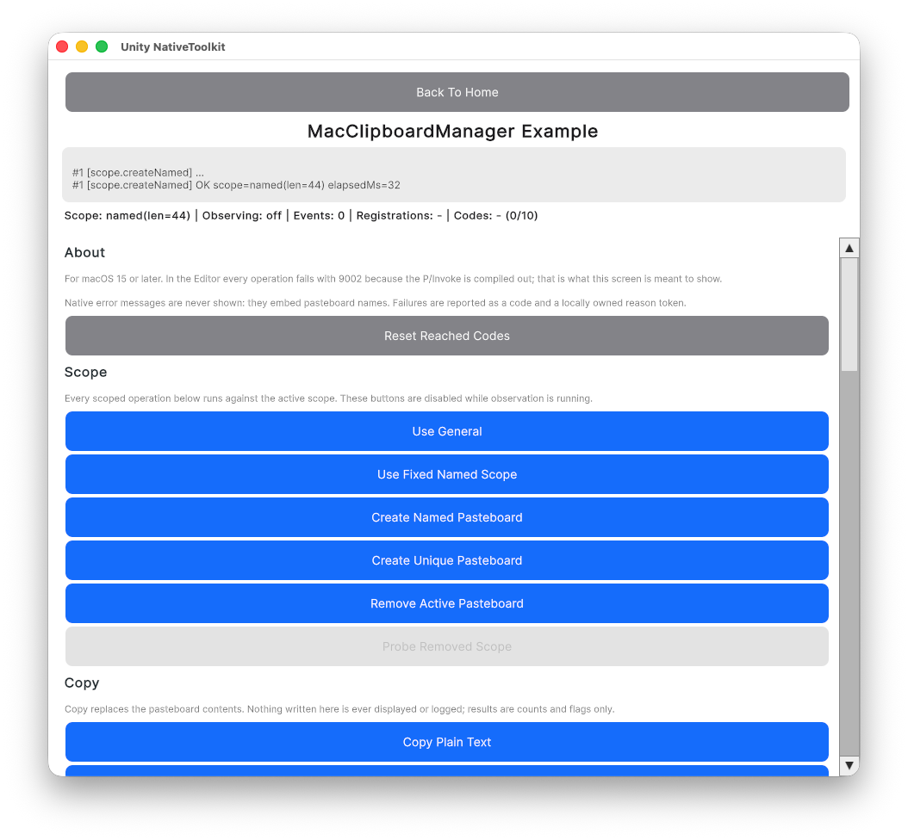
</p>

이름 있는 페이스트보드와 고유 페이스트보드는 `RemovePasteboard`로 해제합니다.

```csharp
#if UNITY_STANDALONE_OSX || UNITY_EDITOR
MacClipboardManager.Instance.RemovePasteboard(_scope, result =>
{
    if (result.IsSuccess)
    {
        _scope = MacPasteboardScope.General;
    }
});
#endif
```

> **참고:** `RemovePasteboard`가 버리는 것은 이름이 아니라 내용입니다. 해제된 스코프를 읽으면 성공하고 항목이 0개로 돌아옵니다. 오류를 기다리지 말고 빈 읽기를 "이미 없음"으로 해석하십시오.

표준 페이스트보드는 해제할 수 없습니다. `general`, `font`, `ruler`, `find`, `drag` 모두 `CannotReleaseStandardPasteboard`(1508)로 실패합니다. 판정은 이름으로 이루어지므로 이 다섯 이름을 `Unique` 스코프로 넘겨도 똑같이 실패합니다.

이름 있는 페이스트보드와 고유 페이스트보드는 프로세스가 끝난 뒤에도 페이스트보드 서버에 남습니다. 더 필요 없는 고유 페이스트보드는 명시적으로 해제하고, 민감한 데이터를 이름 있는 페이스트보드에 두지 마십시오.

---

### 일반 텍스트 복사

`Copy`는 페이스트보드 내용을 통째로 교체하고, [추가](#추가)가 필요로 하는 `MacPasteboardOwnership`을 돌려줍니다.

```csharp
#if UNITY_STANDALONE_OSX || UNITY_EDITOR
private MacPasteboardOwnership? _ownership;

MacClipboardManager.Instance.Copy(
    MacClipboardContent.PlainText("Hello macOS clipboard"),
    _scope,
    options: null,
    onResult: result =>
    {
        if (!result.IsSuccess)
        {
            Debug.LogError($"Copy failed: {result.Error?.Code}");
            return;
        }

        _ownership = result.Ownership;
    });
#endif
```

---

### HTML 텍스트 복사

하나의 항목은 여러 표현을 가질 수 있습니다. `Html`은 `public.html`을 기록하고, 폴백을 넘기면 같은 항목에 `public.utf8-plain-text`도 함께 기록합니다. HTML을 다루지 못하는 앱에서도 읽을 수 있는 텍스트가 남습니다.

```csharp
#if UNITY_STANDALONE_OSX || UNITY_EDITOR
MacClipboardManager.Instance.Copy(
    MacClipboardContent.Single(MacClipboardContentItem.Html("<b>Hello</b>", "Hello")),
    _scope,
    options: null,
    onResult: result => _ownership = result.IsSuccess ? result.Ownership : _ownership);
#endif
```

---

### URL 복사

```csharp
#if UNITY_STANDALONE_OSX || UNITY_EDITOR
MacClipboardManager.Instance.Copy(
    MacClipboardContent.Single(MacClipboardContentItem.Url("https://unity.com")),
    _scope,
    options: null,
    onResult: result => _ownership = result.IsSuccess ? result.Ownership : _ownership);
#endif
```

---

### 사용자 정의 데이터 복사

앱이 정의한 uniform type identifier로 원시 바이트를 기록합니다. 다른 앱은 이 타입을 알아보지 못합니다. 그것이 목적이며, 자신의 씬이나 프로세스 사이에서 데이터를 옮길 때 사용합니다.

```csharp
#if UNITY_STANDALONE_OSX || UNITY_EDITOR
byte[] payload = System.Text.Encoding.UTF8.GetBytes("{\"level\":12}");

MacClipboardManager.Instance.Copy(
    MacClipboardContent.Single(MacClipboardContentItem.Data(
        "com.jonghyunkim.nativetoolkit.example.custom", payload)),
    _scope,
    options: null,
    onResult: result => _ownership = result.IsSuccess ? result.Ownership : _ownership);
#endif
```

---

### 여러 항목 복사

`Multiple`은 여러 항목을 순서대로 기록합니다. 받는 앱이 그것을 어떻게 쓸지는 받는 쪽이 정합니다. 서식 있는 텍스트 뷰는 전부 읽고, 한 줄짜리 입력란은 보통 첫 번째만 사용합니다.

```csharp
#if UNITY_STANDALONE_OSX || UNITY_EDITOR
MacClipboardManager.Instance.Copy(
    MacClipboardContent.Multiple(new[]
    {
        MacClipboardContentItem.PlainText("Hello macOS clipboard"),
        MacClipboardContentItem.Url("https://unity.com"),
    }),
    _scope,
    options: null,
    onResult: result => _ownership = result.IsSuccess ? result.Ownership : _ownership);
#endif
```

---

### 여러 표현 복사

같은 내용의 여러 표현을 하나의 항목에 담습니다. 받는 앱이 원하는 타입을 고릅니다.

`MacClipboardContentItem`에는 public 생성자가 없습니다. `FromRepresentations`가 범용 팩토리로, 타입에서 바이트로 가는 딕셔너리를 받아 그 전부를 하나의 항목에 넣습니다. 이름 있는 팩토리로는 만들 수 없는 타입 조합은 이것으로 만듭니다.

```csharp
#if UNITY_STANDALONE_OSX || UNITY_EDITOR
var representations = new Dictionary<string, byte[]>
{
    [MacClipboardTypes.PlainText] = System.Text.Encoding.UTF8.GetBytes("Hello"),
    [MacClipboardTypes.Html] = System.Text.Encoding.UTF8.GetBytes("<b>Hello</b>"),
};

MacClipboardManager.Instance.Copy(
    MacClipboardContent.Single(MacClipboardContentItem.FromRepresentations(representations)),
    _scope,
    options: null,
    onResult: result => _ownership = result.IsSuccess ? result.Ownership : _ownership);
#endif
```

---

### 복사 옵션: 로컬 전용

`MacClipboardCopyOptions`는 이 쓰기를 Universal Clipboard를 통해 사용자의 다른 Apple 기기에 전달할지 제어합니다.

| 옵션 | 의미 |
| --- | --- |
| `MacClipboardCopyOptions.PrivacyPreservingDefault` | `localOnly: true`. 이 Mac 안에만 머무릅니다. |
| `MacClipboardCopyOptions.Create(false)` | 같은 Apple 계정으로 로그인한 가까운 기기에 전달됩니다. |
| `null` | 시스템 기본값을 따릅니다. |

두 동작 모두 실제 기기에서 확인했습니다. `localOnly: false`에서는 다른 기기에 텍스트가 나타나고, `localOnly: true`에서는 그 기기의 내용이 그대로 유지됩니다.

```csharp
#if UNITY_STANDALONE_OSX || UNITY_EDITOR
// 액세스 토큰을 이 Mac 안에만 둡니다.
MacClipboardManager.Instance.Copy(
    MacClipboardContent.PlainText("Hello macOS clipboard (localOnly true, local)"),
    _scope,
    MacClipboardCopyOptions.PrivacyPreservingDefault,
    result => _ownership = result.IsSuccess ? result.Ownership : _ownership);

// 초대 코드를 사용자의 iPhone까지 전달합니다.
MacClipboardManager.Instance.Copy(
    MacClipboardContent.PlainText("Hello macOS clipboard (localOnly false, shared)"),
    _scope,
    MacClipboardCopyOptions.Create(false),
    result => _ownership = result.IsSuccess ? result.Ownership : _ownership);
#endif
```

---

### 추가

`Append`는 기존 내용을 지우지 않고 항목을 덧붙이며, 직전 `Copy`가 돌려준 `MacPasteboardOwnership`이 필요합니다.

`Append`에는 다른 쓰기 경로와 다른, 실무에서 중요한 성질이 두 가지 있습니다.

- **소유권을 검사합니다.** 도중에 다른 앱이 복사하면 조용히 무시되지 않고 `OwnershipLost`(1511)로 실패합니다.
- **성공한 추가는 changeCount를 바꾸지 않습니다.** 따라서 같은 ownership을 다음 추가에 그대로 쓸 수 있습니다.

```csharp
#if UNITY_STANDALONE_OSX || UNITY_EDITOR
if (_ownership != null)
{
    MacClipboardManager.Instance.Append(
        MacClipboardContent.PlainText("Hello macOS clipboard"),
        _ownership,
        result =>
        {
            if (!result.IsSuccess)
            {
                // 1511: 다른 앱이 페이스트보드를 가져갔습니다. 다시 Copy 해 소유권을 되찾습니다.
                Debug.LogError($"Append failed: {result.Error?.Code}");
                return;
            }

            _ownership = result.Ownership;
        });
}
#endif
```

---

### 읽기

`Read`는 모든 항목을 그 전체 표현과 함께 돌려주고, 읽은 시점의 changeCount도 함께 돌려줍니다.

```csharp
#if UNITY_STANDALONE_OSX || UNITY_EDITOR
MacClipboardManager.Instance.Read(_scope, result =>
{
    if (!result.IsSuccess || result.Contents == null)
    {
        Debug.LogError($"Read failed: {result.Error?.Code}");
        return;
    }

    MacClipboardReadContents contents = result.Contents;
    Debug.Log($"items: {contents.Items.Count}, changeCount: {contents.ChangeCount}");

    foreach (MacClipboardItem item in contents.Items)
    {
        if (item.Representations.TryGetValue(MacClipboardTypes.PlainText, out byte[] bytes))
        {
            string text = System.Text.Encoding.UTF8.GetString(bytes);
            // 텍스트를 사용합니다.
        }
    }
});
#endif
```

<p align="center">
    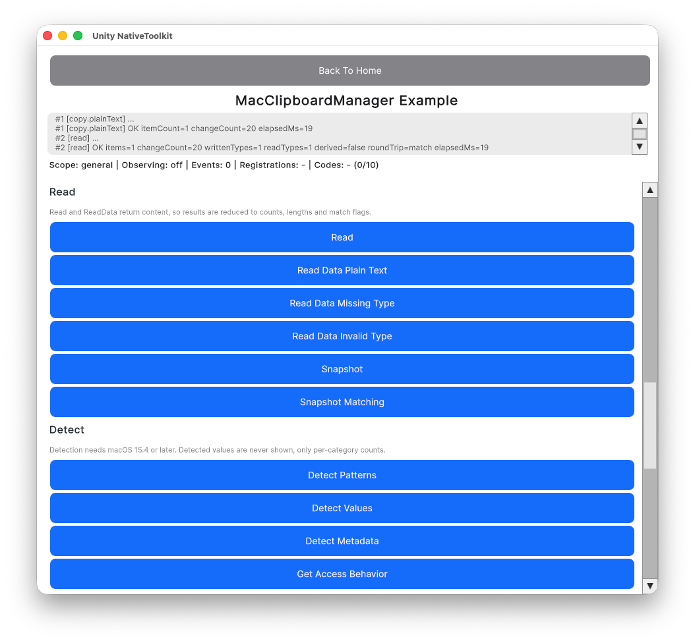
</p>

> **참고:** 돌아오는 내용은 기록한 내용의 거울이 아닙니다. 서식 있는 텍스트를 복사하는 앱은 스스로 추가 표현을 선언하므로, 하나의 항목이 `public.rtf`와 `public.utf8-plain-text`와 `public.utf16-external-plain-text`를 동시에 가질 수 있습니다. 필요한 타입만 요청하고 나머지는 무시하십시오. **표현의 개수나 기록한 내용과의 완전 일치로 분기를 작성하지 마십시오.**

---

### 타입을 지정한 읽기

`ReadData`는 하나의 타입에 대한 바이트를 돌려줍니다. **해당 타입이 없는 경우도, 타입 식별자가 아예 올바르지 않은 경우도 실패가 아니라 `Data == null`인 성공**입니다. `IsSuccess`가 아니라 `Data`를 확인하십시오.

```csharp
#if UNITY_STANDALONE_OSX || UNITY_EDITOR
MacClipboardManager.Instance.ReadData(MacClipboardTypes.PlainText, _scope, result =>
{
    if (!result.IsSuccess)
    {
        Debug.LogError($"ReadData failed: {result.Error?.Code}");
        return;
    }

    if (result.Data == null)
    {
        // 페이스트보드에 일반 텍스트가 없습니다. 오류가 아닙니다.
        return;
    }

    string text = System.Text.Encoding.UTF8.GetString(result.Data);
});
#endif
```

<p align="center">
    
</p>

빈 문자열 `utType`은 다릅니다. 네이티브 계층이 `ContractViolation`(1302)으로 거부합니다.

---

### 스냅샷

`Snapshot`은 페이로드를 읽지 않고 어떤 타입이 있는지만 보고합니다. 바이트를 꺼내기 전에 붙여넣을 가치가 있는지 판단할 때 사용합니다.

`matchingTypes`는 보고되는 타입을 걸러내지 않습니다. 지정한 타입을 하나 이상 가진 항목의 인덱스가 `MatchingItemIndexes`에 담길 뿐입니다.

```csharp
#if UNITY_STANDALONE_OSX || UNITY_EDITOR
MacClipboardManager.Instance.Snapshot(
    new[] { MacClipboardTypes.PlainText, MacClipboardTypes.Html },
    _scope,
    result =>
    {
        if (!result.IsSuccess || result.Snapshot == null)
        {
            Debug.LogError($"Snapshot failed: {result.Error?.Code}");
            return;
        }

        MacClipboardSnapshot snapshot = result.Snapshot;
        Debug.Log($"items: {snapshot.ItemTypes.Count}, " +
                  $"matching: {snapshot.MatchingItemIndexes.Count}, " +
                  $"changeCount: {snapshot.ChangeCount}");
    });
#endif
```

<p align="center">
    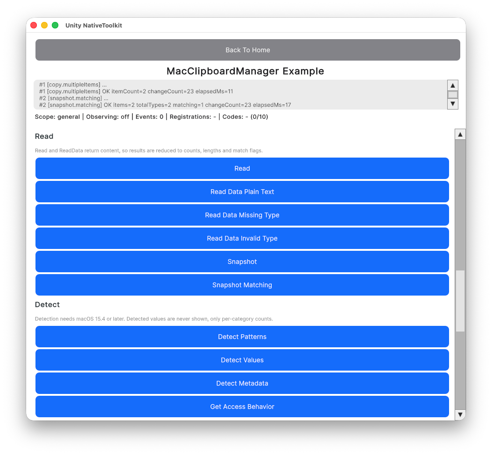
</p>

빈 배열은 "필터 없음"이 아닙니다. `EmptyTypeFilter`(1512)로 실패합니다. 필터를 걸지 않으려면 `null`을 넘기십시오.

> **참고:** 페이로드를 읽지 않는 것은 최적화이지 프라이버시 보장이 아닙니다. `Snapshot`도 감지 API도 사용자에게 클립보드 접근이 알려지지 않는다고 보장하지 않습니다.

---

### 패턴 감지

`DetectPatterns`는 값 자체를 돌려주지 않고 페이스트보드가 어떤 종류의 내용을 담고 있는지 보고합니다.

**이 세 API는 macOS 15.4가 필요합니다.** `DetectPatterns`, `DetectValues`, `DetectMetadata` 모두 그 미만 버전에서 `DetectionUnavailable`(1513)로 실패합니다.

```csharp
#if UNITY_STANDALONE_OSX || UNITY_EDITOR
MacClipboardManager.Instance.DetectPatterns(
    new[]
    {
        MacClipboardDetectionPattern.ProbableWebUrl,
        MacClipboardDetectionPattern.Links,
        MacClipboardDetectionPattern.EmailAddresses,
        MacClipboardDetectionPattern.PhoneNumbers,
    },
    _scope,
    result =>
    {
        if (!result.IsSuccess)
        {
            // macOS 15.4 미만에서는 1513.
            Debug.LogError($"DetectPatterns failed: {result.Error?.Code}");
            return;
        }

        foreach (MacClipboardDetectionPattern pattern in result.Patterns)
        {
            Debug.Log($"matched: {pattern}");
        }
    });
#endif
```

<p align="center">
    
</p>

돌아오는 것은 요청한 패턴 중 일치한 것들입니다. 빈 컬렉션은 `EmptyDetectionPatterns`(1503)로 거부됩니다.

`ProbableWebUrl`, `ProbableWebSearch`, `Number`는 내용 전체를 분류하는 패턴이고, 나머지는 긴 글 안에서 개별 요소를 찾습니다. URL이 들어 있는 문단은 `Links`에 일치하지만, 숫자가 들어 있어도 `Number`에는 일치하지 않습니다.

---

### 값 감지

`DetectValues`는 감지한 값 자체를 돌려줍니다.

```csharp
#if UNITY_STANDALONE_OSX || UNITY_EDITOR
MacClipboardManager.Instance.DetectValues(
    new[] { MacClipboardDetectionPattern.Links, MacClipboardDetectionPattern.EmailAddresses },
    _scope,
    result =>
    {
        if (!result.IsSuccess || result.Values == null)
        {
            Debug.LogError($"DetectValues failed: {result.Error?.Code}");
            return;
        }

        MacClipboardDetectedValues values = result.Values;
        Debug.Log($"links: {values.Links.Count}, emails: {values.EmailAddresses.Count}");

        foreach (MacClipboardDetectedLink link in values.Links)
        {
            Debug.Log($"url: {link.Url}");
        }
    });
#endif
```

<p align="center">
    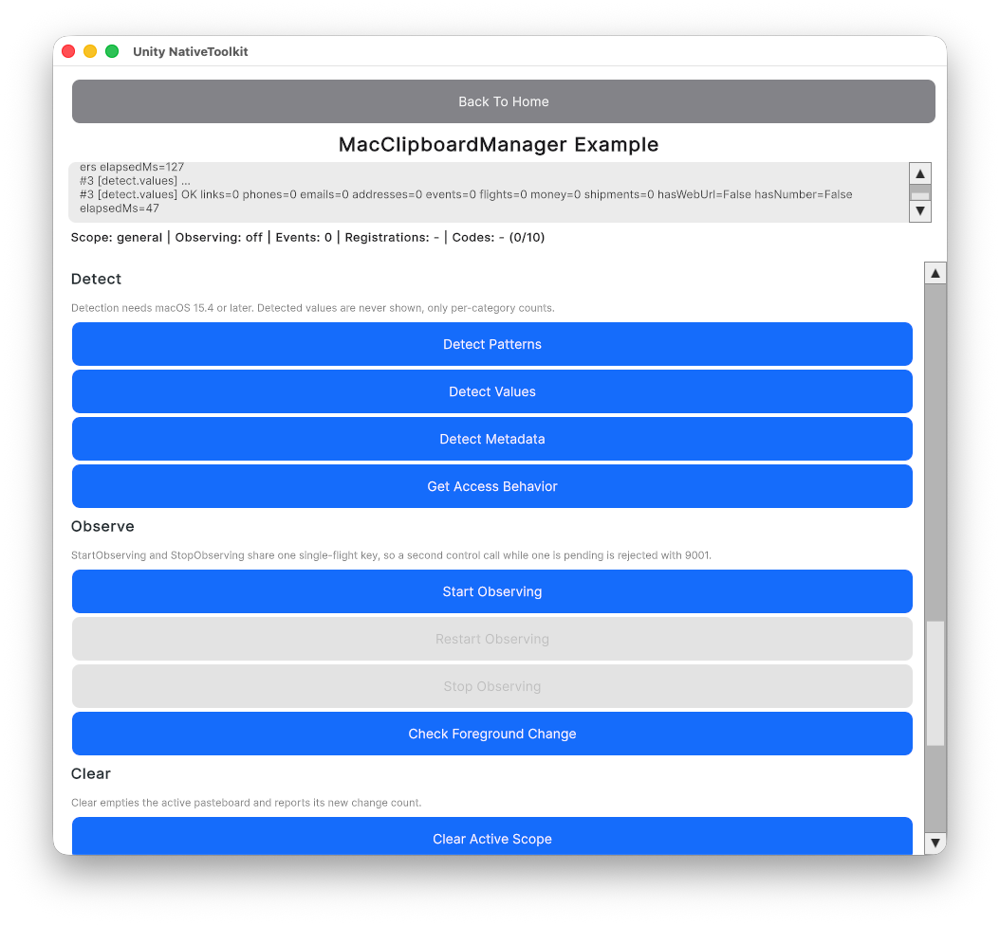
</p>

값을 읽을 때 사용자 허가가 필요할 수 있습니다. 거부되면 `DetectionDenied`(1514)로 실패합니다. 확인한 기기에서는 접근 설정이 `AlwaysAllow`여서 대화상자가 나타나지 않았지만, 일어나지 않는다고 가정하지 말고 1514를 받아도 문제없도록 작성하십시오.

---

### 메타데이터 감지

`DetectMetadata`는 페이로드를 읽지 않고 내용의 종류를 보고합니다.

**일반 텍스트에서는 `DetectionFailed`(1515)로 실패합니다.** 네이티브 계층은 "보고할 것이 없음"과 "보고를 만들지 못함"을 구분할 수 없어, 가장 흔한 일반 텍스트 페이스트보드에서는 항상 실패 경로를 지납니다. 1515는 드러낼 오류가 아니라 "메타데이터 없음"으로 다루십시오.

```csharp
#if UNITY_STANDALONE_OSX || UNITY_EDITOR
MacClipboardManager.Instance.DetectMetadata(_scope, result =>
{
    if (!result.IsSuccess || result.Metadata == null)
    {
        // 일반 텍스트에서는 1515, macOS 15.4 미만에서는 1513.
        return;
    }

    Debug.Log($"contentType: {result.Metadata.ContentTypeIdentifier}");
});
#endif
```

---

### 접근 동작 확인

`GetAccessBehavior`는 다른 앱의 클립보드를 읽는 동작을 시스템이 어떻게 처리하는지 돌려줍니다.

| 값 | 의미 |
| --- | --- |
| `Default` | 시스템 기본값. |
| `Ask` | 사용자에게 확인합니다. |
| `AlwaysAllow` | 확인 없이 읽습니다. |
| `AlwaysDeny` | 읽기가 거부됩니다. |
| `Unavailable` | macOS가 15.4 미만. **실패가 아니라 성공으로 돌아옵니다.** |

```csharp
#if UNITY_STANDALONE_OSX || UNITY_EDITOR
MacClipboardManager.Instance.GetAccessBehavior(_scope, result =>
{
    if (!result.IsSuccess)
    {
        Debug.LogError($"GetAccessBehavior failed: {result.Error?.Code}");
        return;
    }

    if (result.Behavior == MacClipboardAccessBehavior.AlwaysDeny)
    {
        // 실패하게 두지 말고 붙여넣기 버튼을 숨깁니다.
    }
});
#endif
```

<p align="center">
    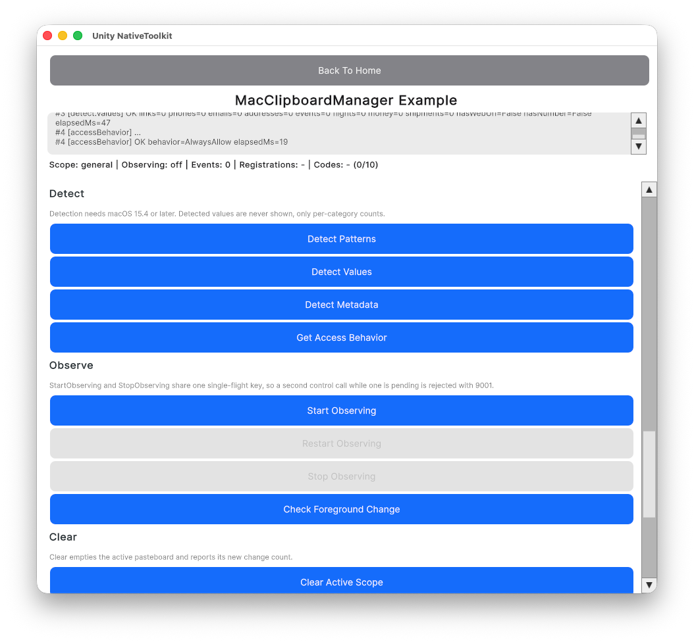
</p>

---

### 변경 감시

`StartObserving`은 페이스트보드를 폴링하다가 changeCount가 움직일 때마다 `onChanged`(그리고 `ClipboardChanged` 이벤트)를 발생시킵니다.

`intervalSeconds`는 `0 < interval <= 60`을 만족해야 합니다. `NaN`을 포함해 범위를 벗어난 값은 `InvalidConfiguration`(1523)으로 실패합니다. 기본값은 0.5초입니다.

```csharp
#if UNITY_STANDALONE_OSX || UNITY_EDITOR
MacClipboardManager.Instance.StartObserving(
    _scope,
    intervalSeconds: 0.5,
    onChanged: change =>
    {
        Debug.Log($"clipboard changed: {change.ChangeCount}");
    },
    onStarted: result =>
    {
        if (!result.IsSuccess)
        {
            Debug.LogError($"StartObserving failed: {result.Error?.Code}");
        }
    });
#endif
```

`StartObserving`을 다시 호출하면 구독이 추가되는 것이 아니라 교체됩니다. 이전 `onChanged`는 더 이상 호출되지 않습니다. `StopObserving`은 멱등입니다.

```csharp
#if UNITY_STANDALONE_OSX || UNITY_EDITOR
MacClipboardManager.Instance.StopObserving(result =>
{
    // 감시하고 있지 않은 상태에서 호출해도 안전합니다.
});
#endif
```

macOS 고유의 동작이 두 가지 있으며, 둘 다 실제 기기에서 확인했습니다.

- **앱이 맨 앞에 있지 않은 동안에는 폴링이 멈추고, 돌아올 때 밀린 만큼 따라잡습니다.** 다른 앱에서 일어난 변경은 그 순간이 아니라 사용자가 돌아왔을 때 보고됩니다.
- **따라잡기는 하나로 합쳐지지 않습니다.** 백그라운드에 있는 동안 세 번 변경되었다면 changeCount 오름차순으로 세 개의 이벤트가 도착합니다. 클립보드 기록 같은 기능에서도 항목을 놓치지 않습니다.

> **참고:** 재시작에 실패해도 이전 감시는 계속 동작합니다. `StartObserving`은 기존 감시를 건드리기 전에 간격을 검증하고 스코프를 해석하므로, 1523으로 실패한 호출은 아무것도 멈추지 않았습니다.

---

### 전면 복귀 시 변경 확인

`CheckForegroundChange`는 폴링을 돌리지 않고 "지난번에 물어본 뒤로 바뀌었는지"에 답합니다. 변경 후 첫 호출은 `true`를 돌려주고 다음 호출은 `false`를 돌려줍니다.

```csharp
#if UNITY_STANDALONE_OSX || UNITY_EDITOR
MacClipboardManager.Instance.CheckForegroundChange(_scope, result =>
{
    if (result.IsSuccess && result.Changed)
    {
        // 붙여넣기 버튼을 갱신합니다.
    }
});
#endif
```

<p align="center">
    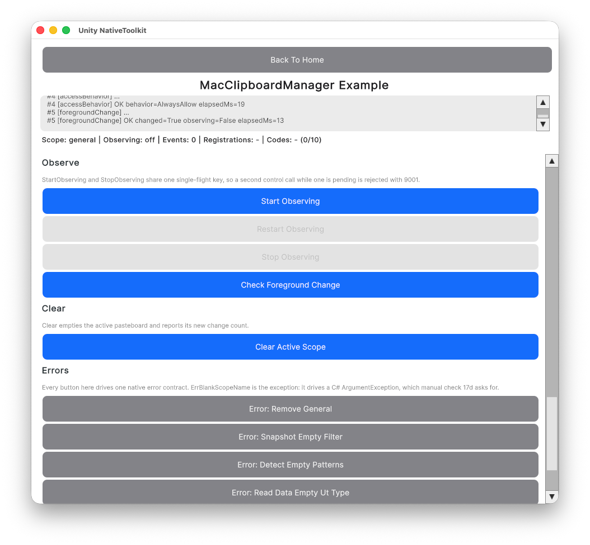
</p>

> **감시와 함께 쓰지 마십시오.** 둘은 같은 기준 changeCount를 공유합니다. `StartObserving`이 도는 동안에는 폴링이 기준을 먼저 갱신하므로 `CheckForegroundChange`는 거의 언제나 `false`를 돌려줍니다. 계속 열려 있는 화면이면 감시를, 필요할 때만 확인하려면 `CheckForegroundChange`를 선택하십시오.

---

### 지우기

`Clear`는 스코프를 비우고 새 changeCount를 돌려줍니다.

```csharp
#if UNITY_STANDALONE_OSX || UNITY_EDITOR
MacClipboardManager.Instance.Clear(_scope, result =>
{
    if (result.IsSuccess)
    {
        Debug.Log($"cleared, changeCount: {result.ChangeCount}");
    }
});
#endif
```

---

### 크기 제한

보내는 쪽과 받는 쪽 모두 32 MiB가 상한입니다.

| 제한 | 상수 | 실패 |
| --- | --- | --- |
| 쓰기 | `MacClipboardLimits.MaxRequestBytes` | `RequestTooLarge`(9007). 네이티브 호출 전에 C#에서 발생합니다. |
| 읽기(표현 단위) | `MacClipboardLimits.MaxResponseBytesPerRepresentation` | `ResponseParseFailed`(9006) |

쓰기 상한은 모든 항목의 모든 표현을 합한 값입니다. 읽기 상한은 표현 하나하나에 적용되므로, 작은 표현이 많아 합계가 32 MiB를 넘어도 읽을 수 있습니다.

**읽기 상한은 다른 앱이 올려둔 내용에 적용되며, 이는 내 앱이 제어할 수 없습니다.** 아주 큰 이미지나 텍스트가 올라와 있으면 `Read`가 9006으로 실패하는데, 이는 실제로 손상된 응답과 같은 코드입니다. `Read`의 9006은 결함이 아니라 "이 페이스트보드는 다룰 수 없음"으로 해석하고, 페이로드를 읽지 않는 `Snapshot`으로 대체하십시오.

#### 큰 단일 항목은 지연 기록됩니다

**단일** 항목이 10 MiB를 넘으면 네이티브 계층은 다른 경로를 지납니다. 페이스트보드에는 타입만 올라가고, 바이트는 읽는 쪽이 요구한 시점에 공급됩니다.

- **따라서 `Copy`의 성공은 붙여넣을 수 있음을 뜻하지 않습니다.** 무언가가 읽기 전에 프로세스가 끝나면 바이트는 사라집니다.
- **한 번이라도 붙여넣어졌다면 바이트가 실체화되어 프로세스 종료 후에도 남습니다.**
- 발동 조건은 "항목이 하나**이고** 10 MiB 초과"입니다. 항목이 여러 개면 합계 크기와 상관없이 일반 경로를 지납니다.

큰 페이로드를 앱 종료 후에도 남겨야 한다면 두 개의 항목으로 나누십시오.

---

### App Sandbox

클립보드는 `com.apple.security.app-sandbox` 외의 entitlement를 필요로 하지 않습니다. App Sandbox를 켠 상태에서도 복사, 읽기, 이름 있는 페이스트보드와 고유 페이스트보드의 생성 및 해제가 모두 동작합니다. Mac App Store용 빌드에서도 못 쓰게 되는 작업은 없습니다.

클립보드와는 무관하지만 알아둘 만한 함정이 하나 있습니다. **샌드박스에서 실행되는 플레이어는 컨테이너 밖에 쓸 수 없습니다.** `-logFile /tmp/player.log`를 넘기면 플레이어가 시작 시 `Unable to open log file, exiting.`를 남기고 종료합니다. `~/Library/Containers/<bundle id>/Data/` 아래 경로를 사용하십시오. 세이브 파일처럼 절대 경로로 내보내는 모든 출력에 같은 이야기가 적용됩니다.

---

### 이벤트 수신

모든 작업은 콜백과 별개로 이벤트도 발생시킵니다. 이벤트는 로그나 공용 UI에 적합하지만 특정 호출과 연결할 수는 없습니다.

```csharp
#if UNITY_STANDALONE_OSX || UNITY_EDITOR
private void OnEnable()
{
    MacClipboardManager.Instance.OwnershipChanged += OnOwnershipChanged;
    MacClipboardManager.Instance.ReadCompleted += OnReadCompleted;
    MacClipboardManager.Instance.ClipboardChanged += OnClipboardChanged;
}

private void OnDisable()
{
    MacClipboardManager.Instance.OwnershipChanged -= OnOwnershipChanged;
    MacClipboardManager.Instance.ReadCompleted -= OnReadCompleted;
    MacClipboardManager.Instance.ClipboardChanged -= OnClipboardChanged;
}

private void OnOwnershipChanged(MacClipboardOwnershipResult result)
{
    Debug.Log($"{result.Operation}: {result.IsSuccess}");
}

private void OnReadCompleted(MacClipboardReadResult result) { }

private void OnClipboardChanged(MacClipboardChangeEvent change)
{
    Debug.Log($"changeCount: {change.ChangeCount}");
}
#endif
```

구독은 `OnDisable`에서 해제하십시오. 매니저는 개별 씬보다 오래 살아남으므로, 해제를 잊으면 파기된 오브젝트가 계속 살아 있게 됩니다.

---

### 오류 처리

실패는 모두 예외가 아니라 결과로 돌아옵니다. 유일한 예외가 `MacPasteboardScope.Named("")` 같은 경우로, 빈 이름에 대해 `ArgumentException`을 던집니다.

| 코드 | 상수 | 발생 조건 |
| --- | --- | --- |
| 1301 | `ParseFailed` | 네이티브 계층이 요청을 해석하지 못했습니다. |
| 1302 | `ContractViolation` | 빈 `utType`처럼 필수 네이티브 인자가 비었습니다. |
| 1501 | `EmptyContent` | 내용에 항목이 없었습니다. |
| 1502 | `EmptyRepresentations` | 항목에 표현이 없었습니다. |
| 1503 | `EmptyDetectionPatterns` | 빈 패턴 컬렉션을 넘겼습니다. |
| 1504 | `InvalidTypeIdentifier` | uniform type identifier가 거부되었습니다. |
| 1505 | `InvalidPasteboardName` | 페이스트보드 이름이 거부되었습니다. |
| 1506 | `ContentTooLarge` | 네이티브 계층이 페이로드 크기를 거부했습니다. |
| 1507 | `PasteboardUnavailable` | 페이스트보드를 읽지 못했습니다. |
| 1508 | `CannotReleaseStandardPasteboard` | `general`, `font`, `ruler`, `find`, `drag`를 `RemovePasteboard`에 넘겼습니다. |
| 1509 | `WriteRejected` | 쓰기가 거부되었습니다. |
| 1510 | `AppendRejected` | 추가가 거부되었습니다. |
| 1511 | `OwnershipLost` | 추가 전에 다른 앱이 페이스트보드를 가져갔습니다. |
| 1512 | `EmptyTypeFilter` | `Snapshot`에 빈 배열을 넘겼습니다. |
| 1513 | `DetectionUnavailable` | macOS가 15.4 미만입니다. |
| 1514 | `DetectionDenied` | 사용자가 읽기를 거부했습니다. |
| 1515 | `DetectionFailed` | 감지가 아무것도 만들지 못했습니다. 일반 텍스트의 메타데이터를 포함합니다. |
| 1523 | `InvalidConfiguration` | 감시 간격이 `0 < interval <= 60` 범위를 벗어났습니다. |
| 1599 | `Unknown` | 분류되지 않은 네이티브 실패. |
| 9001 | `Busy` | 같은 작업이 이미 실행 중입니다. |
| 9002 | `BridgeUnavailable` | 에디터 또는 대상 외 플랫폼에서 호출했습니다. |
| 9003 | `MainThreadRequired` | Unity 메인 스레드가 아닌 곳에서 호출했습니다. |
| 9004 | `ManagerDestroyed` | 매니저가 파기되었습니다. |
| 9005 | `InvalidRequest` | 필수 인자가 null이었습니다. |
| 9006 | `ResponseParseFailed` | 응답을 해석하지 못했습니다. 32 MiB를 넘는 표현을 포함합니다. |
| 9007 | `RequestTooLarge` | 페이로드가 32 MiB를 넘었습니다. |

```csharp
#if UNITY_STANDALONE_OSX || UNITY_EDITOR
MacClipboardManager.Instance.Read(_scope, result =>
{
    if (result.IsSuccess)
    {
        return;
    }

    switch (result.Error?.Code)
    {
        case MacClipboardErrorCodes.ResponseParseFailed:
            // 읽을 수 없을 만큼 큰 페이스트보드를 포함합니다. Snapshot으로 대체합니다.
            break;
        case MacClipboardErrorCodes.Busy:
            // 이미 Read가 실행 중입니다. 이 호출은 무시합니다.
            break;
        default:
            Debug.LogError($"Read failed: {result.Error?.Code}");
            break;
    }
});
#endif
```

> **참고:** `Error.Message`는 네이티브 계층이 만든 문자열이며 페이스트보드 이름을 담을 수 있습니다. 사용자에게 보일 수 있는 곳에서는 원문 메시지 대신 `Code`와 직접 작성한 문구를 출력하십시오.

---

## Windows

### 설정

#### 네임스페이스 가져오기

`WindowsClipboardManager`는 Windows 스탠드얼론 빌드 타깃이 선택되어 있으면 에디터에서도 컴파일됩니다. 에디터에서 호출해도 크래시하지 않습니다. 네이티브 계층이 필요한 작업은 즉시 `PlatformUnavailable`(1000) 실패를 반환하므로, 에디터에서도 실행되는 씬에 같은 코드를 그대로 둘 수 있습니다.

```csharp
#if UNITY_STANDALONE_WIN || UNITY_EDITOR
using JonghyunKim.NativeToolkit.Runtime.Clipboard;
#endif
```

클립보드 기록에는 Windows 10 October 2018 Update 이상이 필요하며, 사용자가 기능을 켜 두어야 합니다. 켜져 있다고 가정하지 않고 질의합니다. [클립보드 기록](#클립보드-기록)을 참고하세요.

#### 무엇보다 먼저 Initialize

`Initialize`를 실행하기 전에는 아무것도 동작하지 않습니다. 그 전에는 다른 모든 API가 `NotInitialized`(2)를 반환합니다.

```csharp
WindowsClipboardResult result = WindowsClipboardManager.Instance.Initialize();
if (!result.IsSuccess)
{
    Debug.LogError($"Initialize failed: {result.ErrorCode} {result.ErrorMessage}");
}
```

`Initialize`는 `enableChangeEvents`(기본값 `true`)를 받습니다. `false`를 넘기면 변경 리스너를 등록하지 않고 초기화하므로, `ClipboardChanged`가 필요 없다면 이쪽이 가볍습니다. `Initialize`는 멱등이며, 이미 실행 중인 매니저에 다시 호출하면 네이티브 계층을 건드리지 않고 성공을 반환합니다.

#### 동기 반환값, 콜백, 이벤트

이 지점이 다른 플랫폼과 다릅니다. 대부분의 작업은 **결과를 동기적으로 반환**하면서, 호출별 선택 콜백도 받고, 이벤트도 발생시킵니다.

```csharp
WindowsClipboardResult returned = WindowsClipboardManager.Instance.CopyPlainText(
    "hello", onResult: r => Debug.Log($"callback: {r.IsSuccess}"));
```

기록 관련 작업만 예외입니다. 이쪽은 실제로 비동기이며, 결과 대신 `uint` 요청 ID를 반환하고 콜백과 이벤트로 결과를 전달합니다.

| 메서드 | 반환값 | 콜백 결과 타입 | 이벤트 |
| --- | --- | --- | --- |
| `Initialize`, `Clear`, `CopyPlainText`, `CopyHtml`, `CopyFiles`, `CopyImage`, `CopyCustomFormat`, `CopyMultipleFormats`, `CancelRequest`, `SetHistoryEventsEnabled`, `ReserveDeferredFormats`, `RecoverDeferredState`, `TryShutdown` | `WindowsClipboardResult` | `WindowsClipboardResult` | `ClipboardOperationCompleted` |
| `ShutdownWithDrain` | `void` | `WindowsClipboardResult` | `ClipboardOperationCompleted` |
| `CanShutdownNow` | `WindowsClipboardFlagResult` | `WindowsClipboardFlagResult` | `FlagChecked` |
| `PastePlainText`, `PasteHtml`, `GetPreferredFormat` | `WindowsClipboardTextResult` | `WindowsClipboardTextResult` | `TextReadCompleted` |
| `PasteFiles`, `GetFormats` | `WindowsClipboardStringListResult` | `WindowsClipboardStringListResult` | `StringListReadCompleted` |
| `PasteImage`, `PasteCustomFormat` | `WindowsClipboardBytesResult` | `WindowsClipboardBytesResult` | `BytesReadCompleted` |
| `HasFormat` | `WindowsClipboardFormatPresenceResult` | `WindowsClipboardFormatPresenceResult` | `FormatPresenceChecked` |
| `GetHistory` | `uint` 요청 ID | `WindowsClipboardHistoryResult` | `HistoryReadCompleted` |
| `GetHistoryAvailability` | `uint` 요청 ID | `WindowsClipboardAvailabilityResult` | `HistoryAvailabilityChecked` |
| `RestoreHistoryItem`, `DeleteHistoryItem`, `ClearUnpinnedHistory` | `uint` 요청 ID | `WindowsClipboardResult` | `ClipboardOperationCompleted` |

모든 결과 타입은 `IsSuccess` / `Operation` / `ErrorCode`(`WindowsClipboardErrorCode`) / `ErrorMessage`를 제공합니다. 이벤트는 요청 ID를 싣지 않으므로, 특정 요청과 결과를 맞춰야 할 때는 호출별 콜백을 쓰고 이벤트는 로깅이나 공용 UI에만 사용하세요.

콜백과 이벤트는 메서드가 반환된 뒤 **호출자의 스택 바깥에서** 발생합니다. 다음 줄에서 콜백이 이미 실행되었다고 가정하지 마세요.

#### 메인 스레드 전용

모든 공개 API는 Unity 메인 스레드에서 호출해야 합니다. 다른 스레드에서의 호출은 `MainThreadRequired`(1002)로 거부되며 네이티브 계층에 도달하지 않습니다.

```csharp
await Task.Run(() =>
{
    // MainThreadRequired가 반환됩니다. 예외를 던지지 않고 클립보드도 건드리지 않습니다.
    WindowsClipboardResult result = WindowsClipboardManager.Instance.CopyPlainText("from a worker");
});
```

#### 매니저의 수명과 종료

`WindowsClipboardManager.Instance`는 최초 접근 시 매니저를 생성하며 씬 전환을 넘어 유지됩니다. 클립보드는 다른 프로세스가 점유할 수 있으므로 종료 경로가 두 가지입니다.

```csharp
// 진행 중인 요청이 없을 때만 완료됩니다. 완료 여부는 completed가 알려 줍니다.
WindowsClipboardResult immediate = WindowsClipboardManager.Instance.TryShutdown(out bool completed);

// 진행 중인 요청을 취소하고 이후 프레임에 걸쳐 완료합니다.
WindowsClipboardManager.Instance.ShutdownWithDrain(result =>
    Debug.Log($"shutdown: {result.IsSuccess} {result.ErrorCode}"));
```

`CanShutdownNow`는 같은 질문을 실행하지 않고 묻습니다. 드레인이 도는 동안의 `Initialize`는 `ShuttingDown`(1011)으로 거부됩니다. 매니저가 파기된 뒤에는 `WindowsClipboardManager.IsTerminated`가 `true`가 되고 모든 API가 거부됩니다.

---

### 일반 텍스트 복사

```csharp
#if UNITY_STANDALONE_WIN && !UNITY_EDITOR
WindowsClipboardResult result = WindowsClipboardManager.Instance.CopyPlainText(
    "NativeToolkit clipboard sample 1");

if (!result.IsSuccess)
{
    Debug.LogError($"CopyPlainText failed: {result.ErrorCode} {result.ErrorMessage}");
}
#endif
```

빈 문자열은 정당한 클립보드 내용이며 그대로 기록됩니다. `null`은 `InvalidArgument`(1005)로 거부됩니다.

### HTML 텍스트 복사

`CopyHtml`은 `HTML Format`을 기록하고, `plainText`가 null이 아니면 일반 텍스트도 함께 기록합니다. HTML을 다루지 못하는 애플리케이션도 무언가를 받을 수 있게 하기 위해서입니다.

```csharp
#if UNITY_STANDALONE_WIN && !UNITY_EDITOR
WindowsClipboardResult result = WindowsClipboardManager.Instance.CopyHtml(
    "<b>Hello</b> from NativeToolkit",
    "Hello from NativeToolkit");
#endif
```

`plainText`에 `null`을 넘기면 HTML만 기록합니다. 텍스트만 요청하는 쪽에서는 클립보드가 비어 보입니다.

### 파일 복사

```csharp
#if UNITY_STANDALONE_WIN && !UNITY_EDITOR
// 이미 디스크에 존재하는 파일의 절대 경로.
string[] paths = { firstExportPath, secondExportPath };

WindowsClipboardResult result = WindowsClipboardManager.Instance.CopyFiles(paths);
#endif
```

경로는 `CF_HDROP`으로 기록됩니다. 파일 탐색기가 붙여넣는 것과 같은 형식입니다. 절대 경로여야 하며 상대 경로를 대신 해석해 주지 않습니다. 빈 목록은 `InvalidArgument`(1005)로 거부됩니다.

### 이미지 복사

`CopyImage`는 장치 독립 비트맵(`CF_DIB`)을 원시 바이트로 받습니다. `BITMAPINFOHEADER` 뒤에 픽셀 데이터가 오는 형태이며, `.bmp` 파일 앞의 14바이트 `BITMAPFILEHEADER`는 포함하지 않습니다.

```csharp
#if UNITY_STANDALONE_WIN && !UNITY_EDITOR
byte[] dib = BuildDib();   // BITMAPINFOHEADER + BGRA 픽셀
WindowsClipboardResult result = WindowsClipboardManager.Instance.CopyImage(dib);
#endif
```

### 커스텀 포맷 복사

커스텀 포맷은 이름으로 등록합니다. 같은 이름을 아는 애플리케이션이라면 바이트를 다시 읽을 수 있습니다.

```csharp
#if UNITY_STANDALONE_WIN && !UNITY_EDITOR
byte[] payload = Encoding.UTF8.GetBytes("native-toolkit-sample-payload");

WindowsClipboardResult result = WindowsClipboardManager.Instance.CopyCustomFormat(
    "NativeToolkitSample", payload);
#endif
```

공백인 포맷 이름은 `InvalidArgument`(1005)로 거부됩니다.

### 다중 포맷 복사

한 번의 쓰기로 여러 포맷을 함께 실을 수 있습니다. 붙여넣는 쪽이 이해할 수 있는 가장 풍부한 형식을 고를 수 있는 이유입니다.

```csharp
#if UNITY_STANDALONE_WIN && !UNITY_EDITOR
var items = new List<WindowsClipboardFormatPayload>
{
    WindowsClipboardFormatPayload.Text("CF_UNICODETEXT", "NativeToolkit clipboard sample 1"),
    WindowsClipboardFormatPayload.Bytes("NativeToolkitSample", payload),
};

WindowsClipboardResult result = WindowsClipboardManager.Instance.CopyMultipleFormats(items);
#endif
```

같은 포맷 이름을 두 번 지정하면 `InvalidArgument`(1005)로 거부됩니다. 빈 목록도 마찬가지입니다.

### 복사 옵션

모든 복사 메서드는 `WindowsClipboardWriteOptions`를 받습니다. 내용이 원래 도달할 곳에 도달하지 않도록 Windows에 요청하는 값입니다.

| 옵션 | 효과 |
| --- | --- |
| `None` | 기본 배치 |
| `ExcludeHistory` | 클립보드 기록(Win+V)에 남기지 않음 |
| `ExcludeRoaming` | 클라우드 클립보드에 올리지 않음 |
| `Sensitive` | 둘 다. 비밀번호 같은 내용에 사용 |

```csharp
#if UNITY_STANDALONE_WIN && !UNITY_EDITOR
WindowsClipboardManager.Instance.CopyPlainText(
    userPassword, WindowsClipboardWriteOptions.Sensitive);
#endif
```

> **참고:** 이들은 운영체제가 존중하는 표식입니다. 기록이나 클라우드 클립보드의 활성화 여부와 무관하게 복사 자체는 성공하며, **표식이 실제로 적용되었음을 알려 주는 결과 필드는 없습니다.**

---

### 일반 텍스트 붙여넣기

```csharp
#if UNITY_STANDALONE_WIN && !UNITY_EDITOR
WindowsClipboardTextResult result = WindowsClipboardManager.Instance.PastePlainText();

if (result.IsSuccess && !result.IsEmpty)
{
    Debug.Log($"pasted {result.Text.Length} characters");
}
#endif
```

**빈 클립보드는 실패가 아니라 성공한 읽기입니다.** `IsSuccess`는 `true`, `IsEmpty`는 `true`, `Text`는 null입니다. 빈 문자열이 올려져 있는 상태(`IsEmpty`가 `false`, `Text`가 `""`)와는 다른 상태입니다. 둘을 모두 "아무것도 없음"으로 다루면 이 차이가 사라집니다.

### HTML 텍스트 붙여넣기

```csharp
#if UNITY_STANDALONE_WIN && !UNITY_EDITOR
WindowsClipboardTextResult result = WindowsClipboardManager.Instance.PasteHtml();
#endif
```

`HTML Format`의 내용을 반환합니다. 일반 텍스트만 올려져 있는 클립보드는 실패가 아니라 비어 있는 것으로 읽힙니다.

### 파일 붙여넣기

```csharp
#if UNITY_STANDALONE_WIN && !UNITY_EDITOR
WindowsClipboardStringListResult result = WindowsClipboardManager.Instance.PasteFiles();

if (result.IsSuccess)
{
    foreach (string path in result.Values)
    {
        Debug.Log(path);
    }
}
#endif
```

### 이미지 붙여넣기

```csharp
#if UNITY_STANDALONE_WIN && !UNITY_EDITOR
WindowsClipboardBytesResult result = WindowsClipboardManager.Instance.PasteImage();

if (result.IsSuccess && !result.IsEmpty)
{
    Debug.Log($"{result.Data.Length} bytes of DIB");
}
#endif
```

바이트는 `CopyImage`가 받는 것과 같은 `CF_DIB` 형태로 돌아옵니다. `BITMAPFILEHEADER`는 포함되지 않습니다.

### 커스텀 포맷 붙여넣기

```csharp
#if UNITY_STANDALONE_WIN && !UNITY_EDITOR
WindowsClipboardBytesResult result =
    WindowsClipboardManager.Instance.PasteCustomFormat("NativeToolkitSample");
#endif
```

어떤 애플리케이션도 올리지 않은 포맷 이름은 실패가 아니라 비어 있는 성공으로 읽힙니다.

---

### 클립보드 내용 살펴보기

클립보드를 가져오지 않고 무엇이 올려져 있는지 답하는 작업이 셋 있습니다.

```csharp
#if UNITY_STANDALONE_WIN && !UNITY_EDITOR
WindowsClipboardStringListResult formats = WindowsClipboardManager.Instance.GetFormats();
Debug.Log($"{formats.Values.Count} formats available");
#endif
```

<p align="center">
    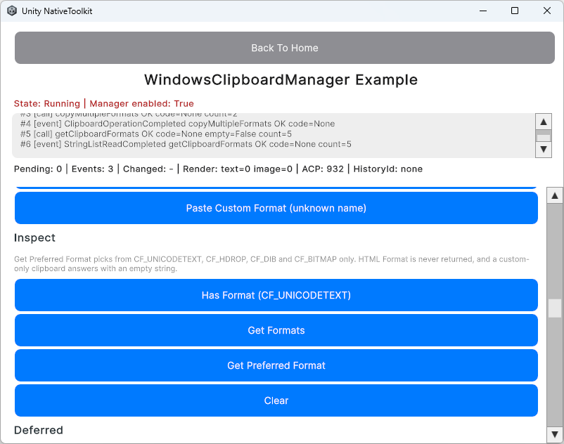
</p>

`GetPreferredFormat`은 붙여넣는 쪽이 보통 고를 포맷의 이름을 반환합니다.

```csharp
#if UNITY_STANDALONE_WIN && !UNITY_EDITOR
WindowsClipboardTextResult preferred = WindowsClipboardManager.Instance.GetPreferredFormat();
#endif
```

<p align="center">
    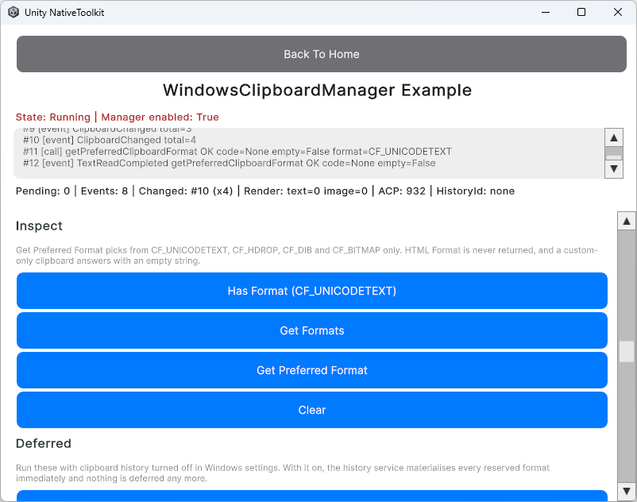
</p>

빈 클립보드에서는 `Empty` 오류가 아니라 빈 문자열이 반환됩니다.

`HasFormat`은 이름 하나를 지정해 존재 여부를 답합니다.

```csharp
#if UNITY_STANDALONE_WIN && !UNITY_EDITOR
WindowsClipboardFormatPresenceResult presence =
    WindowsClipboardManager.Instance.HasFormat("CF_UNICODETEXT");

Debug.Log($"present: {presence.Value}");
#endif
```

`Value`는 `IsSuccess`와 독립입니다. 존재하지 않는 포맷을 정상적으로 확인했다면 `IsSuccess == true`이면서 `Value == false`입니다.

---

### 지연 렌더링

큰 내용을 복사 시점에 만들 필요는 없습니다. `ReserveDeferredFormats`는 포맷을 예약하고 포맷별 공급자를 Windows에 넘깁니다. 공급자는 실제로 그 포맷이 요청될 때만 실행됩니다.

```csharp
#if UNITY_STANDALONE_WIN && !UNITY_EDITOR
var providers = new Dictionary<string, Func<byte[]>>
{
    ["CF_UNICODETEXT"] = () => Encoding.Unicode.GetBytes(BuildLargeText()),
    ["CF_DIB"] = () => BuildScreenshotDib(),
};

WindowsClipboardResult result =
    WindowsClipboardManager.Instance.ReserveDeferredFormats(providers);
#endif
```

성립 여부는 두 가지 규칙이 정합니다.

- **공급자는 Unity API를 전혀 건드리면 안 됩니다.** Unity가 소유하지 않는 스레드에서 호출될 수 있고, 매니저의 종료 처리 중에도 호출됩니다. 미리 확보해 둔 데이터로 바이트를 만드세요.
- **공급자는 포맷당 최대 한 번만 호출됩니다.** Windows는 크기를 먼저, 내용을 나중에 요청하지만 매니저가 첫 답을 캐시하므로 두 번 실행되지 않습니다.

예약이 절반만 적용된 채 남으면 `RecoverDeferredState`가 해소합니다. 종료 드레인이 알아서 호출하므로, 예약이 실패해 클립보드를 즉시 다시 쓸 수 있게 해야 할 때만 직접 호출하세요.

---

### 클립보드 기록

기록은 Win+V 목록입니다. 사용자가 끌 수 있는 Windows 기능이므로 **모든 기록 작업이 "사용할 수 없음"을 반환할 수 있습니다.**

#### 사용 가능 여부

```csharp
#if UNITY_STANDALONE_WIN && !UNITY_EDITOR
WindowsClipboardManager.Instance.GetHistoryAvailability(result =>
{
    if (!result.IsSuccess) return;
    Debug.Log($"history: {result.HistoryEnabled}, cloud: {result.RoamingEnabled}");
});
#endif
```

<p align="center">
    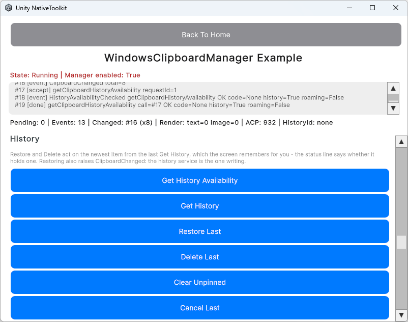
</p>

#### 읽기

```csharp
#if UNITY_STANDALONE_WIN && !UNITY_EDITOR
uint requestId = WindowsClipboardManager.Instance.GetHistory(result =>
{
    if (result.ErrorCode == WindowsClipboardErrorCode.HistoryDisabled)
    {
        Debug.Log("the user has clipboard history turned off");
        return;
    }

    foreach (WindowsClipboardHistoryItem item in result.Items)
    {
        Debug.Log($"{item.Id}: {item.Text?.Length ?? 0} characters");
    }
});
#endif
```

<p align="center">
    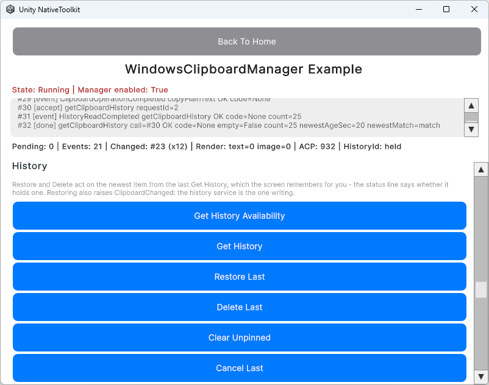
</p>

반환되는 `requestId`는 `CancelRequest`가 받는 값입니다. 항목은 최신순으로 정렬되며, 각 항목은 복원과 삭제에 쓰이는 `Id`를 가집니다.

#### 복원, 삭제, 비우기

```csharp
#if UNITY_STANDALONE_WIN && !UNITY_EDITOR
WindowsClipboardManager.Instance.RestoreHistoryItem(itemId, result =>
    Debug.Log($"restore: {result.IsSuccess} {result.ErrorCode}"));

WindowsClipboardManager.Instance.DeleteHistoryItem(itemId, result =>
    Debug.Log($"delete: {result.IsSuccess} {result.ErrorCode}"));

WindowsClipboardManager.Instance.ClearUnpinnedHistory(result =>
    Debug.Log($"clear: {result.IsSuccess} {result.ErrorCode}"));
#endif
```

복원은 해당 항목을 현재 클립보드 내용으로 다시 올립니다. 이미 없는 ID는 `ItemDeleted`(11), 공백인 ID는 `InvalidArgument`(1005)가 됩니다.

**복원에는 포그라운드 창이 필요합니다.** 백그라운드 애플리케이션에 대해 Windows는 `NotForeground`(17)로 거부하므로, 호출 시점에 게임 창이 앞에 있어야 합니다.

#### 요청 취소

```csharp
#if UNITY_STANDALONE_WIN && !UNITY_EDITOR
uint requestId = WindowsClipboardManager.Instance.GetHistory(HandleHistory);
WindowsClipboardManager.Instance.CancelRequest(requestId);
#endif
```

취소된 요청도 완료는 됩니다. 결과는 `Canceled`(15)입니다. 이미 끝난 ID를 취소하려 하면 `InvalidArgument`(1005)로 거부됩니다.

#### 기록 이벤트

`HistoryChanged` / `HistoryEnabledChanged` / `RoamingEnabledChanged`는 요청하기 전까지 발생하지 않습니다.

```csharp
#if UNITY_STANDALONE_WIN && !UNITY_EDITOR
WindowsClipboardManager.Instance.SetHistoryEventsEnabled(true);
#endif
```

> **참고:** Windows의 기록 설정을 바꾸기 전에 이들을 꺼 두세요. 중지에 실패하면 `MonitorRegisterFailed`(12)가 고착되어, 매니저를 다시 초기화하기 전까지 이후의 모든 시작이 거부됩니다.

---

### Await 버전

기록 관련 다섯 작업에는 `Awaitable` 버전도 있습니다. 처리를 한 줄기로 쓰고 싶을 때 사용합니다.

```csharp
#if UNITY_STANDALONE_WIN && !UNITY_EDITOR
WindowsClipboardHistoryResult result =
    await WindowsClipboardManager.Instance.GetHistoryAsync(destroyCancellationToken);

if (result.ErrorCode == WindowsClipboardErrorCode.Canceled) return;

Debug.Log($"{result.Items.Count} items");
#endif
```

**취소는 예외를 던지지 않습니다.** `OperationCanceledException` 대신 `ErrorCode == Canceled`로 await가 완료되므로 무슨 일이 있어도 결과 타입은 같습니다. `Canceled`를 확인하고 일찍 return하세요. 취소된 호출 뒤에서 연속 작업이 돌면 파기된 `VisualElement`를 건드릴 수 있습니다. 컴파일은 통과하고 런타임에 실패합니다.

---

### 이벤트 수신

```csharp
#if UNITY_STANDALONE_WIN && !UNITY_EDITOR
private void OnEnable()
{
    WindowsClipboardManager manager = WindowsClipboardManager.Instance;
    manager.ClipboardOperationCompleted += OnOperationCompleted;
    manager.TextReadCompleted += OnTextRead;
    manager.ClipboardChanged += OnClipboardChanged;
}

private void OnDisable()
{
    if (WindowsClipboardManager.IsTerminated) return;

    WindowsClipboardManager manager = WindowsClipboardManager.Instance;
    manager.ClipboardOperationCompleted -= OnOperationCompleted;
    manager.TextReadCompleted -= OnTextRead;
    manager.ClipboardChanged -= OnClipboardChanged;
}

private void OnClipboardChanged() => Debug.Log("the clipboard content changed");
#endif
```

`ClipboardChanged`는 다른 애플리케이션의 쓰기뿐 아니라 **자기 자신의 쓰기에도 발생합니다.** 받아서 다시 복사하는 핸들러는 반복됩니다.

`IsTerminated` 확인은 종료 시점에 의미가 있습니다. `Instance`는 매니저가 없으면 생성하는데, 매니저는 씬 오브젝트보다 먼저 파기되므로, 확인 없는 정리는 구독 해제만을 위해 마지막 오브젝트를 하나 더 만들어 버립니다.

---

### 비우기

```csharp
#if UNITY_STANDALONE_WIN && !UNITY_EDITOR
WindowsClipboardResult result = WindowsClipboardManager.Instance.Clear();
#endif
```

모든 포맷을 한 번에 비웁니다. 이후의 읽기는 비어 있는 성공이 됩니다.

---

### 오류 처리 (Windows)

`ErrorCode`는 `WindowsClipboardErrorCode`입니다. 호출하는 쪽에서 보통 다루는 값은 다음과 같습니다.

| 코드 | 값 | 의미 |
| --- | --- | --- |
| `NotInitialized` | 2 | `Initialize`가 실행되지 않음 |
| `Busy` | 3 | 다른 애플리케이션이 클립보드를 점유 중. 재시도로 통과하는 경우가 많음 |
| `FormatUnavailable` | 5 | 요청한 포맷이 클립보드에 없음 |
| `AccessDenied` | 9 | Windows가 이 프로세스에 클립보드를 허용하지 않음 |
| `HistoryDisabled` | 10 | 사용자가 클립보드 기록을 꺼 둠 |
| `ItemDeleted` | 11 | 대상 기록 항목이 이미 없음 |
| `Canceled` | 15 | `CancelRequest` 또는 취소된 `Awaitable` |
| `NotForeground` | 17 | 복원에는 애플리케이션이 앞에 있어야 함 |
| `PlatformUnavailable` | 1000 | 에디터 실행 또는 다른 플랫폼 |
| `MainThreadRequired` | 1002 | Unity 메인 스레드가 아닌 곳에서 호출됨 |
| `InvalidArgument` | 1005 | null 텍스트, 빈 목록, 공백 이름, 중복 포맷 |
| `ShuttingDown` | 1011 | 종료 드레인이 진행 중 |

**실패해도 예외를 던지지 않습니다.** 모든 작업이 결과 타입으로 보고하므로, 클립보드 코드를 `try/catch`로 감싸도 클립보드에서 비롯된 것은 아무것도 잡히지 않습니다.

> **참고:** `ErrorMessage`는 진단용으로 조립된 문자열이며 포맷 이름이나 경로를 포함할 수 있습니다. 사용자에게 보이는 곳에 노출될 가능성이 있다면 원문 대신 `ErrorCode`와 자체 문구를 기록하세요.
