# 알림 기능

언어:

- 한국어（이 페이지）
- English: [notification.md](notification.md)
- 日本語: [notification.ja.md](notification.ja.md)

← [매뉴얼 상단으로 돌아가기](index.ko.md)

---

## 목차

- [Android](#android)
  - [설정](#설정)
  - [권한](#권한)
  - [채널 관리](#채널-관리)
  - [기본 알림 작업](#기본-알림-작업)
  - [알림 스타일](#알림-스타일)
  - [커스텀 뷰 스타일](#커스텀-뷰-스타일)
  - [인터랙션](#인터랙션)
  - [진행 알림](#진행-알림)
  - [포그라운드 서비스 알림](#포그라운드-서비스-알림)
  - [예약 알림](#예약-알림)
- [iOS](#ios)
  - [개요](#개요)
  - [지원 기능](#지원-기능)
    - [기본 설정](#기본-설정)
    - [즉시 알림 표시](#즉시-알림-표시)
    - [앱 아이콘 첨부 즉시 알림](#앱-아이콘-첨부-즉시-알림)
    - [예약 알림 등록](#예약-알림-등록)
    - [카테고리와 액션 등록](#카테고리와-액션-등록)
    - [이벤트 수신](#이벤트-수신)
- [Windows](#windows)
  - [설정](#설정-1)
  - [초기화](#초기화)
  - [알림 표시](#알림-표시)
  - [예약 알림](#예약-알림-2)
  - [진행률 업데이트](#진행률-업데이트)
  - [알림 제거](#알림-제거)
  - [쿼리](#쿼리-1)
  - [이벤트 수신](#이벤트-수신-1)
- [macOS](#macos)
  - [지원 기능](#지원-기능-1)
  - [기본 설정](#기본-설정-1)
  - [권한](#권한-1)
  - [알림 표시](#알림-표시)
  - [업데이트, 취소 및 삭제](#업데이트-취소-및-삭제)
  - [예약 알림](#예약-알림-1)
  - [조회](#조회)
  - [배지](#배지)
  - [카테고리와 액션](#카테고리와-액션)
  - [이벤트 수신](#이벤트-수신-1)

---

## Android

### 설정

#### AndroidManifest.xml

사용할 기능에 필요한 권한을 추가합니다.

```xml
<!-- Android 13 이상에서 알림 전송에 필요 -->
<uses-permission android:name="android.permission.POST_NOTIFICATIONS" />

<!-- 예약 알림(정확한 알람)에 필요 -->
<uses-permission android:name="android.permission.SCHEDULE_EXACT_ALARM" />
<uses-permission android:name="android.permission.RECEIVE_BOOT_COMPLETED" />

<!-- 포그라운드 서비스에 필요 -->
<uses-permission android:name="android.permission.FOREGROUND_SERVICE" />
<uses-permission android:name="android.permission.FOREGROUND_SERVICE_DATA_SYNC" />
```

#### 네임스페이스 임포트

```csharp
// 가드: Android (Player)만. Editor에서는 네이티브 호출을 피합니다.
#if UNITY_ANDROID && !UNITY_EDITOR
using JonghyunKim.NativeToolkit.Runtime.Notification;
#endif
```

> **참고:** `ChannelPayload`, `NotificationPayload`, `AndroidNotificationJsonBuilder` 는 런타임 패키지에 포함되어 있습니다. optional 필드와 `data` 를 포함한 spec 정합 JSON 이 필요하면 `JsonUtility.ToJson(...)` 대신 `AndroidNotificationJsonBuilder` 를 사용하세요.

---

### 권한

```csharp
#if UNITY_ANDROID && !UNITY_EDITOR
// 알림 권한이 부여되었는지 (Android 13+)
bool hasPermission = AndroidNotificationManager.Instance.HasPermission();

// 앱 알림이 활성화되었는지
bool enabled = AndroidNotificationManager.Instance.AreNotificationsEnabled();

// 정확한 알람 예약이 허용되었는지 (Android 12+)
bool canSchedule = AndroidNotificationManager.Instance.CanScheduleExactAlarms();

// POST_NOTIFICATIONS 권한 요청 (Android 13+)
AndroidNotificationManager.Instance.RequestPermission(granted =>
{
    if (granted) { /* 권한 허용됨 */ }
});

// 설정 화면 열기
AndroidNotificationManager.Instance.OpenNotificationSettings();
AndroidNotificationManager.Instance.OpenAppDetailsSettings();
AndroidNotificationManager.Instance.OpenExactAlarmSettings();
#endif
```

---

### 채널 관리

알림을 전송하기 전에 알림 채널을 생성해야 합니다.

#### 채널 생성

```csharp
#if UNITY_ANDROID && !UNITY_EDITOR
string channelJson = AndroidNotificationJsonBuilder.BuildChannelJson(new ChannelPayload
{
    id = "my_channel",
    name = "내 채널",
    importance = 3,             // 3 = DEFAULT
    description = "샘플 알림 채널",
    showBadge = true,
    enableLights = true,
    lightColor = unchecked((int)0xFF4CAF50),
    enableVibration = true,
    vibrationPattern = new long[] { 0, 250, 200, 250 },
    lockscreenVisibility = 1,   // 1 = PUBLIC
    groupId = "my_group",
    groupName = "내 그룹"
});

AndroidNotificationManager.Instance.CreateChannel(channelJson);
#endif
```

채널 중요도 레벨:

| 값  | 레벨    | 설명                   |
| --- | ------- | ---------------------- |
| 1   | MIN     | 소리 없음, 헤드업 없음 |
| 2   | LOW     | 소리 없음              |
| 3   | DEFAULT | 소리 있음              |
| 4   | HIGH    | 소리 있음 + 헤드업     |

#### 채널 삭제

```csharp
#if UNITY_ANDROID && !UNITY_EDITOR
AndroidNotificationManager.Instance.DeleteChannel("my_channel");
#endif
```

#### 이벤트로 결과 받기

```csharp
#if UNITY_ANDROID && !UNITY_EDITOR
AndroidNotificationManager.Instance.NotificationOperationCompleted += OnOperationCompleted;
#endif

private void OnOperationCompleted(NotificationResult result)
{
    // result.Operation    — 어떤 작업이 완료되었는지 나타냄
    // result.IsSuccess    — 성공 시 true
    // result.ErrorMessage — 실패 시 non-null
}
```

---

### 기본 알림 작업

#### 표시

```csharp
#if UNITY_ANDROID && !UNITY_EDITOR
string notificationJson = AndroidNotificationJsonBuilder.BuildNotificationJson(new NotificationPayload
{
    id = 1101,
    title = "에너지 회복",
    message = "부대가 완전히 회복되었습니다. 바로 다음 레이드에 복귀할 수 있습니다.",
    tag = "energy",
    channel = CreateGameplayChannelReference(),
    smallIcon = CreateUnityAppIconResource(),
    largeIcon = CreateUnityAppIconResource(),
    subText = "레이드 준비 완료",
    autoCancel = true,
    priority = 1,
    category = "recommendation",
    ticker = "Energy refilled",
    number = 3,
    style = new NotificationStylePayload
    {
        type = "bigText",
        bigText = "부대가 완전히 회복되었습니다. 스태미나가 넘치기 전에 다음 레이드로 복귀하세요.",
        bigContentTitle = "에너지 회복",
        summaryText = "레이드 준비 완료"
    }
});

AndroidNotificationManager.Instance.ShowNotification(notificationJson);
#endif
```

<p align="center">
    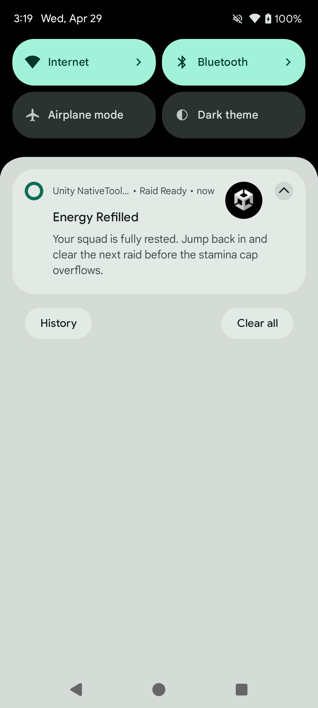
</p>

> **참고:** 알림 페이로드의 `channel` 필드는 채널이 없는 경우 생성하는 데 사용됩니다. 이미 생성된 채널에는 `id`와 `name`만 전달해도 됩니다.

> **참고:** 이 코드 예제들은 `AndroidNotificationManagerExampleController` 와 동일하게 `CreateGameplayChannelReference()` 와 `CreateUnityAppIconResource()` 를 사용하도록 맞췄습니다.

#### 업데이트

동일한 `id` / `tag` 페이로드를 전달하면 현재 표시 중인 알림을 덮어씁니다.

```csharp
#if UNITY_ANDROID && !UNITY_EDITOR
string updatedNotificationJson = AndroidNotificationJsonBuilder.BuildNotificationJson(new NotificationPayload
{
    id = 1101,
    title = "일일 보상 준비 완료",
    message = "로그인 연속 보상 상자가 마을에서 기다리고 있습니다.",
    tag = "energy",
    channel = CreateGameplayChannelReference(),
    smallIcon = CreateUnityAppIconResource(),
    largeIcon = CreateUnityAppIconResource(),
    subText = "마을 보상",
    autoCancel = true,
    priority = 1,
    style = new NotificationStylePayload
    {
        type = "bigPicture",
        picture = CreateUnityAppIconResource(),
        largeIcon = CreateUnityAppIconResource(),
        hideExpandedLargeIcon = false,
        bigText = "로그인 연속 보상 상자가 마을에서 기다리고 있습니다. 지금 받아서 보상 배율을 유지하세요.",
        bigContentTitle = "일일 보상 준비 완료",
        summaryText = "마을 보상"
    }
});

AndroidNotificationManager.Instance.UpdateNotification(updatedNotificationJson);
#endif
```

<p align="center">
    
</p>

#### 취소

```csharp
#if UNITY_ANDROID && !UNITY_EDITOR
// 특정 알림 취소
AndroidNotificationManager.Instance.CancelNotification(1001);
AndroidNotificationManager.Instance.CancelNotification(1001, "energy");

// 모든 알림 취소
AndroidNotificationManager.Instance.CancelAllNotifications();
#endif
```

---

### 알림 스타일

알림 페이로드의 `style` 필드를 설정합니다.

#### 기본

```csharp
// style 필드 없음 — 표준 알림으로 표시됩니다.
```

#### BigText

확장 시 긴 텍스트를 표시합니다.

```csharp
style = new NotificationStylePayload
{
    type = "bigText",
    bigText = "확장 시 표시되는 긴 본문 텍스트입니다.",
    bigContentTitle = "확장 제목",
    summaryText = "요약"
}
```

#### Inbox

확장 시 여러 줄을 목록 형식으로 표시합니다. `lines` 배열에 각 줄을 전달합니다.

```csharp
style = new NotificationStylePayload
{
    type = "inbox",
    lines = new[] { "항목 1", "항목 2", "항목 3" },
    bigContentTitle = "확장 제목",
    summaryText = "3건"
}
```

#### BigPicture

확장 시 이미지를 표시합니다. `picture` 에 이미지 리소스 참조를 전달합니다.

```csharp
style = new NotificationStylePayload
{
    type = "bigPicture",
    picture = new NotificationResourcePayload { name = "my_image", type = "drawable" },
    bigContentTitle = "확장 제목",
    summaryText = "이미지 설명"
}
```

---

### 커스텀 뷰 스타일

커스텀 Android 레이아웃을 사용하여 알림을 표시합니다.

#### DecoratedCustomView

접힘/펼침용 레이아웃 리소스 이름을 지정합니다. 레이아웃 XML은 `Assets/Plugins/Android/com.jonghyunkim.nativetoolkit.androidlib/res/layout/`에 배치합니다（리소스 이름 충돌 방지를 위해 `nt_` 접두사 사용）.

```csharp
#if UNITY_ANDROID && !UNITY_EDITOR
string notificationJson = AndroidNotificationJsonBuilder.BuildNotificationJson(new NotificationPayload
{
    id = 1601,
    title = "커스텀 레이아웃 알림",
    message = "펼쳐서 커스텀 뷰를 확인하고 Dismiss 를 누르세요.",
    channel = CreateGameplayChannelReference(),
    smallIcon = CreateUnityAppIconResource(),
    autoCancel = true,
    style = new NotificationStylePayload
    {
        type = "decoratedCustomView",
        customViewLayout = "nt_notification_custom_view_sample",         // 접힘 레이아웃
        bigCustomViewLayout = "nt_notification_custom_view_sample_expanded", // 펼침 레이아웃 (선택)
        viewActions = new[]
        {
            new NotificationViewActionPayload
            {
                type = "setClickIntent",
                viewId = "nt_notification_btn_dismiss",  // 레이아웃 내 뷰 ID
                actionId = "com.jonghyunkim.nativetoolkit.ACTION_CUSTOM_VIEW_DISMISS"  // NotificationActionTapped에서 수신
            }
        }
    }
});

AndroidNotificationManager.Instance.ShowNotification(notificationJson);
#endif
```

<p align="center">
    
</p>

> **참고:** `RemoteViews` 제약으로 인해 클릭 가능한 요소에는 `Button` 대신 `LinearLayout` + `TextView`를 사용하세요.

---

### 인터랙션

#### NotificationOperationCompleted 이벤트

각 작업（표시, 취소, 예약 등）완료 후 발생합니다.

```csharp
#if UNITY_ANDROID && !UNITY_EDITOR
AndroidNotificationManager.Instance.NotificationOperationCompleted += OnOperationCompleted;
#endif

private void OnOperationCompleted(NotificationResult result)
{
    // result.Operation    — 예: AndroidNotificationManager.OperationShowNotification
    // result.IsSuccess    — 성공 시 true
    // result.ErrorMessage — 실패 시 non-null
}
```

작업 상수:

| 상수                                                                    | 설명                                     |
| ----------------------------------------------------------------------- | ---------------------------------------- |
| `AndroidNotificationManager.OperationShowNotification`                  | `ShowNotification` 완료                  |
| `AndroidNotificationManager.OperationUpdateNotification`                | `UpdateNotification` 완료                |
| `AndroidNotificationManager.OperationCancelNotification`                | `CancelNotification` 완료                |
| `AndroidNotificationManager.OperationCancelAllNotifications`            | `CancelAllNotifications` 완료            |
| `AndroidNotificationManager.OperationScheduleNotification`              | `ScheduleNotification` 완료              |
| `AndroidNotificationManager.OperationCancelScheduledNotification`       | `CancelScheduledNotification` 완료       |
| `AndroidNotificationManager.OperationCancelAllScheduledNotifications`   | `CancelAllScheduledNotifications` 완료   |
| `AndroidNotificationManager.OperationStartProgressForegroundService`    | `StartProgressForegroundService` 완료    |
| `AndroidNotificationManager.OperationUpdateProgressForegroundService`   | `UpdateProgressForegroundService` 완료   |
| `AndroidNotificationManager.OperationCompleteProgressForegroundService` | `CompleteProgressForegroundService` 완료 |
| `AndroidNotificationManager.OperationStopProgressForegroundService`     | `StopProgressForegroundService` 완료     |

#### NotificationActionTapped 이벤트

사용자가 알림 본문, 액션 버튼을 탭하거나 알림을 삭제할 때 발생합니다.

```csharp
#if UNITY_ANDROID && !UNITY_EDITOR
AndroidNotificationManager.Instance.NotificationActionTapped += OnActionTapped;
#endif

private void OnActionTapped(NotificationActionResult result)
{
    bool isBodyTap = result.ActionId == AndroidNotificationManager.ActionBodyTap;
    bool isDismiss = result.ActionId == AndroidNotificationManager.ActionNotificationDismissed;

    // result.NotificationId — 알림 ID
    // result.ActionId       — 액션 식별자
    // result.Data           — Dictionary<string, string> 커스텀 데이터 (null일 수 있음)
}
```

커스텀 데이터를 전송하려면 `data` 엔트리를 설정한 뒤 `AndroidNotificationJsonBuilder` 를 사용합니다:

```csharp
payload.data = new[]
{
    new NotificationDataEntryPayload { key = "screen", value = "battle" },
    new NotificationDataEntryPayload { key = "matchId", value = "match_5678" }
};

string json = AndroidNotificationJsonBuilder.BuildNotificationJson(payload);
```

#### NotificationReceived 이벤트

예약 알림이 앱 포그라운드 중에 발생했을 때 수신합니다.

```csharp
#if UNITY_ANDROID && !UNITY_EDITOR
AndroidNotificationManager.Instance.NotificationReceived += OnNotificationReceived;
#endif

private void OnNotificationReceived(NotificationReceivedResult result)
{
    // result.NotificationId — 알림 ID
    // result.Tag            — 태그 (null일 수 있음)
    // result.ChannelId      — 채널 ID
}
```

#### 액션 버튼

알림에 액션 버튼을 추가합니다.

```csharp
NotificationPayload payload = new NotificationPayload
{
    id = 1401,
    title = "매치 발견",
    message = "랭크 매치가 준비되었습니다. 30초 안에 수락하세요.",
    channel = CreateGameplayChannelReference(),
    smallIcon = CreateUnityAppIconResource(),
    autoCancel = true,
    priority = 1,
    launchAction = "open_battle_screen",
    actions = new[]
    {
        new NotificationActionPayload
        {
            title = "지금 플레이",
            actionId = "com.jonghyunkim.nativetoolkit.ACTION_PLAY_NOW",
            icon = CreateUnityAppIconResource(),
            launchApp = true,
            showsUserInterface = true
        },
        new NotificationActionPayload
        {
            title = "닫기",
            actionId = "com.jonghyunkim.nativetoolkit.ACTION_DISMISS",
            launchApp = false,
            showsUserInterface = false
        }
    },
    data = new[]
    {
        new NotificationDataEntryPayload { key = "screen", value = "battle" },
        new NotificationDataEntryPayload { key = "matchId", value = "match_5678" }
    }
};

string notificationJson = AndroidNotificationJsonBuilder.BuildNotificationJson(payload);
```

<p align="center">
    
</p>

#### 전체 화면 인텐트

기기가 잠겨 있거나 화면이 꺼져 있을 때 전체 화면 액티비티를 실행합니다（알람, 수신 통화 등）. `fullScreenIntent = true`를 설정하고 높은 우선순위 채널（`importance = 4`）을 사용합니다.

```csharp
new NotificationPayload
{
    id = 1501,
    title = "매치 시작",
    message = "지금 바로 매치가 시작됩니다. 게임 화면을 실행합니다.",
    channel = CreateGameplayChannelReference(),
    smallIcon = CreateUnityAppIconResource(),
    priority = 2,
    category = "call",
    fullScreenIntent = true,
    autoCancel = true
}
```

<p align="center">
    
</p>

> **참고:** 기기 상태 및 Android 정책에 따라 전체 화면이 아닌 헤드업 알림으로 표시될 수 있습니다.

---

### 진행 알림

다운로드나 오래 걸리는 작업의 진행 바를 표시합니다.

```csharp
#if UNITY_ANDROID && !UNITY_EDITOR
// 결정적 진행 바로 시작
AndroidNotificationManager.Instance.StartProgressForegroundService(AndroidNotificationJsonBuilder.BuildNotificationJson(new NotificationPayload
{
    id = 1301,
    title = "길드 배틀 에셋 다운로드 중",
    message = "다음 매치를 위해 경기장을 준비하고 있습니다.",
    channel = CreateGameplayChannelReference(),
    smallIcon = CreateUnityAppIconResource(),
    ongoing = true,
    autoCancel = false,
    progress = new NotificationProgressPayload { max = 100, current = _currentProgressValue, indeterminate = false },
    style = new NotificationStylePayload
    {
        type = "bigText",
        bigText = "다음 매치를 위해 경기장을 준비하고 있습니다. 에셋 다운로드가 끝날 때까지 앱을 종료하지 마세요.",
        bigContentTitle = "길드 배틀 에셋 다운로드 중",
        summaryText = "백그라운드 다운로드"
    }
}));

// 진행 업데이트
AndroidNotificationManager.Instance.UpdateProgressForegroundService(AndroidNotificationJsonBuilder.BuildNotificationJson(new NotificationPayload
{
    id = 1301,
    title = "전설 장비 제작 중",
    message = "대장간이 최대 출력으로 가동 중입니다.",
    channel = CreateGameplayChannelReference(),
    smallIcon = CreateUnityAppIconResource(),
    ongoing = true,
    autoCancel = false,
    onlyAlertOnce = true,
    progress = new NotificationProgressPayload { max = 100, current = progressValue, indeterminate = false },
    style = new NotificationStylePayload
    {
        type = "bigText",
        bigText = "대장간이 최대 출력으로 가동 중입니다. 제작이 끝나면 바로 장착할 수 있도록 준비하세요.",
        bigContentTitle = "전설 장비 제작 중",
        summaryText = "제작 업데이트"
    }
}));

// 완료 — 서비스 중지 및 일반 알림으로 강등
AndroidNotificationManager.Instance.CompleteProgressForegroundService(AndroidNotificationJsonBuilder.BuildNotificationJson(new NotificationPayload
{
    id = 1301,
    title = "제작 완료",
    message = "전설 검을 수령할 준비가 되었습니다.",
    channel = CreateGameplayChannelReference(),
    smallIcon = CreateUnityAppIconResource(),
    ongoing = false,
    autoCancel = true,
    progress = new NotificationProgressPayload { max = 100, current = 100, indeterminate = false },
    style = new NotificationStylePayload
    {
        type = "bigText",
        bigText = "전설 검을 수령할 준비가 되었습니다. 다음 전투 전에 대장간으로 돌아가 장착하세요.",
        bigContentTitle = "제작 완료",
        summaryText = "제작 완료"
    }
}));

// 강제 중지 — 알림도 제거
AndroidNotificationManager.Instance.StopProgressForegroundService();
#endif
```

<p align="center">
    
</p>

---

### 포그라운드 서비스 알림

포그라운드 서비스 알림에는 다음 매니페스트 항목이 필요합니다.

```xml
<service
    android:name="android.library.notification.presentation.progress.ProgressForegroundService"
    android:foregroundServiceType="dataSync"
    android:exported="false" />
```

`StartProgressForegroundService`, `UpdateProgressForegroundService`, `CompleteProgressForegroundService`, `StopProgressForegroundService`의 사용법은 [진행 알림](#진행-알림)을 참조하세요.

---

### 예약 알림

지정한 시간에 자동으로 알림을 표시합니다.

```csharp
#if UNITY_ANDROID && !UNITY_EDITOR
long triggerTime = DateTimeOffset.UtcNow.AddSeconds(15).ToUnixTimeMilliseconds();

string scheduleJson = AndroidNotificationJsonBuilder.BuildScheduledNotificationJson(new ScheduledNotificationEnvelopePayload
{
    notification = new NotificationPayload
    {
        id = 1201,
        title = "길드 배틀 곧 시작",
        message = "팀 큐가 15초 후에 열립니다. 길드원을 모아 출격 준비를 하세요.",
        tag = "guild-battle",
        channel = CreateGameplayChannelReference(),
        smallIcon = CreateUnityAppIconResource(),
        autoCancel = true,
        priority = 1,
        groupKey = "guild-events",
        sortKey = "001",
        style = new NotificationStylePayload
        {
            type = "bigText",
            bigText = "팀 큐가 15초 후에 열립니다. 장비를 최종 점검하고 출격 준비를 마치세요.",
            bigContentTitle = "길드 배틀 곧 시작",
            summaryText = "길드 이벤트"
        }
    },
    schedule = new NotificationSchedulePayload
    {
        triggerAtMillis = triggerTime,
        exact = true,           // 정확한 알람 (SCHEDULE_EXACT_ALARM 필요)
        allowWhileIdle = true,  // Doze 모드에서도 발생
        persistAcrossBoot = true,
        alarmType = 0           // RTC_WAKEUP
    }
});

AndroidNotificationManager.Instance.ScheduleNotification(scheduleJson);
#endif
```

<p align="center">
    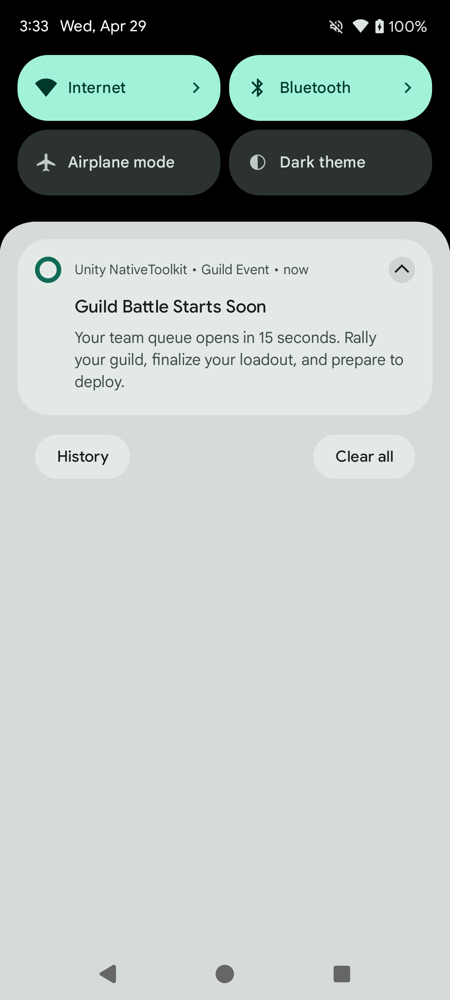
</p>

#### 예약 알림 취소

```csharp
#if UNITY_ANDROID && !UNITY_EDITOR
AndroidNotificationManager.Instance.CancelScheduledNotification(1201, "guild-battle");
AndroidNotificationManager.Instance.CancelAllScheduledNotifications();
#endif
```

#### 예약 상태 확인

```csharp
#if UNITY_ANDROID && !UNITY_EDITOR
bool isScheduled = AndroidNotificationManager.Instance.IsNotificationScheduled(1201, "guild-battle");
#endif
```

---

## iOS

### 개요

iOS 알림은 `IosNotificationManager`를 통해 사용할 수 있습니다. 샘플 화면에서는 권한 요청, 즉시 알림, 첨부 알림, 예약 알림, 카테고리/액션, 배지 조작까지 확인할 수 있습니다.

#### 지원 기능

- 알림 권한 요청 / 권한 상태 확인 / 알림 설정 화면 이동
- 즉시 알림 (첨부 파일 알림 포함)
- 예약 알림 (시간 간격 / 캘린더 / 위치 기반)
- 알림 업데이트 / 취소 / 전달 완료 알림 삭제 / 목록 조회
- 배지 개수 설정
- 카테고리 등록 / 액션 / 텍스트 입력 액션

#### 기본 설정

```csharp
#if UNITY_IOS && !UNITY_EDITOR
IosNotificationManager.Instance.RequestPermission(result =>
{
    if (result.IsSuccess)
    {
        Debug.Log("iOS notification permission granted");
    }
    else
    {
        Debug.LogError($"Permission failed: {result.ErrorMessage}");
    }
});

IosNotificationManager.Instance.GetAuthorizationStatus(status =>
{
    Debug.Log($"Authorization status: {status}");
});
#endif
```

<a id="ios-basic-setup-sample"></a>

<p align="center">
    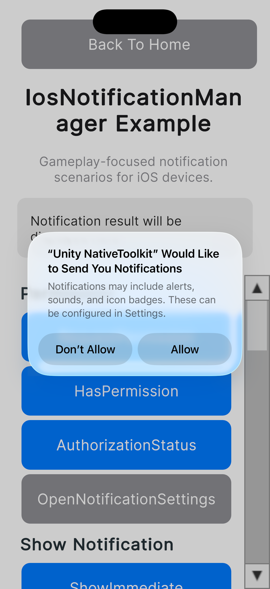
</p>

#### 즉시 알림 표시

```csharp
#if UNITY_IOS && !UNITY_EDITOR
var content = new NotificationContentPayload
{
    id = "sample-notification",
    title = "Energy Refilled",
    body = "Your squad is fully rested. Jump back in and clear the next raid.",
    sound = "default",
    categoryIdentifier = "sample-category"
};

var contentJson = IosNotificationJsonBuilder.BuildContentJson(content);
IosNotificationManager.Instance.ShowNotification(contentJson, null, result =>
{
    Debug.Log($"ShowNotification: {result.IsSuccess}");
});
#endif
```

<a id="ios-show-immediate-sample"></a>

<p align="center">
    
</p>

#### 앱 아이콘 첨부 즉시 알림

```csharp
#if UNITY_IOS && !UNITY_EDITOR
var content = new NotificationContentPayload
{
    id = "sample-notification",
    title = "Immediate Notification with Attachment",
    body = "Displayed with app icon attachment.",
    sound = "default",
    attachments = new[]
    {
        new NotificationAttachmentPayload
        {
            identifier = "app-icon",
            fileURL = appIconFileUrl
        }
    }
};

var contentJson = IosNotificationJsonBuilder.BuildContentJson(content);
IosNotificationManager.Instance.ShowNotification(contentJson, null, null);
#endif
```

<a id="ios-show-attachment-sample"></a>

<p align="center">
    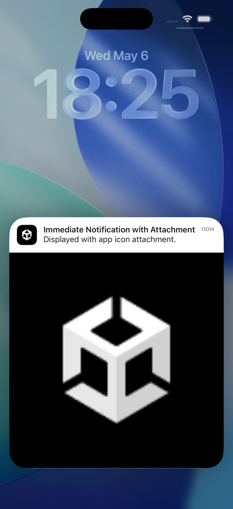
</p>

#### 예약 알림 등록

```csharp
#if UNITY_IOS && !UNITY_EDITOR
var content = new NotificationContentPayload
{
    id = "scheduled-notification",
    title = "Guild Battle Starts Soon",
    body = "Battle queue opens in 10 seconds. Finalize your loadout and deploy.",
    sound = "default"
};

var trigger = new TimeIntervalTriggerPayload
{
    repeats = false,
    interval = 10.0
};

string contentJson = IosNotificationJsonBuilder.BuildContentJson(content);
string triggerJson = IosNotificationJsonBuilder.BuildTimeIntervalTriggerJson(trigger);

IosNotificationManager.Instance.ScheduleNotification(
    contentJson,
    triggerJson,
    "scheduled-notification",
    result => Debug.Log($"ScheduleNotification: {result.IsSuccess}"));
#endif
```

<a id="ios-schedule-sample"></a>

<p align="center">
    
</p>

캘린더 예약은 `CalendarTriggerPayload`, 위치 기반 예약은 `LocationTriggerPayload`를 사용합니다.

#### 카테고리와 액션 등록

```csharp
#if UNITY_IOS && !UNITY_EDITOR
var category = new IosNotificationCategoryPayload
{
    identifier = "sample-category",
    actions = new[]
    {
        new IosNotificationActionPayload
        {
            identifier = "open",
            title = "Open",
            options = new[] { "foreground" }
        }
    },
    textInputActions = new[]
    {
        new IosNotificationTextInputActionPayload
        {
            identifier = "reply",
            title = "Reply",
            buttonTitle = "Send",
            textInputPlaceholder = "Type a message"
        }
    }
};

string categoryJson = IosNotificationJsonBuilder.BuildCategoryJson(category);
IosNotificationManager.Instance.RegisterCategory(categoryJson, null);
#endif
```

<a id="ios-category-sample"></a>

<p align="center">
    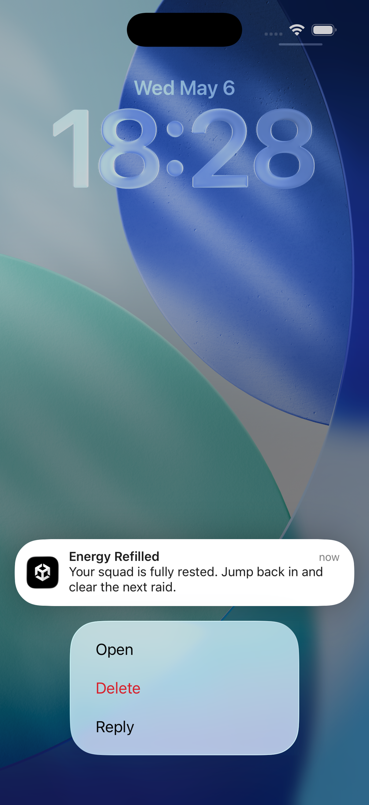
</p>

#### 이벤트 수신

```csharp
#if UNITY_IOS && !UNITY_EDITOR
IosNotificationManager.Instance.NotificationOperationCompleted += result =>
{
    Debug.Log($"Operation={result.Operation}, Success={result.IsSuccess}");
};

IosNotificationManager.Instance.NotificationActionReceived += result =>
{
    Debug.Log($"Action={result.ActionId}, Notification={result.NotificationId}");
};

IosNotificationManager.Instance.NotificationTextInputActionReceived += result =>
{
    Debug.Log($"TextInput={result.UserText}");
};
#endif
```

<a id="ios-events-sample"></a>

<p align="center">
    
</p>

---

## Windows

Windows 알림은 `WindowsNotificationManager`를 통해 제공됩니다. 샘플 씬에서는 초기화, 즉시 알림, 예약 알림, 진행률 바 알림, 알림 삭제, 알림 권한 쿼리를 Unity로 빌드한 언패키지 Win32 앱에서 시연합니다.

### 지원 기능

- Windows App SDK 런타임 초기화 및 알림 콜백 등록
- 즉시 알림 표시
- 예약 알림 등록
- 예약 알림 취소
- 진행률 바 알림 표시 및 업데이트
- 태그 지정 또는 전체 알림 삭제
- 알림 권한 설정 쿼리
- 시스템 알림 설정 열기
- 알림 활성화 이벤트 수신 (콜드 스타트 포함)

### 설정

#### 요구 사항

- Windows 11 이상
- 대상 머신에 [Windows App Runtime 1.7.2 (1.7.250513003)](https://learn.microsoft.com/ko-kr/windows/apps/windows-app-sdk/downloads-archive)이 설치되어 있어야 함
- `StreamingAssets/app-icon.png` — 이 경로에 알림 아이콘을 배치하면 Unity가 빌드 출력에 자동으로 포함합니다

#### 네임스페이스 임포트

```csharp
using JonghyunKim.NativeToolkit.Runtime.Notification;
```

> **참고:** 모든 Windows 알림 API 호출을 `#if UNITY_STANDALONE_WIN && !UNITY_EDITOR`로 감싸 에디터에서 네이티브 호출이 실행되지 않도록 하세요.

### 초기화

다른 알림 API를 호출하기 전에 `Initialize`를 한 번 호출하세요. 언패키지 앱(모든 Unity Windows 스탠드얼론 빌드)의 경우 `isPackaged: false`와 함께 표시 이름과 아이콘 URI를 지정하세요.

```csharp
#if UNITY_STANDALONE_WIN && !UNITY_EDITOR
string iconPath = System.IO.Path.Combine(Application.streamingAssetsPath, "app-icon.png");
string iconUri  = new Uri(iconPath).AbsoluteUri; // file:/// URI 형식

WindowsNotificationManager.Instance.Initialize(
    isPackaged: false,
    displayName: Application.productName,
    iconUri: iconUri,
    onResult: result =>
    {
        if (result.IsSuccess)
            Debug.Log("Windows 알림 초기화 완료");
        else
            Debug.LogError($"Initialize 실패: {result.ErrorMessage}");
    });
#endif
```

> **참고:** `iconUri`는 언패키지 앱에서 필수입니다. `new Uri(path).AbsoluteUri`를 사용하면 Windows App SDK가 요구하는 `file:///` 형식의 URI가 생성됩니다.


### 알림 표시

#### 즉시 알림

```csharp
#if UNITY_STANDALONE_WIN && !UNITY_EDITOR
var payload = new WindowsNotificationPayload
{
    Title   = "에너지 충전 완료",
    Body    = "부대의 휴식이 완료되었습니다. 다음 레이드에 도전하세요.",
    Tag     = "win-sample-notification",
    Group   = "win-sample-group",
    Buttons = new List<WindowsNotificationButtonPayload>
    {
        new() { Label = "열기", Args = new Dictionary<string, string> { ["action"] = "open" } }
    }
};

string json = WindowsNotificationJsonBuilder.BuildNotificationPayload(payload);
WindowsNotificationManager.Instance.ShowNotification(json, result =>
{
    Debug.Log($"ShowNotification: {result.IsSuccess}");
});
#endif
```

<p align="center">
  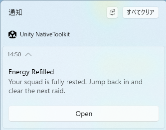
</p>

### 예약 알림

#### 알림 예약

```csharp
#if UNITY_STANDALONE_WIN && !UNITY_EDITOR
var payload = new WindowsNotificationPayload
{
    Title   = "길드 배틀 곧 시작",
    Body    = "1분 후 배틀 큐가 열립니다. 편성을 확인하고 출격하세요.",
    Tag     = "win-sample-notification",
    Group   = "win-sample-group",
    Buttons = new List<WindowsNotificationButtonPayload>
    {
        new() { Label = "열기", Args = new Dictionary<string, string> { ["action"] = "open" } }
    }
};

string json = WindowsNotificationJsonBuilder.BuildNotificationPayload(payload);
long scheduledTimeUnixMs = DateTimeOffset.UtcNow.AddMinutes(1).ToUnixTimeMilliseconds();

WindowsNotificationManager.Instance.ScheduleNotification(json, scheduledTimeUnixMs, result =>
{
    Debug.Log($"ScheduleNotification: {result.IsSuccess}");
});
#endif
```

<p align="center">
  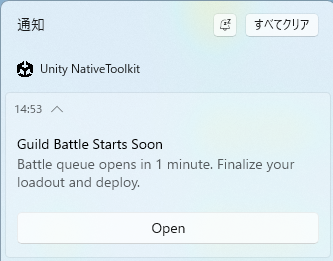
</p>

#### 예약 알림 취소

```csharp
#if UNITY_STANDALONE_WIN && !UNITY_EDITOR
WindowsNotificationManager.Instance.CancelScheduledNotification(
    "win-sample-notification",
    "win-sample-group",
    result => Debug.Log($"CancelScheduled: {result.IsSuccess}"));
#endif
```


### 진행률 업데이트

진행률 바 알림을 먼저 표시한 후 `UpdateNotificationProgress`를 호출하세요. 두 호출에서 동일한 `tag`와 `group`을 사용해야 합니다. `sequenceNumber`는 업데이트마다 증가시켜야 합니다.

#### 진행률 알림 표시

```csharp
#if UNITY_STANDALONE_WIN && !UNITY_EDITOR
uint sequenceNumber = 0; // 새 진행률 알림 표시 시 초기화

var payload = new WindowsNotificationPayload
{
    Title    = "다운로드 중...",
    Tag      = "win-sample-notification",
    Group    = "win-sample-group",
    Progress = new WindowsNotificationProgressPayload
    {
        Value    = 0.3,
        ValueStr = "30%",
        Status   = "다운로드 중"
    }
};

string json = WindowsNotificationJsonBuilder.BuildNotificationPayload(payload);
WindowsNotificationManager.Instance.ShowNotification(json, result =>
{
    Debug.Log($"ShowProgressNotification: {result.IsSuccess}");
});
#endif
```

<p align="center">
  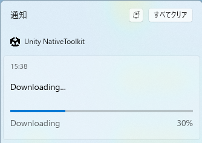
</p>

#### 진행률 업데이트

```csharp
#if UNITY_STANDALONE_WIN && !UNITY_EDITOR
sequenceNumber++; // 이전 값보다 큰 값이어야 합니다

WindowsNotificationManager.Instance.UpdateNotificationProgress(
    tag:            "win-sample-notification",
    group:          "win-sample-group",
    value:          0.5,
    valueStr:       "50%",
    status:         "다운로드 중...",
    sequenceNumber: sequenceNumber,
    onResult: result =>
    {
        if (!result.IsSuccess && result.ErrorCode == 4)
            Debug.LogWarning("진행률 알림을 찾을 수 없습니다. 먼저 ShowProgressNotification을 호출하세요.");
        else
            Debug.Log($"UpdateProgress: {result.IsSuccess}");
    });
#endif
```

> **참고:** `UpdateNotificationProgress`를 호출하기 전에 `ShowProgressNotification`을 호출하세요. 진행률 알림이 알림 센터에 없으면 오류 코드 `4`(`NOTIFICATION_ERROR_PROGRESS_NOT_FOUND`)가 반환됩니다.

<p align="center">
  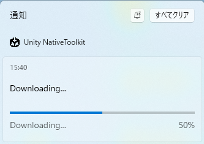
</p>

### 알림 제거

```csharp
#if UNITY_STANDALONE_WIN && !UNITY_EDITOR
// 특정 태그와 그룹에 해당하는 알림 제거
WindowsNotificationManager.Instance.RemoveNotificationsByTag(
    "win-sample-notification",
    "win-sample-group",
    result => Debug.Log($"RemoveByTag: {result.IsSuccess}"));

// 알림 센터의 모든 알림 제거
WindowsNotificationManager.Instance.RemoveAllNotifications(result =>
{
    Debug.Log($"RemoveAll: {result.IsSuccess}");
});
#endif
```


### 쿼리

#### 알림 권한 설정

`GetNotificationSetting`은 동기적으로 즉시 값을 반환합니다.

```csharp
#if UNITY_STANDALONE_WIN && !UNITY_EDITOR
WindowsNotificationSetting setting = WindowsNotificationManager.Instance.GetNotificationSetting();
Debug.Log($"NotificationSetting: {setting}");
// Enabled / DisabledForApplication / DisabledForUser / DisabledByGroupPolicy / DisabledByManifest / Unknown
#endif
```

#### 알림 설정 열기

```csharp
#if UNITY_STANDALONE_WIN && !UNITY_EDITOR
WindowsNotificationManager.Instance.OpenNotificationSettings(result =>
{
    Debug.Log($"OpenNotificationSettings: {result.IsSuccess}");
});
#endif
```


### 이벤트 수신

`OnEnable`에서 구독하고 `OnDisable`에서 구독을 해제하세요.

```csharp
#if UNITY_STANDALONE_WIN && !UNITY_EDITOR
private void OnEnable()
{
    WindowsNotificationManager.Instance.NotificationOperationCompleted += OnOperationCompleted;
    WindowsNotificationManager.Instance.NotificationInvoked            += OnNotificationInvoked;
}

private void OnDisable()
{
    WindowsNotificationManager.Instance.NotificationOperationCompleted -= OnOperationCompleted;
    WindowsNotificationManager.Instance.NotificationInvoked            -= OnNotificationInvoked;
}

private void OnOperationCompleted(WindowsNotificationResult result)
{
    Debug.Log($"Operation={result.Operation}, IsSuccess={result.IsSuccess}");
}

private void OnNotificationInvoked(string argsJson)
{
    // 사용자가 알림 또는 액션 버튼을 클릭했을 때 발생합니다.
    // 콜드 스타트 시에도 발생합니다: 알림 클릭으로 앱이 실행된 경우
    // 씬 로드 후 Initialize()를 호출하면 활성화 인수를 받을 수 있습니다.
    // argsJson 예: {"action":"open"}
    Debug.Log($"NotificationInvoked: {argsJson}");
}
#endif
```

#### 오퍼레이션 상수

| 상수 | 설명 |
|---|---|
| `WindowsNotificationManager.OperationInitialize` | `Initialize` 완료 |
| `WindowsNotificationManager.OperationShow` | `ShowNotification` 완료 |
| `WindowsNotificationManager.OperationSchedule` | `ScheduleNotification` 완료 |
| `WindowsNotificationManager.OperationCancelScheduled` | `CancelScheduledNotification` 완료 |
| `WindowsNotificationManager.OperationUpdateProgress` | `UpdateNotificationProgress` 완료 |
| `WindowsNotificationManager.OperationRemoveByTag` | `RemoveNotificationsByTag` 완료 |
| `WindowsNotificationManager.OperationRemoveAll` | `RemoveAllNotifications` 완료 |
| `WindowsNotificationManager.OperationOpenSettings` | `OpenNotificationSettings` 완료 |

---

## macOS

macOS 알림은 `MacNotificationManager`를 통해 제공됩니다. 샘플 씬에서는 권한 흐름, 즉시 알림, 예약 알림, 카테고리와 액션 등록, 배지 관리, 조회 작업을 확인할 수 있습니다.

### 지원 기능

- 권한 요청 / 인증 상태 확인 / 시스템 알림 설정 열기
- 즉시 알림
- 예약 알림 (시간 간격 / 캘린더)
- 알림 업데이트 / 취소 / 전달된 알림 삭제
- 예약된 알림 및 전달된 알림 목록 조회
- 배지 카운트 관리
- 카테고리 등록 / 액션 / 텍스트 입력 액션

### 기본 설정

```csharp
// Guard: macOS Standalone 전용. 에디터에서의 네이티브 호출을 방지합니다.
#if UNITY_STANDALONE_OSX && !UNITY_EDITOR
using JonghyunKim.NativeToolkit.Runtime.Notification;
#endif
```

---

### 권한

```csharp
#if UNITY_STANDALONE_OSX && !UNITY_EDITOR
// 알림 권한 요청
MacNotificationManager.Instance.RequestPermission(result =>
{
    if (result.IsSuccess)
    {
        Debug.Log("macOS 알림 권한이 허용되었습니다");
    }
    else
    {
        Debug.LogError($"권한 요청 실패: {result.ErrorMessage}");
    }
});

// 알림 권한이 허용되었는지 확인
MacNotificationManager.Instance.HasPermission(hasPermission =>
{
    Debug.Log($"HasPermission: {hasPermission}");
});

// 전체 인증 상태 조회
MacNotificationManager.Instance.GetAuthorizationStatus(result =>
{
    var status = MacNotificationAuthorizationStatusParser.ParseJson(result.Json);
    Debug.Log($"AuthorizationStatus: {status}");
});

// 시스템 알림 설정 열기
MacNotificationManager.Instance.OpenSettings(result =>
{
    Debug.Log($"OpenSettings: {result.IsSuccess}");
});
#endif
```

<p align="center">
    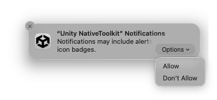
</p>

---

### 알림 표시

#### 즉시 알림

```csharp
#if UNITY_STANDALONE_OSX && !UNITY_EDITOR
var content = new NotificationContentPayload
{
    id = "mac-sample-notification",
    title = "Energy Refilled",
    body = "Your squad is fully rested. Jump back in and clear the next raid.",
    categoryIdentifier = "mac-sample-category"
};
var contentJson = MacNotificationJsonBuilder.BuildContentJson(content);
MacNotificationManager.Instance.ShowNotification(contentJson, null, result =>
{
    if (result.IsSuccess)
    {
        Debug.Log("알림이 표시되었습니다");
    }
    else
    {
        Debug.LogError($"ShowNotification 실패: {result.ErrorMessage}");
    }
});
#endif
```

<p align="center">
    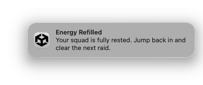
</p>

#### 시간 간격 트리거

```csharp
#if UNITY_STANDALONE_OSX && !UNITY_EDITOR
var content = new NotificationContentPayload
{
    id = "mac-sample-notification",
    title = "Guild Battle Countdown",
    body = "Your team queue opens in 5 seconds. Rally your party and get ready."
};
var trigger = new TimeIntervalTriggerPayload { interval = 5.0, repeats = false };
var contentJson = MacNotificationJsonBuilder.BuildContentJson(content);
var triggerJson = MacNotificationJsonBuilder.BuildTimeIntervalTriggerJson(trigger);
MacNotificationManager.Instance.ShowNotification(contentJson, triggerJson, result =>
{
    Debug.Log($"ShowNotification: {result.IsSuccess}");
});
#endif
```

<p align="center">
    
</p>

#### 캘린더 트리거

```csharp
#if UNITY_STANDALONE_OSX && !UNITY_EDITOR
var now = DateTime.Now.AddMinutes(1);
var content = new NotificationContentPayload
{
    id = "mac-sample-notification",
    title = "Daily Reward Ready",
    body = "Your login streak chest is ready in town. Claim it before reset."
};
var trigger = new CalendarTriggerPayload
{
    year = now.Year,
    month = now.Month,
    day = now.Day,
    hour = now.Hour,
    minute = now.Minute,
    second = now.Second,
    repeats = false
};
var contentJson = MacNotificationJsonBuilder.BuildContentJson(content);
var triggerJson = MacNotificationJsonBuilder.BuildCalendarTriggerJson(trigger);
MacNotificationManager.Instance.ShowNotification(contentJson, triggerJson, result =>
{
    Debug.Log($"ShowNotification: {result.IsSuccess}");
});
#endif
```

<p align="center">
    
</p>

---

### 업데이트, 취소 및 삭제

#### 업데이트

```csharp
#if UNITY_STANDALONE_OSX && !UNITY_EDITOR
var content = new NotificationContentPayload
{
    id = "mac-sample-notification",
    title = "Town Entry Bonus",
    body = "Welcome back to town. Your blacksmith bonus is now available."
};
var contentJson = MacNotificationJsonBuilder.BuildContentJson(content);
MacNotificationManager.Instance.UpdateNotification("mac-sample-notification", contentJson, null, result =>
{
    Debug.Log($"UpdateNotification: {result.IsSuccess}");
});
#endif
```

#### 취소

```csharp
#if UNITY_STANDALONE_OSX && !UNITY_EDITOR
// ID로 특정 대기 중인 알림 취소
MacNotificationManager.Instance.CancelNotification("mac-sample-notification");

// 모든 대기 중인 알림 취소
MacNotificationManager.Instance.CancelAllNotifications();
#endif
```

#### 전달된 알림 삭제

```csharp
#if UNITY_STANDALONE_OSX && !UNITY_EDITOR
// 알림 센터에서 특정 전달된 알림 삭제
MacNotificationManager.Instance.RemoveDeliveredNotification("mac-sample-notification");

// 알림 센터에서 모든 전달된 알림 삭제
MacNotificationManager.Instance.RemoveAllDeliveredNotifications();
#endif
```

<p align="center">
    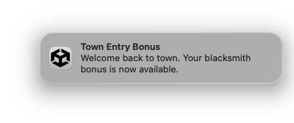
</p>

---

### 예약 알림

게임 루프를 차단하지 않고 미래 시각에 알림을 예약합니다.

#### 시간 간격

```csharp
#if UNITY_STANDALONE_OSX && !UNITY_EDITOR
var content = new NotificationContentPayload
{
    id = "mac-sample-notification",
    title = "Guild Battle Starts Soon",
    body = "Battle queue opens in 10 seconds. Finalize your loadout and deploy."
};
var trigger = new TimeIntervalTriggerPayload { interval = 10.0, repeats = false };
var contentJson = MacNotificationJsonBuilder.BuildContentJson(content);
var triggerJson = MacNotificationJsonBuilder.BuildTimeIntervalTriggerJson(trigger);
MacNotificationManager.Instance.ScheduleNotification(contentJson, triggerJson, result =>
{
    Debug.Log($"ScheduleNotification: {result.IsSuccess}");
});
#endif
```

#### 캘린더

```csharp
#if UNITY_STANDALONE_OSX && !UNITY_EDITOR
var future = DateTime.Now.AddMinutes(1);
var content = new NotificationContentPayload
{
    id = "mac-sample-notification",
    title = "Daily Reward Window",
    body = "Your daily reward window is open. Check in now to keep your streak."
};
var trigger = new CalendarTriggerPayload
{
    year = future.Year,
    month = future.Month,
    day = future.Day,
    hour = future.Hour,
    minute = future.Minute,
    second = future.Second,
    repeats = false
};
var contentJson = MacNotificationJsonBuilder.BuildContentJson(content);
var triggerJson = MacNotificationJsonBuilder.BuildCalendarTriggerJson(trigger);
MacNotificationManager.Instance.ScheduleNotification(contentJson, triggerJson, result =>
{
    Debug.Log($"ScheduleNotification: {result.IsSuccess}");
});
#endif
```

#### 예약 취소

```csharp
#if UNITY_STANDALONE_OSX && !UNITY_EDITOR
// ID로 특정 예약된 알림 취소
MacNotificationManager.Instance.CancelScheduledNotification("mac-sample-notification");

// 모든 예약된 알림 취소
MacNotificationManager.Instance.CancelAllScheduledNotifications();
#endif
```

<p align="center">
    
</p>

---

### 조회

```csharp
#if UNITY_STANDALONE_OSX && !UNITY_EDITOR
// 대기 중인 예약 알림 조회
MacNotificationManager.Instance.GetScheduledNotifications(result =>
{
    Debug.Log($"GetScheduled: {result.Json}");
});

// 알림 센터의 전달된 알림 조회
MacNotificationManager.Instance.GetDeliveredNotifications(result =>
{
    Debug.Log($"GetDelivered: {result.Json}");
});
#endif
```

---

### 배지

```csharp
#if UNITY_STANDALONE_OSX && !UNITY_EDITOR
// 배지 카운트를 1로 설정
MacNotificationManager.Instance.SetBadgeCount(1, result =>
{
    Debug.Log($"SetBadgeCount(1): {result.IsSuccess}");
});

// 배지 지우기
MacNotificationManager.Instance.SetBadgeCount(0, result =>
{
    Debug.Log($"SetBadgeCount(0): {result.IsSuccess}");
});
#endif
```

---

### 카테고리와 액션

`categoryIdentifier`를 사용하는 알림을 보내기 전에 액션 버튼이 포함된 카테고리를 먼저 등록하세요.

```csharp
#if UNITY_STANDALONE_OSX && !UNITY_EDITOR
var category = new MacNotificationCategoryPayload
{
    id = "mac-sample-category",
    actions = new[]
    {
        new MacNotificationActionPayload
        {
            id = "open",
            title = "Open",
            isForeground = true,
            isTextInput = false
        },
        new MacNotificationActionPayload
        {
            id = "delete",
            title = "Delete",
            isForeground = false,
            isTextInput = false
        },
        new MacNotificationActionPayload
        {
            id = "reply",
            title = "Reply",
            isForeground = false,
            isTextInput = true,
            textInputPlaceholder = "Type a message"
        }
    }
};
string categoryJson = MacNotificationJsonBuilder.BuildCategoryJson(category);
MacNotificationManager.Instance.RegisterCategory(categoryJson, result =>
{
    Debug.Log($"RegisterCategory: {result.IsSuccess}");
});
#endif
```

액션 버튼을 보려면 알림 배너에 마우스를 올려 Options (▼) 버튼을 클릭하세요.

#### 카테고리 삭제

```csharp
#if UNITY_STANDALONE_OSX && !UNITY_EDITOR
MacNotificationManager.Instance.RemoveCategory("mac-sample-category", result =>
{
    Debug.Log($"RemoveCategory: {result.IsSuccess}");
});
#endif
```

<p align="center">
    
</p>

---

### 이벤트 수신

`OnEnable`에서 구독하고 `OnDisable`에서 구독을 해제하세요.

```csharp
#if UNITY_STANDALONE_OSX && !UNITY_EDITOR
private void OnEnable()
{
    MacNotificationManager.Instance.NotificationActionReceived += OnNotificationActionReceived;
    MacNotificationManager.Instance.NotificationTextInputActionReceived += OnNotificationTextInputActionReceived;
}

private void OnDisable()
{
    MacNotificationManager.Instance.NotificationActionReceived -= OnNotificationActionReceived;
    MacNotificationManager.Instance.NotificationTextInputActionReceived -= OnNotificationTextInputActionReceived;
}

private void OnNotificationActionReceived(MacNotificationActionResult result)
{
    Debug.Log($"Action: notificationId={result.NotificationId}, actionId={result.ActionId}");
}

private void OnNotificationTextInputActionReceived(MacNotificationTextInputActionResult result)
{
    Debug.Log($"TextInput: notificationId={result.NotificationId}, actionId={result.ActionId}, userText={result.UserText}");
}
#endif
```

<p align="center">
    
</p>
