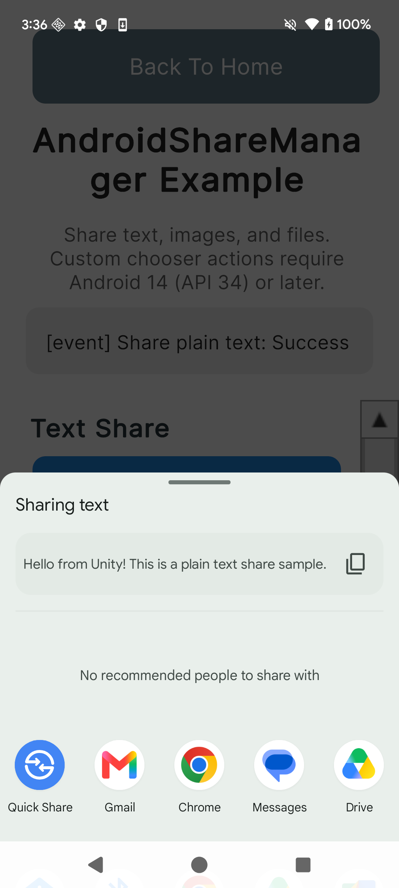
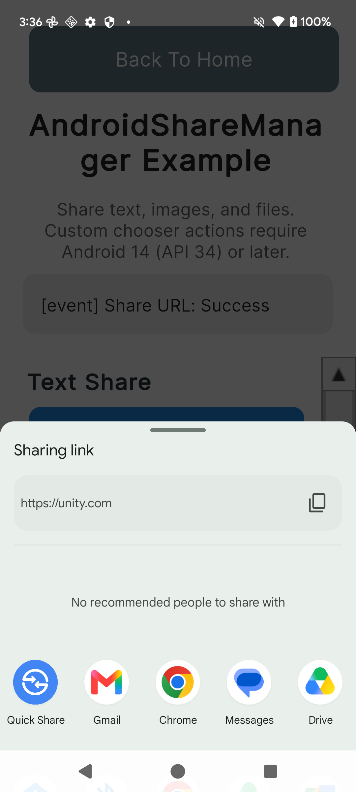
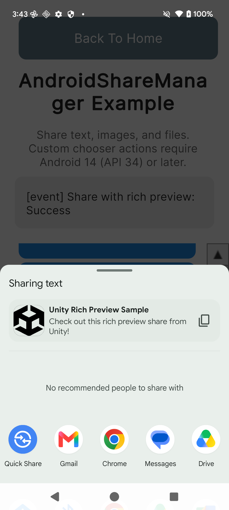
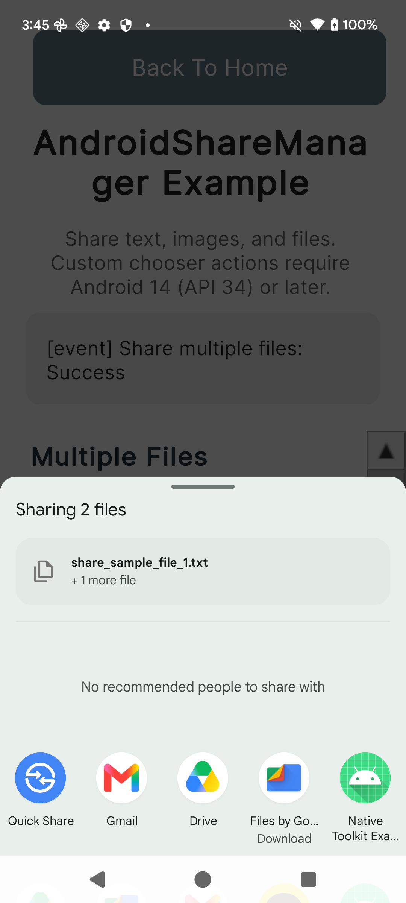
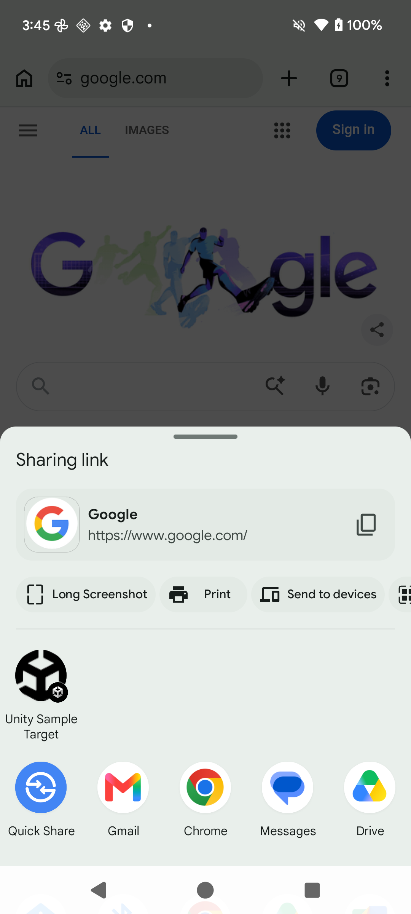
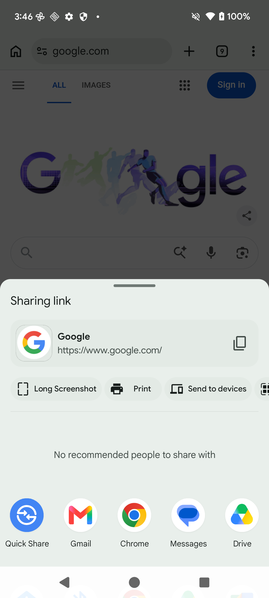

# 공유 기능

언어:

- [English](share.md)
- [日本語](share.ja.md)
- 한국어（이 페이지）

← [매뉴얼 상단으로 돌아가기](index.ko.md)

---

## 목차

- [Android](#android)
  - [설정](#설정)
  - [텍스트 공유](#텍스트-공유)
  - [URL 공유](#url-공유)
  - [커스텀 Chooser 액션 공유 (API 34+)](#커스텀-chooser-액션-공유-api-34)
  - [제목·주제 포함 공유](#제목주제-포함-공유)
  - [리치 프리뷰 공유](#리치-프리뷰-공유)
  - [이미지 공유](#이미지-공유)
  - [다중 이미지 공유](#다중-이미지-공유)
  - [파일 공유](#파일-공유)
  - [다중 파일 공유](#다중-파일-공유)
  - [다이렉트 공유 타겟](#다이렉트-공유-타겟)
  - [콜백 포함 공유](#콜백-포함-공유)
  - [대기 중 콜백 취소](#대기-중-콜백-취소)
  - [이벤트 수신](#이벤트-수신)
  - [에러 처리](#에러-처리)

---

## Android

### 설정

#### 네임스페이스 가져오기

```csharp
// 가드: Android (Player) 전용. 에디터에서의 네이티브 호출을 방지합니다.
#if UNITY_ANDROID && !UNITY_EDITOR
using JonghyunKim.NativeToolkit.Runtime.Share;
#endif
```

#### AndroidManifest.xml (다이렉트 공유에 필요)

앱이 Android 공유 시트의 다이렉트 공유 타겟으로 나타나도록 하려면, Android 라이브러리 프로젝트 매니페스트(예: `Assets/Plugins/Android/<your-app>.androidlib/AndroidManifest.xml`)에 다음을 추가합니다. `RegisterDirectShareTarget`을 사용하는 경우에만 필요합니다.

```xml
<manifest xmlns:android="http://schemas.android.com/apk/res/android"
    package="com.example.your.androidlib">
    <application>
        <activity android:name="com.unity3d.player.UnityPlayerGameActivity" android:exported="true">
            <intent-filter>
                <action android:name="android.intent.action.SEND" />
                <category android:name="android.intent.category.DEFAULT" />
                <data android:mimeType="*/*" />
            </intent-filter>
            <meta-data
                android:name="android.app.shortcuts"
                android:resource="@xml/shortcuts" />
        </activity>
    </application>
</manifest>
```

동일한 Android 라이브러리 프로젝트에 `res/xml/shortcuts.xml`을 추가합니다:

```xml
<?xml version="1.0" encoding="utf-8"?>
<shortcuts xmlns:android="http://schemas.android.com/apk/res/android">
    <share-target android:targetClass="com.unity3d.player.UnityPlayerGameActivity">
        <data android:mimeType="*/*" />
        <category android:name="android.shortcut.conversation" />
    </share-target>
</shortcuts>
```

#### 이미지·파일 공유 시 파일 경로

`ShareImage`, `ShareImages`, `ShareFile`, `ShareFiles`에 전달하는 파일은 네이티브 FileProvider가 적용되는 디렉터리에 있어야 합니다. `Application.persistentDataPath`(외부 파일 디렉터리에 매핑되며, FileProvider 설정에서 `<external-files-path>`로 선언됨)를 사용하세요. `Application.temporaryCachePath`(외부 캐시 디렉터리)는 FileProvider 적용 대상이 아니므로 사용할 수 없습니다.

```csharp
string path = Path.Combine(Application.persistentDataPath, "my_image.png");
```

---

### 텍스트 공유

```csharp
#if UNITY_ANDROID && !UNITY_EDITOR
AndroidShareManager.Instance.ShareText(new ShareTextPayload
{
    text = "Hello from Unity! 일반 텍스트 공유 샘플입니다."
});
#endif
```

<p align="center">
    
</p>

---

### URL 공유

```csharp
#if UNITY_ANDROID && !UNITY_EDITOR
AndroidShareManager.Instance.ShareText(new ShareTextPayload
{
    text = "https://unity.com",
    mimeType = "text/plain"
});
#endif
```

<p align="center">
    
</p>

---

### 커스텀 Chooser 액션 공유 (API 34+)

커스텀 Chooser 액션은 Android 공유 Chooser 다이얼로그에 추가 버튼으로 표시됩니다. Android 14 (API 34) 이상 및 Chooser 액션을 지원하는 AAR이 필요합니다. 이전 API 레벨에서는 커스텀 액션 없이 공유가 진행됩니다.

각 액션에는 탭 콜백을 받기 위해 고유한 `intentAction` 문자열(`android.intent.action.SEND` 이외의 값)을 지정해야 합니다. 탭 이벤트는 `ShareChooserActionTapped`(전역 이벤트) 또는 `ShareText`의 `onChooserAction` 파라미터(호출별 콜백)로 받을 수 있습니다.

```csharp
#if UNITY_ANDROID && !UNITY_EDITOR
// Chooser 액션 탭을 수신하기 위해 전역 이벤트를 구독합니다.
AndroidShareManager.Instance.ShareChooserActionTapped += result =>
{
    Debug.Log($"Chooser 액션 탭됨: {result.ActionId}");
};

AndroidShareManager.Instance.ShareText(new ShareTextPayload
{
    text = "커스텀 Chooser 액션 공유 (Android 14 / API 34+ 전용).",
    chooserActions = new[]
    {
        new ChooserActionPayload
        {
            label = "저장",
            iconBase64 = iconBase64, // base64 인코딩된 PNG/JPEG
            intentAction = "com.jonghyunkim.nativetoolkit.SHARE_CUSTOM_ACTION_SAVE"
        },
        new ChooserActionPayload
        {
            label = "열기",
            iconBase64 = iconBase64,
            intentAction = "com.jonghyunkim.nativetoolkit.SHARE_CUSTOM_ACTION_OPEN"
        }
    }
});
#endif
```

<p align="center">
    
</p>

> **주의:** `chooserActions`의 최대 항목 수는 5개입니다. 초과하면 경고가 로그에 기록되고 네이티브 레이어에서 초과 항목이 무시됩니다. `ShareWithCallback`은 Chooser 액션을 지원하지 않습니다. 대신 `ShareText`에 `chooserActions`를 지정하세요.

---

### 제목·주제 포함 공유

```csharp
#if UNITY_ANDROID && !UNITY_EDITOR
AndroidShareManager.Instance.ShareText(new ShareTextPayload
{
    text = "Unity에서 제목과 주제를 포함하여 공유하는 샘플입니다.",
    title = "Unity 공유 샘플",
    subject = "샘플 주제",
    mimeType = "text/plain"
});
#endif
```

<p align="center">
    
</p>

---

### 리치 프리뷰 공유

Chooser에 프리뷰 제목과 썸네일 이미지를 표시합니다. 썸네일 경로는 FileProvider가 접근 가능한 디렉터리의 파일을 가리켜야 합니다.

```csharp
#if UNITY_ANDROID && !UNITY_EDITOR
string thumbnailPath = Path.Combine(Application.persistentDataPath, "share_preview_thumbnail.png");
// ShareText를 호출하기 전에 thumbnailPath에 PNG 파일을 저장하세요.

AndroidShareManager.Instance.ShareText(new ShareTextPayload
{
    text = "Unity에서의 리치 프리뷰 공유 샘플입니다!",
    previewTitle = "Unity 리치 프리뷰 샘플",
    previewThumbnailPath = thumbnailPath
});
#endif
```

<p align="center">
    
</p>

---

### 이미지 공유

```csharp
#if UNITY_ANDROID && !UNITY_EDITOR
string imagePath = Path.Combine(Application.persistentDataPath, "share_sample_image.png");
// ShareImage를 호출하기 전에 imagePath에 PNG 파일을 저장하세요.

AndroidShareManager.Instance.ShareImage(new ShareImagePayload
{
    filePath = imagePath,
    mimeType = "image/png"
});
#endif
```

<p align="center">
    
</p>

---

### 다중 이미지 공유

```csharp
#if UNITY_ANDROID && !UNITY_EDITOR
string imagePath1 = Path.Combine(Application.persistentDataPath, "share_sample_image_1.png");
string imagePath2 = Path.Combine(Application.persistentDataPath, "share_sample_image_2.png");
// ShareImages를 호출하기 전에 각 경로에 PNG 파일을 저장하세요.

AndroidShareManager.Instance.ShareImages(new ShareImagesPayload
{
    filePaths = new[] { imagePath1, imagePath2 }
});
#endif
```

<p align="center">
    
</p>

---

### 파일 공유

```csharp
#if UNITY_ANDROID && !UNITY_EDITOR
string filePath = Path.Combine(Application.persistentDataPath, "share_sample_file.txt");
File.WriteAllText(filePath, "Unity Native Toolkit에서 공유된 샘플 텍스트 파일입니다.");

AndroidShareManager.Instance.ShareFile(new ShareFilePayload
{
    filePath = filePath
});
#endif
```

<p align="center">
    
</p>

---

### 다중 파일 공유

```csharp
#if UNITY_ANDROID && !UNITY_EDITOR
string filePath1 = Path.Combine(Application.persistentDataPath, "share_sample_file_1.txt");
string filePath2 = Path.Combine(Application.persistentDataPath, "share_sample_file_2.txt");
File.WriteAllText(filePath1, "Unity Native Toolkit 샘플 파일 1.");
File.WriteAllText(filePath2, "Unity Native Toolkit 샘플 파일 2.");

AndroidShareManager.Instance.ShareFiles(new ShareFilesPayload
{
    filePaths = new[] { filePath1, filePath2 }
});
#endif
```

<p align="center">
    
</p>

---

### 다이렉트 공유 타겟

Android 공유 시트의 다이렉트 공유 행에 표시되는 단축키를 등록합니다. [설정](#설정)에서 설명한 매니페스트와 `shortcuts.xml` 설정이 필요합니다. OS 레벨 캐싱으로 인해 등록 직후에 단축키가 표시되지 않을 수 있습니다.

```csharp
#if UNITY_ANDROID && !UNITY_EDITOR
AndroidShareManager.Instance.RegisterDirectShareTarget(new DirectShareTargetPayload
{
    id = "native_toolkit_sample_target",
    label = "Unity 샘플 타겟",
    iconBase64 = iconBase64 // base64 인코딩된 PNG/JPEG, 작은 크기 권장 (64x64)
});
#endif
```

<p align="center">
    
</p>

```csharp
#if UNITY_ANDROID && !UNITY_EDITOR
AndroidShareManager.Instance.RemoveDirectShareTargets(new RemoveDirectShareTargetsPayload
{
    ids = new[] { "native_toolkit_sample_target" }
});
#endif
```

<p align="center">
    
</p>

> **주의:** 아이콘 비트맵은 Android Binder를 통해 전달됩니다. Binder 트랜잭션 크기 제한을 초과하지 않도록 작은 크기(64×64 픽셀 권장)로 유지하세요.

---

### 콜백 포함 공유

텍스트를 공유하고 사용자가 앱을 선택했을 때 콜백을 수신합니다. `onStarted`는 Chooser가 실행될 때(성공·실패 여부 무관) 발생합니다. `onSelected`는 사용자가 앱을 선택했을 때 발생합니다(취소·복사·편집 시에는 발생하지 않음).

```csharp
#if UNITY_ANDROID && !UNITY_EDITOR
AndroidShareManager.Instance.ShareWithCallback(
    new ShareTextPayload
    {
        text = "Unity에서의 콜백 포함 공유 샘플입니다. 앱을 선택하면 선택 결과를 수신합니다."
    },
    onStarted: result =>
    {
        string status = result.IsSuccess ? "성공" : "실패";
        Debug.Log($"[onStarted] ShareWithCallback: {status}");
    },
    onSelected: result =>
    {
        string pkg = result.SelectedPackageName ?? "(알 수 없음)";
        Debug.Log($"[onSelected] 선택된 앱: {pkg}");
    });
#endif
```

<p align="center">
    
</p>

> **주의:** `ShareWithCallback`은 `chooserActions`를 지원하지 않습니다. 대신 `ShareText`에 `chooserActions`를 지정하세요.

---

### 대기 중 콜백 취소

공유 선택 결과를 기다리는 BroadcastReceiver를 취소합니다. 예를 들어 공유 시트가 선택 없이 닫힌 후 `onSelected` 콜백을 받고 싶지 않을 때 호출합니다. 화면 전환 후 오래된 콜백이 남지 않도록 `CancelPendingShareCallback`은 `OnDisable` 시 자동으로 호출됩니다.

```csharp
#if UNITY_ANDROID && !UNITY_EDITOR
AndroidShareManager.Instance.CancelPendingShareCallback();
#endif
```

---

### 이벤트 수신

화면 전환 후 오래된 참조가 남지 않도록 `OnEnable`에서 이벤트를 구독하고 `OnDisable`에서 구독을 해제하세요.

```csharp
private void OnEnable()
{
#if UNITY_ANDROID && !UNITY_EDITOR
    AndroidShareManager.Instance.ShareOperationCompleted += OnShareOperationCompleted;
    AndroidShareManager.Instance.ShareCallbackReceived += OnShareCallbackReceived;
    AndroidShareManager.Instance.ShareChooserActionTapped += OnShareChooserActionTapped;
#endif
}

private void OnDisable()
{
#if UNITY_ANDROID && !UNITY_EDITOR
    AndroidShareManager.Instance.ShareOperationCompleted -= OnShareOperationCompleted;
    AndroidShareManager.Instance.ShareCallbackReceived -= OnShareCallbackReceived;
    AndroidShareManager.Instance.ShareChooserActionTapped -= OnShareChooserActionTapped;
    AndroidShareManager.Instance.CancelPendingShareCallback();
#endif
}

#if UNITY_ANDROID && !UNITY_EDITOR
private void OnShareOperationCompleted(ShareOperationResult result)
{
    string status = result.IsSuccess ? "성공" : "실패";
    Debug.Log($"[event] {result.Operation}: {status}");
    if (!string.IsNullOrEmpty(result.ErrorMessage))
        Debug.LogError(result.ErrorMessage);
}

private void OnShareCallbackReceived(ShareCallbackResult result)
{
    string pkg = result.SelectedPackageName ?? "(알 수 없음)";
    Debug.Log($"[event] ShareCallback: {pkg} 선택됨");
}

private void OnShareChooserActionTapped(ShareChooserActionResult result)
{
    Debug.Log($"[event] Chooser 액션 탭됨: {result.ActionId}");
}
#endif
```

---

### 에러 처리

모든 공유 작업은 `ShareOperationCompleted`를 통해 성공·실패를 보고합니다. `IsSuccess`가 `false`인 경우 `ErrorMessage` 필드에 설명이 포함됩니다.

공유 API에 전달하는 파일은 존재해야 하며, FileProvider가 접근 가능한 디렉터리에 있어야 합니다. 유효하지 않은 경로를 전달하면 `ShareOperationCompleted`를 통해 `IllegalFileAccess` 에러가 보고됩니다.

```csharp
#if UNITY_ANDROID && !UNITY_EDITOR
// ShareOperationCompleted로 에러가 보고됩니다 (IsSuccess = false)
AndroidShareManager.Instance.ShareFile(new ShareFilePayload
{
    filePath = "/invalid/path/that/does/not/exist/sample.txt"
});
#endif
```
