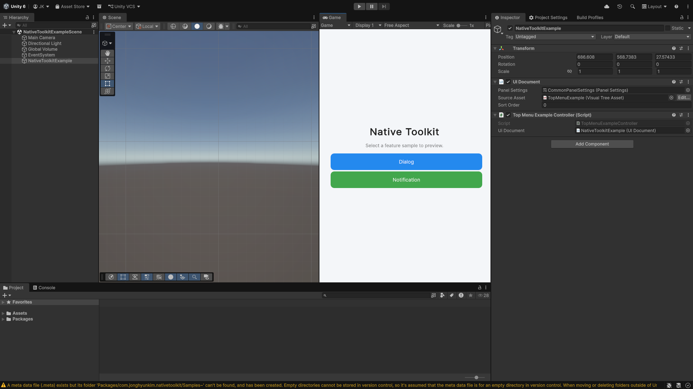
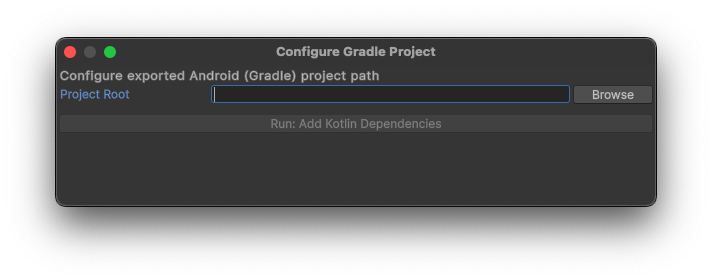
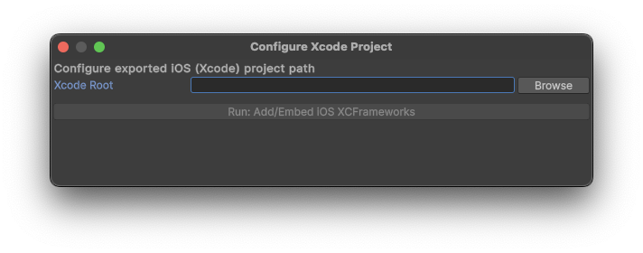

# Unity Native Toolkit (Unity 6)

[English](index.md) | [Korean](index.ko.md) | [Japanese](index.ja.md)

- Unity 6+에서 네이티브 기능을 제공하는 툴킷입니다.
- 패키지에는 Android/iOS/Windows/macOS용 네이티브 플러그인과 샘플 씬이 포함되며, 다이얼로그·알림·공유 등의 네이티브 기능을 싱글톤 API로 사용할 수 있습니다.
- Editor 창을 통해 네이티브 라이브러리와 Gradle/Xcode 설정을 추가하여 빌드 후 프로젝트 정리를 워크플로로 제공합니다.

# 버전

## 1.6.0

# 지원 OS 버전

- Android 12 이상
- iOS 18 이상
- Windows 11 이상
- macOS 15 이상

# 기능

## Android

- 다이얼로그 기능
  - 기본 다이얼로그
  - 확인 다이얼로그
  - 단일 선택 다이얼로그
  - 다중 선택 다이얼로그
  - 입력 다이얼로그
  - 로그인 다이얼로그

- 알림 기능
  - 즉시 알림
  - 예약 알림
  - 진행률 포그라운드 서비스
  - 알림 작업
  - 전체 화면 알림
  - 사용자 정의 보기 알림

- 공유 기능
  - 텍스트 / URL 공유
  - 이미지 / 다중 이미지 공유
  - 파일 / 다중 파일 공유
  - 커스텀 Chooser 액션 (API 34+)
  - 리치 프리뷰
  - 다이렉트 공유 타겟 등록
  - 콜백 포함 공유
  - 대기 중 콜백 취소

## iOS

- 다이얼로그 기능
  - 기본 다이얼로그
  - 확인 다이얼로그
  - 파괴적 다이얼로그
  - 액션 시트
  - 입력 다이얼로그
  - 로그인 다이얼로그
- 알림 기능
  - 알림 권한 요청 / 권한 상태 확인 / 알림 설정 화면 이동
  - 즉시 알림 (첨부 파일 알림 샘플 포함)
  - 예약 알림 (시간 간격 / 캘린더 / 위치 기반)
  - 알림 업데이트 / 취소 / 전달 완료 알림 삭제 / 상태 조회
  - 배지 개수 설정
  - 카테고리 등록 / 액션 / 텍스트 입력 액션
- 공유 기능
  - 텍스트 / URL / 프리뷰 포함 URL 공유
  - 이미지 / 다중 이미지 공유
  - 파일 / 다중 파일 공유
  - 텍스트와 URL 동시 공유
  - 제목 포함 공유
  - 공유 시트에서 특정 액티비티 제외

## Windows

- 다이얼로그 기능
  - 기본 다이얼로그
  - 파일 선택 다이얼로그
  - 다중 파일 선택 다이얼로그
  - 폴더 선택 다이얼로그
  - 다중 폴더 선택 다이얼로그
  - 파일 저장 다이얼로그

- 알림 기능
  - 즉시 알림
  - 예약 알림
  - 예약 알림 취소
  - 진행률 바 알림 표시 및 업데이트
  - 태그 지정 또는 전체 알림 삭제
  - 알림 권한 설정 쿼리
  - 시스템 알림 설정 열기
  - 알림 활성화 이벤트 수신 (콜드 스타트 포함)

## macOS

- 다이얼로그 기능
  - 기본 다이얼로그
  - 파일 선택 다이얼로그
  - 다중 파일 선택 다이얼로그
  - 폴더 선택 다이얼로그
  - 다중 폴더 선택 다이얼로그
  - 파일 저장 다이얼로그

- 알림 기능
  - 알림 권한 요청 / 권한 상태 확인 / 시스템 알림 설정 열기
  - 즉시 알림
  - 예약 알림 (시간 간격 / 캘린더)
  - 알림 업데이트 / 취소 / 전달된 알림 삭제
  - 예약된 알림 및 전달된 알림 목록 조회
  - 배지 카운트 관리
  - 카테고리 등록 / 액션 / 텍스트 입력 액션

## 추가 예정 기능

- 클립보드 연동

# 시작하기

## 설치

- Unity 6을 실행합니다.
- Window -> Package Manager를 선택합니다.
- "install from Git URL..."을 선택합니다.
- Native Toolkit 패키지의 Git URL을 입력합니다.
  - https://github.com/jonghyunkim/unity-native-plugin.git?path=/Packages/com.jonghyunkim.nativetoolkit#1.6.0
- "install"을 클릭합니다.
- 요구 사항:
  - Unity 6 이상
  - 의존 패키지: Localization, Addressables, Input System

## 샘플

- Unity 6을 실행합니다.
- Window -> Package Manager를 선택합니다.
- Unity Package Manager -> Native Toolkit -> Samples -> Import를 선택합니다.
- Tools -> Native Toolkit -> Sample을 선택합니다.
  

    
  

- Android 샘플
  - Game 뷰에 샘플 화면이 표시됩니다.
  - Build Profiles에서 "Android Profile" -> Export를 실행합니다.
  - Tools -> Native Toolkit -> Android -> Configure Gradle Project를 선택합니다.
  

    
  

  - "Browse"를 클릭하고 Export한 Android 프로젝트를 선택합니다.
  - "Run: Add Kotlin Dependencies"를 클릭하여 Kotlin 라이브러리를 추가합니다.
  - Android Studio에서 샘플 앱을 설치합니다.
    - <a href="https://developer.android.com/studio" target="_blank" rel="noopener noreferrer">참고</a>

- iOS 샘플
  - Game 뷰에 샘플 화면이 표시됩니다.
  - Build Profiles에서 "iOS Profile" -> Build를 실행합니다.
  - Tools -> Native Toolkit -> iOS -> Configure Xcode Project를 선택합니다.
  

    
  

  - "Browse"를 클릭하고 빌드된 iOS 프로젝트를 선택합니다.
  - "Run: Add/Embed iOS XCFrameworks"를 클릭하여 NativeToolkit 라이브러리를 추가합니다.
  - Xcode에서 샘플 앱을 설치합니다.
    - <a href="https://developer.apple.com/xcode" target="_blank" rel="noopener noreferrer">참고</a>

- Windows 샘플
  - Game 뷰에 샘플 화면이 표시됩니다.
  - Build Profiles에서 "Windows Profile" -> Build를 실행합니다.
  - 빌드 출력 폴더의 "Unity NativeToolkit.exe"를 실행합니다.

- macOS 샘플
  - Game 뷰에 샘플 화면이 표시됩니다.
  - Build Profiles에서 "macOS Profile" -> Build를 실행합니다.
  - Tools -> Native Toolkit -> macOS -> Configure Xcode Project를 선택합니다.
  

    
  

  - "Browse"를 클릭하고 빌드된 macOS 프로젝트를 선택합니다.
  - "Run: Add UnityMacNativeToolkit.xcframework"를 클릭하여 NativeToolkit 라이브러리를 추가합니다.
  - Xcode에서 샘플 앱을 설치합니다.
    - <a href="https://developer.apple.com/xcode" target="_blank" rel="noopener noreferrer">참고</a>

# API 사용법

- [다이얼로그](dialog.ko.md)
- [알림](notification.ko.md)
- [공유](share.ko.md)
