# 共有機能

言語:

- [English](share.md)
- 日本語（このページ）
- [한국어](share.ko.md)

← [マニュアルトップへ戻る](index.ja.md)

---

## 目次

- [Android](#android)
  - [セットアップ](#セットアップ)
  - [テキスト共有](#テキスト共有)
  - [URL共有](#url共有)
  - [カスタムChooserアクション付き共有（API 34+）](#カスタムchooserアクション付き共有api-34)
  - [件名・タイトル付き共有](#件名タイトル付き共有)
  - [リッチプレビュー付き共有](#リッチプレビュー付き共有)
  - [画像共有](#画像共有)
  - [複数画像共有](#複数画像共有)
  - [ファイル共有](#ファイル共有)
  - [複数ファイル共有](#複数ファイル共有)
  - [ダイレクト共有ターゲット](#ダイレクト共有ターゲット)
  - [コールバック付き共有](#コールバック付き共有)
  - [保留コールバックのキャンセル](#保留コールバックのキャンセル)
  - [イベントの受信](#イベントの受信)
  - [エラーハンドリング](#エラーハンドリング)
- [iOS](#ios)
  - [セットアップ](#セットアップ-1)
  - [テキスト共有](#テキスト共有-1)
  - [URL共有](#url共有-1)
  - [プレビュー付きURL共有](#プレビュー付きurl共有)
  - [画像共有](#画像共有-1)
  - [複数画像共有](#複数画像共有-1)
  - [ファイル共有](#ファイル共有-1)
  - [複数ファイル共有](#複数ファイル共有-1)
  - [テキストとURLの共有](#テキストとurlの共有)
  - [件名付き共有](#件名付き共有)
  - [特定アクティビティを除外した共有](#特定アクティビティを除外した共有)
  - [結果の受信](#結果の受信)
  - [エラーハンドリング](#エラーハンドリング-1)

---

## Android

### セットアップ

#### 名前空間のインポート

```csharp
// ガード: Android（Player）専用。エディター上でのネイティブ呼び出しを防ぎます。
#if UNITY_ANDROID && !UNITY_EDITOR
using JonghyunKim.NativeToolkit.Runtime.Share;
#endif
```

#### AndroidManifest.xml（ダイレクト共有に必要）

アプリを Android 共有シートのダイレクト共有ターゲットとして表示させるには、Android ライブラリプロジェクトのマニフェスト（例: `Assets/Plugins/Android/<your-app>.androidlib/AndroidManifest.xml`）に以下を追加します。`RegisterDirectShareTarget` を使用する場合のみ必要です。

```xml
<manifest xmlns:android="http://schemas.android.com/apk/res/android"
    package="com.example.your.androidlib">
    <application>
        <activity android:name="com.unity3d.player.UnityPlayerGameActivity" android:exported="true">
            <intent-filter>
                <action android:name="android.intent.action.SEND" />
                <category android:name="android.intent.category.DEFAULT" />
                <data android:mimeType="*/*" />
            </intent-filter>
            <meta-data
                android:name="android.app.shortcuts"
                android:resource="@xml/shortcuts" />
        </activity>
    </application>
</manifest>
```

同じ Android ライブラリプロジェクトに `res/xml/shortcuts.xml` を追加します:

```xml
<?xml version="1.0" encoding="utf-8"?>
<shortcuts xmlns:android="http://schemas.android.com/apk/res/android">
    <share-target android:targetClass="com.unity3d.player.UnityPlayerGameActivity">
        <data android:mimeType="*/*" />
        <category android:name="android.shortcut.conversation" />
    </share-target>
</shortcuts>
```

#### 画像・ファイル共有時のファイルパス

`ShareImage`、`ShareImages`、`ShareFile`、`ShareFiles` に渡すファイルは、ネイティブ FileProvider が対象とするディレクトリに存在する必要があります。`Application.persistentDataPath`（外部ファイルディレクトリにマップされ、FileProvider 設定で `<external-files-path>` として宣言済み）を使用してください。`Application.temporaryCachePath`（外部キャッシュディレクトリ）は FileProvider の対象外のため使用できません。

```csharp
string path = Path.Combine(Application.persistentDataPath, "my_image.png");
```

---

### テキスト共有

```csharp
#if UNITY_ANDROID && !UNITY_EDITOR
AndroidShareManager.Instance.ShareText(new ShareTextPayload
{
    text = "Hello from Unity! プレーンテキスト共有のサンプルです。"
});
#endif
```

<p align="center">
    
</p>

---

### URL共有

```csharp
#if UNITY_ANDROID && !UNITY_EDITOR
AndroidShareManager.Instance.ShareText(new ShareTextPayload
{
    text = "https://unity.com",
    mimeType = "text/plain"
});
#endif
```

<p align="center">
    
</p>

---

### カスタムChooserアクション付き共有（API 34+）

カスタムChooserアクションは、Android 共有チューザーダイアログに追加ボタンとして表示されます。Android 14（API 34）以降、およびChooserアクションをサポートするAARが必要です。それ以前のAPIレベルでは、カスタムアクションなしで共有が実行されます。

各アクションには、タップコールバックを受信するために一意の `intentAction` 文字列（`android.intent.action.SEND` 以外）を指定する必要があります。タップイベントは `ShareChooserActionTapped`（グローバルイベント）または `ShareText` の `onChooserAction` パラメーター（呼び出しごとのコールバック）で受信できます。

```csharp
#if UNITY_ANDROID && !UNITY_EDITOR
// Chooserアクションのタップを受信するためにグローバルイベントを購読します。
AndroidShareManager.Instance.ShareChooserActionTapped += result =>
{
    Debug.Log($"Chooserアクションがタップされました: {result.ActionId}");
};

AndroidShareManager.Instance.ShareText(new ShareTextPayload
{
    text = "カスタムChooserアクション付き共有（Android 14 / API 34+ のみ）。",
    chooserActions = new[]
    {
        new ChooserActionPayload
        {
            label = "保存",
            iconBase64 = iconBase64, // base64エンコードされたPNG/JPEG
            intentAction = "com.jonghyunkim.nativetoolkit.SHARE_CUSTOM_ACTION_SAVE"
        },
        new ChooserActionPayload
        {
            label = "開く",
            iconBase64 = iconBase64,
            intentAction = "com.jonghyunkim.nativetoolkit.SHARE_CUSTOM_ACTION_OPEN"
        }
    }
});
#endif
```

<p align="center">
    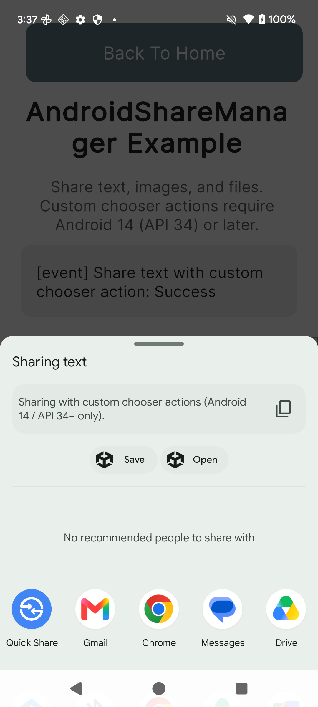
</p>

> **注意:** `chooserActions` の最大エントリ数は 5 です。超過した場合は警告がログに記録され、余分なエントリはネイティブ層で無視されます。`ShareWithCallback` は Chooser アクションをサポートしていません。代わりに `ShareText` に `chooserActions` を指定してください。

---

### 件名・タイトル付き共有

```csharp
#if UNITY_ANDROID && !UNITY_EDITOR
AndroidShareManager.Instance.ShareText(new ShareTextPayload
{
    text = "Unity から件名とタイトル付きで共有するサンプルです。",
    title = "Unity 共有サンプル",
    subject = "サンプル件名",
    mimeType = "text/plain"
});
#endif
```

<p align="center">
    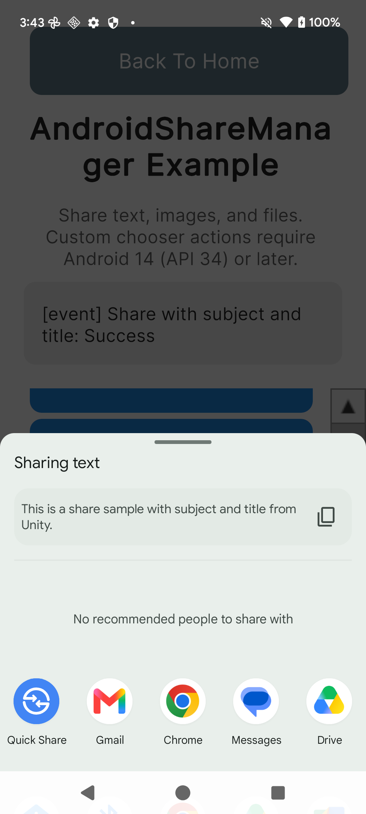
</p>

---

### リッチプレビュー付き共有

チューザーにプレビュータイトルとサムネイル画像を表示します。サムネイルのパスは FileProvider がアクセスできるディレクトリのファイルを指定する必要があります。

```csharp
#if UNITY_ANDROID && !UNITY_EDITOR
string thumbnailPath = Path.Combine(Application.persistentDataPath, "share_preview_thumbnail.png");
// ShareText を呼び出す前に、thumbnailPath へPNGファイルを書き込んでください。

AndroidShareManager.Instance.ShareText(new ShareTextPayload
{
    text = "Unity からのリッチプレビュー共有サンプルです！",
    previewTitle = "Unity リッチプレビューサンプル",
    previewThumbnailPath = thumbnailPath
});
#endif
```

<p align="center">
    
</p>

---

### 画像共有

```csharp
#if UNITY_ANDROID && !UNITY_EDITOR
string imagePath = Path.Combine(Application.persistentDataPath, "share_sample_image.png");
// ShareImage を呼び出す前に、imagePath へPNGファイルを書き込んでください。

AndroidShareManager.Instance.ShareImage(new ShareImagePayload
{
    filePath = imagePath,
    mimeType = "image/png"
});
#endif
```

<p align="center">
    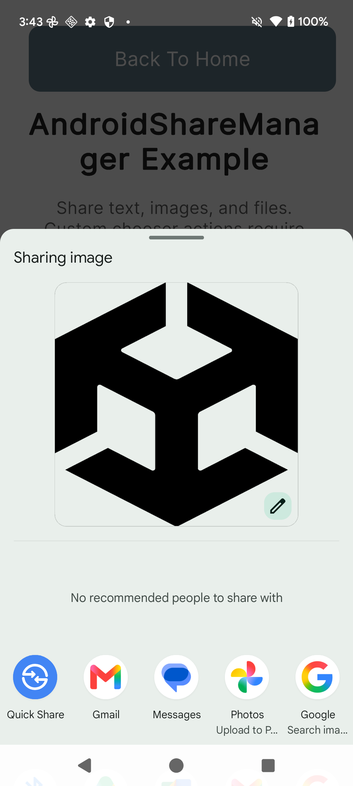
</p>

---

### 複数画像共有

```csharp
#if UNITY_ANDROID && !UNITY_EDITOR
string imagePath1 = Path.Combine(Application.persistentDataPath, "share_sample_image_1.png");
string imagePath2 = Path.Combine(Application.persistentDataPath, "share_sample_image_2.png");
// ShareImages を呼び出す前に、各パスへPNGファイルを書き込んでください。

AndroidShareManager.Instance.ShareImages(new ShareImagesPayload
{
    filePaths = new[] { imagePath1, imagePath2 }
});
#endif
```

<p align="center">
    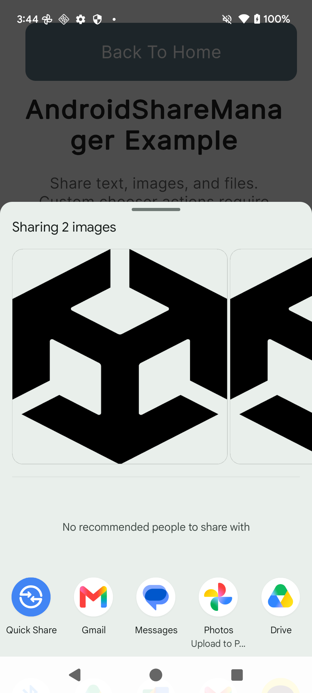
</p>

---

### ファイル共有

```csharp
#if UNITY_ANDROID && !UNITY_EDITOR
string filePath = Path.Combine(Application.persistentDataPath, "share_sample_file.txt");
File.WriteAllText(filePath, "Unity Native Toolkit から共有されたサンプルテキストファイルです。");

AndroidShareManager.Instance.ShareFile(new ShareFilePayload
{
    filePath = filePath
});
#endif
```

<p align="center">
    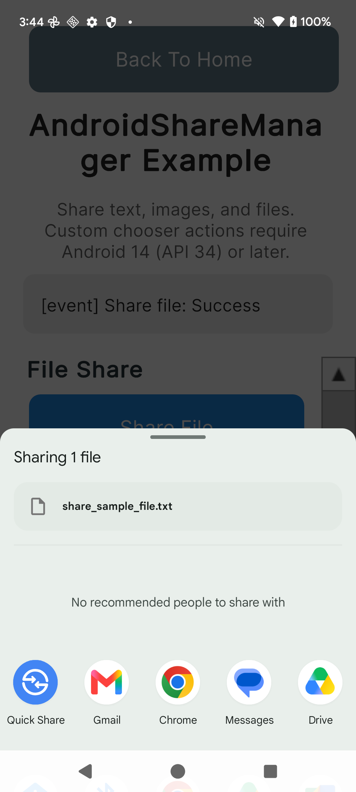
</p>

---

### 複数ファイル共有

```csharp
#if UNITY_ANDROID && !UNITY_EDITOR
string filePath1 = Path.Combine(Application.persistentDataPath, "share_sample_file_1.txt");
string filePath2 = Path.Combine(Application.persistentDataPath, "share_sample_file_2.txt");
File.WriteAllText(filePath1, "Unity Native Toolkit のサンプルファイル 1。");
File.WriteAllText(filePath2, "Unity Native Toolkit のサンプルファイル 2。");

AndroidShareManager.Instance.ShareFiles(new ShareFilesPayload
{
    filePaths = new[] { filePath1, filePath2 }
});
#endif
```

<p align="center">
    
</p>

---

### ダイレクト共有ターゲット

Android 共有シートのダイレクト共有行に表示されるショートカットを登録します。[セットアップ](#セットアップ)で説明したマニフェストと `shortcuts.xml` の設定が必要です。OS レベルのキャッシュにより、登録直後にショートカットが表示されない場合があります。

```csharp
#if UNITY_ANDROID && !UNITY_EDITOR
AndroidShareManager.Instance.RegisterDirectShareTarget(new DirectShareTargetPayload
{
    id = "native_toolkit_sample_target",
    label = "Unity サンプルターゲット",
    iconBase64 = iconBase64 // base64エンコードされたPNG/JPEG、小さいサイズを推奨（64x64）
});
#endif
```

<p align="center">
    
</p>

```csharp
#if UNITY_ANDROID && !UNITY_EDITOR
AndroidShareManager.Instance.RemoveDirectShareTargets(new RemoveDirectShareTargetsPayload
{
    ids = new[] { "native_toolkit_sample_target" }
});
#endif
```

<p align="center">
    
</p>

> **注意:** アイコンビットマップは Android Binder 経由で送信されます。Binder トランザクションサイズの上限を超えないよう、小さなサイズ（64×64 ピクセル推奨）に抑えてください。

---

### コールバック付き共有

テキストを共有し、ユーザーがアプリを選択したときにコールバックを受信します。`onStarted` はチューザーが起動したとき（成功・失敗を問わず）に発火します。`onSelected` はユーザーがアプリを選択したときに発火します（キャンセル・コピー・編集の場合は発火しません）。

```csharp
#if UNITY_ANDROID && !UNITY_EDITOR
AndroidShareManager.Instance.ShareWithCallback(
    new ShareTextPayload
    {
        text = "Unity からのコールバック付き共有サンプルです。アプリを選択すると選択結果を受信します。"
    },
    onStarted: result =>
    {
        string status = result.IsSuccess ? "成功" : "失敗";
        Debug.Log($"[onStarted] ShareWithCallback: {status}");
    },
    onSelected: result =>
    {
        string pkg = result.SelectedPackageName ?? "（不明）";
        Debug.Log($"[onSelected] 選択されたアプリ: {pkg}");
    });
#endif
```

<p align="center">
    
</p>

> **注意:** `ShareWithCallback` では `chooserActions` はサポートされていません。代わりに `ShareText` に `chooserActions` を指定してください。

---

### 保留コールバックのキャンセル

共有選択結果を待機している BroadcastReceiver をキャンセルします。例えば共有シートが選択なしで閉じられた後など、`onSelected` コールバックを受信したくない場合に呼び出します。画面遷移後に古いコールバックが残らないよう、`CancelPendingShareCallback` は `OnDisable` 時に自動的に呼び出されます。

```csharp
#if UNITY_ANDROID && !UNITY_EDITOR
AndroidShareManager.Instance.CancelPendingShareCallback();
#endif
```

---

### イベントの受信

画面遷移後に古い参照が残らないよう、`OnEnable` でイベントを購読し、`OnDisable` で購読解除してください。

```csharp
private void OnEnable()
{
#if UNITY_ANDROID && !UNITY_EDITOR
    AndroidShareManager.Instance.ShareOperationCompleted += OnShareOperationCompleted;
    AndroidShareManager.Instance.ShareCallbackReceived += OnShareCallbackReceived;
    AndroidShareManager.Instance.ShareChooserActionTapped += OnShareChooserActionTapped;
#endif
}

private void OnDisable()
{
#if UNITY_ANDROID && !UNITY_EDITOR
    AndroidShareManager.Instance.ShareOperationCompleted -= OnShareOperationCompleted;
    AndroidShareManager.Instance.ShareCallbackReceived -= OnShareCallbackReceived;
    AndroidShareManager.Instance.ShareChooserActionTapped -= OnShareChooserActionTapped;
    AndroidShareManager.Instance.CancelPendingShareCallback();
#endif
}

#if UNITY_ANDROID && !UNITY_EDITOR
private void OnShareOperationCompleted(ShareOperationResult result)
{
    string status = result.IsSuccess ? "成功" : "失敗";
    Debug.Log($"[event] {result.Operation}: {status}");
    if (!string.IsNullOrEmpty(result.ErrorMessage))
        Debug.LogError(result.ErrorMessage);
}

private void OnShareCallbackReceived(ShareCallbackResult result)
{
    string pkg = result.SelectedPackageName ?? "（不明）";
    Debug.Log($"[event] ShareCallback: {pkg} が選択されました");
}

private void OnShareChooserActionTapped(ShareChooserActionResult result)
{
    Debug.Log($"[event] Chooserアクションがタップされました: {result.ActionId}");
}
#endif
```

---

### エラーハンドリング

すべての共有操作は `ShareOperationCompleted` を通じて成功・失敗を報告します。`IsSuccess` が `false` の場合、`ErrorMessage` フィールドに説明が含まれます。

共有 API に渡すファイルは存在し、FileProvider がアクセスできるディレクトリにある必要があります。無効なパスを渡すと、`ShareOperationCompleted` を通じて `IllegalFileAccess` エラーが報告されます。

```csharp
#if UNITY_ANDROID && !UNITY_EDITOR
// ShareOperationCompleted でエラーが報告されます（IsSuccess = false）
AndroidShareManager.Instance.ShareFile(new ShareFilePayload
{
    filePath = "/invalid/path/that/does/not/exist/sample.txt"
});
#endif
```

---

## iOS

### セットアップ

#### 名前空間のインポート

`IosShareManager` は iOS ビルドターゲットが選択されている限り、エディターを含めて常にコンパイルされます。エディター上や非 iOS デバイスで `Share` を呼び出してもクラッシュせず、即座に失敗結果が返されます（[エラーハンドリング](#エラーハンドリング-1)参照）。

```csharp
#if UNITY_IOS || UNITY_EDITOR
using JonghyunKim.NativeToolkit.Runtime.Share;
#endif
```

#### 画像・ファイル共有時のパスについて

Android と異なり、iOS には FileProvider の制約がありません。`Application.persistentDataPath` 配下のファイルはそのまま共有できます。

```csharp
string path = Path.Combine(Application.persistentDataPath, "my_image.png");
```

---

### テキスト共有

```csharp
#if UNITY_IOS || UNITY_EDITOR
IosShareManager.Instance.Share(new IosShareContentPayload
{
    items = new[] { IosShareItem.Text("Shared from Unity Native Toolkit") }
});
#endif
```

<p align="center">
    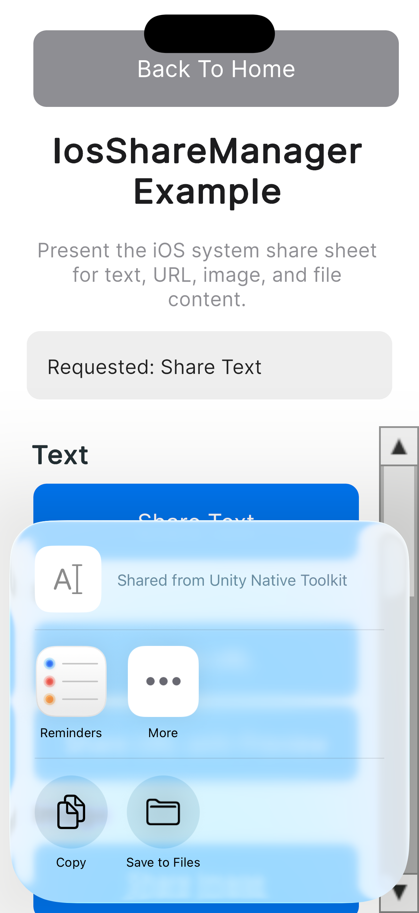
</p>

---

### URL共有

```csharp
#if UNITY_IOS || UNITY_EDITOR
IosShareManager.Instance.Share(new IosShareContentPayload
{
    items = new[] { IosShareItem.Url("https://unity.com") }
});
#endif
```

<p align="center">
    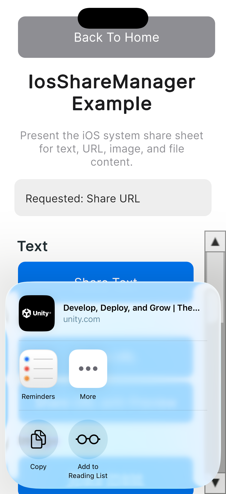
</p>

---

### プレビュー付きURL共有

`previewTitle` を指定すると、共有シートのコンテンツプレビュー領域に表示されるタイトルを設定できます。

```csharp
#if UNITY_IOS || UNITY_EDITOR
IosShareManager.Instance.Share(new IosShareContentPayload
{
    items = new[] { IosShareItem.Url("https://unity.com") },
    previewTitle = "Unity"
});
#endif
```

<p align="center">
    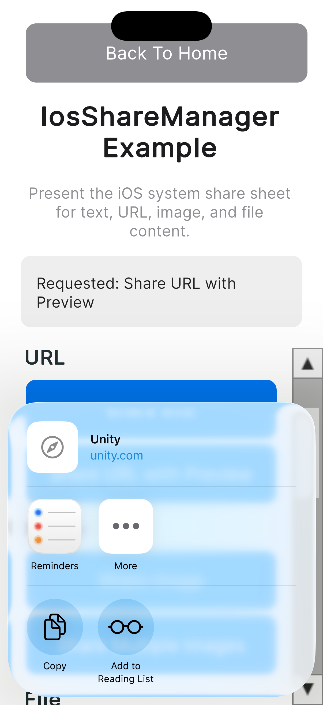
</p>

---

### 画像共有

```csharp
#if UNITY_IOS || UNITY_EDITOR
string imagePath = Path.Combine(Application.persistentDataPath, "share_sample_image.png");
// Share を呼び出す前に、imagePath に PNG ファイルを書き出しておきます。

IosShareManager.Instance.Share(new IosShareContentPayload
{
    items = new[] { IosShareItem.Image(imagePath) }
});
#endif
```

<p align="center">
    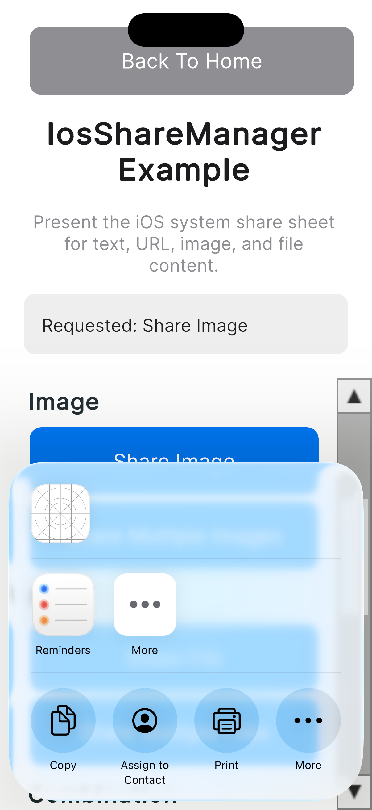
</p>

---

### 複数画像共有

```csharp
#if UNITY_IOS || UNITY_EDITOR
string imagePath1 = Path.Combine(Application.persistentDataPath, "share_sample_image_1.png");
string imagePath2 = Path.Combine(Application.persistentDataPath, "share_sample_image_2.png");
// Share を呼び出す前に、各パスに PNG ファイルを書き出しておきます。

IosShareManager.Instance.Share(new IosShareContentPayload
{
    items = new[] { IosShareItem.Image(imagePath1), IosShareItem.Image(imagePath2) }
});
#endif
```

<p align="center">
    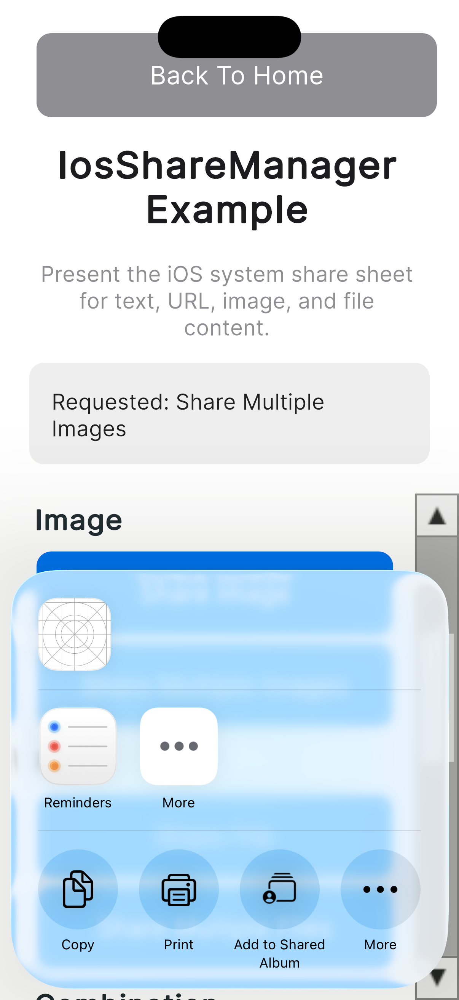
</p>

---

### ファイル共有

```csharp
#if UNITY_IOS || UNITY_EDITOR
string filePath = Path.Combine(Application.persistentDataPath, "share_sample_file.txt");
File.WriteAllText(filePath, "This is a sample text file shared from Unity Native Toolkit.");

IosShareManager.Instance.Share(new IosShareContentPayload
{
    items = new[] { IosShareItem.File(filePath) }
});
#endif
```

<p align="center">
    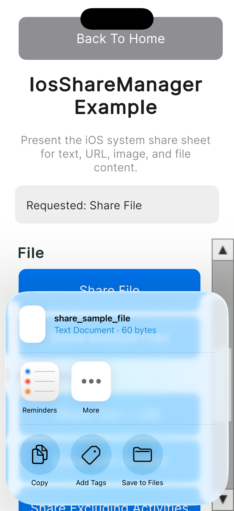
</p>

---

### 複数ファイル共有

```csharp
#if UNITY_IOS || UNITY_EDITOR
string filePath1 = Path.Combine(Application.persistentDataPath, "share_sample_file_1.txt");
string filePath2 = Path.Combine(Application.persistentDataPath, "share_sample_file_2.txt");
File.WriteAllText(filePath1, "Sample file 1 from Unity Native Toolkit.");
File.WriteAllText(filePath2, "Sample file 2 from Unity Native Toolkit.");

IosShareManager.Instance.Share(new IosShareContentPayload
{
    items = new[] { IosShareItem.File(filePath1), IosShareItem.File(filePath2) }
});
#endif
```

<p align="center">
    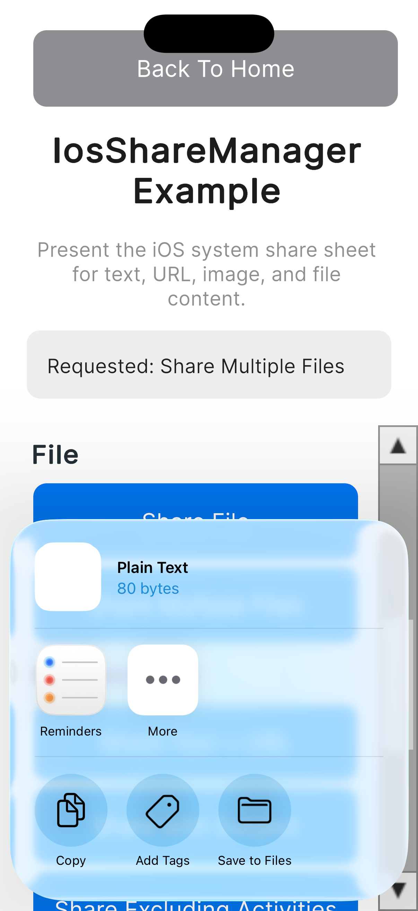
</p>

---

### テキストとURLの共有

1回の `Share` 呼び出しで、異なる種類の複数アイテムをまとめて共有できます。

```csharp
#if UNITY_IOS || UNITY_EDITOR
IosShareManager.Instance.Share(new IosShareContentPayload
{
    items = new[] { IosShareItem.Text("Check this out"), IosShareItem.Url("https://unity.com") }
});
#endif
```

<p align="center">
    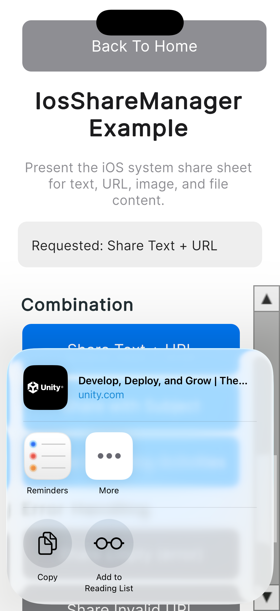
</p>

---

### 件名付き共有

`subject` は、Mail などのアクティビティでメッセージの件名として使用されます。

```csharp
#if UNITY_IOS || UNITY_EDITOR
IosShareManager.Instance.Share(new IosShareContentPayload
{
    items = new[] { IosShareItem.Text("Body text") },
    subject = "Sample Subject"
});
#endif
```

<p align="center">
    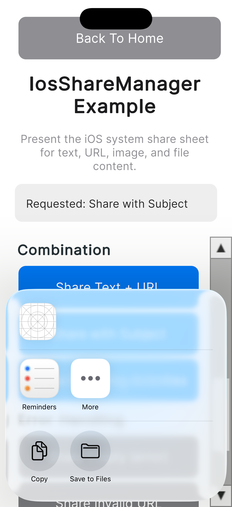
</p>

---

### 特定アクティビティを除外した共有

`excludedActivityTypes` を指定すると、共有シートから指定したアクティビティタイプ（raw identifier）を非表示にできます。

```csharp
#if UNITY_IOS || UNITY_EDITOR
IosShareManager.Instance.Share(new IosShareContentPayload
{
    items = new[] { IosShareItem.Url("https://unity.com") },
    excludedActivityTypes = new[]
    {
        "com.apple.UIKit.activity.CopyToPasteboard",
        "com.apple.UIKit.activity.PostToFacebook"
    }
});
#endif
```

<p align="center">
    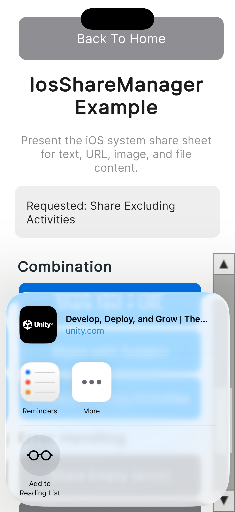
</p>

> **注記:** 特定のアクティビティタイプが実際に共有シートに表示されるかは、端末やインストール済みアプリにも依存します。Facebook のようなサードパーティアクティビティは検証端末にインストールされていない場合があるため、`com.apple.UIKit.activity.CopyToPasteboard`（コピー）を主な確認対象としてください。

---

### 結果の受信

画面遷移後の古い参照を避けるため、`OnEnable` で `ShareCompleted` を購読し、`OnDisable` で解除します。`ShareCompleted` は、`Share` に渡した任意の個別コールバックより必ず先に発火します。

```csharp
private void OnEnable()
{
#if UNITY_IOS || UNITY_EDITOR
    IosShareManager.Instance.ShareCompleted += OnShareCompleted;
#endif
}

private void OnDisable()
{
#if UNITY_IOS || UNITY_EDITOR
    IosShareManager.Instance.ShareCompleted -= OnShareCompleted;
#endif
}

#if UNITY_IOS || UNITY_EDITOR
private void OnShareCompleted(IosShareResult result)
{
    if (!result.IsSuccess)
    {
        Debug.LogError($"Share failed: {result.ErrorMessage}");
        return;
    }

    if (result.Completed)
    {
        Debug.Log($"Share completed: activityType={result.ActivityType}");
    }
    else
    {
        Debug.Log("Share cancelled by the user.");
    }
}
#endif
```

> **注記:** ユーザーによるキャンセルはエラーとして扱われません。`IsSuccess` は `true`、`Completed` は `false` となり、`ActivityType` は `null` になります。

---

### エラーハンドリング

すべての `Share` 呼び出しの結果は `ShareCompleted`（および `Share` に渡した任意の個別コールバック）を通じて報告されます。`IsSuccess` が `false` の場合、`ErrorMessage` は必ず non-null になります。

```csharp
#if UNITY_IOS || UNITY_EDITOR
// アイテムなし: 共有シートを提示せずに即座に失敗します。
// ErrorMessage: "No shareable items were provided."
IosShareManager.Instance.Share(new IosShareContentPayload
{
    items = Array.Empty<IosShareItem>()
});

// 不正なURL文字列: ネイティブ側のバリデーションエラーで失敗します。
// ErrorMessage: "Invalid URL: not a valid url."
IosShareManager.Instance.Share(new IosShareContentPayload
{
    items = new[] { IosShareItem.Url("not a valid url") }
});

// ファイル不在: ネイティブ側がファイルを見つけられない場合に失敗します。
// ErrorMessage: "File not found at path: /nonexistent/share-missing.txt."
IosShareManager.Instance.Share(new IosShareContentPayload
{
    items = new[] { IosShareItem.File("/nonexistent/share-missing.txt") }
});

// 画像不在: ネイティブ側が画像を読み込めない場合に失敗します。
// ErrorMessage: "Failed to load image at path: /nonexistent/share-missing.png."
IosShareManager.Instance.Share(new IosShareContentPayload
{
    items = new[] { IosShareItem.Image("/nonexistent/share-missing.png") }
});
#endif
```

> **注記:** エディター上や非 iOS デバイスで `Share` を呼び出した場合も失敗となり、`ErrorMessage` には `"iOS share is only available on an iOS device."` が設定されます。これにより、実機がなくてもエディターのサンプルシーンでナビゲーションと結果表示の動作を確認できます。
