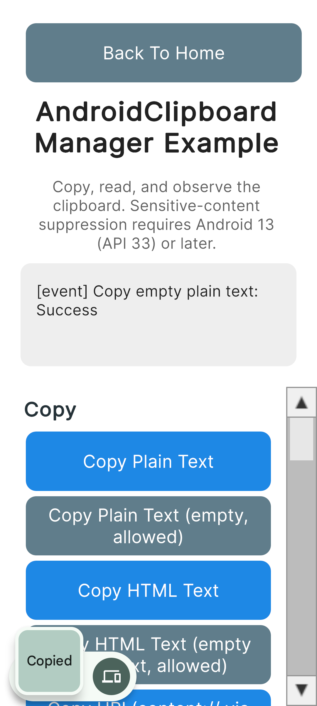
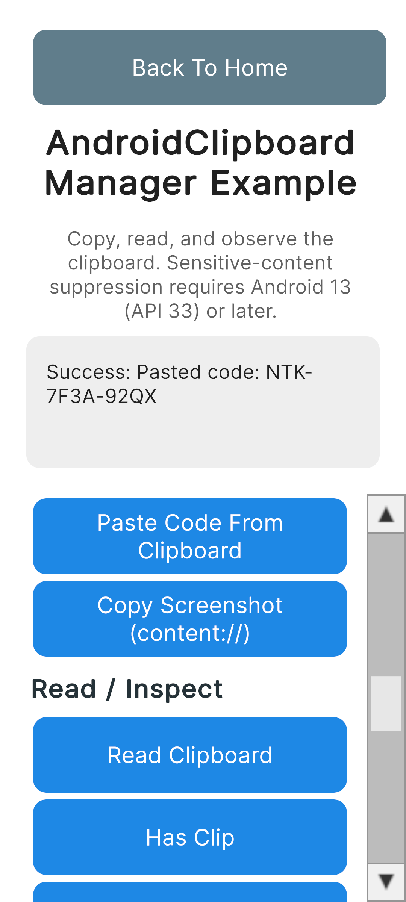

# Clipboard Feature

Language:

- English (this page)
- 日本語: [clipboard.ja.md](clipboard.ja.md)
- 한국어: [clipboard.ko.md](clipboard.ko.md)

← [Back to manual top](index.md)

---

## Table of Contents

- [Android](#android)
  - [Setup](#setup)
  - [Copy Plain Text](#copy-plain-text)
  - [Copy Plain Text (Empty, Allowed)](#copy-plain-text-empty-allowed)
  - [Copy HTML Text](#copy-html-text)
  - [Copy HTML Text with Empty Plain Text Fallback](#copy-html-text-with-empty-plain-text-fallback)
  - [Copy URI](#copy-uri)
  - [Copy Multiple Text](#copy-multiple-text)
  - [Copy Sensitive Text](#copy-sensitive-text)
  - [Game Use Cases](#game-use-cases)
    - [Copy Invite Code](#copy-invite-code)
    - [Paste Code from Clipboard](#paste-code-from-clipboard)
    - [Copy Screenshot](#copy-screenshot)
  - [Read Clipboard](#read-clipboard)
  - [Has Clip](#has-clip)
  - [Get Description](#get-description)
  - [Clear Clipboard](#clear-clipboard)
  - [Start / Stop Observing](#start--stop-observing)
  - [Receive Events](#receive-events)
  - [Error Handling](#error-handling)

---

## Android

Clipboard support targets Android only. There is no iOS, Windows, or macOS implementation of this feature.

### Setup

#### Import the namespace

`AndroidClipboardManager` compiles only when the Android build target is selected.

```csharp
// Guard: Android only. AndroidClipboardManager does not exist on other build targets.
#if UNITY_ANDROID
using JonghyunKim.NativeToolkit.Runtime.Clipboard;
#endif
```

Call sites in your own scripts (for example a MonoBehaviour that also runs in the Editor) should additionally exclude the Editor at the call site, since the native bridge only exists on an Android device:

```csharp
#if UNITY_ANDROID && !UNITY_EDITOR
AndroidClipboardManager.Instance.CopyPlainText(new CopyPlainTextPayload { text = "Hello" });
#endif
```

#### Synchronous vs. asynchronous APIs

- `Read`, `HasClip`, and `GetDescription` are synchronous: they return their result directly and never raise `ClipboardOperationCompleted`.
- `CopyPlainText`, `CopyHtmlText`, `CopyUri`, `CopyMultipleText`, `Clear`, and `StopObserving` are asynchronous: they report their result through the `ClipboardOperationCompleted` event, followed by an optional per-call callback.
- `StartObserving` reports no result at all, on success or failure. See [Start / Stop Observing](#start--stop-observing).

#### content:// URIs (required for Copy URI and Copy Screenshot)

The clipboard API takes a URI string but has no built-in way to build one. Use the FileProvider bundled in the native-toolkit AAR (the same FileProvider used by the Share feature). It is declared in the AAR manifest as `${applicationId}.native_toolkit.share.fileprovider`; no additional manifest entry is required in your app.

```csharp
#if UNITY_ANDROID && !UNITY_EDITOR
private static string CreateContentUri(string path)
{
    using var unityPlayer = new AndroidJavaClass("com.unity3d.player.UnityPlayer");
    using var activity = unityPlayer.GetStatic<AndroidJavaObject>("currentActivity");
    using var file = new AndroidJavaObject("java.io.File", path);
    string authority = $"{Application.identifier}.native_toolkit.share.fileprovider";
    using var fileProvider = new AndroidJavaClass("androidx.core.content.FileProvider");
    using var uri = fileProvider.CallStatic<AndroidJavaObject>("getUriForFile", activity, authority, file);
    return uri.Call<string>("toString");
}
#endif
```

> **Note:** The FileProvider authority is built from `Application.identifier`. If your Gradle template applies an `applicationIdSuffix`, verify the authority matches the merged manifest; otherwise `getUriForFile` throws `IllegalArgumentException`.

---

### Copy Plain Text

```csharp
#if UNITY_ANDROID && !UNITY_EDITOR
AndroidClipboardManager.Instance.CopyPlainText(new CopyPlainTextPayload
{
    text = "Hello from Unity Native Toolkit",
    label = "sample"
});
#endif
```

<p align="center">
    
</p>

---

### Copy Plain Text (Empty, Allowed)

A blank `text` value is explicitly accepted by the native layer and does not fail, unlike `CopyHtmlText`'s `htmlText`.

```csharp
#if UNITY_ANDROID && !UNITY_EDITOR
AndroidClipboardManager.Instance.CopyPlainText(new CopyPlainTextPayload
{
    text = ""
});
#endif
```

<p align="center">
    
</p>

---

### Copy HTML Text

```csharp
#if UNITY_ANDROID && !UNITY_EDITOR
AndroidClipboardManager.Instance.CopyHtmlText(new CopyHtmlTextPayload
{
    plainText = "Hello",
    htmlText = "<b>Hello</b>"
});
#endif
```

<p align="center">
    
</p>

---

### Copy HTML Text with Empty Plain Text Fallback

`plainText` may be blank; only a blank `htmlText` fails (see [Error Handling](#error-handling)).

```csharp
#if UNITY_ANDROID && !UNITY_EDITOR
AndroidClipboardManager.Instance.CopyHtmlText(new CopyHtmlTextPayload
{
    plainText = "",
    htmlText = "<b>Html only</b>"
});
#endif
```

<p align="center">
    
</p>

---

### Copy URI

Copies a `content://` URI, for example a reference to an image or file. See [content:// URIs](#content-uris-required-for-copy-uri-and-copy-screenshot) above for how to build the URI string.

```csharp
#if UNITY_ANDROID && !UNITY_EDITOR
string path = Path.Combine(Application.persistentDataPath, "clipboard_sample.txt");
File.WriteAllText(path, "Clipboard sample file content");
string uri = CreateContentUri(path);

AndroidClipboardManager.Instance.CopyUri(new CopyUriPayload
{
    uri = uri
});
#endif
```

<p align="center">
    
</p>

> **Note:** Whether the receiving app can read the pasted `content://` URI depends on the device and the target app; a plain-text receiver will not resolve it.

---

### Copy Multiple Text

Copies multiple plain-text items as one clip. Individual empty strings inside `texts` are accepted; only an empty array fails (see [Error Handling](#error-handling)).

```csharp
#if UNITY_ANDROID && !UNITY_EDITOR
AndroidClipboardManager.Instance.CopyMultipleText(new CopyMultipleTextPayload
{
    texts = new[] { "First", "", "Third" }
});
#endif
```

<p align="center">
    
</p>

---

### Copy Sensitive Text

Set `isSensitive` to request preview suppression in the system clipboard UI. This hint only takes effect on Android 13 (API 33) or later; on earlier versions the clip is copied normally without suppression.

```csharp
#if UNITY_ANDROID && !UNITY_EDITOR
AndroidClipboardManager.Instance.CopyPlainText(new CopyPlainTextPayload
{
    text = "P@ssw0rd-sample",
    isSensitive = true
});
#endif
```

<p align="center">
    
</p>

---

### Game Use Cases

Typical in-game clipboard flows: sharing an invite code, letting a player paste a code they received, and copying a screenshot to share elsewhere.

#### Copy Invite Code

```csharp
#if UNITY_ANDROID && !UNITY_EDITOR
AndroidClipboardManager.Instance.CopyPlainText(new CopyPlainTextPayload
{
    text = "NTK-7F3A-92QX",
    label = "invite code"
});
#endif
```

<p align="center">
    
</p>

#### Paste Code from Clipboard

Reads the clipboard synchronously and extracts the first item's plain text. This does not fall back to a coerced/best-effort text: a clip that holds only a `content://` URI (such as one produced by [Copy Screenshot](#copy-screenshot)) reports that no text item was found, rather than displaying the URI as if it were a pasted code.

```csharp
#if UNITY_ANDROID && !UNITY_EDITOR
var result = AndroidClipboardManager.Instance.Read();
switch (result.Status)
{
    case ClipboardReadStatus.HasContent:
        string? code = ExtractFirstText(result.Contents!);
        // code is null when the clip holds no plain-text item (for example a URI-only clip).
        break;
    case ClipboardReadStatus.Empty:
        // Clipboard is empty. This is a normal outcome, not a failure.
        break;
    default:
        // result.ErrorCode / result.ErrorMessage describe the failure.
        break;
}

static string? ExtractFirstText(ClipContents contents)
{
    foreach (var item in contents.Items)
    {
        if (!string.IsNullOrEmpty(item.Text)) return item.Text;
    }
    return null;
}
#endif
```

<p align="center">
    
</p>

> **Security note:** Never log the pasted value; it may be a coupon code or other sensitive data. Log only `result.Status` and `result.ErrorCode`.

#### Copy Screenshot

Captures the current frame and copies it as a `content://` URI. `ScreenCapture.CaptureScreenshotAsTexture` requires the frame to be fully rendered, so the capture must run inside a coroutine after `WaitForEndOfFrame`. Always destroy the captured `Texture2D` once its PNG bytes have been written, or it leaks.

```csharp
#if UNITY_ANDROID && !UNITY_EDITOR
private IEnumerator CaptureAndCopyScreenshot()
{
    yield return new WaitForEndOfFrame();

    string uri;
    Texture2D? screenshot = null;
    try
    {
        screenshot = ScreenCapture.CaptureScreenshotAsTexture();
        byte[] png = screenshot.EncodeToPNG();
        string path = Path.Combine(Application.persistentDataPath, "clipboard_screenshot.png");
        File.WriteAllBytes(path, png);
        uri = CreateContentUri(path);
    }
    finally
    {
        if (screenshot != null) Destroy(screenshot);
    }

    AndroidClipboardManager.Instance.CopyUri(new CopyUriPayload
    {
        uri = uri,
        label = "screenshot"
    });
}
#endif
```

<p align="center">
    
</p>

> **Note:** Whether the receiving app can read the pasted screenshot depends on the device and the target app, as with any `content://` clip.

---

### Read Clipboard

Synchronous. Returns clip content, an empty result, or a failure — an empty clipboard is a normal outcome, distinct from a failed read.

```csharp
#if UNITY_ANDROID && !UNITY_EDITOR
var result = AndroidClipboardManager.Instance.Read();
switch (result.Status)
{
    case ClipboardReadStatus.HasContent:
        ClipContents contents = result.Contents!;
        // contents.Label, contents.MimeTypes, contents.Items (Text / HtmlText / Uri / CoercedText per item)
        break;
    case ClipboardReadStatus.Empty:
        // Normal outcome, not a failure.
        break;
    default:
        // result.ErrorCode / result.ErrorMessage describe the failure.
        break;
}
#endif
```

<p align="center">
    
</p>

> **Security note:** Clipboard content may hold passwords or tokens. Log only `result.Status` and `result.ErrorCode`; never log the clip content itself.

---

### Has Clip

Synchronous. Returns `false` both when the clipboard is genuinely empty and when the check itself could not be performed; the two cases are indistinguishable from C#.

```csharp
#if UNITY_ANDROID && !UNITY_EDITOR
bool hasClip = AndroidClipboardManager.Instance.HasClip();
#endif
```

<p align="center">
    
</p>

---

### Get Description

Synchronous. Reads clipboard metadata (label, MIME types, styled-text flag, classification status) without touching the clip body.

```csharp
#if UNITY_ANDROID && !UNITY_EDITOR
var result = AndroidClipboardManager.Instance.GetDescription();
switch (result.Status)
{
    case ClipboardReadStatus.HasContent:
        ClipDescriptionInfo info = result.Description!;
        // info.Label, info.MimeTypes, info.IsStyledText, info.ClassificationStatus (null below API 31)
        break;
    case ClipboardReadStatus.Empty:
        break;
    default:
        break;
}
#endif
```

<p align="center">
    
</p>

---

### Clear Clipboard

Asynchronous; reports through `ClipboardOperationCompleted`.

```csharp
#if UNITY_ANDROID && !UNITY_EDITOR
AndroidClipboardManager.Instance.Clear();
#endif
```

<p align="center">
    
</p>

---

### Start / Stop Observing

`StartObserving` reports no result at all, on either success or failure — do not display it as a success. Clipboard changes while observing are delivered through the `ClipboardChanged` event (see [Receive Events](#receive-events)). A second call while already observing is a no-op on the native side. Observation is only reliable while the app is in the foreground (an Android 10+ platform restriction).

`StopObserving` is asynchronous like the other operations and reports through `ClipboardOperationCompleted`. Call it in `OnDisable` so observation does not continue after your screen is hidden.

```csharp
#if UNITY_ANDROID && !UNITY_EDITOR
// Start: no result is reported. Change the clipboard afterward to verify via ClipboardChanged.
AndroidClipboardManager.Instance.StartObserving();

// Stop: reports through ClipboardOperationCompleted, like Clear.
AndroidClipboardManager.Instance.StopObserving();
#endif
```

<p align="center">
    
</p>

---

### Receive Events

Subscribe to events on `OnEnable` and unsubscribe on `OnDisable`. Also call `StopObserving` on `OnDisable` so a hidden screen does not keep observing.

```csharp
private void OnEnable()
{
#if UNITY_ANDROID && !UNITY_EDITOR
    AndroidClipboardManager.Instance.ClipboardOperationCompleted += OnClipboardOperationCompleted;
    AndroidClipboardManager.Instance.ClipboardChanged += OnClipboardChanged;
#endif
}

private void OnDisable()
{
#if UNITY_ANDROID && !UNITY_EDITOR
    AndroidClipboardManager.Instance.ClipboardOperationCompleted -= OnClipboardOperationCompleted;
    AndroidClipboardManager.Instance.ClipboardChanged -= OnClipboardChanged;
    AndroidClipboardManager.Instance.StopObserving();
#endif
}

#if UNITY_ANDROID && !UNITY_EDITOR
private void OnClipboardOperationCompleted(ClipboardOperationResult result)
{
    string status = result.IsSuccess ? "Success" : "Failed";
    Debug.Log($"[event] {result.Operation}: {status}");
    if (!string.IsNullOrEmpty(result.ErrorMessage))
        Debug.LogError(result.ErrorMessage);
}

private void OnClipboardChanged()
{
    Debug.Log("[event] Clipboard changed");
}
#endif
```

`ClipboardOperationCompleted` always fires before any per-call callback passed to `CopyPlainText`, `CopyHtmlText`, `CopyUri`, `CopyMultipleText`, `Clear`, or `StopObserving`. If both a subscriber to the event and a per-call callback throw, each exception is caught independently — one throwing does not prevent the other from being invoked.

---

### Error Handling

All asynchronous operations report success or failure via `ClipboardOperationCompleted`. `ErrorMessage` is non-null only when `IsSuccess` is `false`.

```csharp
#if UNITY_ANDROID && !UNITY_EDITOR
// Blank HTML text fails: CLIPBOARD_EMPTY_CONTENT.
// ErrorMessage: "Clipboard content is empty. Please provide text or HTML."
AndroidClipboardManager.Instance.CopyHtmlText(new CopyHtmlTextPayload
{
    plainText = "Hello",
    htmlText = ""
});

// Empty items array fails: CLIPBOARD_EMPTY_ITEMS.
// ErrorMessage: "No items provided for clipboard copy."
AndroidClipboardManager.Instance.CopyMultipleText(new CopyMultipleTextPayload
{
    texts = Array.Empty<string>()
});

// Blank URI fails: CLIPBOARD_INVALID_URI.
AndroidClipboardManager.Instance.CopyUri(new CopyUriPayload
{
    uri = ""
});

// http:// scheme is rejected; only content:// URIs are supported: CLIPBOARD_INVALID_URI.
// ErrorMessage starts with "Invalid URI:".
AndroidClipboardManager.Instance.CopyUri(new CopyUriPayload
{
    uri = "http://example.com/x"
});
#endif
```

The full set of stable error codes reported through `ErrorCode`:

| Error Code | Meaning |
| --- | --- |
| `CLIPBOARD_EMPTY_CONTENT` | `CopyHtmlText` was called with a blank `htmlText`. |
| `CLIPBOARD_EMPTY_ITEMS` | `CopyMultipleText` was called with an empty `texts` array. |
| `CLIPBOARD_INVALID_URI` | `CopyUri` was called with a blank, malformed, or non-`content://` URI. |
| `CLIPBOARD_READ_NOT_ALLOWED` | The native layer refused a read (for example, a focus/permission restriction). |
| `CLIPBOARD_SECURITY` | The native layer denied the operation for a security reason. |
| `CLIPBOARD_UNAVAILABLE` | The system `ClipboardManager` could not be obtained. |
| `CLIPBOARD_UNKNOWN` | An unrecognized failure; also used for parse failures on the Unity side. |

`Read` and `GetDescription` can additionally fail with `CLIPBOARD_BRIDGE_UNAVAILABLE` when the native bridge itself could not be reached (not running on Android, plugin not initialized, or no current Activity) — this is a Unity-side error code, not one reported by the native layer.
