# 클립보드 기능

언어:

- [English](clipboard.md)
- [日本語](clipboard.ja.md)
- 한국어（이 페이지）

← [매뉴얼 상단으로 돌아가기](index.ko.md)

---

## 목차

- [Android](#android)
  - [설정](#설정)
  - [일반 텍스트 복사](#일반-텍스트-복사)
  - [일반 텍스트 복사 (빈 문자열, 허용됨)](#일반-텍스트-복사-빈-문자열-허용됨)
  - [HTML 텍스트 복사](#html-텍스트-복사)
  - [일반 텍스트가 빈 HTML 복사](#일반-텍스트가-빈-html-복사)
  - [URI 복사](#uri-복사)
  - [다중 텍스트 복사](#다중-텍스트-복사)
  - [민감한 텍스트 복사](#민감한-텍스트-복사)
  - [게임 활용 사례](#게임-활용-사례)
    - [초대 코드 복사](#초대-코드-복사)
    - [클립보드에서 코드 붙여넣기](#클립보드에서-코드-붙여넣기)
    - [스크린샷 복사](#스크린샷-복사)
  - [클립보드 읽기](#클립보드-읽기)
  - [클립 존재 여부 확인](#클립-존재-여부-확인)
  - [메타데이터 조회](#메타데이터-조회)
  - [클립보드 지우기](#클립보드-지우기)
  - [관찰 시작·중지](#관찰-시작중지)
  - [이벤트 수신](#이벤트-수신)
  - [에러 처리](#에러-처리)
- [iOS](#ios)
  - [설정](#설정-1)
  - [페이스트보드 스코프](#페이스트보드-스코프)
  - [일반 텍스트 복사](#일반-텍스트-복사-1)
  - [HTML 텍스트 복사](#html-텍스트-복사-1)
  - [URL 복사](#url-복사)
  - [이미지 파일 복사](#이미지-파일-복사)
  - [이미지 데이터 복사](#이미지-데이터-복사)
  - [색상 복사](#색상-복사)
  - [커스텀 데이터 복사](#커스텀-데이터-복사)
  - [다중 텍스트 복사](#다중-텍스트-복사-1)
  - [다중 표현 복사](#다중-표현-복사)
  - [복사 옵션](#복사-옵션)
  - [추가](#추가)
  - [읽기](#읽기)
  - [데이터 읽기](#데이터-읽기)
  - [스냅샷](#스냅샷)
  - [아이템 로드](#아이템-로드)
  - [로드 취소](#로드-취소)
  - [패턴 감지](#패턴-감지)
  - [값 감지](#값-감지)
  - [변경 관찰](#변경-관찰)
  - [포그라운드 복귀 시 변경 확인](#포그라운드-복귀-시-변경-확인)
  - [지우기](#지우기)
  - [동시 실행과 Busy 거부](#동시-실행과-busy-거부)
  - [이벤트 수신](#이벤트-수신-1)
  - [에러 처리](#에러-처리-1)

---

## Android

클립보드 기능은 Android와 iOS를 대상으로 합니다. Windows·macOS 구현은 제공되지 않습니다. 두 플랫폼은 Manager와 API가 서로 다른 계열이며, iOS 쪽은 [iOS](#ios)를 참고하세요.

### 설정

#### 네임스페이스 가져오기

`AndroidClipboardManager`는 Android 빌드 타겟이 선택된 경우에만 컴파일됩니다.

```csharp
// 가드: Android 전용. AndroidClipboardManager는 다른 빌드 타겟에는 존재하지 않습니다.
#if UNITY_ANDROID
using JonghyunKim.NativeToolkit.Runtime.Clipboard;
#endif
```

네이티브 브리지는 실제 기기에서만 존재하므로, 에디터에서도 실행되는 MonoBehaviour 등 자체 스크립트의 호출 지점에서는 에디터를 추가로 제외해야 합니다.

```csharp
#if UNITY_ANDROID && !UNITY_EDITOR
AndroidClipboardManager.Instance.CopyPlainText(new CopyPlainTextPayload { text = "Hello" });
#endif
```

#### 동기 API와 비동기 API

- `Read`, `HasClip`, `GetDescription`은 동기 API로, 결과를 즉시 반환하며 `ClipboardOperationCompleted`를 발생시키지 않습니다.
- `CopyPlainText`, `CopyHtmlText`, `CopyUri`, `CopyMultipleText`, `Clear`, `StopObserving`은 비동기 API로, `ClipboardOperationCompleted` 이벤트를 통해 결과를 알린 뒤 선택적으로 호출별 콜백을 호출합니다.
- `StartObserving`은 성공·실패 여부와 관계없이 결과를 전혀 알리지 않습니다. 자세한 내용은 [관찰 시작·중지](#관찰-시작중지)를 참고하세요.

#### content:// URI (Copy URI · Copy Screenshot에 필요)

클립보드 API는 URI 문자열을 인자로 받지만 이를 생성하는 기능은 제공하지 않습니다. native-toolkit AAR에 포함된 FileProvider(Share 기능이 사용하는 것과 동일)를 사용하세요. AAR 매니페스트에 `${applicationId}.native_toolkit.share.fileprovider`로 이미 선언되어 있어 앱 측에서 별도로 매니페스트를 추가할 필요가 없습니다.

```csharp
#if UNITY_ANDROID && !UNITY_EDITOR
private static string CreateContentUri(string path)
{
    using var unityPlayer = new AndroidJavaClass("com.unity3d.player.UnityPlayer");
    using var activity = unityPlayer.GetStatic<AndroidJavaObject>("currentActivity");
    using var file = new AndroidJavaObject("java.io.File", path);
    string authority = $"{Application.identifier}.native_toolkit.share.fileprovider";
    using var fileProvider = new AndroidJavaClass("androidx.core.content.FileProvider");
    using var uri = fileProvider.CallStatic<AndroidJavaObject>("getUriForFile", activity, authority, file);
    return uri.Call<string>("toString");
}
#endif
```

> **참고:** FileProvider의 authority는 `Application.identifier`로 구성됩니다. Gradle 템플릿에서 `applicationIdSuffix`를 사용하는 경우 병합된 매니페스트와 일치하는지 확인하세요. 일치하지 않으면 `getUriForFile`이 `IllegalArgumentException`을 던집니다.

---

### 일반 텍스트 복사

```csharp
#if UNITY_ANDROID && !UNITY_EDITOR
AndroidClipboardManager.Instance.CopyPlainText(new CopyPlainTextPayload
{
    text = "Hello from Unity Native Toolkit",
    label = "sample"
});
#endif
```

<p align="center">
    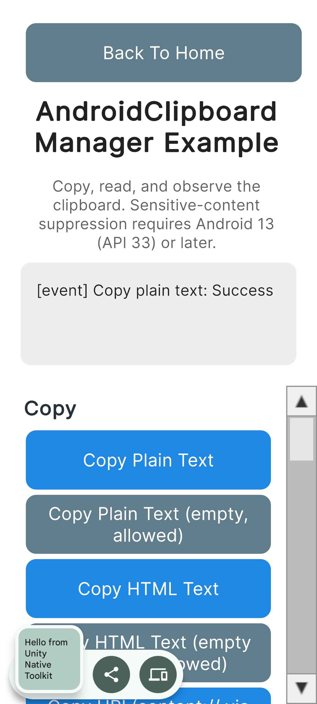
</p>

---

### 일반 텍스트 복사 (빈 문자열, 허용됨)

`text`가 빈 문자열이어도 네이티브 계층은 이를 명시적으로 허용하며 실패하지 않습니다. `CopyHtmlText`의 `htmlText`와는 다른 동작입니다.

```csharp
#if UNITY_ANDROID && !UNITY_EDITOR
AndroidClipboardManager.Instance.CopyPlainText(new CopyPlainTextPayload
{
    text = ""
});
#endif
```

<p align="center">
    
</p>

---

### HTML 텍스트 복사

```csharp
#if UNITY_ANDROID && !UNITY_EDITOR
AndroidClipboardManager.Instance.CopyHtmlText(new CopyHtmlTextPayload
{
    plainText = "Hello",
    htmlText = "<b>Hello</b>"
});
#endif
```

<p align="center">
    
</p>

---

### 일반 텍스트가 빈 HTML 복사

`plainText`는 빈 문자열을 허용하지만, `htmlText`가 빈 문자열인 경우에만 실패합니다([에러 처리](#에러-처리) 참고).

```csharp
#if UNITY_ANDROID && !UNITY_EDITOR
AndroidClipboardManager.Instance.CopyHtmlText(new CopyHtmlTextPayload
{
    plainText = "",
    htmlText = "<b>Html only</b>"
});
#endif
```

<p align="center">
    
</p>

---

### URI 복사

`content://` URI(이미지나 파일 참조 등)를 복사합니다. URI 문자열을 만드는 방법은 위의 [content:// URI](#content-uri-copy-uri--copy-screenshot에-필요)를 참고하세요.

```csharp
#if UNITY_ANDROID && !UNITY_EDITOR
string path = Path.Combine(Application.persistentDataPath, "clipboard_sample.txt");
File.WriteAllText(path, "Clipboard sample file content");
string uri = CreateContentUri(path);

AndroidClipboardManager.Instance.CopyUri(new CopyUriPayload
{
    uri = uri
});
#endif
```

<p align="center">
    
</p>

> **참고:** 붙여넣은 `content://` URI를 대상 앱이 읽을 수 있는지는 기기와 대상 앱에 따라 다릅니다. 일반 텍스트만 처리하는 앱에서는 해석되지 않습니다.

---

### 다중 텍스트 복사

여러 개의 일반 텍스트를 하나의 클립으로 복사합니다. `texts` 배열 안의 개별 빈 문자열은 허용되며, 배열 자체가 비어 있는 경우에만 실패합니다([에러 처리](#에러-처리) 참고).

```csharp
#if UNITY_ANDROID && !UNITY_EDITOR
AndroidClipboardManager.Instance.CopyMultipleText(new CopyMultipleTextPayload
{
    texts = new[] { "First", "", "Third" }
});
#endif
```

<p align="center">
    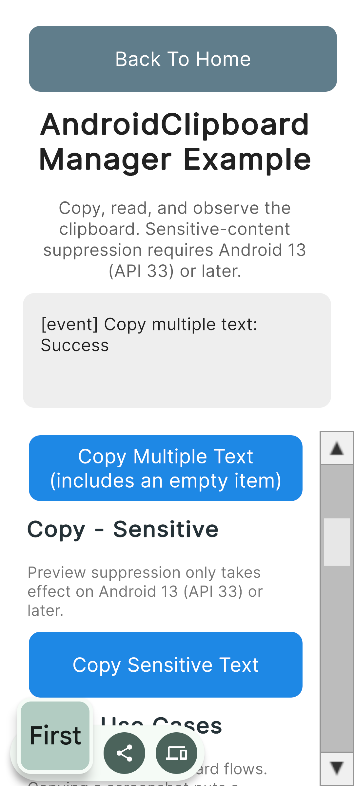
</p>

---

### 민감한 텍스트 복사

`isSensitive`를 설정하면 시스템 클립보드 UI에서 미리보기 억제를 요청할 수 있습니다. 이 힌트는 Android 13(API 33) 이상에서만 적용되며, 그 이전 버전에서는 억제 없이 일반적으로 복사됩니다.

```csharp
#if UNITY_ANDROID && !UNITY_EDITOR
AndroidClipboardManager.Instance.CopyPlainText(new CopyPlainTextPayload
{
    text = "P@ssw0rd-sample",
    isSensitive = true
});
#endif
```

<p align="center">
    
</p>

---

### 게임 활용 사례

게임에서 자주 사용하는 클립보드 활용 사례로, 초대 코드 공유, 전달받은 코드 붙여넣기, 스크린샷 복사를 소개합니다.

#### 초대 코드 복사

```csharp
#if UNITY_ANDROID && !UNITY_EDITOR
AndroidClipboardManager.Instance.CopyPlainText(new CopyPlainTextPayload
{
    text = "NTK-7F3A-92QX",
    label = "invite code"
});
#endif
```

<p align="center">
    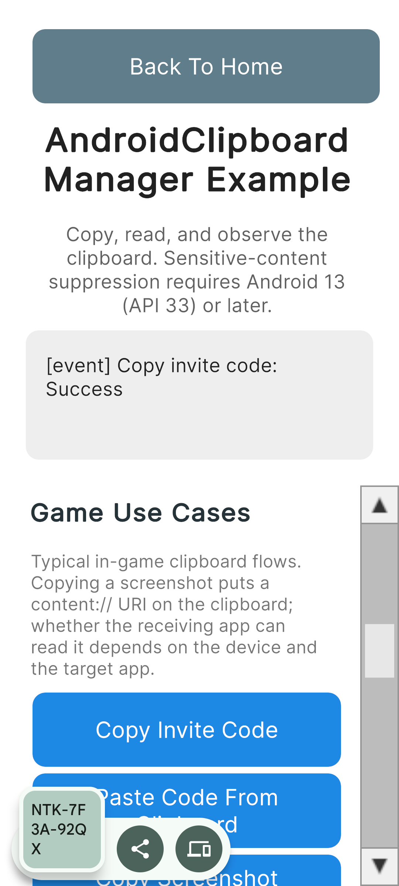
</p>

#### 클립보드에서 코드 붙여넣기

클립보드를 동기적으로 읽어 첫 번째 항목의 일반 텍스트를 추출합니다. 최선 추정(best-effort) 대체값으로는 폴백하지 않습니다. `content://` URI만 담고 있는 클립([스크린샷 복사](#스크린샷-복사)로 생성한 것 등)은 URI를 코드처럼 잘못 표시하는 대신 "텍스트 항목을 찾을 수 없음"으로 처리됩니다.

```csharp
#if UNITY_ANDROID && !UNITY_EDITOR
var result = AndroidClipboardManager.Instance.Read();
switch (result.Status)
{
    case ClipboardReadStatus.HasContent:
        string? code = ExtractFirstText(result.Contents!);
        // 클립에 일반 텍스트 항목이 없으면(URI 전용 클립 등) null
        break;
    case ClipboardReadStatus.Empty:
        // 클립보드가 비어 있음. 실패가 아닌 정상적인 결과
        break;
    default:
        // result.ErrorCode / result.ErrorMessage가 실패 내용을 나타냄
        break;
}

static string? ExtractFirstText(ClipContents contents)
{
    foreach (var item in contents.Items)
    {
        if (!string.IsNullOrEmpty(item.Text)) return item.Text;
    }
    return null;
}
#endif
```

<p align="center">
    
</p>

> **보안 참고:** 붙여넣은 값은 절대 로그로 남기지 마세요. 쿠폰 코드 등 민감한 데이터일 수 있습니다. 로그에는 `result.Status`와 `result.ErrorCode`만 남기세요.

#### 스크린샷 복사

현재 프레임을 캡처하여 `content://` URI로 복사합니다. `ScreenCapture.CaptureScreenshotAsTexture`는 프레임 렌더링이 완료되어야 하므로, 캡처는 `WaitForEndOfFrame` 이후 코루틴 안에서 실행해야 합니다. PNG 바이트로 저장이 끝난 `Texture2D`는 반드시 파괴해야 합니다. 그렇지 않으면 메모리 누수가 발생합니다.

```csharp
#if UNITY_ANDROID && !UNITY_EDITOR
private IEnumerator CaptureAndCopyScreenshot()
{
    yield return new WaitForEndOfFrame();

    string uri;
    Texture2D? screenshot = null;
    try
    {
        screenshot = ScreenCapture.CaptureScreenshotAsTexture();
        byte[] png = screenshot.EncodeToPNG();
        string path = Path.Combine(Application.persistentDataPath, "clipboard_screenshot.png");
        File.WriteAllBytes(path, png);
        uri = CreateContentUri(path);
    }
    finally
    {
        if (screenshot != null) Destroy(screenshot);
    }

    AndroidClipboardManager.Instance.CopyUri(new CopyUriPayload
    {
        uri = uri,
        label = "screenshot"
    });
}
#endif
```

<p align="center">
    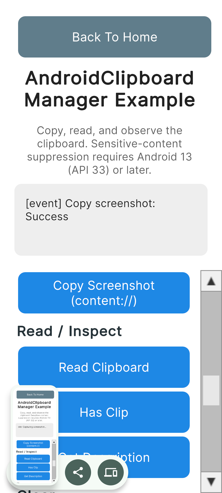
</p>

> **참고:** 붙여넣은 스크린샷을 수신 앱이 읽을 수 있는지는 다른 `content://` 클립과 마찬가지로 기기와 대상 앱에 따라 다릅니다.

---

### 클립보드 읽기

동기 API. 클립 내용, 빈 결과, 또는 실패 중 하나를 반환합니다. 빈 클립보드는 실패가 아닌 정상적인 결과로 취급됩니다.

```csharp
#if UNITY_ANDROID && !UNITY_EDITOR
var result = AndroidClipboardManager.Instance.Read();
switch (result.Status)
{
    case ClipboardReadStatus.HasContent:
        ClipContents contents = result.Contents!;
        // contents.Label, contents.MimeTypes, contents.Items (각 항목의 Text / HtmlText / Uri / CoercedText)
        break;
    case ClipboardReadStatus.Empty:
        // 실패가 아닌 정상적인 결과
        break;
    default:
        // result.ErrorCode / result.ErrorMessage가 실패 내용을 나타냄
        break;
}
#endif
```

<p align="center">
    
</p>

> **보안 참고:** 클립보드 내용에는 비밀번호나 토큰이 포함될 수 있습니다. 로그에는 `result.Status`와 `result.ErrorCode`만 남기고, 클립 본문 자체는 절대 로그로 남기지 마세요.

---

### 클립 존재 여부 확인

동기 API. 클립보드가 실제로 비어 있는 경우와 확인 자체를 수행할 수 없었던 경우 모두 `false`를 반환합니다. C# 쪽에서는 두 경우를 구분할 수 없습니다.

```csharp
#if UNITY_ANDROID && !UNITY_EDITOR
bool hasClip = AndroidClipboardManager.Instance.HasClip();
#endif
```

<p align="center">
    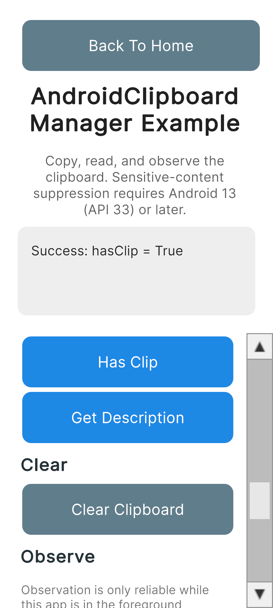
</p>

---

### 메타데이터 조회

동기 API. 클립 본문에는 접근하지 않고 라벨, MIME 타입, 스타일 텍스트 여부, 분류 상태 등의 메타데이터만 읽어옵니다.

```csharp
#if UNITY_ANDROID && !UNITY_EDITOR
var result = AndroidClipboardManager.Instance.GetDescription();
switch (result.Status)
{
    case ClipboardReadStatus.HasContent:
        ClipDescriptionInfo info = result.Description!;
        // info.Label, info.MimeTypes, info.IsStyledText, info.ClassificationStatus (API 31 미만에서는 null)
        break;
    case ClipboardReadStatus.Empty:
        break;
    default:
        break;
}
#endif
```

<p align="center">
    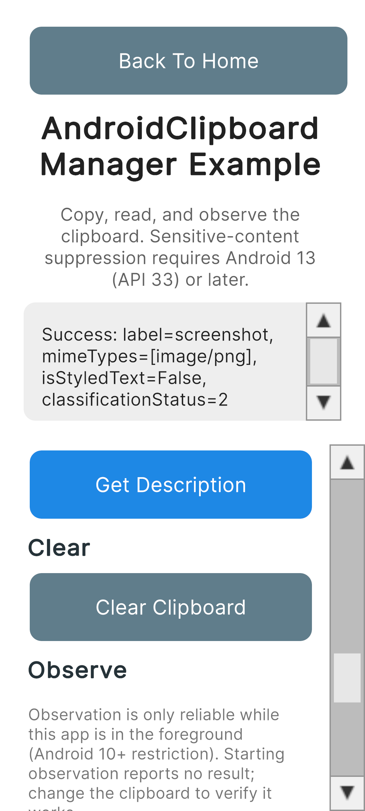
</p>

---

### 클립보드 지우기

비동기 API. `ClipboardOperationCompleted`를 통해 결과가 통보됩니다.

```csharp
#if UNITY_ANDROID && !UNITY_EDITOR
AndroidClipboardManager.Instance.Clear();
#endif
```

<p align="center">
    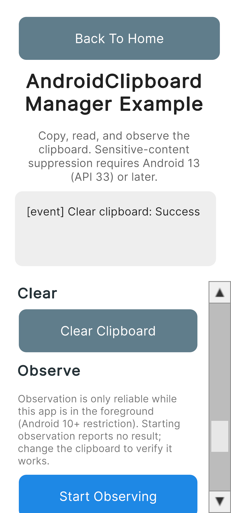
</p>

---

### 관찰 시작·중지

`StartObserving`은 성공·실패 여부와 관계없이 결과를 전혀 알리지 않습니다. 성공으로 표시하지 마세요. 관찰 중 클립보드 변경은 `ClipboardChanged` 이벤트로 전달됩니다([이벤트 수신](#이벤트-수신) 참고). 이미 관찰 중인 상태에서 다시 호출하면 네이티브 측에서는 아무 동작도 하지 않습니다. 관찰은 앱이 포그라운드에 있는 동안에만 안정적으로 동작합니다(Android 10 이상의 플랫폼 제약).

`StopObserving`은 다른 작업과 마찬가지로 비동기 API이며 `ClipboardOperationCompleted`를 통해 결과가 통보됩니다. 화면이 숨겨진 뒤에도 관찰이 계속되지 않도록 `OnDisable`에서 호출하세요.

```csharp
#if UNITY_ANDROID && !UNITY_EDITOR
// 시작: 결과가 전혀 통보되지 않음. 이후 클립보드를 변경해 ClipboardChanged로 동작을 확인
AndroidClipboardManager.Instance.StartObserving();

// 중지: Clear와 마찬가지로 ClipboardOperationCompleted를 통해 통보됨
AndroidClipboardManager.Instance.StopObserving();
#endif
```

<p align="center">
    
</p>

---

### 이벤트 수신

`OnEnable`에서 이벤트를 구독하고 `OnDisable`에서 해제하세요. `OnDisable`에서는 `StopObserving`도 호출하여 숨겨진 화면이 계속 관찰하지 않도록 합니다.

```csharp
private void OnEnable()
{
#if UNITY_ANDROID && !UNITY_EDITOR
    AndroidClipboardManager.Instance.ClipboardOperationCompleted += OnClipboardOperationCompleted;
    AndroidClipboardManager.Instance.ClipboardChanged += OnClipboardChanged;
#endif
}

private void OnDisable()
{
#if UNITY_ANDROID && !UNITY_EDITOR
    AndroidClipboardManager.Instance.ClipboardOperationCompleted -= OnClipboardOperationCompleted;
    AndroidClipboardManager.Instance.ClipboardChanged -= OnClipboardChanged;
    AndroidClipboardManager.Instance.StopObserving();
#endif
}

#if UNITY_ANDROID && !UNITY_EDITOR
private void OnClipboardOperationCompleted(ClipboardOperationResult result)
{
    string status = result.IsSuccess ? "Success" : "Failed";
    Debug.Log($"[event] {result.Operation}: {status}");
    if (!string.IsNullOrEmpty(result.ErrorMessage))
        Debug.LogError(result.ErrorMessage);
}

private void OnClipboardChanged()
{
    Debug.Log("[event] Clipboard changed");
}
#endif
```

`ClipboardOperationCompleted`는 `CopyPlainText`, `CopyHtmlText`, `CopyUri`, `CopyMultipleText`, `Clear`, `StopObserving`에 전달한 호출별 콜백보다 항상 먼저 발생합니다. 이벤트 구독자와 호출별 콜백이 모두 예외를 던지더라도 각각 독립적으로 처리되므로, 한쪽의 예외가 다른 쪽 호출을 막지 않습니다.

---

### 에러 처리

모든 비동기 작업은 `ClipboardOperationCompleted`를 통해 성공·실패를 통보합니다. `ErrorMessage`는 `IsSuccess`가 `false`인 경우에만 null이 아닙니다.

```csharp
#if UNITY_ANDROID && !UNITY_EDITOR
// HTML 텍스트가 빈 문자열이면 실패: CLIPBOARD_EMPTY_CONTENT
// ErrorMessage: "Clipboard content is empty. Please provide text or HTML."
AndroidClipboardManager.Instance.CopyHtmlText(new CopyHtmlTextPayload
{
    plainText = "Hello",
    htmlText = ""
});

// 항목 배열이 비어 있으면 실패: CLIPBOARD_EMPTY_ITEMS
// ErrorMessage: "No items provided for clipboard copy."
AndroidClipboardManager.Instance.CopyMultipleText(new CopyMultipleTextPayload
{
    texts = Array.Empty<string>()
});

// URI가 빈 문자열이면 실패: CLIPBOARD_INVALID_URI
AndroidClipboardManager.Instance.CopyUri(new CopyUriPayload
{
    uri = ""
});

// http:// 스킴은 거부됨. content:// URI만 지원: CLIPBOARD_INVALID_URI
// ErrorMessage는 "Invalid URI:"로 시작함
AndroidClipboardManager.Instance.CopyUri(new CopyUriPayload
{
    uri = "http://example.com/x"
});
#endif
```

`ErrorCode`로 통보되는 안정적인 에러 코드 목록:

| 에러 코드 | 의미 |
| --- | --- |
| `CLIPBOARD_EMPTY_CONTENT` | `CopyHtmlText`가 빈 문자열 `htmlText`로 호출됨 |
| `CLIPBOARD_EMPTY_ITEMS` | `CopyMultipleText`가 빈 `texts` 배열로 호출됨 |
| `CLIPBOARD_INVALID_URI` | `CopyUri`가 빈 문자열, 잘못된 형식, 또는 `content://`가 아닌 URI로 호출됨 |
| `CLIPBOARD_READ_NOT_ALLOWED` | 네이티브 계층이 읽기를 거부함(포커스·권한 제약 등) |
| `CLIPBOARD_SECURITY` | 네이티브 계층이 보안상의 이유로 작업을 거부함 |
| `CLIPBOARD_UNAVAILABLE` | 시스템 `ClipboardManager`를 가져올 수 없었음 |
| `CLIPBOARD_UNKNOWN` | 분류되지 않은 실패. Unity 측 파싱 실패에도 사용됨 |

`Read`와 `GetDescription`은 네이티브 브리지 자체에 접근할 수 없는 경우(Android에서 실행 중이 아님, 플러그인 미초기화, currentActivity를 가져올 수 없음 등) 추가로 `CLIPBOARD_BRIDGE_UNAVAILABLE`을 반환할 수 있습니다. 이는 네이티브 계층이 반환하는 값이 아니라 Unity 측 에러 코드입니다.

---

## iOS

### 설정

#### 네임스페이스 임포트

`IosClipboardManager`는 iOS 빌드 타겟이 선택되어 있으면 에디터에서도 컴파일됩니다. 에디터에서 호출해도 크래시하지 않으며, 네이티브 브리지에 접근하지 않고 즉시 `CLIPBOARD_BRIDGE_UNAVAILABLE` 실패를 반환합니다. 따라서 에디터에서도 실행되는 씬에 그대로 두어도 됩니다.

```csharp
#if UNITY_IOS || UNITY_EDITOR
using JonghyunKim.NativeToolkit.Runtime.Clipboard;
#endif
```

네이티브 계층의 지원 대상은 iOS 18 이상입니다.

#### 모든 동작은 비동기

iOS에는 동기 API가 없습니다. 각 호출은 선택적인 호출별 콜백을 받으며, 동시에 종류별 이벤트도 발생시킵니다.

| 메서드 | 콜백 결과 타입 | 이벤트 |
| --- | --- | --- |
| `Copy` / `Append` / `Clear` / `RemovePasteboard` / `CancelLoads` / `StartObserving` / `StopObserving` | `IosClipboardOperationResult` | `ClipboardOperationCompleted` |
| `Read` | `IosClipboardReadResult` | `ReadCompleted` |
| `ReadData` | `IosClipboardReadDataResult` | `ReadDataCompleted` |
| `GetSnapshot` | `IosClipboardSnapshotResult` | `SnapshotCompleted` |
| `CreatePasteboard` | `IosPasteboardScopeResult` | `PasteboardCreated` |
| `DetectPatterns` | `IosClipboardDetectedPatternsResult` | `PatternsDetected` |
| `DetectValues` | `IosClipboardDetectedValuesResult` | `ValuesDetected` |
| `LoadItem` | `IosClipboardLoadedItemResult` | `ItemLoaded` |
| `CheckForegroundChange` | `IosClipboardForegroundChangeResult` | `ForegroundChangeChecked` |

이벤트만으로는 어느 호출의 결과인지 구분할 수 없습니다. 결과를 특정 요청과 대응시켜야 한다면 호출별 콜백을 사용하고, 이벤트는 로깅이나 공용 UI 갱신에만 사용하세요. 모든 결과 타입은 `IsSuccess`를 제공하며, 실패 시 `Error`(`Code`, `Message`와 선택적 `Domain` / `NativeCode`를 가진 `IosClipboardErrorInfo`)를 반환합니다.

#### 메인 스레드 전용

모든 public API는 Unity 메인 스레드에서 호출해야 합니다. 다른 스레드에서의 호출은 `CLIPBOARD_MAIN_THREAD_REQUIRED`로 거부되며 네이티브 계층에 도달하지 않습니다.

#### 동일 동작은 한 번에 하나

직렬화되는 것은 동일한 동작뿐입니다. 실행 중인 `LoadItem`에 또 하나의 `LoadItem`을 겹치면 `CLIPBOARD_BUSY`로 거부되지만, `Read`와 `GetSnapshot`은 동시에 실행됩니다. [동시 실행과 Busy 거부](#동시-실행과-busy-거부)를 참고하세요.

#### Manager 수명

`IosClipboardManager.Instance`는 최초 접근 시 생성되며, 네이티브 계층은 첫 호출 시 초기화됩니다. 실행 중에 파괴한 뒤 다시 만드는 사용 방식은 지원하지 않습니다. 파괴된 뒤에는 `IosClipboardManager.IsTerminated`가 `true`가 되고 이후 모든 API가 `CLIPBOARD_MANAGER_DESTROYED`를 반환합니다.

---

### 페이스트보드 스코프

모든 동작은 스코프를 대상으로 실행됩니다. `scope` 인자를 생략(`null`)하면 general 페이스트보드가 대상이 됩니다.

| 스코프 | 팩토리 | 비고 |
| --- | --- | --- |
| General | `IosPasteboardScope.General` | 다른 앱과 공유되는 시스템 페이스트보드 |
| Named | `IosPasteboardScope.Named(name)` | 앱이 이름을 정하는 페이스트보드. `CreatePasteboard`로 한 번 생성한다 |
| Unique | `IosPasteboardScope.Unique(name)` | 이름을 시스템이 생성하는 페이스트보드. 이름은 `CreatePasteboard` 결과에서 얻는다 |

`Named`와 `Unique`는 이름이 공백이면 `ArgumentException`을 던집니다. 사용자 입력으로 만들 경우 미리 검증하세요.

```csharp
#if UNITY_IOS || UNITY_EDITOR
private IosPasteboardScope _scope = IosPasteboardScope.General;

// 이름 있는 페이스트보드를 생성하고 활성 스코프로 보관한다.
IosClipboardManager.Instance.CreatePasteboard(
    IosPasteboardCreationRequest.Named("com.jonghyunkim.nativetoolkit.example.sample"),
    result =>
    {
        if (!result.IsSuccess || result.Scope == null)
        {
            Debug.LogError($"CreatePasteboard failed: {result.Error?.Code}");
            return;
        }

        _scope = result.Scope;
    });

// 시스템이 이름을 정하는 페이스트보드. 이름은 결과에서만 알 수 있다.
IosClipboardManager.Instance.CreatePasteboard(
    IosPasteboardCreationRequest.Unique,
    result => _scope = result.IsSuccess && result.Scope != null ? result.Scope : _scope);
#endif
```

<p align="center">
    
</p>

Named / Unique 페이스트보드는 `RemovePasteboard`로 삭제합니다. general 페이스트보드는 삭제할 수 없으며 `CLIPBOARD_CANNOT_REMOVE_GENERAL`로 실패합니다.

```csharp
#if UNITY_IOS || UNITY_EDITOR
IosClipboardManager.Instance.RemovePasteboard(_scope, result =>
{
    if (result.IsSuccess)
    {
        _scope = IosPasteboardScope.General;
    }
});
#endif
```

<p align="center">
    
</p>

> **참고:** 삭제된 스코프를 읽어도 실패하지 않고, 비어 있는 상태로 페이스트보드가 다시 생성됩니다. "비어 있는 읽기"를 삭제되었다는 신호로 다루고 에러로 처리하지 마세요.

---

### 일반 텍스트 복사

`Copy`는 페이스트보드 내용 전체를 교체합니다. 빈 문자열도 허용되며 실패하지 않습니다.

```csharp
#if UNITY_IOS || UNITY_EDITOR
IosClipboardManager.Instance.Copy(
    IosClipboardContent.PlainText("Hello 日本語 \U0001F680 テスト"),
    _scope,
    options: null,
    onResult: result =>
    {
        if (!result.IsSuccess)
        {
            Debug.LogError($"Copy failed: {result.Error?.Code}");
        }
    });
#endif
```

<p align="center">
    
</p>

---

### HTML 텍스트 복사

하나의 아이템에 일반 텍스트 표현과 HTML 표현을 함께 기록합니다.

```csharp
#if UNITY_IOS || UNITY_EDITOR
IosClipboardManager.Instance.Copy(
    IosClipboardContent.HtmlText("Hello", "<b>Hello</b>"),
    _scope);
#endif
```

<p align="center">
    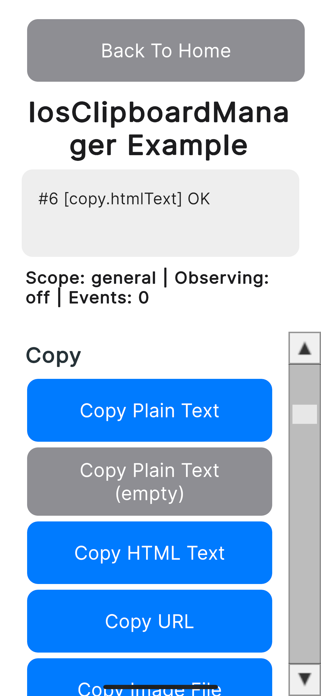
</p>

---

### URL 복사

유효한 URL이어야 하며, 해석할 수 없는 문자열은 네이티브 계층이 `CLIPBOARD_INVALID_URL`을 반환합니다.

```csharp
#if UNITY_IOS || UNITY_EDITOR
IosClipboardManager.Instance.Copy(IosClipboardContent.Url("https://unity.com"), _scope);
#endif
```

<p align="center">
    
</p>

---

### 이미지 파일 복사

경로를 지정해 이미지를 복사합니다. Android와 달리 FileProvider가 필요 없으며, 읽을 수 있는 경로면 그대로 전달할 수 있습니다. 존재하지 않는 경로는 `CLIPBOARD_FILE_NOT_FOUND`가 됩니다.

```csharp
#if UNITY_IOS || UNITY_EDITOR
string path = Path.Combine(Application.persistentDataPath, "ios_clipboard_sample_image.png");
File.WriteAllBytes(path, pngBytes);

IosClipboardManager.Instance.Copy(IosClipboardContent.ImageFile(path), _scope);
#endif
```

<p align="center">
    
</p>

---

### 이미지 데이터 복사

인코딩된 이미지 바이트열을 해당 uniform type identifier와 함께 복사합니다.

```csharp
#if UNITY_IOS || UNITY_EDITOR
IosClipboardManager.Instance.Copy(
    IosClipboardContent.ImageData(pngBytes, "public.png"),
    _scope);
#endif
```

<p align="center">
    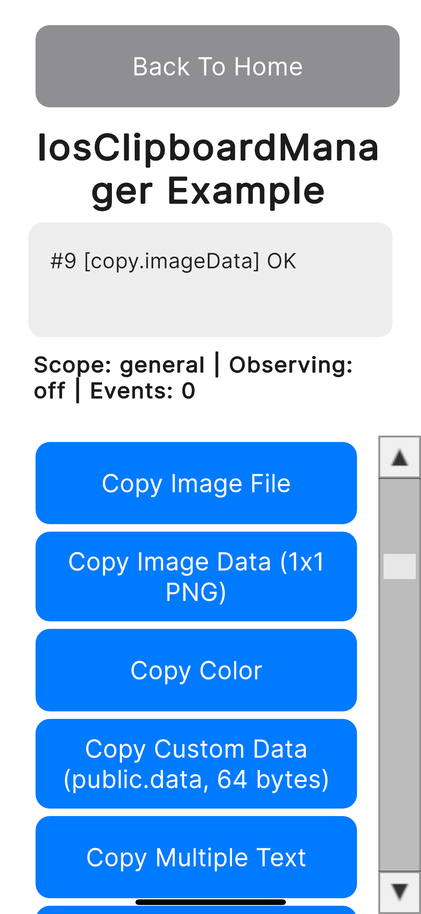
</p>

> **참고:** `IosClipboardLoadRequest.Image`를 사용하는 `LoadItem`은 이미지를 다시 인코딩하므로, 반환되는 바이트 수는 복사한 바이트 수와 일치하지 않습니다. 바이트 단위로 일치시켜야 한다면 [데이터 읽기](#데이터-읽기)를 사용하세요.

---

### 색상 복사

각 성분은 유한한 값이어야 합니다. `NaN`이나 무한대는 `IosClipboardContent.Color`가 호출 전에 `ArgumentException`을 던집니다. 유한하지만 `0.0...1.0` 범위를 벗어난 값은 네이티브 계층까지 전달되어 `CLIPBOARD_INVALID_COLOR`가 됩니다.

```csharp
#if UNITY_IOS || UNITY_EDITOR
IosClipboardManager.Instance.Copy(IosClipboardContent.Color(0.2, 0.4, 0.8, 1.0), _scope);
#endif
```

<p align="center">
    
</p>

> **참고:** 복사한 색상은 텍스트 붙여넣기 대상에는 나타나지 않습니다. [스냅샷](#스냅샷)의 `HasColors`가 `true`가 되는 것으로 확인할 수 있습니다.

---

### 커스텀 데이터 복사

임의의 uniform type identifier로 원시 바이트열을 복사합니다. 잘못된 identifier는 `CLIPBOARD_INVALID_TYPE`이 됩니다.

```csharp
#if UNITY_IOS || UNITY_EDITOR
byte[] payload = new byte[64];
payload.AsSpan().Fill(0x41);

IosClipboardManager.Instance.Copy(
    IosClipboardContent.CustomData(payload, "public.data"),
    _scope);
#endif
```

<p align="center">
    
</p>

---

### 다중 텍스트 복사

배열 요소마다 하나의 텍스트 아이템을 기록합니다. 개별 요소는 비어 있어도 되지만, 빈 배열은 `CLIPBOARD_EMPTY_ITEMS`로 실패합니다.

```csharp
#if UNITY_IOS || UNITY_EDITOR
IosClipboardManager.Instance.Copy(
    IosClipboardContent.MultipleText(new[] { "First", string.Empty, "Third" }),
    _scope);
#endif
```

<p align="center">
    
</p>

---

### 다중 표현 복사

하나의 아이템에 여러 표현을 담아, 받는 앱이 해석할 수 있는 타입을 고를 수 있게 합니다. 빈 딕셔너리는 `CLIPBOARD_EMPTY_ITEMS`로 실패합니다.

```csharp
#if UNITY_IOS || UNITY_EDITOR
var representations = new Dictionary<string, byte[]>
{
    { "public.utf8-plain-text", Encoding.UTF8.GetBytes("LOCALONLY-0001") },
    { "com.jonghyunkim.nativetoolkit.example.custom", payload }
};

IosClipboardManager.Instance.Copy(
    IosClipboardContent.MultiRepresentation(representations),
    _scope);
#endif
```

<p align="center">
    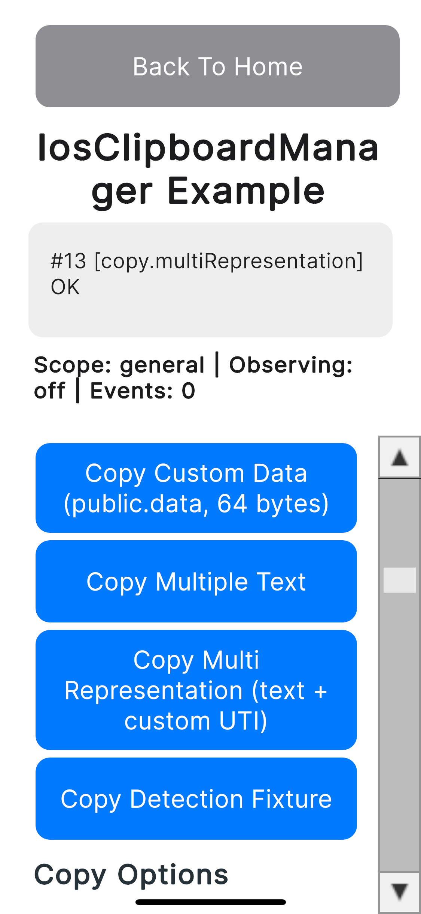
</p>

---

### 복사 옵션

`IosClipboardCopyOptions`는 `Copy` 전용입니다. `Append`에는 옵션 인자가 없습니다.

- `LocalOnly`는 Universal Clipboard를 통한 주변 기기 전달을 하지 않도록 시스템에 요청합니다.
- `ExpirationDate`는 미래 시각이어야 하며, 과거 시각은 네이티브 계층이 `CLIPBOARD_INVALID_EXPIRATION`을 반환합니다.
- `IosClipboardCopyOptions.PrivacyPreservingDefault`는 `localOnly: true`이고 만료 시각이 없습니다.

```csharp
#if UNITY_IOS || UNITY_EDITOR
// 이 기기 안에만 남긴다.
IosClipboardManager.Instance.Copy(
    IosClipboardContent.PlainText("LOCALONLY-0001"),
    _scope,
    IosClipboardCopyOptions.Create(localOnly: true));

// 30초 뒤에 만료시킨다.
IosClipboardManager.Instance.Copy(
    IosClipboardContent.PlainText("Hello 日本語 \U0001F680 テスト"),
    _scope,
    IosClipboardCopyOptions.Create(localOnly: false, DateTime.UtcNow.AddSeconds(30)));
#endif
```

<p align="center">
    
</p>

> **참고:** `localOnly`가 실제로 주변 기기로의 전송을 막는지는 기기 한 대로는 확인할 수 없습니다. 시스템에 대한 요청일 뿐, 이 패키지가 검증한 보장은 아니라는 점을 염두에 두세요.

---

### 추가

`Append`는 내용을 교체하지 않고 아이템을 추가합니다. 옵션은 지정할 수 없습니다.

```csharp
#if UNITY_IOS || UNITY_EDITOR
IosClipboardManager.Instance.Append(
    IosClipboardContent.PlainText("APPENDED-MARKER-0001"),
    _scope,
    result => Debug.Log($"Append: {result.IsSuccess}"));
#endif
```

<p align="center">
    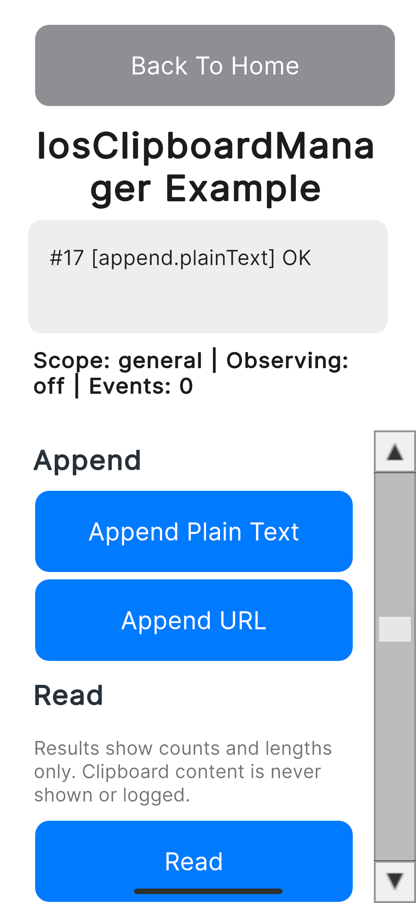
</p>

---

### 읽기

모든 아이템을 타입 식별자와 함께 읽고, 가능한 경우 텍스트·URL 표현도 반환합니다.

```csharp
#if UNITY_IOS || UNITY_EDITOR
IosClipboardManager.Instance.Read(_scope, result =>
{
    if (!result.IsSuccess)
    {
        Debug.LogError($"Read failed: {result.Error?.Code}");
        return;
    }

    foreach (IosClipboardItem item in result.Items)
    {
        // item.TypeIdentifiers, item.Text, item.UrlString, item.ImageDataUtType
        Debug.Log($"types: {item.TypeIdentifiers.Count}, hasText: {item.Text != null}");
    }
});
#endif
```

<p align="center">
    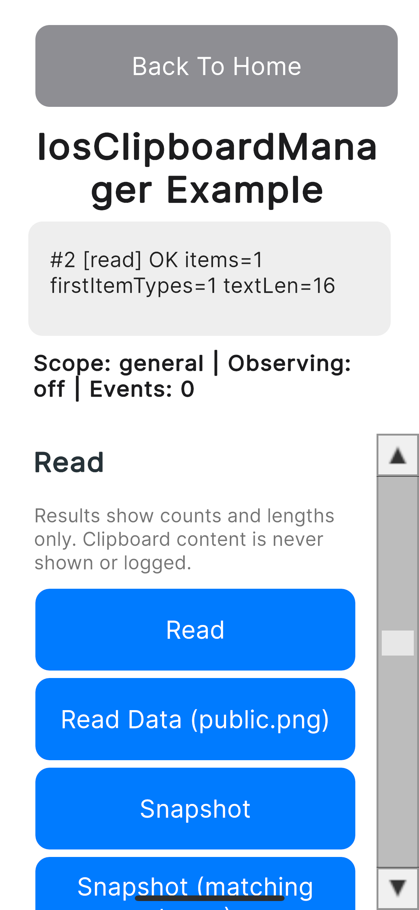
</p>

> **참고:** general 페이스트보드에서는 앱이 직접 쓰지 않은 내용을 처음 읽을 때 iOS의 붙여넣기 허용 시스템 다이얼로그가 표시됩니다. `Read` / `ReadData` / `LoadItem`과 감지 API는 내용을 읽으므로 해당됩니다. `GetSnapshot`은 어떤 타입이 있는지만 보고하므로 다이얼로그가 뜨지 않습니다.

---

### 데이터 읽기

지정한 uniform type identifier로 저장된 원시 바이트열을 반환합니다. 해당 타입을 가진 아이템이 없어도 성공하며 `HasData`가 `false`가 됩니다.

```csharp
#if UNITY_IOS || UNITY_EDITOR
IosClipboardManager.Instance.ReadData("public.png", _scope, result =>
{
    if (!result.IsSuccess)
    {
        Debug.LogError($"ReadData failed: {result.Error?.Code}");
        return;
    }

    if (!result.HasData)
    {
        Debug.Log("No item carries public.png");
        return;
    }

    byte[] data = result.Data!;
    Debug.Log($"utType: {result.UtType}, bytes: {result.ByteCount}");
});
#endif
```

<p align="center">
    
</p>

> **참고:** 디코딩 후 크기가 64 MiB를 넘는 페이로드는 버퍼를 할당하기 전에 `CLIPBOARD_CONTENT_TOO_LARGE`로 거부됩니다.

---

### 스냅샷

내용을 읽지 않고 아이템 수, 타입 식별자, `HasStrings` / `HasUrls` / `HasImages` / `HasColors` 플래그를 보고합니다. `matchingTypes`를 전달하면 해당 타입을 가진 아이템의 인덱스가 `MatchingItemIndexes`에 채워지고, 전달하지 않으면 `MatchingItemIndexes`는 `null`입니다.

```csharp
#if UNITY_IOS || UNITY_EDITOR
IosClipboardManager.Instance.GetSnapshot(_scope, matchingTypes: null, result =>
{
    if (!result.IsSuccess || result.Snapshot == null) return;

    IosClipboardSnapshot snapshot = result.Snapshot;
    Debug.Log($"items: {snapshot.NumberOfItems}, strings: {snapshot.HasStrings}, " +
              $"urls: {snapshot.HasUrls}, images: {snapshot.HasImages}, colors: {snapshot.HasColors}");
});

// 특정 타입으로 좁혀서 조회한다.
IosClipboardManager.Instance.GetSnapshot(
    _scope,
    new[] { "public.utf8-plain-text", "public.png" },
    result =>
    {
        IReadOnlyList<int>? matching = result.Snapshot?.MatchingItemIndexes;
        Debug.Log($"matching items: {matching?.Count ?? 0}");
    });
#endif
```

<p align="center">
    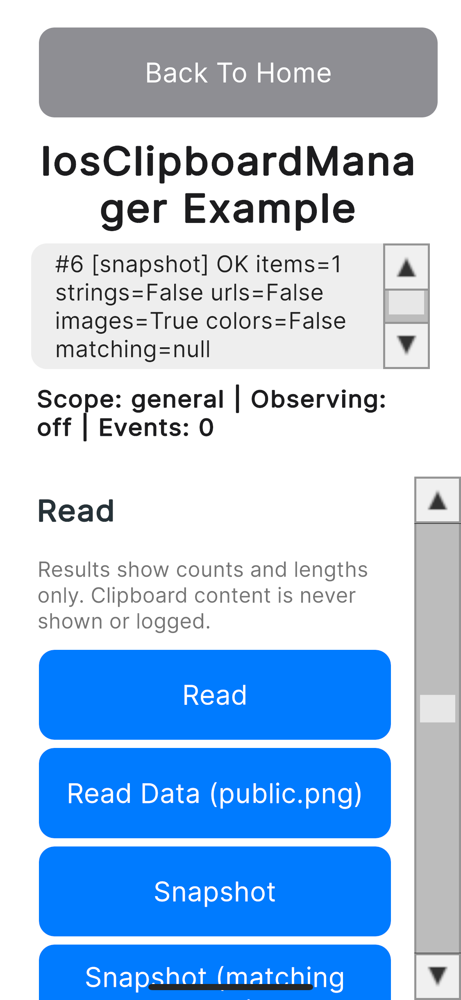
</p>

---

### 아이템 로드

`LoadItem`은 아이템을 텍스트·URL·이미지·파일로 구체화하도록 시스템에 요청합니다. 파일로 받을 수 있는 유일한 API입니다.

| 요청 | 결과 `Kind` | 값이 채워지는 멤버 |
| --- | --- | --- |
| `IosClipboardLoadRequest.Text` | `Text` | `Text` |
| `IosClipboardLoadRequest.Url` | `Url` | `UrlString` |
| `IosClipboardLoadRequest.Image` | `ImageData` | `Data`, `UtType` |
| `IosClipboardLoadRequest.File(utType)` | `File` | `Path`, `UtType` |

```csharp
#if UNITY_IOS || UNITY_EDITOR
IosClipboardManager.Instance.LoadItem(IosClipboardLoadRequest.Text, _scope, result =>
{
    if (!result.IsSuccess || result.Item == null)
    {
        Debug.LogError($"LoadItem failed: {result.Error?.Code}");
        return;
    }

    Debug.Log($"kind: {result.Item.Kind}, textLength: {result.Item.Text?.Length ?? 0}");
});
#endif
```

<p align="center">
    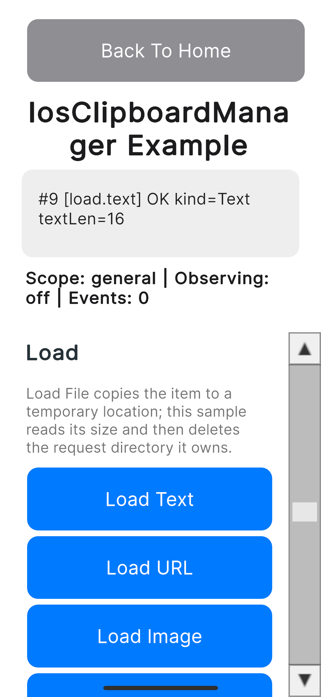
</p>

**`File` 요청으로 반환되는 파일은 호출자 소유입니다.** 네이티브 계층은 요청마다 임시 디렉터리에 아이템을 복사할 뿐 삭제하지 않으므로, 사용이 끝나면 앱에서 해당 디렉터리를 삭제해야 합니다.

```csharp
#if UNITY_IOS || UNITY_EDITOR
IosClipboardManager.Instance.LoadItem(IosClipboardLoadRequest.File("public.data"), _scope, result =>
{
    if (!result.IsSuccess || result.Item?.Path == null) return;

    string path = result.Item.Path;
    try
    {
        long size = new FileInfo(path).Length;
        Debug.Log($"loaded file size: {size}");
    }
    finally
    {
        // 이 호출을 위해 네이티브 계층이 만든 요청 디렉터리를 삭제한다.
        string? directory = Path.GetDirectoryName(path);
        if (!string.IsNullOrEmpty(directory))
        {
            Directory.Delete(directory, recursive: true);
        }
    }
});
#endif
```

<p align="center">
    
</p>

---

### 로드 취소

`CancelLoads`는 실행 중인 로드를 중단합니다. 중단된 로드는 `CLIPBOARD_CANCELLED`를 반환하며, 이는 정상적인 결과이지 알림을 띄울 실패가 아닙니다.

```csharp
#if UNITY_IOS || UNITY_EDITOR
IosClipboardManager.Instance.LoadItem(IosClipboardLoadRequest.Image, _scope, result =>
{
    if (!result.IsSuccess && result.Error?.Code == "CLIPBOARD_CANCELLED")
    {
        Debug.Log("The load was cancelled on purpose.");
        return;
    }
});

IosClipboardManager.Instance.CancelLoads();
#endif
```

---

### 패턴 감지

요청한 패턴 중 페이스트보드 텍스트에 포함된 것을 보고합니다. 값 자체는 반환하지 않습니다. 빈 패턴 배열은 `CLIPBOARD_EMPTY_PATTERNS`로 실패합니다.

```csharp
#if UNITY_IOS || UNITY_EDITOR
private static readonly IosClipboardDetectionPattern[] AllPatterns =
{
    IosClipboardDetectionPattern.ProbableWebUrl,
    IosClipboardDetectionPattern.ProbableWebSearch,
    IosClipboardDetectionPattern.Number,
    IosClipboardDetectionPattern.Link,
    IosClipboardDetectionPattern.EmailAddress,
    IosClipboardDetectionPattern.PhoneNumber,
    IosClipboardDetectionPattern.PostalAddress,
    IosClipboardDetectionPattern.CalendarEvent,
    IosClipboardDetectionPattern.FlightNumber,
    IosClipboardDetectionPattern.MoneyAmount,
    IosClipboardDetectionPattern.ShipmentTrackingNumber
};

IosClipboardManager.Instance.DetectPatterns(AllPatterns, _scope, result =>
{
    if (!result.IsSuccess) return;

    foreach (IosClipboardDetectionPattern pattern in result.Patterns)
    {
        Debug.Log($"detected: {pattern}");
    }
});
#endif
```

<p align="center">
    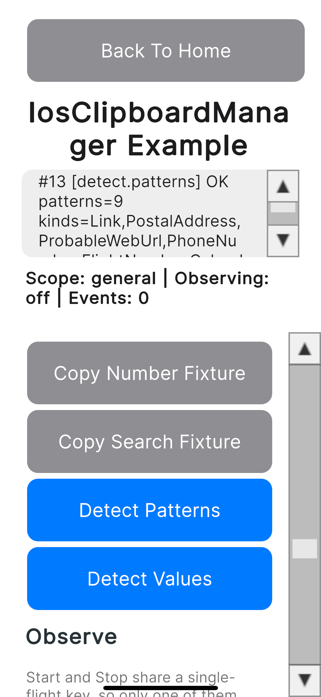
</p>

> **참고:** `Number`와 `ProbableWebSearch`는 텍스트 전체가 숫자이거나 검색어일 때만 보고됩니다. 다른 패턴과 함께 숫자가 섞여 있는 텍스트에서는 감지되지 않습니다.

---

### 값 감지

감지된 값 자체를 카테고리별로 반환합니다.

```csharp
#if UNITY_IOS || UNITY_EDITOR
IosClipboardManager.Instance.DetectValues(AllPatterns, _scope, result =>
{
    if (!result.IsSuccess || result.Values == null) return;

    IosClipboardDetectedValues values = result.Values;
    Debug.Log($"patterns: {values.DetectedPatterns.Count}, emails: {values.EmailAddresses.Count}, " +
              $"phones: {values.PhoneNumbers.Count}, addresses: {values.PostalAddresses.Count}, " +
              $"events: {values.CalendarEvents.Count}, flights: {values.FlightNumbers.Count}, " +
              $"money: {values.MoneyAmounts.Count}, shipments: {values.ShipmentTrackingNumbers.Count}, " +
              $"links: {values.Links.Count}");
});
#endif
```

<p align="center">
    
</p>

> **참고:** 감지된 값은 사용자 내용 그 자체입니다. 로그에는 값이 아니라 건수를 남기세요.

---

### 변경 관찰

`StartObserving`은 스코프에 대한 시스템 변경 알림을 구독하고 결과를 자신의 콜백으로 반환합니다. 이후 변경은 `ClipboardChanged` 이벤트로 전달됩니다.

`StartObserving`과 `StopObserving`은 single-flight 키를 공유하므로 둘 중 하나만 실행 중일 수 있습니다. 한쪽이 진행 중일 때 다른 쪽을 호출하면 `CLIPBOARD_BUSY`로 거부됩니다. 관찰 중에 `StartObserving`을 다시 호출하면 네이티브 계층이 먼저 이전 관찰을 중지하므로 관찰이 교체됩니다. 존재하지 않는 이름 있는 페이스트보드를 관찰하려 하면 `CLIPBOARD_UNAVAILABLE`이 됩니다.

```csharp
#if UNITY_IOS || UNITY_EDITOR
IosClipboardManager.Instance.StartObserving(
    _scope,
    onChanged: null,
    onStarted: result =>
    {
        if (!result.IsSuccess)
        {
            Debug.LogError($"StartObserving failed: {result.Error?.Code}");
        }
    });

// 화면을 벗어날 때 중지한다.
IosClipboardManager.Instance.StopObserving(result => Debug.Log($"StopObserving: {result.IsSuccess}"));
#endif
```

<p align="center">
    
</p>

> **참고:** `StartObserving`이 실패하면 관찰하지 않는 상태가 됩니다. 네이티브 계층은 새 관찰을 시작하기 전에 이전 관찰을 중지하므로 남아서 중지해야 할 것이 없습니다.

---

### 포그라운드 복귀 시 변경 확인

시스템이 변경 알림을 보내는 것은 앱이 포그라운드에 있는 동안뿐입니다. 백그라운드 중에 다른 앱이 수행한 복사는 `ClipboardChanged`로 전달되지 않습니다. `CheckForegroundChange`는 페이스트보드 변경 카운트를 비교해 마지막 확인 이후 내용이 바뀌었는지 보고하므로, 포그라운드로 복귀할 때 호출하세요.

```csharp
#if UNITY_IOS || UNITY_EDITOR
private void OnApplicationPause(bool paused)
{
    if (paused) return;

    IosClipboardManager.Instance.CheckForegroundChange(_scope, result =>
    {
        if (result.IsSuccess && result.Changed)
        {
            Debug.Log("The clipboard changed while the app was in the background.");
        }
    });
}
#endif
```

<p align="center">
    
</p>

---

### 지우기

스코프에서 모든 아이템을 삭제합니다.

```csharp
#if UNITY_IOS || UNITY_EDITOR
IosClipboardManager.Instance.Clear(_scope, result => Debug.Log($"Clear: {result.IsSuccess}"));
#endif
```

<p align="center">
    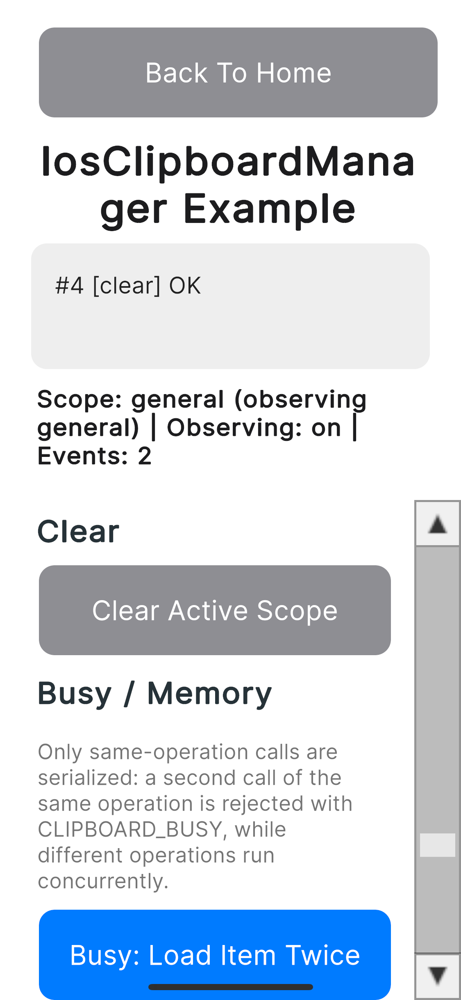
</p>

---

### 동시 실행과 Busy 거부

직렬화되는 것은 **동일한 동작**뿐입니다. 실행 중인 동작에 같은 동작을 겹치면 두 번째 호출이 즉시 `CLIPBOARD_BUSY`로 거부되고, 첫 번째 호출은 영향을 받지 않고 정상적으로 완료됩니다. 서로 다른 동작은 동시에 실행되므로 결과가 발행 순서와 다르게 도착할 수 있습니다.

```csharp
#if UNITY_IOS || UNITY_EDITOR
// 첫 번째가 실행 중일 때 발행한 두 번째 LoadItem은 CLIPBOARD_BUSY로 거부된다.
IosClipboardManager.Instance.LoadItem(IosClipboardLoadRequest.Text, _scope, first =>
    Debug.Log($"first: {first.IsSuccess}"));

IosClipboardManager.Instance.LoadItem(IosClipboardLoadRequest.Text, _scope, second =>
    Debug.Log($"second: {second.Error?.Code}"));  // CLIPBOARD_BUSY
#endif
```

결과만으로는 어느 호출의 것인지 알 수 없습니다. 여러 호출이 동시에 진행될 수 있다면, 발행하는 클로저에 호출 식별자를 담아 두세요.

```csharp
#if UNITY_IOS || UNITY_EDITOR
int sequence = ++_sequence;
IosClipboardManager.Instance.Read(_scope, result =>
    Debug.Log($"#{sequence} read: {result.IsSuccess}"));
#endif
```

---

### 이벤트 수신

`OnEnable`에서 구독하고 `OnDisable`에서 해제합니다. 숨겨진 화면이 계속 변경을 받지 않도록 `OnDisable`에서 관찰도 중지하세요.

```csharp
private void OnEnable()
{
#if UNITY_IOS || UNITY_EDITOR
    var manager = IosClipboardManager.Instance;
    manager.ClipboardOperationCompleted += OnClipboardOperationCompleted;
    manager.ClipboardChanged += OnClipboardChanged;
#endif
}

private void OnDisable()
{
#if UNITY_IOS || UNITY_EDITOR
    var manager = IosClipboardManager.Instance;
    manager.StopObserving();
    manager.ClipboardOperationCompleted -= OnClipboardOperationCompleted;
    manager.ClipboardChanged -= OnClipboardChanged;
#endif
}

#if UNITY_IOS || UNITY_EDITOR
private void OnClipboardOperationCompleted(IosClipboardOperationResult result)
{
    Debug.Log($"[event] {result.Operation}: {result.IsSuccess}, code: {result.Error?.Code}");
}

private void OnClipboardChanged(IosClipboardChangeEvent changeEvent)
{
    // Kind: Changed, ChangedDetectedOnForeground, Removed, Unknown 중 하나.
    Debug.Log($"[event] {changeEvent.Kind}, added: {changeEvent.TypesAdded.Count}, " +
              $"removed: {changeEvent.TypesRemoved.Count}");
}
#endif
```

`IosClipboardOperationResult.Operation`에 들어가는 값은 `IosClipboardManager.OperationCopy` / `OperationAppend` / `OperationClear` / `OperationRemovePasteboard` / `OperationCancelLoads` / `OperationStartObserving` / `OperationStopObserving` 상수입니다.

> **참고:** 앱 자신이 만든 변경에서는 변경 알림이 복사 콜백보다 먼저 도착할 수 있습니다. 둘이 같은 UI 요소에 쓰면 이벤트가 원인이 된 복사의 결과를 덮어씁니다.

---

### 에러 처리

모든 실패에는 `IosClipboardErrorInfo`가 따라옵니다. `Code`는 안정적이므로 분기에 사용할 수 있고 `Message`는 로그용입니다. `Domain`과 `NativeCode`는 시스템이 사유를 반환한 실패에만 채워집니다.

```csharp
#if UNITY_IOS || UNITY_EDITOR
// 빈 배열: CLIPBOARD_EMPTY_ITEMS.
IosClipboardManager.Instance.Copy(
    IosClipboardContent.MultipleText(Array.Empty<string>()),
    _scope,
    options: null,
    onResult: result => Debug.Log(result.Error?.Code));

// 존재하지 않는 파일: CLIPBOARD_FILE_NOT_FOUND.
IosClipboardManager.Instance.Copy(
    IosClipboardContent.ImageFile("/nonexistent/ios-clipboard-missing.png"), _scope);

// 잘못된 uniform type identifier: CLIPBOARD_INVALID_TYPE.
IosClipboardManager.Instance.Copy(
    IosClipboardContent.CustomData(payload, "not a uti"), _scope);

// 잘못된 URL: CLIPBOARD_INVALID_URL.
IosClipboardManager.Instance.Copy(IosClipboardContent.Url("not a valid url"), _scope);

// 유한하지만 0.0...1.0 범위 밖: CLIPBOARD_INVALID_COLOR.
IosClipboardManager.Instance.Copy(IosClipboardContent.Color(1.5, 0.0, 0.0, 1.0), _scope);

// general은 삭제할 수 없다: CLIPBOARD_CANNOT_REMOVE_GENERAL.
IosClipboardManager.Instance.RemovePasteboard(IosPasteboardScope.General);

// 빈 패턴 배열: CLIPBOARD_EMPTY_PATTERNS. 네이티브 계층에 도달하기 전에 반환된다.
IosClipboardManager.Instance.DetectPatterns(
    Array.Empty<IosClipboardDetectionPattern>(), _scope);
#endif
```

네이티브 계층이 반환하는 코드:

| 에러 코드 | 의미 |
| --- | --- |
| `CLIPBOARD_EMPTY_CONTENT` | 텍스트·데이터·표현 값이 비어 있음 |
| `CLIPBOARD_EMPTY_ITEMS` | `texts` 배열 또는 표현 딕셔너리가 비어 있음 |
| `CLIPBOARD_EMPTY_PATTERNS` | 감지 패턴이 지정되지 않음 |
| `CLIPBOARD_INVALID_URL` | URL 문자열을 해석할 수 없음 |
| `CLIPBOARD_INVALID_TYPE` | `utType` 또는 표현 키가 uniform type identifier로 유효하지 않음 |
| `CLIPBOARD_INVALID_NAME` | 페이스트보드 이름을 사용할 수 없음 |
| `CLIPBOARD_INVALID_COLOR` | 색상 성분이 `0.0...1.0` 범위를 벗어남 |
| `CLIPBOARD_INVALID_IMAGE_DATA` | 이미지 데이터를 디코딩할 수 없음 |
| `CLIPBOARD_INVALID_EXPIRATION` | `ExpirationDate`가 미래 시각이 아님 |
| `CLIPBOARD_INVALID_REQUEST` | 요청 자체가 거부됨. 개별 사유는 반환되지 않음 |
| `CLIPBOARD_CONTENT_TOO_LARGE` | 내용이 상한(64 MiB)을 초과함 |
| `CLIPBOARD_FILE_NOT_FOUND` | 지정한 이미지 파일이 존재하지 않음 |
| `CLIPBOARD_IMAGE_LOAD_FAILED` | 이미지를 읽을 수 없음 |
| `CLIPBOARD_IMAGE_ENCODE_FAILED` | 붙여넣은 이미지를 인코딩할 수 없음 |
| `CLIPBOARD_UNAVAILABLE` | 요청한 페이스트보드가 존재하지 않음 |
| `CLIPBOARD_CANNOT_REMOVE_GENERAL` | general 스코프에 대한 `RemovePasteboard` |
| `CLIPBOARD_NO_MATCHING_ITEM` | 요청한 타입에 해당하는 아이템이 없음 |
| `CLIPBOARD_LOAD_FAILED` | 아이템을 로드할 수 없음 |
| `CLIPBOARD_UNEXPECTED_TYPE` | 요청한 타입으로 변환할 수 없음 |
| `CLIPBOARD_FILE_COPY_FAILED` | 임시 디렉터리로의 복사가 실패함 |
| `CLIPBOARD_CANCELLED` | 로드가 중단됨. 정상적인 결과이며 알릴 실패가 아님 |
| `CLIPBOARD_TIMED_OUT` | 감지·아이템 로드·이미지 코딩이 시간 제한을 초과함 |
| `CLIPBOARD_DETECTION_FAILED` | 시스템에서 감지 처리가 실패함 |
| `CLIPBOARD_UNKNOWN` | 분류되지 않은 시스템 에러 |

Unity 측에서 네이티브 호출 전에 또는 대신 반환되는 코드:

| 에러 코드 | 의미 |
| --- | --- |
| `CLIPBOARD_BUSY` | 동일한 동작이 이미 진행 중 |
| `CLIPBOARD_BRIDGE_UNAVAILABLE` | iOS 실기기에서 실행 중이 아님(에디터 포함), 또는 브리지 호출이 예외를 던짐 |
| `CLIPBOARD_MAIN_THREAD_REQUIRED` | Unity 메인 스레드가 아닌 곳에서 호출됨 |
| `CLIPBOARD_MANAGER_DESTROYED` | Manager가 이미 파괴됨. 실행 중 재생성은 지원하지 않음 |
| `CLIPBOARD_INVALID_REQUEST` | 필수 인자가 `null` |
| `CLIPBOARD_EMPTY_PATTERNS` | 빈 패턴 배열. 네이티브 호출 전에 거부됨 |
| `CLIPBOARD_CONTENT_TOO_LARGE` | 반환된 페이로드의 디코딩 후 크기가 64 MiB를 초과 |
| `CLIPBOARD_UNKNOWN` | 네이티브 응답이 비었거나 파싱할 수 없음 |

결과로 반환되지 않고 생성 시점에 예외가 되는 입력도 있습니다. 사용자 입력으로 만들기 전에 검증하세요.

| 팩토리 | 예외 |
| --- | --- |
| `IosPasteboardScope.Named` / `Unique`, `IosPasteboardCreationRequest.Named` | 이름이 공백이면 `ArgumentException` |
| `IosClipboardContent.Color` | 성분이 `NaN` 또는 무한대이면 `ArgumentException` |
| 그 밖의 `IosClipboardContent` 팩토리, `IosClipboardLoadRequest.File` | 인자가 `null`이면 `ArgumentNullException` |
