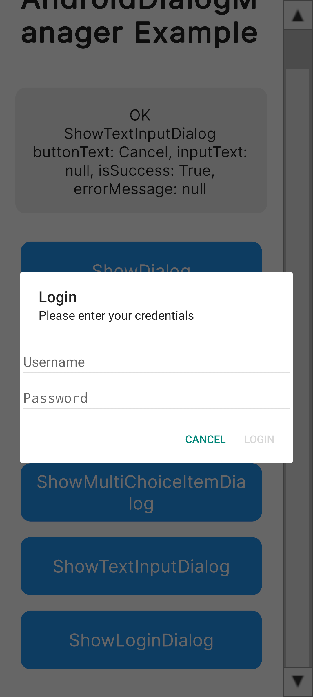
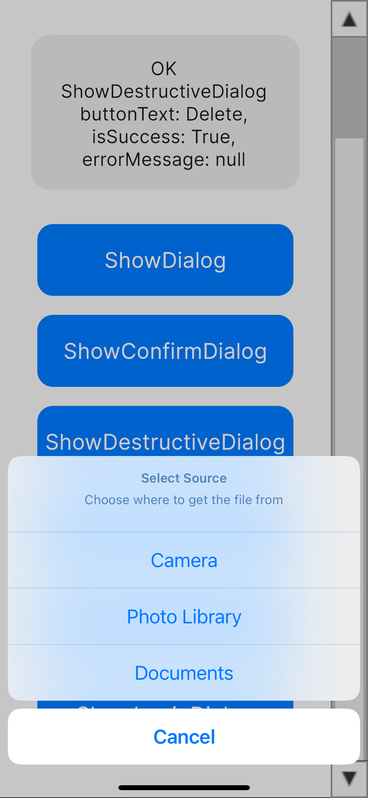
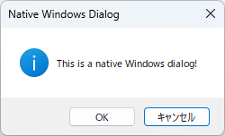
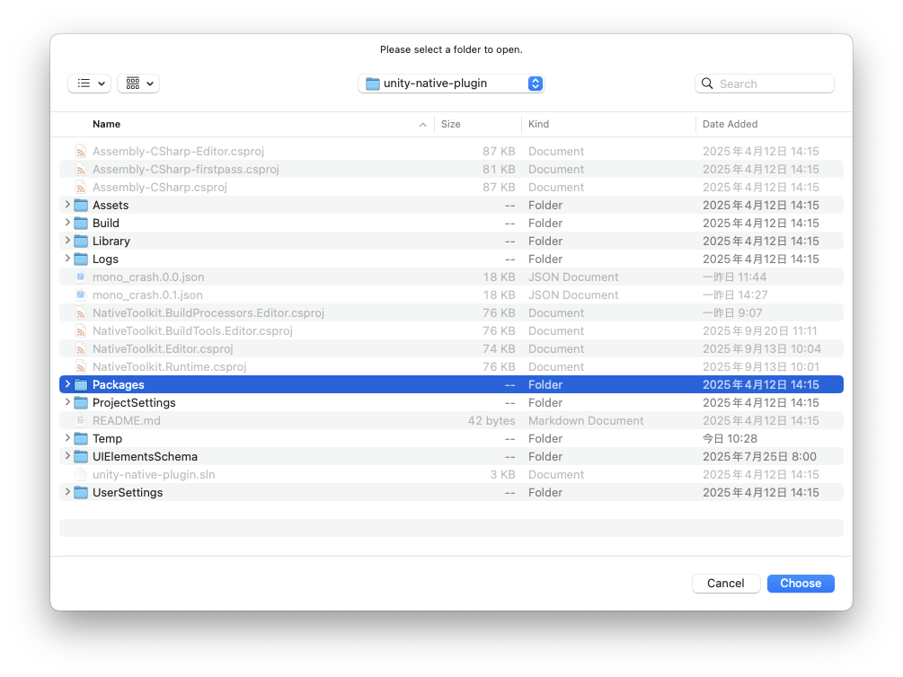

# Unity Native Toolkit (Unity 6)

[English](index.md) | [Korean](index.ko.md) | [Japanese](index.ja.md)

- Unity6 以降でネイティブ機能を提供するツールキットです。
- パッケージには Android/iOS/Windows/macOS 用のネイティブプラグインとサンプルシーンが含まれ、各プラットフォームのダイアログ操作をシングルトン API で扱えます。
- Editor 用ウィンドウからネイティブライブラリや Gradle/Xcode 設定を追加でき、ビルド後のプロジェクト整備をワークフロー化します。

# バージョン

## 1.0.0

# 対応 OS バージョン

- Android 12 以降
- iOS 18 以降
- Windows 11 以降
- macOS 15 以降

# 機能一覧

## Android

- ダイアログ機能
  - 基本ダイアログ
  - 確認ダイアログ
  - シングル選択ダイアログ
  - マルチ選択ダイアログ
  - 入力ダイアログ
  - ログインダイアログ

## iOS

- ダイアログ機能
  - 基本ダイアログ
  - 確認ダイアログ
  - ディストラクティブなダイアログ
  - アクションシート
  - 入力ダイアログ
  - ログインダイアログ

## Windows

- ダイアログ機能
  - 基本ダイアログ
  - ファイル選択ダイアログ
  - 複数ファイル選択ダイアログ
  - フォルダ選択ダイアログ
  - 複数フォルダ選択ダイアログ
  - ファイル保存ダイアログ

## Mac

- ダイアログ機能
  - 基本ダイアログ
  - ファイル選択ダイアログ
  - 複数ファイル選択ダイアログ
  - フォルダ選択ダイアログ
  - 複数フォルダ選択ダイアログ
  - ファイル保存ダイアログ

## 追加予定機能

- シェア機能
- クリップボード連携
- 通知

# はじめに

## インストール

- Unity6 を起動します。
- Window → Package Manager を選択します。
- Unity Package Manager → install from Git URL... を選択します。
- Native Toolkit パッケージの Git URL を入力します。
  - Git URL: https://github.com/jonghyunkim/unity-native-plugin.git?path=/Packages/com.jonghyunkim.nativetoolkit#1.0.0
- install をクリックします。
- 必要条件:
  - Unity 6 以降
  - 依存パッケージ: Localization, Addressables, Input System

## サンプル

- Unity6 を起動します。
- Window → Package Manager を選択します。
- Unity Package Manager → Native Toolkit → Samples → Import を選択します。
- Tools → Native Toolkit → Example を選択します。
<p align="center">
  
</p>

- Android サンプル
  - Android - Dialog - AndroidDialogManager.cs を選択します。
  - 「Open」ボタンをクリックします。
  - 「Game ビュー」にサンプル画面が表示されます。
  - 「Build Profiles」から「Android Profile」→ Export を実行します。
  - Tools → Native Toolkit → Android → Configue Gradle Project を選択します。
  <p align="center">
    
  </p>　

  - 「Browse」ボタンを押下して、Export した Android Project を指定します。
  - 「Run: Add Kotlin Dependencies」ボタンを押下して、Kotlin ライブラリを追加します。
  - Android Studio からサンプルアプリをインストールしてください。
    - <a href="https://developer.android.com/studio?hl=ja" target="_blank" rel="noopener noreferrer">参考サイト</a>

- iOS サンプル
  - iOS - Dialog - IosDialogManager.cs を選択します。
  - 「Open」ボタンをクリックします。
  - 「Game ビュー」にサンプル画面が表示されます。
  - 「Build Profiles」から「iOS Profile」→ Build を実行します。
  - Tools → Native Toolkit → iOS → Configue Xcode Project を選択します。
  <p align="center">
    
  </p>

  - 「Browse」ボタンを押下して、Build した iOS Project を指定します。
  - 「Run: Add/Embed iOS XCFrameworks」ボタンを押下して、NativeToolkit ライブラリを追加します。
  - Xcode からサンプルアプリをインストールしてください。
    - <a href="https://developer.apple.com/jp/xcode" target="_blank" rel="noopener noreferrer">参考サイト</a>

- Windows サンプル
  - Windows - Dialog - WindowsDialogManager.cs を選択します。
  - 「Open」ボタンをクリックします。
  - 「Game ビュー」にサンプル画面が表示されます。
  - 「Build Profiles」から「Windows Profile」→ Build を実行します。
  - Build 出力先にある「Unity NativeToolkit.exe」を実行してください。

- Mac サンプル
  - macOS - Dialog - MacDialogManager.cs を選択します。
  - 「Open」ボタンをクリックします。
  - 「Game ビュー」にサンプル画面が表示されます。
  - 「Build Profiles」から「macOS Profile」→ Build を実行します。
  - Tools → Native Toolkit → macOS → Configue Xcode Project を選択します。
  <p align="center">
    
  </p>

  - 「Browse」ボタンを押下して、Build した macOS Project を指定します。
  - 「Run: Add UnityMacNativeToolkit.xcframework」ボタンを押下して、NativeToolkit ライブラリを追加します。
  - Xcode からサンプルアプリをインストールしてください。
    - <a href="https://developer.apple.com/jp/xcode" target="_blank" rel="noopener noreferrer">参考サイト</a>

# API 使用方法

## ダイアログ

## AndroidDialogManager

### ShowDialog - 基本ダイアログ

- 名前空間をインポートします。

```csharp
// 実行ガード: Android (Player) のみ有効。Editor ではネイティブ呼び出しを行わないようにします。
#if UNITY_ANDROID && !UNITY_EDITOR
using JonghyunKim.NativeToolkit.Runtime.Dialog;
#endif
```

- イベントを登録します。

```csharp
// 実行ガード: Android (Player) のみ有効。Editor ではネイティブ呼び出しを行わないようにします。
#if UNITY_ANDROID && !UNITY_EDITOR
AndroidDialogManager.Instance.DialogResult += OnDialogResult;
#endif
```

- ダイアログを表示します。

```csharp
// 実行ガード: Android (Player) のみ有効。Editor ではネイティブ呼び出しを行わないようにします。
#if UNITY_ANDROID && !UNITY_EDITOR
// タイトルを設定します。必須項目です。
string title = "Hello from Unity";
// メッセージを設定します。必須項目です。
string message = "This is a native Android dialog!";
// ボタンのテキストを設定します。未設定の場合、"OK" が使用されます。
string buttonText = "OK";
// ダイアログの外をタップした場合、キャンセル可能かを設定します。未設定の場合、true が使用されます。
bool cancelableOnTouchOutside = false;
// バックキーなどでダイアログがキャンセル可能かを設定します。未設定の場合、true が使用されます。
bool cancelable = false;
AndroidDialogManager.Instance.ShowDialog(
  title,
  message,
  buttonText,
  cancelableOnTouchOutside,
  cancelable
);
#endif
```

<p align="center">
  
</p>
- ボタン押下時の結果はイベントで受け取ります。

```csharp
// buttonText:　押下したボタンのテキストを取得します。エラーの場合、null を返します。
// isSuccess: ダイアログ表示成功のプラグを取得します。成功の場合、true を返します。
// errorMessage: エラーが発生した場合、エラー内容を取得します。成功の場合、null を返します。

private void OnDialogResult(
  string? buttonText,
  bool isSuccess,
  string? errorMessage
)
```

### ShowConfirmDialog - 確認ダイアログ

- 名前空間をインポートします。

```csharp
// 実行ガード: Android (Player) のみ有効。Editor ではネイティブ呼び出しを行わないようにします。
#if UNITY_ANDROID && !UNITY_EDITOR
using JonghyunKim.NativeToolkit.Runtime.Dialog;
#endif
```

- イベントを登録します。

```csharp
// 実行ガード: Android (Player) のみ有効。Editor ではネイティブ呼び出しを行わないようにします。
#if UNITY_ANDROID && !UNITY_EDITOR
AndroidDialogManager.Instance.ConfirmDialogResult += OnConfirmDialogResult;
#endif
```

- ダイアログを表示します。

```csharp
// 実行ガード: Android (Player) のみ有効。Editor ではネイティブ呼び出しを行わないようにします。
#if UNITY_ANDROID && !UNITY_EDITOR
// タイトルを設定します。必須項目です。
string title = "Confirmation";
// メッセージを設定します。必須項目です。
string message = "Do you want to proceed with this action?";
// 否定ボタンのテキストを設定します。未設定の場合、"No" が使用されます。
string negativeButtonText = "No";
// 肯定ボタンのテキストを設定します。未設定の場合、"Yes" が使用されます。
string positiveButtonText = "Yes";
// ダイアログの外をタップした場合、キャンセル可能かを設定します。未設定の場合、true が使用されます。
bool cancelableOnTouchOutside = false;
// バックキーなどでダイアログがキャンセル可能かを設定します。未設定の場合、true が使用されます。
bool cancelable = false;
AndroidDialogManager.Instance.ShowConfirmDialog(
  title,
  message,
  negativeButtonText,
  positiveButtonText,
  cancelableOnTouchOutside,
  cancelable
);
#endif
```

<p align="center">
  
</p>
- ボタン押下時の結果はイベントで受け取ります。

```csharp
// buttonText:　押下したボタンのテキストを取得します。エラーの場合、null を返します。
// isSuccess: ダイアログ表示成功のプラグを取得します。成功の場合、true を返します。
// errorMessage: エラーが発生した場合、エラー内容を取得します。成功の場合、null を返します。

private void OnConfirmDialogResult(
  string? buttonText,
  bool isSuccess,
  string? errorMessage
)
```

### ShowSingleChoiceDialog - シングル選択ダイアログ

- 名前空間をインポートします。

```csharp
// 実行ガード: Android (Player) のみ有効。Editor ではネイティブ呼び出しを行わないようにします。
#if UNITY_ANDROID && !UNITY_EDITOR
using JonghyunKim.NativeToolkit.Runtime.Dialog;
#endif
```

- イベントを登録します。

```csharp
// 実行ガード: Android (Player) のみ有効。Editor ではネイティブ呼び出しを行わないようにします。
#if UNITY_ANDROID && !UNITY_EDITOR
AndroidDialogManager.Instance.SingleChoiceItemDialogResult += OnSingleChoiceItemDialogResult;
#endif
```

- ダイアログを表示します。

```csharp
// 実行ガード: Android (Player) のみ有効。Editor ではネイティブ呼び出しを行わないようにします。
#if UNITY_ANDROID && !UNITY_EDITOR
// タイトルを設定します。必須項目です。
string title = "Please select one";
// 選択肢を設定します。必須項目です。
string[] singleChoiceItems = { "Option 1", "Option 2", "Option 3" };
// デフォルト選択項目のindex番号を設定します。未設定の場合、0 が使用されます。
int checkedItem = 0;
// 否定ボタンのテキストを設定します。未設定の場合、"Cancel" が使用されます。
string negativeButtonText = "Cancel";
// 肯定ボタンのテキストを設定します。未設定の場合、"OK" が使用されます。
string positiveButtonText = "OK";
// ダイアログの外をタップした場合、キャンセル可能かを設定します。未設定の場合、true が使用されます。
bool cancelableOnTouchOutside = false;
// バックキーなどでダイアログがキャンセル可能かを設定します。未設定の場合、true が使用されます。
bool cancelable = false;
AndroidDialogManager.Instance.ShowSingleChoiceItemDialog(
  title,
  singleChoiceItems,
  checkedItem,
  negativeButtonText,
  positiveButtonText,
  cancelableOnTouchOutside,
  cancelable
);
#endif
```

<p align="center">
  
</p>
- ボタン押下時の結果はイベントで受け取ります。

```csharp
// buttonText:　押下したボタンのテキストを取得します。エラーの場合、null を返します。
// checkedItem: 選択された項目のindex番号を取得します。エラーの場合、null を返します。
// isSuccess: ダイアログ表示成功のプラグを取得します。成功の場合、true を返します。
// errorMessage: エラーが発生した場合、エラー内容を取得します。成功の場合、null を返します。

private void OnSingleChoiceItemDialogResult(
  string? buttonText,
  int? checkedItem,
  bool isSuccess,
  string? errorMessage
)
```

### ShowMultiChoiceDialog - マルチ選択ダイアログ

- 名前空間をインポートします。

```csharp
// 実行ガード: Android (Player) のみ有効。Editor ではネイティブ呼び出しを行わないようにします。
#if UNITY_ANDROID && !UNITY_EDITOR
using JonghyunKim.NativeToolkit.Runtime.Dialog;
#endif
```

- イベントを登録します。

```csharp
// 実行ガード: Android (Player) のみ有効。Editor ではネイティブ呼び出しを行わないようにします。
#if UNITY_ANDROID && !UNITY_EDITOR
AndroidDialogManager.Instance.MultiChoiceItemDialogResult += OnMultiChoiceItemDialogResult;
#endif
```

- ダイアログを表示します。

```csharp
// 実行ガード: Android (Player) のみ有効。Editor ではネイティブ呼び出しを行わないようにします。
#if UNITY_ANDROID && !UNITY_EDITOR
// タイトルを設定します。必須項目です。
string title = "Multiple Selection";
// 選択肢を設定します。必須項目です。
string[] multiChoiceItems = { "Item 1", "Item 2", "Item 3", "Item 4" };
// デフォルト選択項目の選択状態を設定します。未設定の場合、すべて false が使用されます。
bool[] checkedItems = { false, true, false, true };
// 否定ボタンのテキストを設定します。未設定の場合、"Cancel" が使用されます。
string negativeButtonText = "Cancel";
// 肯定ボタンのテキストを設定します。未設定の場合、"OK" が使用されます。
string positiveButtonText = "OK";
// ダイアログの外をタップした場合、キャンセル可能かを設定します。未設定の場合、true が使用されます。
bool cancelableOnTouchOutside = false;
// バックキーなどでダイアログがキャンセル可能かを設定します。未設定の場合、true が使用されます。
bool cancelable = false;
AndroidDialogManager.Instance.ShowMultiChoiceItemDialog(
  title,
  multiChoiceItems,
  checkedItems,
  negativeButtonText,
  positiveButtonText,
  cancelableOnTouchOutside,
  cancelable
);
#endif
```

<p align="center">
  
</p>
- ボタン押下時の結果はイベントで受け取ります。

```csharp
// buttonText:　押下したボタンのテキストを取得します。エラーの場合、null を返します。
// checkedItems: 選択された項目の選択状態を取得します。選択はtrue, 未選択はfalse。エラーの場合、null を返します。
// isSuccess: ダイアログ表示成功のプラグを取得します。成功の場合、true を返します。
// errorMessage: エラーが発生した場合、エラー内容を取得します。成功の場合、null を返します。

private void OnMultiChoiceItemDialogResult(
  string? buttonText,
  bool[]? checkedItems,
  bool isSuccess,
  string? errorMessage
)
```

### ShowInputDialog - 入力ダイアログ

- 名前空間をインポートします。

```csharp
// 実行ガード: Android (Player) のみ有効。Editor ではネイティブ呼び出しを行わないようにします。
#if UNITY_ANDROID && !UNITY_EDITOR
using JonghyunKim.NativeToolkit.Runtime.Dialog;
#endif
```

- イベントを登録します。

```csharp
// 実行ガード: Android (Player) のみ有効。Editor ではネイティブ呼び出しを行わないようにします。
#if UNITY_ANDROID && !UNITY_EDITOR
AndroidDialogManager.Instance.TextInputDialogResult += OnTextInputDialogResult;
#endif
```

- ダイアログを表示します。

```csharp
// 実行ガード: Android (Player) のみ有効。Editor ではネイティブ呼び出しを行わないようにします。
#if UNITY_ANDROID && !UNITY_EDITOR
// タイトルを設定します。必須項目です。
string title = "Text Input";
// メッセージを設定します。必須項目です。
string message = "Please enter your name";
// プレースホルダーを設定します。未設定の場合、空文字列が使用されます。
string placeholder = "Enter here...";
// 否定ボタンのテキストを設定します。未設定の場合、"Cancel" が使用されます。
string negativeButtonText = "Cancel";
// 肯定ボタンのテキストを設定します。未設定の場合、"OK" が使用されます。
string positiveButtonText = "OK";
// 入力値が空の場合、肯定ボタンが有効になるかを設定します。未設定の場合、false が使用されます。
bool enablePositiveButtonWhenEmpty = false;
// ダイアログの外をタップした場合、キャンセル可能かを設定します。未設定の場合、true が使用されます。
bool cancelableOnTouchOutside = false;
// バックキーなどでダイアログがキャンセル可能かを設定します。未設定の場合、true が使用されます。
bool cancelable = false;
AndroidDialogManager.Instance.ShowTextInputDialog(
  title,
  message,
  placeholder,
  negativeButtonText,
  positiveButtonText,
  enablePositiveButtonWhenEmpty,
  cancelableOnTouchOutside,
  cancelable
);
#endif
```

<p align="center">
  
</p>
- ボタン押下時の結果はイベントで受け取ります。

```csharp
// buttonText:　押下したボタンのテキストを取得します。エラーの場合、null を返します。
// inputText: 入力されたテキストを取得します。エラーの場合、null を返します。
// isSuccess: ダイアログ表示成功のプラグを取得します。成功の場合、true を返します。
// errorMessage: エラーが発生した場合、エラー内容を取得します。成功の場合、null を返します。

private void OnTextInputDialogResult(
  string? buttonText,
  string? inputText,
  bool isSuccess,
  string? errorMessage
)
```

### ShowLoginDialog - ログインダイアログ

- 名前空間をインポートします。

```csharp
// 実行ガード: Android (Player) のみ有効。Editor ではネイティブ呼び出しを行わないようにします。
#if UNITY_ANDROID && !UNITY_EDITOR
using JonghyunKim.NativeToolkit.Runtime.Dialog;
#endif
```

- イベントを登録します。

```csharp
// 実行ガード: Android (Player) のみ有効。Editor ではネイティブ呼び出しを行わないようにします。
#if UNITY_ANDROID && !UNITY_EDITOR
AndroidDialogManager.Instance.LoginDialogResult += OnLoginDialogResult;
#endif
```

- ダイアログを表示します。

```csharp
// 実行ガード: Android (Player) のみ有効。Editor ではネイティブ呼び出しを行わないようにします。
#if UNITY_ANDROID && !UNITY_EDITOR
// タイトルを設定します。必須項目です。
string title = "Login";
// メッセージを設定します。必須項目です。
string message = "Please enter your credentials";
// ユーザ名のプレースホルダーを設定します。未設定の場合、"Username" が使用されます。
string usernameHint = "Username";
// パスワードのプレースホルダーを設定します。未設定の場合、"Password" が使用されます。
string passwordHint = "Password";
// 否定ボタンのテキストを設定します。未設定の場合、"Cancel" が使用されます。
string negativeButtonText = "Cancel";
// 肯定ボタンのテキストを設定します。未設定の場合、"Login" が使用されます。
string positiveButtonText = "Login";
// 入力値が空の場合、肯定ボタンが有効になるかを設定します。未設定の場合、false が使用されます。
bool enablePositiveButtonWhenEmpty = false;
// ダイアログの外をタップした場合、キャンセル可能かを設定します。未設定の場合、true が使用されます。
bool cancelableOnTouchOutside = false;
// バックキーなどでダイアログがキャンセル可能かを設定します。未設定の場合、true が使用されます。
bool cancelable = false;
AndroidDialogManager.Instance.ShowLoginDialog(
  title,
  message,
  usernameHint,
  passwordHint,
  negativeButtonText,
  positiveButtonText,
  enablePositiveButtonWhenEmpty,
  cancelableOnTouchOutside,
  cancelable
);
#endif
```

<p align="center">
  
</p>
- ボタン押下時の結果はイベントで受け取ります。

```csharp
// buttonText:　押下したボタンのテキストを取得します。エラーの場合、null を返します。
// username: 入力されたユーザ名を取得します。エラーの場合、null を返します。
// password: 入力されたパスワードを取得します。エラーの場合、null を返します。
// isSuccess: ダイアログ表示成功のプラグを取得します。成功の場合、true を返します。
// errorMessage: エラーが発生した場合、エラー内容を取得します。成功の場合、null を返します。

private void OnLoginDialogResult(
  string? buttonText,
  string? username,
  string? password,
  bool isSuccess,
  string? errorMessage
)
```

## iOSDialogManager

### ShowDialog - 基本ダイアログ

- 名前空間をインポートします。

```csharp
// 実行ガード: iOS (Player) のみ有効。Editor ではネイティブ呼び出しを行わないようにします。
#if UNITY_IOS && !UNITY_EDITOR
using JonghyunKim.NativeToolkit.Runtime.Dialog;
#endif
```

- イベントを登録します。

```csharp
// 実行ガード: iOS (Player) のみ有効。Editor ではネイティブ呼び出しを行わないようにします。
#if UNITY_IOS && !UNITY_EDITOR
IosDialogManager.Instance.DialogResult += OnDialogResult;
#endif
```

- ダイアログを表示します。

```csharp
// 実行ガード: iOS (Player) のみ有効。Editor ではネイティブ呼び出しを行わないようにします。
#if UNITY_IOS && !UNITY_EDITOR
// タイトルを設定します。必須項目です。
string title = "Hello from Unity";
// メッセージを設定します。必須項目です。
string message = "This is a native iOS dialog!";
// ボタンのテキストを設定します。未設定の場合、"OK" が使用されます。
string buttonText = "OK";
IosDialogManager.Instance.ShowDialog(
  title,
  message,
  buttonText
);
#endif
```

<p align="center">
  
</p>
- ボタン押下時の結果はイベントで受け取ります。

```csharp
// buttonText:　押下したボタンのテキストを取得します。エラーの場合、null を返します。
// isSuccess: ダイアログ表示成功のプラグを取得します。成功の場合、true を返します。
// errorMessage: エラーが発生した場合、エラー内容を取得します。成功の場合、null を返します。

private void OnDialogResult(
  string? buttonText,
  bool isSuccess,
  string? errorMessage
)
```

### ShowConfirmDialog - 確認ダイアログ

- 名前空間をインポートします。

```csharp
// 実行ガード: iOS (Player) のみ有効。Editor ではネイティブ呼び出しを行わないようにします。
#if UNITY_IOS && !UNITY_EDITOR
using JonghyunKim.NativeToolkit.Runtime.Dialog;
#endif
```

- イベントを登録します。

```csharp
// 実行ガード: iOS (Player) のみ有効。Editor ではネイティブ呼び出しを行わないようにします。
#if UNITY_IOS && !UNITY_EDITOR
IosDialogManager.Instance.ConfirmDialogResult += OnConfirmDialogResult;
#endif
```

- ダイアログを表示します。

```csharp
// 実行ガード: iOS (Player) のみ有効。Editor ではネイティブ呼び出しを行わないようにします。
#if UNITY_IOS && !UNITY_EDITOR
// タイトルを設定します。必須項目です。
string title = "Confirm Action";
// メッセージを設定します。必須項目です。
string message = "Are you sure you want to proceed?";
// 確認ボタンのテキストを設定します。未設定の場合、"OK" が使用されます。
string confirmButtonText = "Yes";
// キャンセルボタンのテキストを設定します。未設定の場合、"Cancel" が使用されます。
string cancelButtonText = "No";
IosDialogManager.Instance.ShowConfirmDialog(
  title,
  message,
  confirmButtonText,
  cancelButtonText
);
#endif
```

<p align="center">
  
</p>
- ボタン押下時の結果はイベントで受け取ります。

```csharp
// buttonText:　押下したボタンのテキストを取得します。エラーの場合、null を返します。
// isSuccess: ダイアログ表示成功のプラグを取得します。成功の場合、true を返します。
// errorMessage: エラーが発生した場合、エラー内容を取得します。成功の場合、null を返します。

private void OnConfirmDialogResult(
  string? buttonText,
  bool isSuccess,
  string? errorMessage
)
```

### ShowDestructiveDialog - ディストラクティブなダイアログ

- 名前空間をインポートします。

```csharp
// 実行ガード: iOS (Player) のみ有効。Editor ではネイティブ呼び出しを行わないようにします。
#if UNITY_IOS && !UNITY_EDITOR
using JonghyunKim.NativeToolkit.Runtime.Dialog;
#endif
```

- イベントを登録します。

```csharp
// 実行ガード: iOS (Player) のみ有効。Editor ではネイティブ呼び出しを行わないようにします。
#if UNITY_IOS && !UNITY_EDITOR
IosDialogManager.Instance.DestructiveDialogResult += OnDestructiveDialogResult;
#endif
```

- ダイアログを表示します。

```csharp
// 実行ガード: iOS (Player) のみ有効。Editor ではネイティブ呼び出しを行わないようにします。
#if UNITY_IOS && !UNITY_EDITOR
// タイトルを設定します。必須項目です。
string title = "Delete File";
// メッセージを設定します。必須項目です。
string message = "This action cannot be undone. Are you sure?";
// 破壊的操作の確認ボタンのテキストを設定します。未設定の場合、"Delete" が使用されます。
string destructiveButtonText = "Delete";
// キャンセルボタンのテキストを設定します。未設定の場合、"Cancel" が使用されます。
string cancelButtonText = "Cancel";
IosDialogManager.Instance.ShowDestructiveDialog(
  title,
  message,
  destructiveButtonText,
  cancelButtonText
);
#endif
```

<p align="center">
  
</p>
- ボタン押下時の結果はイベントで受け取ります。

```csharp
// buttonText:　押下したボタンのテキストを取得します。エラーの場合、null を返します。
// isSuccess: ダイアログ表示成功のプラグを取得します。成功の場合、true を返します。
// errorMessage: エラーが発生した場合、エラー内容を取得します。成功の場合、null を返します。

private void OnDestructiveDialogResult(
  string? buttonText,
  bool isSuccess,
  string? errorMessage
)
```

### ShowActionSheet - アクションシート

- 名前空間をインポートします。

```csharp
// 実行ガード: iOS (Player) のみ有効。Editor ではネイティブ呼び出しを行わないようにします。
#if UNITY_IOS && !UNITY_EDITOR
using JonghyunKim.NativeToolkit.Runtime.Dialog;
#endif
```

- イベントを登録します。

```csharp
// 実行ガード: iOS (Player) のみ有効。Editor ではネイティブ呼び出しを行わないようにします。
#if UNITY_IOS && !UNITY_EDITOR
IosDialogManager.Instance.ActionSheetResult += OnActionSheetResult;
#endif
```

- アクションシートを表示します。

```csharp
// 実行ガード: iOS (Player) のみ有効。Editor ではネイティブ呼び出しを行わないようにします。
#if UNITY_IOS && !UNITY_EDITOR
// タイトルを設定します。必須項目です。
string title = "Select Source";
// メッセージを設定します。必須項目です。
string message = "Choose where to get the file from";
// 選択肢を設定します。必須項目です。
string[] options = { "Camera", "Photo Library", "Documents" };
// キャンセルボタンのテキストを設定します。未設定の場合、"Cancel" が使用されます。
string cancelButtonText = "Cancel";
IosDialogManager.Instance.ShowActionSheet(
  title,
  message,
  options,
  cancelButtonText
);
#endif
```

<p align="center">
  
</p>
- ボタン押下時の結果はイベントで受け取ります。

```csharp
// buttonText:　押下したボタンのテキストを取得します。エラーの場合、null を返します。
// isSuccess: ダイアログ表示成功のプラグを取得します。成功の場合、true を返します。
// errorMessage: エラーが発生した場合、エラー内容を取得します。成功の場合、null を返します。

private void OnActionSheetResult(
  string? buttonText,
  bool isSuccess,
  string? errorMessage
)
```

### ShowTextInputDialog - 入力ダイアログ

- 名前空間をインポートします。

```csharp
// 実行ガード: iOS (Player) のみ有効。Editor ではネイティブ呼び出しを行わないようにします。
#if UNITY_IOS && !UNITY_EDITOR
using JonghyunKim.NativeToolkit.Runtime.Dialog;
#endif
```

- イベントを登録します。

```csharp
// 実行ガード: iOS (Player) のみ有効。Editor ではネイティブ呼び出しを行わないようにします。
#if UNITY_IOS && !UNITY_EDITOR
IosDialogManager.Instance.TextInputDialogResult += OnTextInputDialogResult;
#endif
```

- ダイアログを表示します。

```csharp
// 実行ガード: iOS (Player) のみ有効。Editor ではネイティブ呼び出しを行わないようにします。
#if UNITY_IOS && !UNITY_EDITOR
// タイトルを設定します。必須項目です。
string title = "Enter Name";
// メッセージを設定します。必須項目です。
string message = "Please enter your name";
// プレースホルダーを設定します。未設定の場合、空文字列が使用されます。
string placeholder = "Your name here";
// 確認ボタンのテキストを設定します。未設定の場合、"OK" が使用されます。
string confirmButtonText = "OK";
// キャンセルボタンのテキストを設定します。未設定の場合、"Cancel" が使用されます。
string cancelButtonText = "Cancel";
// 入力値が空の場合、確認ボタンが有効になるかを設定します。未設定の場合、false が使用されます。
bool enableConfirmWhenEmpty = false;
IosDialogManager.Instance.ShowTextInputDialog(
  title,
  message,
  placeholder,
  confirmButtonText,
  cancelButtonText,
  enableConfirmWhenEmpty
);
#endif
```

<p align="center">
  
</p>
- ボタン押下時の結果はイベントで受け取ります。

```csharp
// buttonText:　押下したボタンのテキストを取得します。エラーの場合、null を返します。
// inputText: 入力されたテキストを取得します。エラーの場合、null を返します。
// isSuccess: ダイアログ表示成功のプラグを取得します。成功の場合、true を返します。
// errorMessage: エラーが発生した場合、エラー内容を取得します。成功の場合、null を返します。

private void OnTextInputDialogResult(
  string? buttonText,
  string? inputText,
  bool isSuccess,
  string? errorMessage
)
```

### ShowLoginDialog - ログインダイアログ

- 名前空間をインポートします。

```csharp
// 実行ガード: iOS (Player) のみ有効。Editor ではネイティブ呼び出しを行わないようにします。
#if UNITY_IOS && !UNITY_EDITOR
using JonghyunKim.NativeToolkit.Runtime.Dialog;
#endif
```

- イベントを登録します。

```csharp
// 実行ガード: iOS (Player) のみ有効。Editor ではネイティブ呼び出しを行わないようにします。
#if UNITY_IOS && !UNITY_EDITOR
IosDialogManager.Instance.LoginDialogResult += OnLoginDialogResult;
#endif
```

- ダイアログを表示します。

```csharp
// 実行ガード: iOS (Player) のみ有効。Editor ではネイティブ呼び出しを行わないようにします。
#if UNITY_IOS && !UNITY_EDITOR
// タイトルを設定します。必須項目です。
string title = "Login Required";
// メッセージを設定します。必須項目です。
string message = "Please enter your credentials";
// ユーザ名のプレースホルダーを設定します。未設定の場合、"Username" が使用されます。
string usernamePlaceholder = "Username";
// パスワードのプレースホルダーを設定します。未設定の場合、"Password" が使用されます。
string passwordPlaceholder = "Password";
// ログインボタンのテキストを設定します。未設定の場合、"Login" が使用されます。
string loginButtonText = "Login";
// キャンセルボタンのテキストを設定します。未設定の場合、"Cancel" が使用されます。
string cancelButtonText = "Cancel";
// 入力値が空の場合、ログインボタンが有効になるかを設定します。未設定の場合、false が使用されます。
bool enableLoginWhenEmpty = false;
IosDialogManager.Instance.ShowLoginDialog(
  title,
  message,
  usernamePlaceholder,
  passwordPlaceholder,
  loginButtonText,
  cancelButtonText,
  enableLoginWhenEmpty
);
#endif
```

<p align="center">
  
</p>
- ボタン押下時の結果はイベントで受け取ります。

```csharp
// buttonText:　押下したボタンのテキストを取得します。エラーの場合、null を返します。
// username: 入力されたユーザ名を取得します。エラーの場合、null を返します。
// password: 入力されたパスワードを取得します。エラーの場合、null を返します。
// isSuccess: ダイアログ表示成功のプラグを取得します。成功の場合、true を返します。
// errorMessage: エラーが発生した場合、エラー内容を取得します。成功の場合、null を返します。

private void OnLoginDialogResult(
  string? buttonText,
  string? username,
  string? password,
  bool isSuccess,
  string? errorMessage
)
```

## WindowsDialogManager

### ShowDialog - 基本ダイアログ

- 名前空間をインポートします。

```csharp
// 実行ガード: Windows (Player) のみ有効。Editor ではネイティブ呼び出しを行わないようにします。
#if UNITY_STANDALONE_WIN && !UNITY_EDITOR
using JonghyunKim.NativeToolkit.Runtime.Dialog;
#endif
```

- イベントを登録します。

```csharp
// 実行ガード: Windows (Player) のみ有効。Editor ではネイティブ呼び出しを行わないようにします。
#if UNITY_STANDALONE_WIN && !UNITY_EDITOR
WindowsDialogManager.Instance.AlertDialogResult += OnAlertDialogResult;
#endif
```

- ダイアログを表示します。

```csharp
// 実行ガード: Windows (Player) のみ有効。Editor ではネイティブ呼び出しを行わないようにします。
#if UNITY_STANDALONE_WIN && !UNITY_EDITOR
// タイトルを設定します。必須項目です。
string title = "Native Windows Dialog";
// メッセージを設定します。必須項目です。
string message = "This is a native Windows dialog!";
// ボタンの種類を設定します。ここでは OK と キャンセル ボタンを表示します。未設定の場合、MB_OK が使用されます。
uint buttons = Win32MessageBox.MB_OKCANCEL;
// アイコンを設定します。ここでは情報アイコンを表示します。未設定の場合、MB_ICONINFORMATION が使用されます。
uint icon = Win32MessageBox.MB_ICONINFORMATION;
// デフォルトボタンを設定します。ここでは2番目のボタンをデフォルトにします。未設定の場合、MB_DEFBUTTON1 が使用されます。
uint defbutton = Win32MessageBox.MB_DEFBUTTON2;
// オプションを設定します。ここではアプリケーションモーダルを指定します。未設定の場合、MB_APPLMODAL が使用されます。
uint options = Win32MessageBox.MB_APPLMODAL;
WindowsDialogManager.Instance.ShowDialog(
  title,
  message,
  buttons,
  icon,
  defbutton,
  options
);
#endif
```

<p align="center">
  
</p>
- 結果はイベントで受け取ります。

```csharp
// result: 押下したボタンの識別子を取得します。エラーの場合、null を返します。
// isSuccess: ダイアログ表示成功のフラグを取得します。成功の場合、true を返します。
// errorCode: エラーが発生した場合、エラーコードを取得します。成功の場合、null を返します。

private void OnAlertDialogResult(
  int? result,
  bool isSuccess,
  int? errorCode
)
```

### ShowFileDialog - ファイル選択ダイアログ

- 名前空間をインポートします。

```csharp
// 実行ガード: Windows (Player) のみ有効。Editor ではネイティブ呼び出しを行わないようにします。
#if UNITY_STANDALONE_WIN && !UNITY_EDITOR
using JonghyunKim.NativeToolkit.Runtime.Dialog;
#endif
```

- イベントを登録します。

```csharp
// 実行ガード: Windows (Player) のみ有効。Editor ではネイティブ呼び出しを行わないようにします。
#if UNITY_STANDALONE_WIN && !UNITY_EDITOR
WindowsDialogManager.Instance.FileDialogResult += OnFileDialogResult;
#endif
```

- ダイアログを表示します。

```csharp
// 実行ガード: Windows (Player) のみ有効。Editor ではネイティブ呼び出しを行わないようにします。
#if UNITY_STANDALONE_WIN && !UNITY_EDITOR
// バッファサイズを設定します。未設定の場合、1024 が使用されます。
uint bufferSize = 1024;
// フィルタを設定します。各フィルタはヌル文字 (\0) で区切り、最後に二重のヌル文字で終了します。未設定の場合、"All Files\0*.*\0\0" が使用されます。
string filter = "All Files\0*.*\0\0";
WindowsDialogManager.Instance.ShowFileDialog(
  bufferSize,
  filter
);
#endif
```

<p align="center">
  
</p>
- 結果はイベントで受け取ります。

```csharp
// filePath: 選択されたファイルパスを取得します。キャンセルや失敗の場合は null を返します。
// isCancelled: ユーザがダイアログをキャンセルしたかどうかを取得します。
// isSuccess: ダイアログ表示成功のフラグを取得します。成功の場合、true を返します。
// errorCode: エラーが発生した場合、エラーコードを取得します。成功の場合、null を返します。

private void OnFileDialogResult(
  string? filePath,
  bool isCancelled,
  bool isSuccess,
  int? errorCode
)
```

### ShowMultiFileDialog - 複数ファイル選択ダイアログ

- 名前空間をインポートします。

```csharp
// 実行ガード: Windows (Player) のみ有効。Editor ではネイティブ呼び出しを行わないようにします。
#if UNITY_STANDALONE_WIN && !UNITY_EDITOR
using JonghyunKim.NativeToolkit.Runtime.Dialog;
#endif
```

- イベントを登録します。

```csharp
// 実行ガード: Windows (Player) のみ有効。Editor ではネイティブ呼び出しを行わないようにします。
#if UNITY_STANDALONE_WIN && !UNITY_EDITOR
WindowsDialogManager.Instance.MultiFileDialogResult += OnMultiFileDialogResult;
#endif
```

- ダイアログを表示します。

```csharp
// 実行ガード: Windows (Player) のみ有効。Editor ではネイティブ呼び出しを行わないようにします。
#if UNITY_STANDALONE_WIN && !UNITY_EDITOR
// バッファサイズを設定します。未設定の場合、4096 が使用されます。
uint bufferSize = 4096;
// フィルタを設定します。各フィルタはヌル文字 (\0) で区切り、最後に二重のヌル文字で終了します。未設定の場合、"All Files\0*.*\0\0" が使用されます。
string filter = "All Files\0*.*\0\0";
WindowsDialogManager.Instance.ShowMultiFileDialog(
  bufferSize,
  filter
);
#endif
```

<p align="center">
  
</p>
- 結果はイベントで受け取ります。

```csharp
// filePaths: 選択されたファイルパスの ArrayList を取得します。キャンセルや失敗の場合は null を返します。
// isCancelled: ユーザがダイアログをキャンセルしたかどうかを取得します。
// isSuccess: ダイアログ表示成功のフラグを取得します。成功の場合、true を返します。
// errorCode: エラーが発生した場合、エラーコードを取得します。成功の場合、null を返します。

private void OnMultiFileDialogResult(
  ArrayList? filePaths,
  bool isCancelled,
  bool isSuccess,
  int? errorCode
)
```

### ShowFolderDialog - フォルダ選択ダイアログ

- 名前空間をインポートします。

```csharp
// 実行ガード: Windows (Player) のみ有効。Editor ではネイティブ呼び出しを行わないようにします。
#if UNITY_STANDALONE_WIN && !UNITY_EDITOR
using JonghyunKim.NativeToolkit.Runtime.Dialog;
#endif
```

- イベントを登録します。

```csharp
// 実行ガード: Windows (Player) のみ有効。Editor ではネイティブ呼び出しを行わないようにします。
#if UNITY_STANDALONE_WIN && !UNITY_EDITOR
WindowsDialogManager.Instance.FolderDialogResult += OnFolderDialogResult;
#endif
```

- ダイアログを表示します。

```csharp
// 実行ガード: Windows (Player) のみ有効。Editor ではネイティブ呼び出しを行わないようにします。
#if UNITY_STANDALONE_WIN && !UNITY_EDITOR
// バッファサイズを設定します。未設定の場合、1024 が使用されます。
uint bufferSize = 1024;
// タイトルを設定します。未設定の場合、"Select Folder" が使用されます。
string title = "Select Folder";
WindowsDialogManager.Instance.ShowFolderDialog(
  bufferSize,
  title
);
#endif
```

<p align="center">
  
</p>
- 結果はイベントで受け取ります。

```csharp
// folderPath: 選択されたフォルダパスを取得します。キャンセルや失敗の場合は null を返します。
// isCancelled: ユーザがダイアログをキャンセルしたかどうかを取得します。
// isSuccess: ダイアログ表示成功のフラグを取得します。成功の場合、true を返します。
// errorCode: エラーが発生した場合、エラーコードを取得します。成功の場合、null を返します。

private void OnFolderDialogResult(
  string? folderPath,
  bool isCancelled,
  bool isSuccess,
  int? errorCode
)
```

### ShowMultiFolderDialog - 複数フォルダ選択ダイアログ

- 名前空間をインポートします。

```csharp
// 実行ガード: Windows (Player) のみ有効。Editor ではネイティブ呼び出しを行わないようにします。
#if UNITY_STANDALONE_WIN && !UNITY_EDITOR
using JonghyunKim.NativeToolkit.Runtime.Dialog;
#endif
```

- イベントを登録します。

```csharp
// 実行ガード: Windows (Player) のみ有効。Editor ではネイティブ呼び出しを行わないようにします。
#if UNITY_STANDALONE_WIN && !UNITY_EDITOR
WindowsDialogManager.Instance.MultiFolderDialogResult += OnMultiFolderDialogResult;
#endif
```

- ダイアログを表示します。

```csharp
// 実行ガード: Windows (Player) のみ有効。Editor ではネイティブ呼び出しを行わないようにします。
#if UNITY_STANDALONE_WIN && !UNITY_EDITOR
// バッファサイズを設定します。未設定の場合、4096 が使用されます。
uint bufferSize = 4096;
// タイトルを設定します。未設定の場合、"Select Folders" が使用されます。
string title = "Select Folders";
WindowsDialogManager.Instance.ShowMultiFolderDialog(
  bufferSize,
  title
);
#endif
```

<p align="center">
  
</p>
- 結果はイベントで受け取ります。

```csharp
// folderPaths: 選択されたフォルダパスの ArrayList を取得します。キャンセルや失敗の場合は null を返します。
// isCancelled: ユーザがダイアログをキャンセルしたかどうかを取得します。
// isSuccess: ダイアログ表示成功のフラグを取得します。成功の場合、true を返します。
// errorCode: エラーが発生した場合、エラーコードを取得します。成功の場合、null を返します。

private void OnMultiFolderDialogResult(
  ArrayList? folderPaths,
  bool isCancelled,
  bool isSuccess,
  int? errorCode
)
```

### ShowSaveFileDialog - ファイル保存ダイアログ

- 名前空間をインポートします。

```csharp
// 実行ガード: Windows (Player) のみ有効。Editor ではネイティブ呼び出しを行わないようにします。
#if UNITY_STANDALONE_WIN && !UNITY_EDITOR
using JonghyunKim.NativeToolkit.Runtime.Dialog;
#endif
```

- イベントを登録します。

```csharp
// 実行ガード: Windows (Player) のみ有効。Editor ではネイティブ呼び出しを行わないようにします。
#if UNITY_STANDALONE_WIN && !UNITY_EDITOR
WindowsDialogManager.Instance.SaveFileDialogResult += OnSaveFileDialogResult;
#endif
```

- ダイアログを表示します。

```csharp
// 実行ガード: Windows (Player) のみ有効。Editor ではネイティブ呼び出しを行わないようにします。
#if UNITY_STANDALONE_WIN && !UNITY_EDITOR
// バッファサイズを設定します。未設定の場合、1024 が使用されます。
uint bufferSize = 1024;
// フィルタを設定します。各フィルタはヌル文字 (\0) で区切り、最後に二重のヌル文字で終了します。未設定の場合、"All Files\0*.*\0\0" が使用されます。
string filter = "All Files\0*.*\0\0";
// デフォルトの拡張子を設定します。未設定の場合、"txt" が使用されます。
string defExt = "txt";
WindowsDialogManager.Instance.ShowSaveFileDialog(
  bufferSize,
  filter,
  defExt
);
#endif
```

<p align="center">
  
</p>
- 結果はイベントで受け取ります。

```csharp
// filePath: 保存先のファイルパスを取得します。キャンセルや失敗の場合は null を返します。
// isCancelled: ユーザがダイアログをキャンセルしたかどうかを取得します。
// isSuccess: ダイアログ表示成功のフラグを取得します。成功の場合、true を返します。
// errorCode: エラーが発生した場合、エラーコードを取得します。 成功の場合、null を返します。

private void OnSaveFileDialogResult(
  string? filePath,
  bool isCancelled,
  bool isSuccess,
  int? errorCode
)
```

## MacDialogManager

### ShowDialog - 基本ダイアログ

- 名前空間をインポートします。

```csharp
// 実行ガード: macOS (Player) のみ有効。Editor ではネイティブ呼び出しを行わないようにします。
#if UNITY_STANDALONE_OSX && !UNITY_EDITOR
using JonghyunKim.NativeToolkit.Runtime.Dialog;
#endif
```

- イベントを登録します。

```csharp
// 実行ガード: macOS (Player) のみ有効。Editor ではネイティブ呼び出しを行わないようにします。
#if UNITY_STANDALONE_OSX && !UNITY_EDITOR
MacDialogManager.Instance.AlertDialogResult += OnAlertDialogResult;
#endif
```

- ダイアログを表示します。

```csharp
// 実行ガード: macOS (Player) のみ有効。Editor ではネイティブ呼び出しを行わないようにします。
#if UNITY_STANDALONE_OSX && !UNITY_EDITOR
// タイトルを設定します。必須項目です。
string title = "Hello from Unity";
// メッセージを設定します。未設定の場合、表示されません。
string message = "This is a native macOS dialog!";
// ボタンを設定します。最低1個のボタンが必要です。
DialogButton[] buttons = {
  // title: ボタンのタイトルを設定します。必須項目です。
  // isDefault: デフォルトボタンに設定する場合、true を指定します。省略時は false です。1個のダイアログにつき、1つのデフォルトボタンのみ設定可能です。
  // keyEquivalent: ボタンのキーショートカットを設定します。省略時は null です。isDefault が true の場合、自動的に Enter キーが割り当てられます。
  new DialogButton(title: "OK", isDefault: true),
  new DialogButton(title: "Cancel", keyEquivalent: "\u001b"),
  new DialogButton(title: "Delete", keyEquivalent: "d")
};
// オプションを設定します。必須項目です。
DialogOptions options = new DialogOptions(
  // alertStyle: ダイアログのスタイルを設定します。必須項目です。
  alertStyle: DialogOptions.AlertStyle.Informational,
  // showsHelp: ヘルプボタンを表示する場合、true を指定します。省略時は false です。
  showsHelp: true,
  // showsSuppressionButton: サプレッションチェックボックスを表示する場合、true を指定します。省略時は false です。
  showsSuppressionButton: true,
  // suppressionButtonTitle: サプレッションチェックボックスのタイトルを設定します。省略時は OSデフォルトのタイトルが使用されます。showsSuppressionButton が false の場合、無視されます。
  suppressionButtonTitle: "Don't show this again",
  // icon: ダイアログに表示するアイコンを設定します。
  icon: new IconConfiguration(
    // 以下はアイコンのタイプごとの設定方法例です。必要に応じて設定してください。
    ...
  )
);

// アイコンのタイプがシステムシンボルアイコンの例です。
DialogOptions options = new DialogOptions(
  ...
  icon: new IconConfiguration(
    // type: アイコンのタイプがシステムシンボルです。必須項目です。
    type: IconConfiguration.IconType.SystemSymbol,
    // value: システムシンボルの名前を設定します。必須項目です。
    value: "info.square.fill",
    // mode: アイコンのレンダリングモードを設定します。必須項目です。
    mode: IconConfiguration.RenderingMode.Palette,
    // colors: アイコンのカラー配列を設定します。レンダリングモードが Palette の場合、1～3色を指定可能で必須です。レンダリングモードが Hierarchical の場合、1色が指定可能です。色は #RRGGBB または colorname 形式で指定します。
    colors: new List<string> { "white", "systemblue", "systemblue" },
    // size: アイコンのサイズをポイント単位で設定します。省略時は OSデフォルト値が使用されます。ダイアログでは制限により設定しても無効です。
    size: 64f,
    // weight: アイコンのウェイトを設定します。省略時は OSデフォルト値が使用されます。
    weight: IconConfiguration.Weight.Regular,
    // scale: アイコンのスケールを設定します。省略時は OSデフォルト値が使用されます。ダイアログでは制限により設定しても無効です。
    scale: IconConfiguration.Scale.Medium
  )
);

// アイコンのタイプがファイルパスの場合の例です。
DialogOptions options = new DialogOptions(
  ...
  icon: new IconConfiguration(
    // type: アイコンのタイプがファイルパスです。必須項目です。
    type: IconConfiguration.IconType.FilePath,
    // value: ファイルパスを設定します。必須項目です。
    value: "/Users/user/Downloads/test.png"
  )
);

// アイコンのタイプが名前付き画像の場合の例です。
DialogOptions options = new DialogOptions(
  ...
  icon: new IconConfiguration(
    // type: アイコンのタイプが名前付き画像です。必須項目です。
    type: IconConfiguration.IconType.NamedImage,
    // value: 名前付き画像の名前を設定します。必須項目です。
    value: "test-image"
  )
);

// アイコンのタイプがアプリアイコンの場合の例です。
DialogOptions options = new DialogOptions(
  ...
  icon: new IconConfiguration(
    // type: アイコンのタイプがアプリアイコンです。必須項目です。
    type: IconConfiguration.IconType.AppIcon
  )
);

// アイコンのタイプがシステム画像の場合の例です。
DialogOptions options = new DialogOptions(
  ...
  icon: new IconConfiguration(
    // type: アイコンのタイプがシステム画像です。必須項目です。
    type: IconConfiguration.IconType.SystemImage,
    // value: システム画像の名前を設定します。必須項目です。
    value: "cautionName"
  )
);

MacDialogManager.Instance.ShowDialog(
  title,
  message,
  buttons,
  options
);
#endif
```

<p align="center">
  
</p>
- ボタン押下時の結果はイベントで受け取ります。

```csharp
// buttonTitle: 押下したボタンのタイトルを取得します。エラーの場合、null を返します。
// buttonIndex: 押下したボタンの index を取得します。
// suppressionState: サプレッションチェックボックスの状態を取得します。
// isSuccess: ダイアログ表示成功のフラグを取得します。成功の場合、true を返します。
// errorMessage: エラーが発生した場合、エラー内容を取得します。成功の場合、null を返します。

private void OnAlertDialogResult(
  string? buttonTitle,
  int buttonIndex,
  bool suppressionState,
  bool isSuccess,
  string? errorMessage
)
```

### ShowFileDialog - ファイル選択ダイアログ

- 名前空間をインポートします。

```csharp
// 実行ガード: macOS (Player) のみ有効。Editor ではネイティブ呼び出しを行わないようにします。
#if UNITY_STANDALONE_OSX && !UNITY_EDITOR
using JonghyunKim.NativeToolkit.Runtime.Dialog;
#endif
```

- イベントを登録します。

```csharp
// 実行ガード: macOS (Player) のみ有効。Editor ではネイティブ呼び出しを行わないようにします。
#if UNITY_STANDALONE_OSX && !UNITY_EDITOR
MacDialogManager.Instance.FileDialogResult += OnFileDialogResult;
#endif
```

- ダイアログを表示します。

```csharp
// 実行ガード: macOS (Player) のみ有効。Editor ではネイティブ呼び出しを行わないようにします。
#if UNITY_STANDALONE_OSX && !UNITY_EDITOR
// タイトルを設定します。必須項目です。
string title = "Select a file";
// メッセージを設定します。未設定の場合、表示されません。
string message = "Please select a file to open.";
// 許可するファイルの拡張子を設定します。未設定の場合、OS規定の値が使用されます。
string[] allowedContentTypes = { "txt", "png" };
// 初期ディレクトリを設定します。未設定の場合、OS規定の値が使用されます。
string? directoryPath = null;
MacDialogManager.Instance.ShowFileDialog(
  title,
  message,
  allowedContentTypes,
  directoryPath
);
#endif
```

<p align="center">
  
</p>
- 選択結果はイベントで受け取ります。

```csharp
// filePaths: 選択されたファイルパスの配列を取得します。エラーの場合、null を返します。
// fileCount: 返却されたファイル数を取得します。キャンセルされた場合は 0 です。
// directoryURL: 選択が行われたディレクトリ URL を取得します。エラーの場合、null を返します。
// isCancelled: ユーザがダイアログをキャンセルしたかどうかを取得します。
// isSuccess: ダイアログ表示成功のフラグを取得します。成功の場合、true を返します。
// errorMessage: エラーが発生した場合、エラー内容を取得します。成功の場合、null を返します。

private void OnFileDialogResult(
  string[]? filePaths,
  int fileCount,
  string? directoryURL,
  bool isCancelled,
  bool isSuccess,
  string? errorMessage
)
```

### ShowMultiFileDialog - 複数ファイル選択ダイアログ

- 名前空間をインポートします。

```csharp
// 実行ガード: macOS (Player) のみ有効。Editor ではネイティブ呼び出しを行わないようにします。
#if UNITY_STANDALONE_OSX && !UNITY_EDITOR
using JonghyunKim.NativeToolkit.Runtime.Dialog;
#endif
```

- イベントを登録します。

```csharp
// 実行ガード: macOS (Player) のみ有効。Editor ではネイティブ呼び出しを行わないようにします。
#if UNITY_STANDALONE_OSX && !UNITY_EDITOR
MacDialogManager.Instance.MultiFileDialogResult += OnMultiFileDialogResult;
#endif
```

- ダイアログを表示します。

```csharp
// 実行ガード: macOS (Player) のみ有効。Editor ではネイティブ呼び出しを行わないようにします。
#if UNITY_STANDALONE_OSX && !UNITY_EDITOR
// タイトルを設定します。必須項目です。
string title = "Select files";
// メッセージを設定します。未設定の場合、表示されません。
string message = "Please select files to open.";
// 許可するファイルの拡張子を設定します。未設定の場合、OS規定の値が使用されます。
string[] allowedContentTypes = { "txt", "png" };
// 初期ディレクトリを設定します。未設定の場合、OS規定の値が使用されます。
string? directoryPath = null;
MacDialogManager.Instance.ShowMultiFileDialog(
  title,
  message,
  allowedContentTypes,
  directoryPath
);
#endif
```

<p align="center">
  
</p>
- 選択結果はイベントで受け取ります。

```csharp
// filePaths: 選択されたファイルパスの配列を取得します。エラーの場合、null を返します。
// fileCount: 返却されたファイル数を取得します。キャンセルされた場合は 0 です。
// directoryURL: 選択が行われたディレクトリ URL を取得します。エラーの場合、null を返します。
// isCancelled: ユーザがダイアログをキャンセルしたかどうかを取得します。
// isSuccess: ダイアログ表示成功のフラグを取得します。成功の場合、true を返します。
// errorMessage: エラーが発生した場合、エラー内容を取得します。成功の場合、null を返します。

private void OnMultiFileDialogResult(
  string[]? filePaths,
  int fileCount,
  string? directoryURL,
  bool isCancelled,
  bool isSuccess,
  string? errorMessage
)
```

### ShowFolderDialog - フォルダ選択ダイアログ

- 名前空間をインポートします。

```csharp
// 実行ガード: macOS (Player) のみ有効。Editor ではネイティブ呼び出しを行わないようにします。
#if UNITY_STANDALONE_OSX && !UNITY_EDITOR
using JonghyunKim.NativeToolkit.Runtime.Dialog;
#endif
```

- イベントを登録します。

```csharp
// 実行ガード: macOS (Player) のみ有効。Editor ではネイティブ呼び出しを行わないようにします。
#if UNITY_STANDALONE_OSX && !UNITY_EDITOR
MacDialogManager.Instance.FolderDialogResult += OnFolderDialogResult;
#endif
```

- ダイアログを表示します。

```csharp
// 実行ガード: macOS (Player) のみ有効。Editor ではネイティブ呼び出しを行わないようにします。
#if UNITY_STANDALONE_OSX && !UNITY_EDITOR
// タイトルを設定します。必須項目です。
string title = "Select a folder";
// メッセージを設定します。未設定の場合、表示されません。
string message = "Please select a folder to open.";
// 初期ディレクトリを設定します。未設定の場合、OS規定の値が使用されます。
string? directoryPath = null;
MacDialogManager.Instance.ShowFolderDialog(
  title,
  message,
  directoryPath
);
#endif
```

<p align="center">
  
</p>
- 選択結果はイベントで受け取ります。

```csharp
// folderPaths: 選択されたフォルダパスの配列を取得します。エラーの場合、null を返します。
// folderCount: 返却されたフォルダ数を取得します。キャンセルされた場合は 0 です。
// directoryURL: 選択が行われたディレクトリ URL を取得します。エラーの場合、null を返します。
// isCancelled: ユーザがダイアログをキャンセルしたかどうかを取得します。
// isSuccess: ダイアログ表示成功のフラグを取得します。成功の場合、true を返します。
// errorMessage: エラーが発生した場合、エラー内容を取得します。成功の場合、null を返します。

private void OnFolderDialogResult(
  string[]? folderPaths,
  int folderCount,
  string? directoryURL,
  bool isCancelled,
  bool isSuccess,
  string? errorMessage
)
```

### ShowMultiFolderDialog - 複数フォルダ選択ダイアログ

- 名前空間をインポートします。

```csharp
// 実行ガード: macOS (Player) のみ有効。Editor ではネイティブ呼び出しを行わないようにします。
#if UNITY_STANDALONE_OSX && !UNITY_EDITOR
using JonghyunKim.NativeToolkit.Runtime.Dialog;
#endif
```

- イベントを登録します。

```csharp
// 実行ガード: macOS (Player) のみ有効。Editor ではネイティブ呼び出しを行わないようにします。
#if UNITY_STANDALONE_OSX && !UNITY_EDITOR
MacDialogManager.Instance.MultiFolderDialogResult += OnMultiFolderDialogResult;
#endif
```

- ダイアログを表示します。

```csharp
// 実行ガード: macOS (Player) のみ有効。Editor ではネイティブ呼び出しを行わないようにします。
#if UNITY_STANDALONE_OSX && !UNITY_EDITOR
// タイトルを設定します。必須項目です。
string title = "Select folders";
// メッセージを設定します。未設定の場合、表示されません。
string message = "Please select folders to open.";
// 初期ディレクトリを設定します。未設定の場合、OS規定の値が使用されます。
string? directoryPath = null;
MacDialogManager.Instance.ShowMultiFolderDialog(
  title,
  message,
  directoryPath
);
#endif
```

<p align="center">
  
</p>
- 選択結果はイベントで受け取ります。

```csharp
// folderPaths: 選択されたフォルダパスの配列を取得します。エラーの場合、null を返します。
// folderCount: 返却されたフォルダ数を取得します。キャンセルされた場合は 0 です。
// directoryURL: 選択が行われたディレクトリ URL を取得します。エラーの場合、null を返します。
// isCancelled: ユーザがダイアログをキャンセルしたかどうかを取得します。
// isSuccess: ダイアログ表示成功のフラグを取得します。成功の場合、true を返します。
// errorMessage: エラーが発生した場合、エラー内容を取得します。成功の場合、null を返します。

private void OnMultiFolderDialogResult(
  string[]? folderPaths,
  int folderCount,
  string? directoryURL,
  bool isCancelled,
  bool isSuccess,
  string? errorMessage
)
```

### ShowSaveFileDialog - ファイル保存ダイアログ

- 名前空間をインポートします。

```csharp
// 実行ガード: macOS (Player) のみ有効。Editor ではネイティブ呼び出しを行わないようにします。
#if UNITY_STANDALONE_OSX && !UNITY_EDITOR
using JonghyunKim.NativeToolkit.Runtime.Dialog;
#endif
```

- イベントを登録します。

```csharp
// 実行ガード: macOS (Player) のみ有効。Editor ではネイティブ呼び出しを行わないようにします。
#if UNITY_STANDALONE_OSX && !UNITY_EDITOR
MacDialogManager.Instance.SaveFileDialogResult += OnSaveFileDialogResult;
#endif
```

- ダイアログを表示します。

```csharp
// 実行ガード: macOS (Player) のみ有効。Editor ではネイティブ呼び出しを行わないようにします。
#if UNITY_STANDALONE_OSX && !UNITY_EDITOR
// タイトルを設定します。必須項目です。
string title = "Save File";
// メッセージを設定します。未設定の場合、表示されません。
string message = "Choose a destination";
// デフォルトのファイル名を設定します。未設定の場合、OS規定の値が使用されます。
string defaultFileName = "default";
// 許可するファイルの拡張子を設定します。未設定の場合、OS規定の値が使用されます。
string[] allowedContentTypes = { "txt" };
// 初期ディレクトリを設定します。未設定の場合、OS規定の値が使用されます。
string? directoryPath = null;
MacDialogManager.Instance.ShowSaveFileDialog(
  title,
  message,
  defaultFileName,
  allowedContentTypes,
  directoryPath
);
#endif
```

<p align="center">
  
</p>
- 保存結果はイベントで受け取ります。

```csharp
// filePath: 保存先のファイルパスを取得します。キャンセルや失敗の場合は null を返します。
// fileCount: 返却されたパス数を取得します。成功時は 1、キャンセル時は 0 です。
// directoryURL: 保存が行われたディレクトリ URL を取得します。エラーの場合、null を返します。
// isCancelled: ユーザがダイアログをキャンセルしたかどうかを取得します。
// isSuccess: ダイアログ表示成功のフラグを取得します。成功の場合、true を返します。
// errorMessage: エラーが発生した場合、エラー内容を取得します。成功の場合、null を返します。

private void OnSaveFileDialogResult(
  string? filePath,
  int fileCount,
  string? directoryURL,
  bool isCancelled,
  bool isSuccess,
  string? errorMessage
)
```
