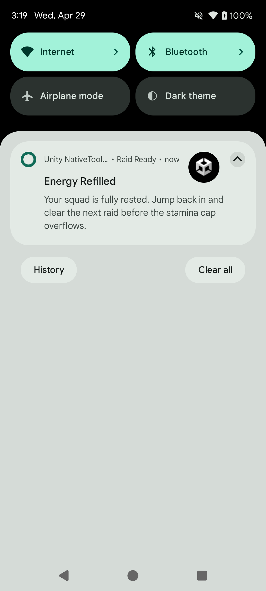
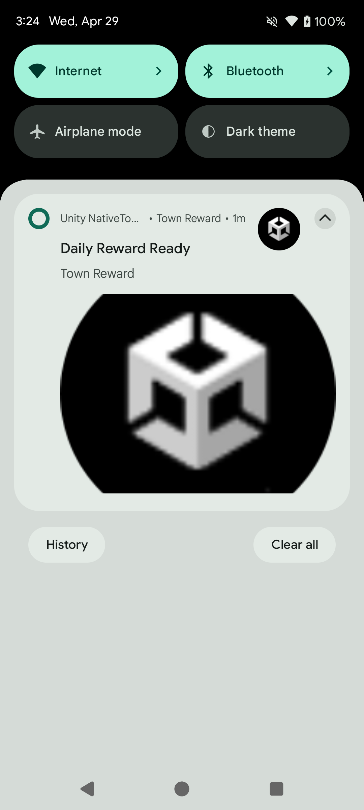
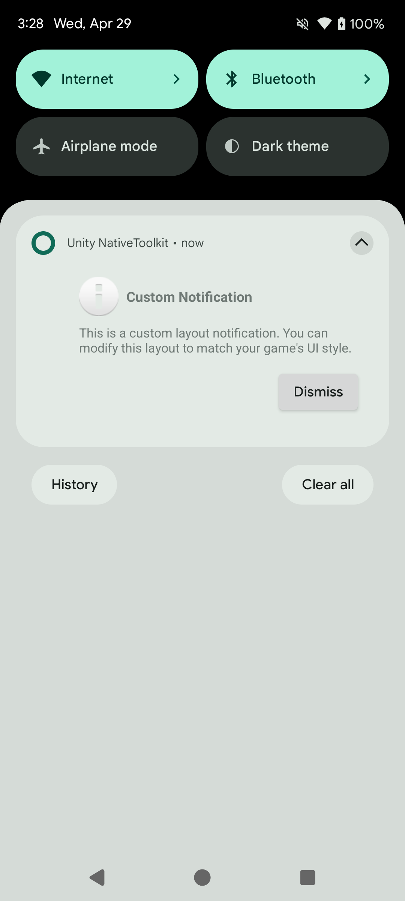
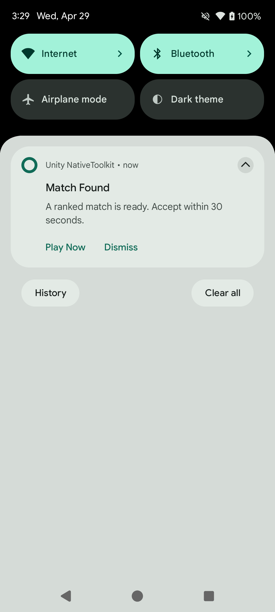
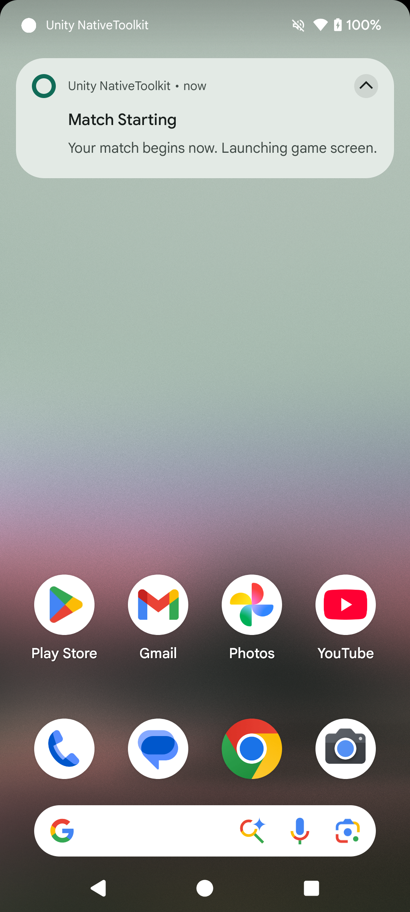
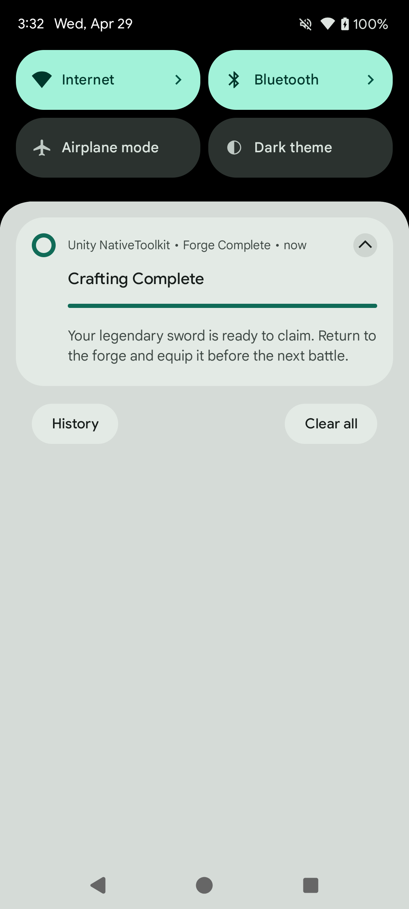
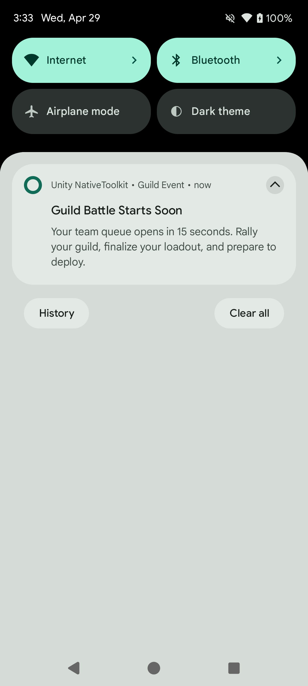

# Notification Feature

Language:

- English (this page)
- 日本語: [notification.ja.md](notification.ja.md)
- 한국어: [notification.ko.md](notification.ko.md)

← [Back to manual top](index.md)

---

## Table of Contents

- [Android](#android)
  - [Setup](#setup)
  - [Permission](#permission)
  - [Channel Management](#channel-management)
  - [Basic Notification Operations](#basic-notification-operations)
  - [Notification Styles](#notification-styles)
  - [Custom View Styles](#custom-view-styles)
  - [Interaction](#interaction)
  - [Progress Notifications](#progress-notifications)
  - [Foreground Service Notifications](#foreground-service-notifications)
  - [Scheduled Notifications](#scheduled-notifications)
- [iOS](#ios)
- [Windows](#windows)
- [macOS](#macos)

---

## Android

### Setup

#### AndroidManifest.xml

Add the permissions required for the features you use.

```xml
<!-- Required to post notifications on Android 13 and above -->
<uses-permission android:name="android.permission.POST_NOTIFICATIONS" />

<!-- Required for scheduled notifications (exact alarms) -->
<uses-permission android:name="android.permission.SCHEDULE_EXACT_ALARM" />
<uses-permission android:name="android.permission.RECEIVE_BOOT_COMPLETED" />

<!-- Required for foreground services -->
<uses-permission android:name="android.permission.FOREGROUND_SERVICE" />
<uses-permission android:name="android.permission.FOREGROUND_SERVICE_DATA_SYNC" />
```

#### Import the namespace

```csharp
// Guard: Android (Player) only. Prevents native calls in the Editor.
#if UNITY_ANDROID && !UNITY_EDITOR
using JonghyunKim.NativeToolkit.Runtime.Notification;
#endif
```

> **Note:** `ChannelPayload`, `NotificationPayload`, and `AndroidNotificationJsonBuilder` are included in the runtime package. Prefer `AndroidNotificationJsonBuilder` over `JsonUtility.ToJson(...)` when you need spec-aligned JSON for optional fields and `data`.

---

### Permission

```csharp
#if UNITY_ANDROID && !UNITY_EDITOR
// Whether notification permission is granted (Android 13+)
bool hasPermission = AndroidNotificationManager.Instance.HasPermission();

// Whether app notifications are enabled
bool enabled = AndroidNotificationManager.Instance.AreNotificationsEnabled();

// Whether exact alarm scheduling is permitted (Android 12+)
bool canSchedule = AndroidNotificationManager.Instance.CanScheduleExactAlarms();

// Request POST_NOTIFICATIONS permission (Android 13+)
AndroidNotificationManager.Instance.RequestPermission(granted =>
{
    if (granted) { /* permission granted */ }
});

// Open settings screens
AndroidNotificationManager.Instance.OpenNotificationSettings();
AndroidNotificationManager.Instance.OpenAppDetailsSettings();
AndroidNotificationManager.Instance.OpenExactAlarmSettings();
#endif
```

---

### Channel Management

A notification channel must be created before posting notifications.

#### Create a channel

```csharp
#if UNITY_ANDROID && !UNITY_EDITOR
string channelJson = AndroidNotificationJsonBuilder.BuildChannelJson(new ChannelPayload
{
    id = "my_channel",
    name = "My Channel",
    importance = 3,             // 3 = DEFAULT
    description = "Sample notification channel",
    showBadge = true,
    enableLights = true,
    lightColor = unchecked((int)0xFF4CAF50),
    enableVibration = true,
    vibrationPattern = new long[] { 0, 250, 200, 250 },
    lockscreenVisibility = 1,   // 1 = PUBLIC
    groupId = "my_group",
    groupName = "My Group"
});

AndroidNotificationManager.Instance.CreateChannel(channelJson);
#endif
```

Channel importance levels:

| Value | Level   | Description           |
| ----- | ------- | --------------------- |
| 1     | MIN     | No sound, no heads-up |
| 2     | LOW     | No sound              |
| 3     | DEFAULT | Sound                 |
| 4     | HIGH    | Sound + heads-up      |

#### Delete a channel

```csharp
#if UNITY_ANDROID && !UNITY_EDITOR
AndroidNotificationManager.Instance.DeleteChannel("my_channel");
#endif
```

#### Receive results via event

```csharp
#if UNITY_ANDROID && !UNITY_EDITOR
AndroidNotificationManager.Instance.NotificationOperationCompleted += OnOperationCompleted;
#endif

private void OnOperationCompleted(NotificationResult result)
{
    // result.Operation  — identifies which operation completed
    // result.IsSuccess  — true on success
    // result.ErrorMessage — non-null on failure
}
```

---

### Basic Notification Operations

#### Show

```csharp
#if UNITY_ANDROID && !UNITY_EDITOR
string notificationJson = AndroidNotificationJsonBuilder.BuildNotificationJson(new NotificationPayload
{
    id = 1101,
    title = "Energy Refilled",
    message = "Your squad is fully rested. Jump back in and clear the next raid.",
    tag = "energy",
    channel = CreateGameplayChannelReference(),
    smallIcon = CreateUnityAppIconResource(),
    largeIcon = CreateUnityAppIconResource(),
    subText = "Raid Ready",
    autoCancel = true,
    priority = 1,
    category = "recommendation",
    ticker = "Energy refilled",
    number = 3,
    style = new NotificationStylePayload
    {
        type = "bigText",
        bigText = "Your squad is fully rested. Jump back in and clear the next raid before the stamina cap overflows.",
        bigContentTitle = "Energy Refilled",
        summaryText = "Raid Ready"
    }
});

AndroidNotificationManager.Instance.ShowNotification(notificationJson);
#endif
```

<p align="center">
    
</p>

> **Note:** The `channel` field in the notification payload is used to create the channel if it does not exist. For a channel already created, you can pass just `id` and `name`.

> **Note:** These snippets intentionally use the same helper calls as `AndroidNotificationManagerExampleController`, including `CreateGameplayChannelReference()` and `CreateUnityAppIconResource()`, so the manual stays aligned with the sample scene.

#### Update

Pass a payload with the same `id` / `tag` to overwrite an active notification.

```csharp
#if UNITY_ANDROID && !UNITY_EDITOR
string updatedNotificationJson = AndroidNotificationJsonBuilder.BuildNotificationJson(new NotificationPayload
{
    id = 1101,
    title = "Daily Reward Ready",
    message = "Your login streak chest is waiting in town.",
    tag = "energy",
    channel = CreateGameplayChannelReference(),
    smallIcon = CreateUnityAppIconResource(),
    largeIcon = CreateUnityAppIconResource(),
    subText = "Town Reward",
    autoCancel = true,
    priority = 1,
    style = new NotificationStylePayload
    {
        type = "bigPicture",
        picture = CreateUnityAppIconResource(),
        largeIcon = CreateUnityAppIconResource(),
        hideExpandedLargeIcon = false,
        bigText = "Your login streak chest is waiting in town. Claim it now to keep your reward multiplier active.",
        bigContentTitle = "Daily Reward Ready",
        summaryText = "Town Reward"
    }
});

AndroidNotificationManager.Instance.UpdateNotification(updatedNotificationJson);
#endif
```

<p align="center">
    
</p>

#### Cancel

```csharp
#if UNITY_ANDROID && !UNITY_EDITOR
// Cancel a specific notification
AndroidNotificationManager.Instance.CancelNotification(1001);
AndroidNotificationManager.Instance.CancelNotification(1001, "energy");

// Cancel all notifications
AndroidNotificationManager.Instance.CancelAllNotifications();
#endif
```

---

### Notification Styles

Set the `style` field in the notification payload.

#### Default

```csharp
// No style field — renders as a standard notification.
```

#### BigText

Displays long text when the notification is expanded.

```csharp
style = new NotificationStylePayload
{
    type = "bigText",
    bigText = "Long body text shown when the notification is expanded.",
    bigContentTitle = "Expanded Title",
    summaryText = "Summary"
}
```

#### Inbox

Displays multiple lines in list format when expanded. Pass each line in the `lines` array.

```csharp
style = new NotificationStylePayload
{
    type = "inbox",
    lines = new[] { "Item 1", "Item 2", "Item 3" },
    bigContentTitle = "Expanded Title",
    summaryText = "3 items"
}
```

#### BigPicture

Displays an image when the notification is expanded. Pass a resource reference in `picture`.

```csharp
style = new NotificationStylePayload
{
    type = "bigPicture",
    picture = new NotificationResourcePayload { name = "my_image", type = "drawable" },
    bigContentTitle = "Expanded Title",
    summaryText = "Image description"
}
```

---

### Custom View Styles

Display notifications using a custom Android layout.

#### DecoratedCustomView

Provide collapsed and optional expanded layout resource names. Layout XML files must be placed in `Assets/Plugins/Android/com.jonghyunkim.nativetoolkit.androidlib/res/layout/` (prefixed with `nt_` to avoid resource name conflicts).

```csharp
#if UNITY_ANDROID && !UNITY_EDITOR
string notificationJson = AndroidNotificationJsonBuilder.BuildNotificationJson(new NotificationPayload
{
    id = 1601,
    title = "Custom Layout Notification",
    message = "Expand to see the custom view and tap Dismiss.",
    channel = CreateGameplayChannelReference(),
    smallIcon = CreateUnityAppIconResource(),
    autoCancel = true,
    style = new NotificationStylePayload
    {
        type = "decoratedCustomView",
        customViewLayout = "nt_notification_custom_view_sample",         // collapsed layout
        bigCustomViewLayout = "nt_notification_custom_view_sample_expanded", // expanded layout (optional)
        viewActions = new[]
        {
            new NotificationViewActionPayload
            {
                type = "setClickIntent",
                viewId = "nt_notification_btn_dismiss",  // view ID in the layout
                actionId = "com.jonghyunkim.nativetoolkit.ACTION_CUSTOM_VIEW_DISMISS"  // received in NotificationActionTapped
            }
        }
    }
});

AndroidNotificationManager.Instance.ShowNotification(notificationJson);
#endif
```

<p align="center">
    
</p>

> **Note:** Due to `RemoteViews` constraints, use `LinearLayout` + `TextView` instead of `Button` for clickable elements.

---

### Interaction

#### NotificationOperationCompleted event

Fired after each operation (show, cancel, schedule, etc.) completes.

```csharp
#if UNITY_ANDROID && !UNITY_EDITOR
AndroidNotificationManager.Instance.NotificationOperationCompleted += OnOperationCompleted;
#endif

private void OnOperationCompleted(NotificationResult result)
{
    // result.Operation     — e.g. AndroidNotificationManager.OperationShowNotification
    // result.IsSuccess     — true on success
    // result.ErrorMessage  — non-null on failure
}
```

Operation constants:

| Constant                                                                | Description                                   |
| ----------------------------------------------------------------------- | --------------------------------------------- |
| `AndroidNotificationManager.OperationShowNotification`                  | `ShowNotification` completed                  |
| `AndroidNotificationManager.OperationUpdateNotification`                | `UpdateNotification` completed                |
| `AndroidNotificationManager.OperationCancelNotification`                | `CancelNotification` completed                |
| `AndroidNotificationManager.OperationCancelAllNotifications`            | `CancelAllNotifications` completed            |
| `AndroidNotificationManager.OperationScheduleNotification`              | `ScheduleNotification` completed              |
| `AndroidNotificationManager.OperationCancelScheduledNotification`       | `CancelScheduledNotification` completed       |
| `AndroidNotificationManager.OperationCancelAllScheduledNotifications`   | `CancelAllScheduledNotifications` completed   |
| `AndroidNotificationManager.OperationStartProgressForegroundService`    | `StartProgressForegroundService` completed    |
| `AndroidNotificationManager.OperationUpdateProgressForegroundService`   | `UpdateProgressForegroundService` completed   |
| `AndroidNotificationManager.OperationCompleteProgressForegroundService` | `CompleteProgressForegroundService` completed |
| `AndroidNotificationManager.OperationStopProgressForegroundService`     | `StopProgressForegroundService` completed     |

#### NotificationActionTapped event

Fired when the user taps the notification body, a notification action button, or dismisses the notification.

```csharp
#if UNITY_ANDROID && !UNITY_EDITOR
AndroidNotificationManager.Instance.NotificationActionTapped += OnActionTapped;
#endif

private void OnActionTapped(NotificationActionResult result)
{
    bool isBodyTap = result.ActionId == AndroidNotificationManager.ActionBodyTap;
    bool isDismiss = result.ActionId == AndroidNotificationManager.ActionNotificationDismissed;

    // result.NotificationId — notification ID
    // result.ActionId       — action identifier
    // result.Data           — Dictionary<string, string> custom data payload (may be null)
}
```

To send custom data, populate `data` entries and pass the payload through `AndroidNotificationJsonBuilder`:

```csharp
payload.data = new[]
{
    new NotificationDataEntryPayload { key = "screen", value = "battle" },
    new NotificationDataEntryPayload { key = "matchId", value = "match_5678" }
};

string json = AndroidNotificationJsonBuilder.BuildNotificationJson(payload);
```

#### NotificationReceived event

Fired when a scheduled notification fires while the app is in the foreground.

```csharp
#if UNITY_ANDROID && !UNITY_EDITOR
AndroidNotificationManager.Instance.NotificationReceived += OnNotificationReceived;
#endif

private void OnNotificationReceived(NotificationReceivedResult result)
{
    // result.NotificationId — notification ID
    // result.Tag            — tag (may be null)
    // result.ChannelId      — channel ID
}
```

#### Action buttons

Add action buttons to a notification.

```csharp
NotificationPayload payload = new NotificationPayload
{
    id = 1401,
    title = "Match Found",
    message = "A ranked match is ready. Accept within 30 seconds.",
    channel = CreateGameplayChannelReference(),
    smallIcon = CreateUnityAppIconResource(),
    autoCancel = true,
    priority = 1,
    launchAction = "open_battle_screen",
    actions = new[]
    {
        new NotificationActionPayload
        {
            title = "Play Now",
            actionId = "com.jonghyunkim.nativetoolkit.ACTION_PLAY_NOW",
            icon = CreateUnityAppIconResource(),
            launchApp = true,
            showsUserInterface = true
        },
        new NotificationActionPayload
        {
            title = "Dismiss",
            actionId = "com.jonghyunkim.nativetoolkit.ACTION_DISMISS",
            launchApp = false,
            showsUserInterface = false
        }
    },
    data = new[]
    {
        new NotificationDataEntryPayload { key = "screen", value = "battle" },
        new NotificationDataEntryPayload { key = "matchId", value = "match_5678" }
    }
};

string notificationJson = AndroidNotificationJsonBuilder.BuildNotificationJson(payload);
```

<p align="center">
    
</p>

#### Full-screen intent

Launches a full-screen activity when the device is locked or the screen is off (e.g. alarms, incoming calls). Set `fullScreenIntent = true` and use a high-priority channel (`importance = 4`).

```csharp
new NotificationPayload
{
    id = 1501,
    title = "Match Starting",
    message = "Your match begins now. Launching game screen.",
    channel = CreateGameplayChannelReference(),
    smallIcon = CreateUnityAppIconResource(),
    priority = 2,
    category = "call",
    fullScreenIntent = true,
    autoCancel = true
}
```

<p align="center">
    
</p>

> **Note:** Depending on device state and Android policy, the notification may appear as a heads-up notification instead of full-screen.

---

### Progress Notifications

Display a progress bar for downloads or long-running operations.

```csharp
#if UNITY_ANDROID && !UNITY_EDITOR
// Start with a determinate progress bar
AndroidNotificationManager.Instance.StartProgressForegroundService(AndroidNotificationJsonBuilder.BuildNotificationJson(new NotificationPayload
{
    id = 1301,
    title = "Downloading Guild Battle Assets",
    message = "Preparing the arena for your next match.",
    channel = CreateGameplayChannelReference(),
    smallIcon = CreateUnityAppIconResource(),
    ongoing = true,
    autoCancel = false,
    progress = new NotificationProgressPayload { max = 100, current = _currentProgressValue, indeterminate = false },
    style = new NotificationStylePayload
    {
        type = "bigText",
        bigText = "Preparing the arena for your next match. Keep the app alive while assets finish downloading.",
        bigContentTitle = "Downloading Guild Battle Assets",
        summaryText = "Background Download"
    }
}));

// Update progress
AndroidNotificationManager.Instance.UpdateProgressForegroundService(AndroidNotificationJsonBuilder.BuildNotificationJson(new NotificationPayload
{
    id = 1301,
    title = "Crafting Legendary Gear",
    message = "The forge is running at full power.",
    channel = CreateGameplayChannelReference(),
    smallIcon = CreateUnityAppIconResource(),
    ongoing = true,
    autoCancel = false,
    onlyAlertOnce = true,
    progress = new NotificationProgressPayload { max = 100, current = progressValue, indeterminate = false },
    style = new NotificationStylePayload
    {
        type = "bigText",
        bigText = "The forge is running at full power. Stay ready to equip the reward when crafting finishes.",
        bigContentTitle = "Crafting Legendary Gear",
        summaryText = "Forge Update"
    }
}));

// Complete — stop service and demote to a regular notification
AndroidNotificationManager.Instance.CompleteProgressForegroundService(AndroidNotificationJsonBuilder.BuildNotificationJson(new NotificationPayload
{
    id = 1301,
    title = "Crafting Complete",
    message = "Your legendary sword is ready to claim.",
    channel = CreateGameplayChannelReference(),
    smallIcon = CreateUnityAppIconResource(),
    ongoing = false,
    autoCancel = true,
    progress = new NotificationProgressPayload { max = 100, current = 100, indeterminate = false },
    style = new NotificationStylePayload
    {
        type = "bigText",
        bigText = "Your legendary sword is ready to claim. Return to the forge and equip it before the next battle.",
        bigContentTitle = "Crafting Complete",
        summaryText = "Forge Complete"
    }
}));

// Force stop — also removes the notification
AndroidNotificationManager.Instance.StopProgressForegroundService();
#endif
```

<p align="center">
    
</p>

---

### Foreground Service Notifications

Foreground service notifications require the following manifest entry:

```xml
<service
    android:name="android.library.notification.presentation.progress.ProgressForegroundService"
    android:foregroundServiceType="dataSync"
    android:exported="false" />
```

Use `StartProgressForegroundService`, `UpdateProgressForegroundService`, `CompleteProgressForegroundService`, and `StopProgressForegroundService` as shown in [Progress Notifications](#progress-notifications).

---

### Scheduled Notifications

Automatically show a notification at a specified time.

```csharp
#if UNITY_ANDROID && !UNITY_EDITOR
long triggerTime = DateTimeOffset.UtcNow.AddSeconds(15).ToUnixTimeMilliseconds();

string scheduleJson = AndroidNotificationJsonBuilder.BuildScheduledNotificationJson(new ScheduledNotificationEnvelopePayload
{
    notification = new NotificationPayload
    {
        id = 1201,
        title = "Guild Battle Starts Soon",
        message = "Your team queue opens in 15 seconds. Rally your guild and prepare to deploy.",
        tag = "guild-battle",
        channel = CreateGameplayChannelReference(),
        smallIcon = CreateUnityAppIconResource(),
        autoCancel = true,
        priority = 1,
        groupKey = "guild-events",
        sortKey = "001",
        style = new NotificationStylePayload
        {
            type = "bigText",
            bigText = "Your team queue opens in 15 seconds. Rally your guild, finalize your loadout, and prepare to deploy.",
            bigContentTitle = "Guild Battle Starts Soon",
            summaryText = "Guild Event"
        }
    },
    schedule = new NotificationSchedulePayload
    {
        triggerAtMillis = triggerTime,
        exact = true,           // exact alarm (requires SCHEDULE_EXACT_ALARM)
        allowWhileIdle = true,  // fires even in Doze mode
        persistAcrossBoot = true,
        alarmType = 0           // RTC_WAKEUP
    }
});

AndroidNotificationManager.Instance.ScheduleNotification(scheduleJson);
#endif
```

<p align="center">
    
</p>

#### Cancel scheduled notifications

```csharp
#if UNITY_ANDROID && !UNITY_EDITOR
AndroidNotificationManager.Instance.CancelScheduledNotification(1201, "guild-battle");
AndroidNotificationManager.Instance.CancelAllScheduledNotifications();
#endif
```

#### Check scheduled status

```csharp
#if UNITY_ANDROID && !UNITY_EDITOR
bool isScheduled = AndroidNotificationManager.Instance.IsNotificationScheduled(1201, "guild-battle");
#endif
```

---

## iOS

(Coming soon)

---

## Windows

(Coming soon)

---

## macOS

(Coming soon)
